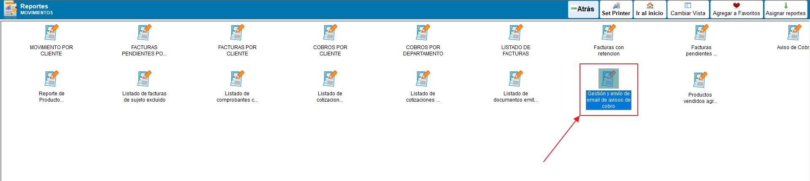
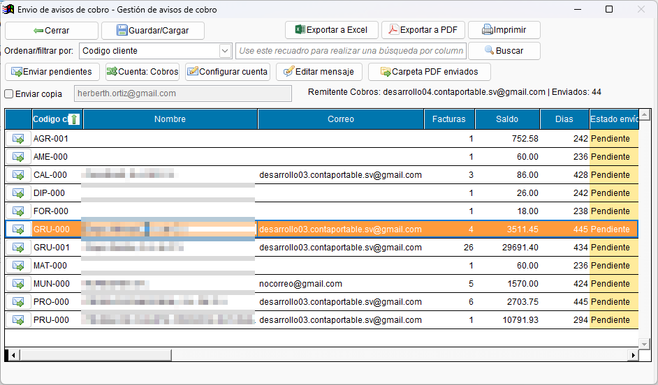
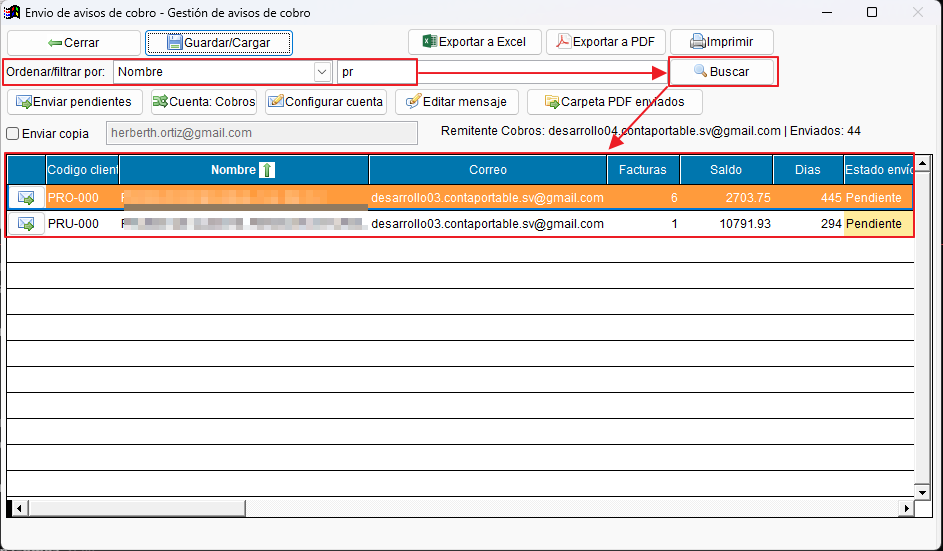
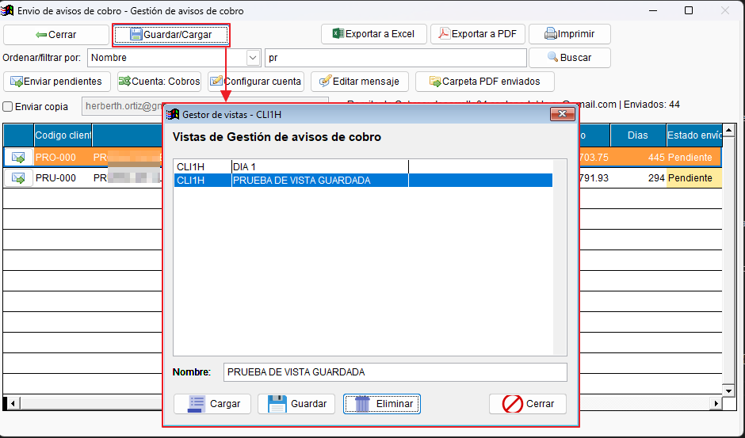
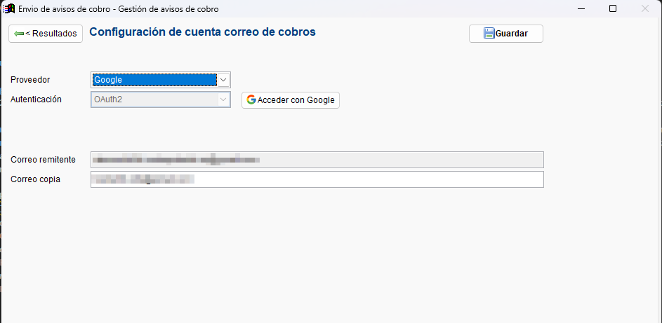
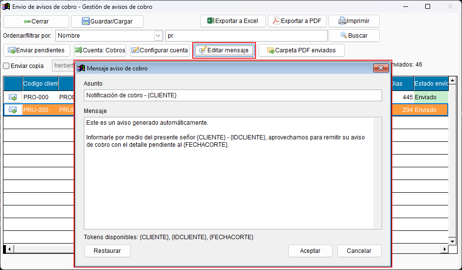
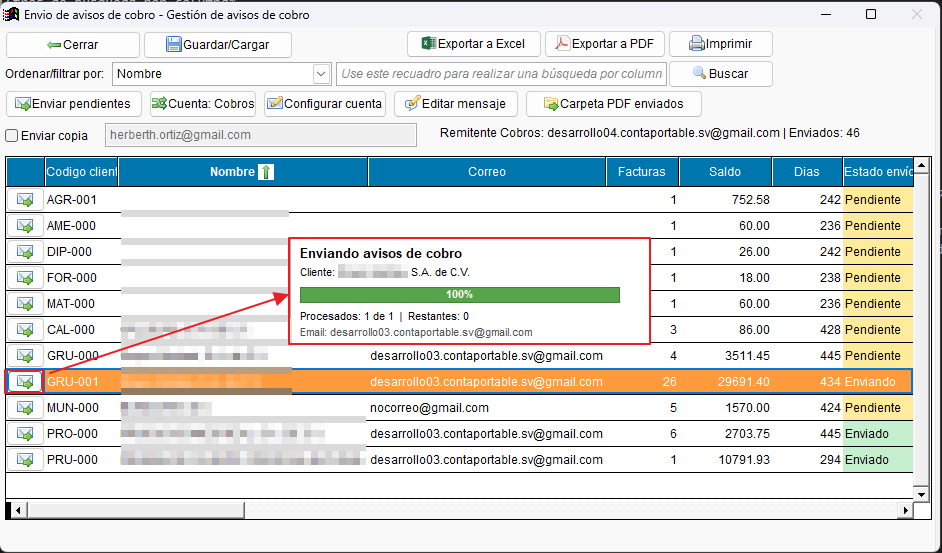
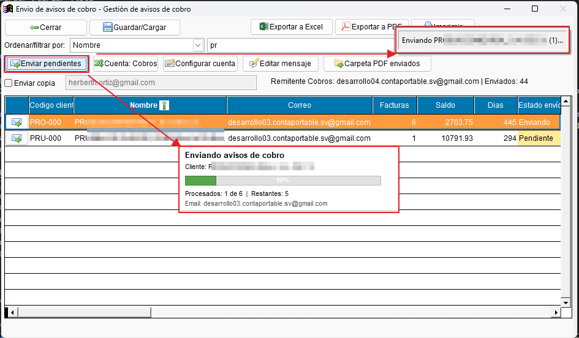
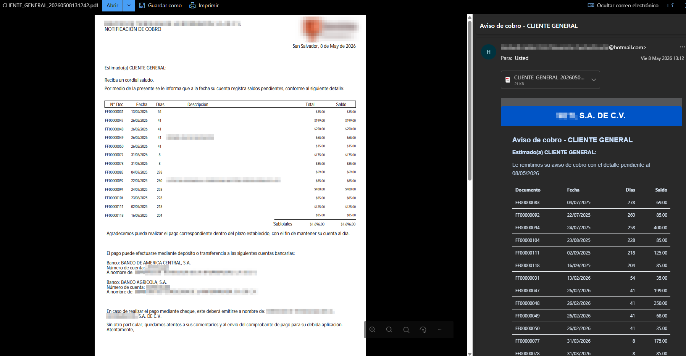
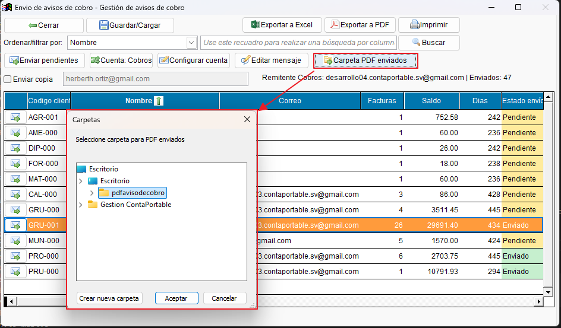

# Interfaz gestión y Envío de Avisos de Cobro

- Interfaz dedicada para la gestión y envío de avisos de cobro por correo electrónico a clientes.
- Permite visualizar saldos, antigüedad de deuda, confirmar correos destino y revisar el estado previo de los envíos.
- Se muestra una versión alternativa a la del reporte de avisos de cobro tradicional.
- Se tiene la posibilidad de guardar y cargar vistas personalizadas. (Filtros precargados que podrían ser recurrrentes para el usuario)

---

### **Acceso y Selección**

1. Ingrese al listado de reportes de clientes y seleccione la subcategoría **Movimientos**.
2. Seleccione el reporte **Gestión y envío de email de avisos de cobro**.
3. Defina los filtros requeridos (clientes, fecha de corte, cuentas bancarias a mostrar en el reporte, etc.).
4. Ejecute el reporte para abrir la interfaz de gestión de envíos de aviso de cobro.

> [!NOTE]
> Desde esta misma pantalla puede definir un telefono de contacto personalizado para el reporte. En este reporte ese telefono se usa en el PDF y en el contenido del correo enviado; en el aviso de cobro se reutiliza el mismo teléfono personalizado junto con el correo personalizado. El cambio solo aplica a la sesión actual y no modifica la configuración general del sistema.

!!! note "Acceso y selección en imágenes"
    

        *Ubicación del reporte de gestión y envío de email de avisos de cobro*
        {align = center }
        *Definición de filtros iniciales*
        { align = center }
        *Interfaz de gestión de envíos de aviso de cobro*
        { align = center }
    

---

### Interfaz de Gestión y Envío

1. En la bandeja principal, podrá ver el listado de clientes con pagos pendientes, su saldo y el correo electrónico.
2. **Correo Electrónico:** El campo de correo toma por defecto el del contacto principal, pero es editable directamente en la interfaz. *Nota: Los clientes que tengan el campo de correo vacío serán omitidos al enviar pendientes.*
3. **Filtros de Búsqueda:** Utilice la búsqueda por columna para encontrar rápidamente clientes específicos.
4. **Vistas Guardadas:** Utilice el botón "Guardar Vista" para guardar el filtro actual (tanto la selección de clientes como los filtros de texto aplicados). Puede cargar estas vistas posteriormente para agilizar envíos frecuentes.

!!! note "Uso de la interfaz de gestión y envío en imágenes"
    

        *Interfaz principal de gestión y envío de email de avisos de cobro*
        {align = center }
        *Filtros de búsqueda por columna*
        { align = center }
        *Guardar /cargar vista*
        { align = center }
    

---

### Configuración y envío de correos

1. **Configuración de cuenta:** Mediante el botón de cuenta, puede seleccionar si desea enviar los correos usando la cuenta de DTE o configurar una cuenta exclusiva para cobros (vía OAuth2). *Precaución: Es probable que en ciertos dominios con restricciones de Outlook el envío de correos requiera configuraciones adicionales de administrador en su cuenta.*
2. **Límites diarios por cuenta:** Dentro de la misma pantalla de configuración se muestra un panel único de límites de envío, con valores separados para la cuenta de Cobros y la cuenta DTE.
3. **Alertas y bloqueo diario:** Puede definir desde qué cantidad de correos debe alertar el sistema y cuál es el límite máximo diario permitido por cuenta.
4. **Confirmación antes de enviar:** El sistema solicita confirmación tanto en el envío individual como en el envío masivo antes de procesar correos.
5. **Editar mensaje:** Puede modificar el asunto y el cuerpo del correo que recibirá el cliente haciendo clic en el botón de editar mensaje.
6. **Envio individual:** Puede enviar el aviso uno a uno usando el botón de acción en la parte izquierda de cada registro.
7. **Envio masivo:** Al hacer clic en "Enviar pendientes", se enviarán los avisos a todos los registros con estado pendiente (y correo configurado).
8. Si el envío es exitoso, al cliente le llegará un correo con un formato de PDF detallando los pagos pendientes.
9. **Telefono personalizado:** Si necesita mostrar un telefono distinto al general, puede escribirlo en la pantalla previa del reporte antes de abrir la gestión. Ese valor también se incorpora al correo HTML enviado al cliente.

> [!NOTE]
> La pantalla de configuración presenta primero los datos de cuenta y, debajo, el panel de límites. Esta separación busca evitar superposición de controles y facilitar la revisión rápida antes de enviar.

!!! note "Configuración y envío de correos en imágenes"
    

        *Configuración de cuenta*
        {align = center }
        *Editar mensaje de correo*
        { align = center }
        *Envío individual*
        { align = center }
        *Envío masivo*
        { align = center }
        *Resultado del envío*
        { align = center }
    

---

### Exportación y Generación de PDF

- **Carpeta para PDF's:** Es posible establecer una carpeta predeterminada para guardar los PDF's generados.
- **Impresión Directa:** Puede imprimir o exportar el PDF con los botones de la barra superior sin necesidad de enviar el correo electrónico.

!!! note "Configuración y envío de correos en imágenes"
    

        *Carpeta para PDF's*
        {align = center }
        *Impresión directa*
        { align = center }
        **[Descargar versión PDF :fontawesome-regular-file-pdf:](../../assets/reportes/clientes/CLI1H.PDF){ .md-button }**
    

---
