# **Reportes de clientes**

Esta página reúne el detalle de los reportes incluídos en la categoría de clientes en el sistema **ContaPortable**.

<!-- Se agrega el código mermaid para diagramar las subcategorías de clientes -->
!!! tip "Diagrama de las subcategorías contenidas en **Reportes de clientes**"
    ``` mermaid
    graph TD
      A[Reportes de clientes]:::root

      subgraph "Subcategorías"
        B[1. Movimientos]
        C[2. Saldos por antigüedad]
        D[3. Resúmenes y estadísticas de venta]
        E[4. Antigüedad de saldos por factura]
        F[5. Control de cobros y comisiones]
        G[6. Información de clientes]
      end

      A --> B
      A --> C
      A --> D
      A --> E
      A --> F
      A --> G

    click B "#1-movimientos" "Ir a movimientos"
    click C "#2-saldos-por-antiguedad" "Ir a saldos por antigüedad"
    click D "#3-resumenes-y-estadisticas-de-venta" "Ir a Resúmenes y estadísticas de venta"
    click E "#4-antiguedad-de-saldos-por-factura" "Ir a antigüedad de saldos por factura"
    click F "#5-control-de-cobros-y-comisiones" "Ir a control de cobros y comisiones"
    click G "#6-informacion-de-clientes" "Ir a control de información de clientes"
    ```
---

## **1. Movimientos**

<!-- Se agrega el código mermaid para diagramar el listado de reportes dentro de la subcategoría de movimientos -->
!!! tip "Diagrama de los reportes contenidos en la subcategoría **Movimientos**"
    ``` mermaid
    graph LR
      A[Movimientos]:::root

      subgraph "Listado de reportes:"

        B[1.1 Movimientos por cliente]
        C[1.2 Facturas pendientes por cliente]
        D[1.3 Facturas por cliente]
        E[1.4 Cobros por clientes]
        F[1.6 Cobros por departamento]
        G[1.7 Listado de documentos emitidos]
        H[1.11 Reporte de productos vendidos]
        I[1.12 Listado de facturas de sujeto excluido]
        J[1.13 Listado de cotizaciones emitidas]
        K[1.14 Listado de comprobantes con documento relacionado]
        L[1.17 Gestión y envío de email de avisos de cobro]
        M[1.18 Productos vendidos agrupados por familia de inventario]
      end
      A --> B
      A --> C
      A --> D
      A --> E
      A --> F
      A --> G
      A --> H
      A --> I
      A --> J
      A --> K
      A --> L
      A --> M

    click B "#11-movimientos-por-cliente" "Ir a reporte de movimientos por cliente"
    click C "#12-facturas-pendientes-por-cliente" "Ir a reporte de facturas pendientes por cliente"
    click D "#13-facturas-por-clientes" "Ir a reporte de facturas por cliente"
    click E "#14-cobros-por-clientes" "Ir a reporte cobros por clientes"
    click F "#16-cobros-por-departamento" "Ir a reporte de cobros por departamento"
    click G "#17-listado-de-documentos-emitidos" "Ir a reporte de listado de documentos emitidos"
    click H "#111-reporte-de-productos-vendidos" "Ir a reporte de productos vendidos"
    click I "#112-listado-de-facturas-de-sujeto-excluido" "Ir a reporte de listado de facturas de sujeto excluido"
    click J "#113-listado-de-cotizaciones-emitidas" "Ir a reporte de listado de cotizaciones emitidas"
    click K "#114-listado-de-comprobantes-con-documento-relacionado" "Ir a reporte de listado de comprobantes con documentos relacionados"
    click L "#117-gestion-y-envio-de-email-de-avisos-de-cobro" "Ir a reporte de gestión y envío de email de avisos de cobro"
    click M "#118-productos-vendidos-agrupados-por-familia-de-inventario" "Ir a reporte de productos vendidos agrupados por familia de inventario"
    ```
---

### 1.1  Movimientos por cliente

!!! info "Descripción del reporte"
    Este reporte muestra un formato que contiene un listado de movimientos por cliente realizados desde el módulo de facturación, puede ser filtrado por medio de los siguientes parámetros:

    - Fecha
    - Clientes (Todos o bloques)
    - Afiliadas

    **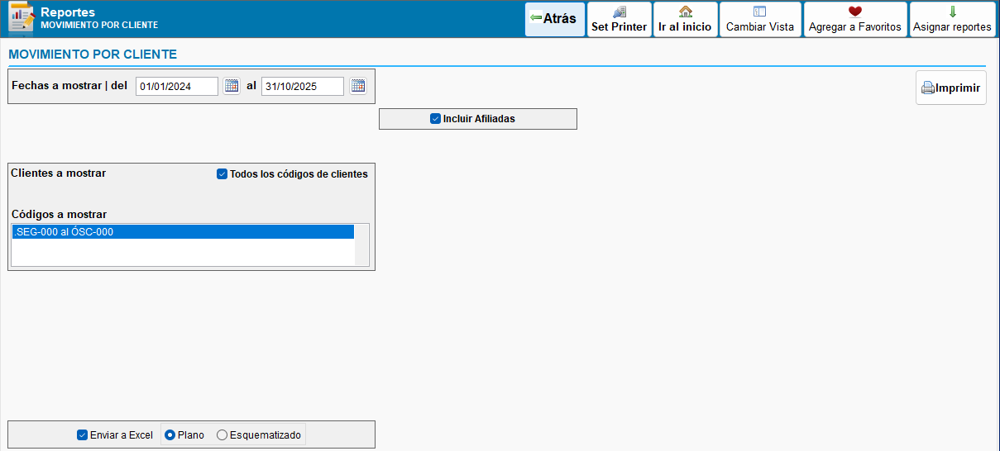{ align= center }**

    Es posible exportarlo a formato Excel, ya sea de forma agrupada (Esquematizado) o detallada (Plano).

Vista previa del reporte **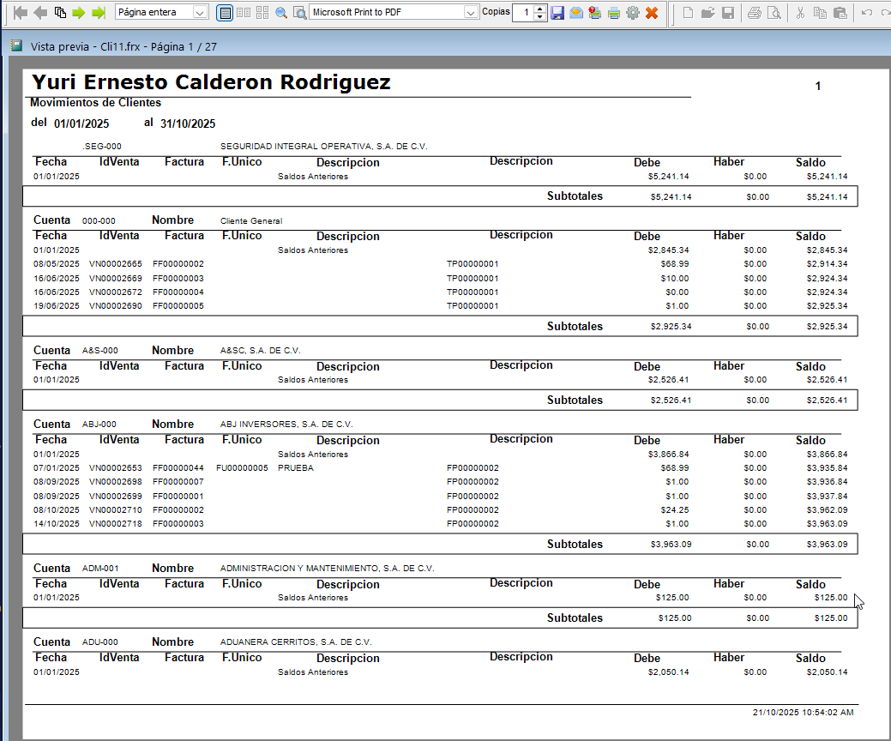{ align = center }**

??? abstract "1.1 Movimientos por cliente - Descargas de ejemplo"
    - **[Descargar versión PDF :fontawesome-regular-file-pdf:](../../assets/reportes/clientes/CLI11.PDF){ .md-button }**
    - **[Descargar versión Excel (Consolidado) :material-microsoft-excel:](../../assets/reportes/clientes/CLI11_CON.xlsx){ .md-button }**
    - **[Descargar versión Excel (Plano) :material-microsoft-excel:](../../assets/reportes/clientes/CLI11_PLN.xlsx){ .md-button }**

---

### 1.2  Facturas pendientes de cobro por cliente

!!! info "Descripción del reporte"
    Este reporte muestra un formato que contiene un listado de facturas pendientes por cliente con información de los días y saldos pendientes de las documentos emitidos que no han sido cobrados, puede ser filtrado por medio de los siguientes parámetros:

    - Fecha
    - Clientes (Todos o bloques)
    - Permite seleccionar si se usará la fecha de quedan para el cálculo

    **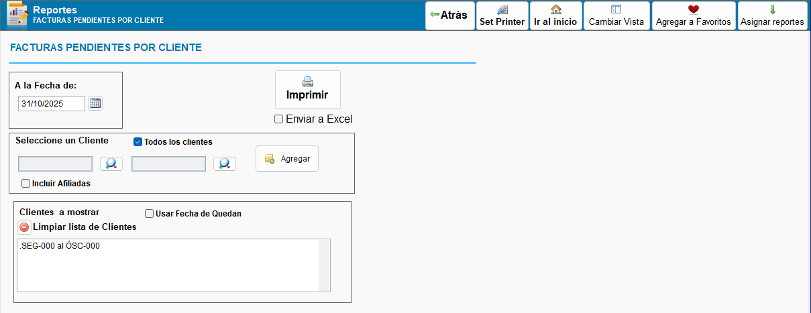{ align= center }**

    Es posible exportarlo a formato Excel.

Vista previa del reporte **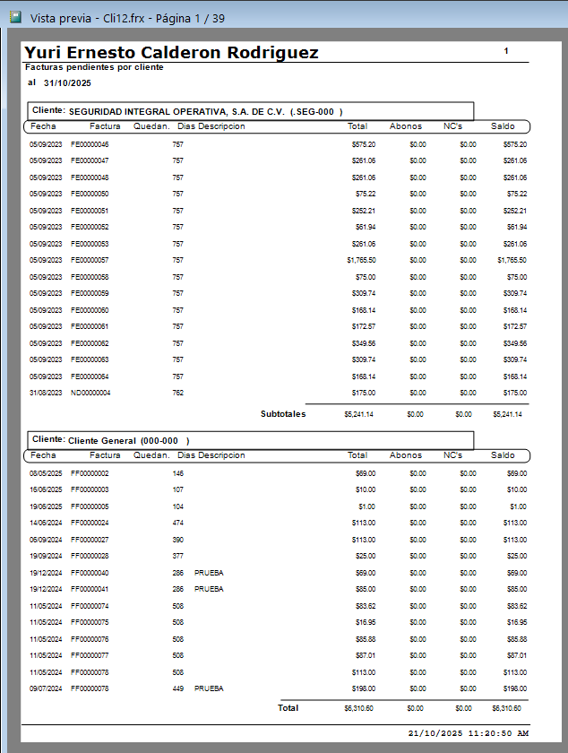{ align = center }**

??? abstract "1.2 Facturas pendientes por cliente - Descargas de ejemplo"
    - **[Descargar versión PDF :fontawesome-regular-file-pdf:](../../assets/reportes/clientes/CLI12.PDF){ .md-button }**
    - **[Descargar versión Excel :material-microsoft-excel:](../../assets/reportes/clientes/CLI12.xlsx){ .md-button }**

---

### 1.3 Facturas emitidas por cliente

!!! info "Descripción del reporte"
    Este reporte muestra un formato que contiene un listado de facturas emitidas por cliente, puede ser filtrado por medio de los siguientes parámetros:

    - Fecha
    - Clientes (Todos o bloques)
    - Permite seleccionar si se usará la fecha de quedan para el cálculo

    **{ align= center }**

    Es posible exportarlo a formato Excel ya sea en formato plano o esquematizado.

Vista previa del reporte **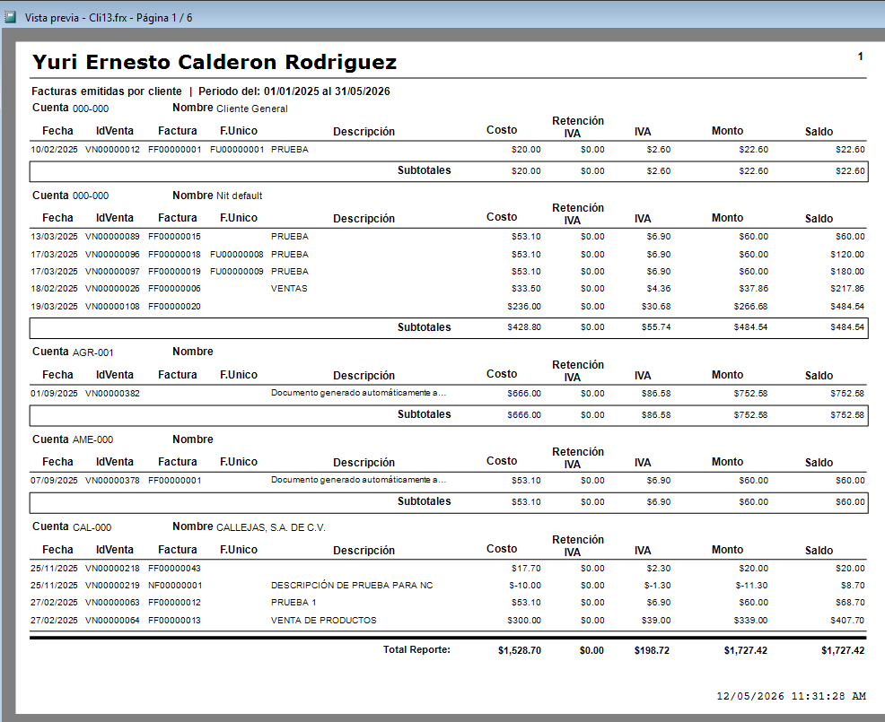{ align = center }**

??? abstract "1.3 Facturas emitidas por cliente - Descargas de ejemplo"
    - **[Descargar versión PDF :fontawesome-regular-file-pdf:](../../assets/reportes/clientes/CLI13.PDF){ .md-button }**
     - **[Descargar versión Excel (Consolidado) :material-microsoft-excel:](../../assets/reportes/clientes/CLI13_CON.xlsx){ .md-button }**
    - **[Descargar versión Excel (Plano) :material-microsoft-excel:](../../assets/reportes/clientes/CLI13_PLN.xlsx){ .md-button }**

---

### 1.4 Cobros por clientes

!!! info "Descripción del reporte"
    Este reporte muestra un formato que contiene un listado de cobros registrados agrupados por cliente. Puede ser filtrado por medio de los siguientes parámetros:

    - Fecha
    - Clientes (Todos o bloques)
    - Departamento

    **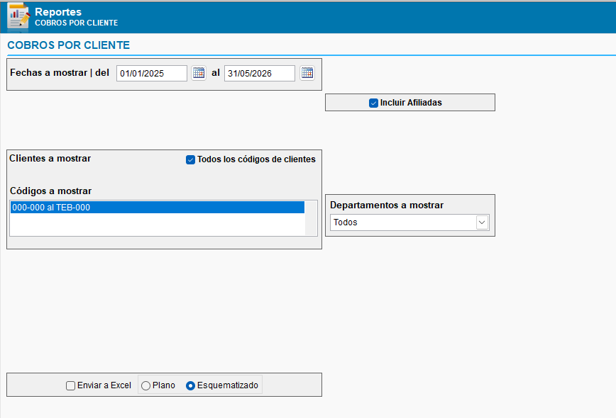{ align= center }**

    Es posible exportarlo a formato Excel en formato consolidado o plano.

Vista previa del reporte **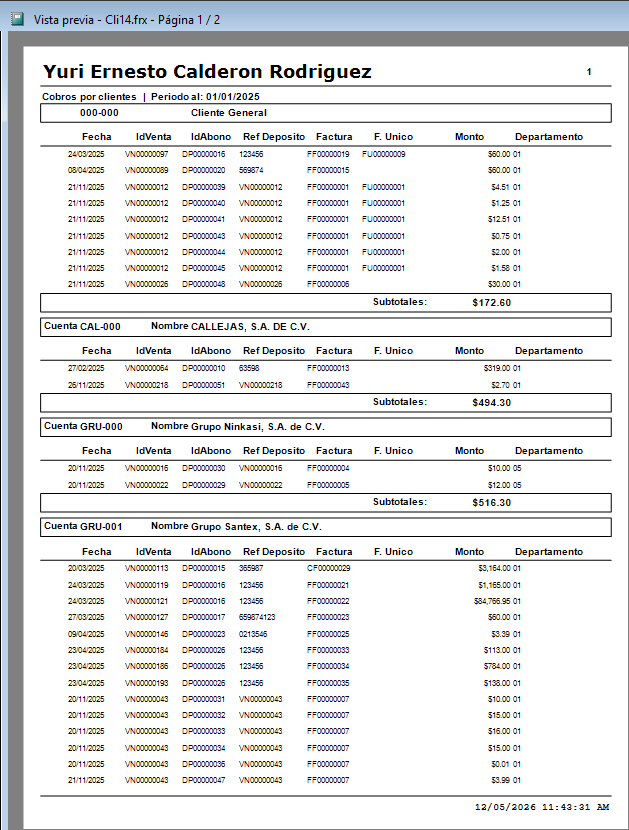{ align = center }**

??? abstract "1.4 Cobros por clientes - Descargas de ejemplo"
    - **[Descargar versión PDF :fontawesome-regular-file-pdf:](../../assets/reportes/clientes/CLI14.PDF){ .md-button }**
    - **[Descargar versión Excel (Consolidado) :material-microsoft-excel:](../../assets/reportes/clientes/CLI14_CON.xlsx){ .md-button }**
    - **[Descargar versión Excel (Plano) :material-microsoft-excel:](../../assets/reportes/clientes/CLI14_PLN.xlsx){ .md-button }**

---

### 1.6 Cobros por departamento

!!! info "Descripción del reporte"
    Este reporte muestra un formato que contiene un listado de cobros por departamento, puede ser filtrado por medio de los siguientes parámetros:

    - Fecha
    - Clientes (Todos o bloques)
    - Departamentos (Todos o bloques)
    - Afiliados 

    **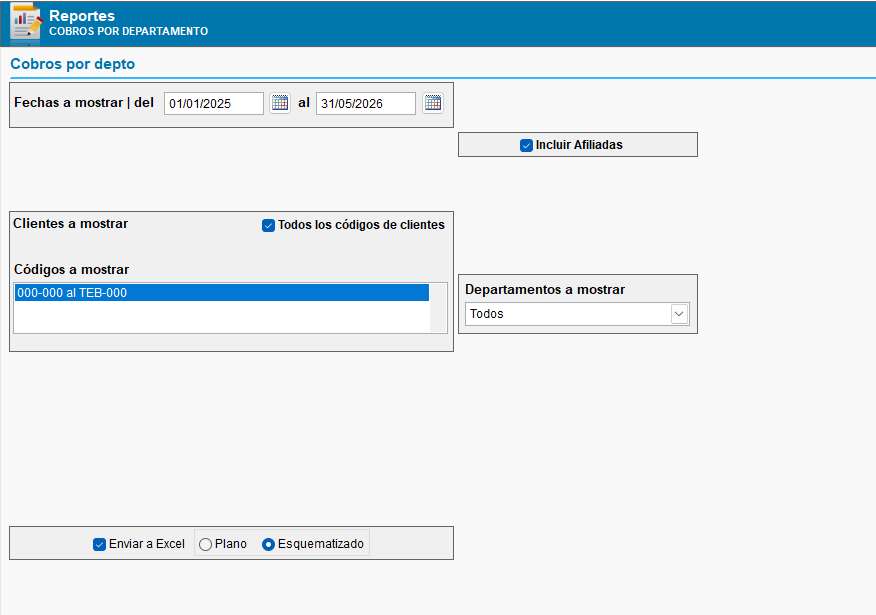{ align= center }**

    Es posible exportarlo a formato Excel en formato consolidado o plano.

Vista previa del reporte **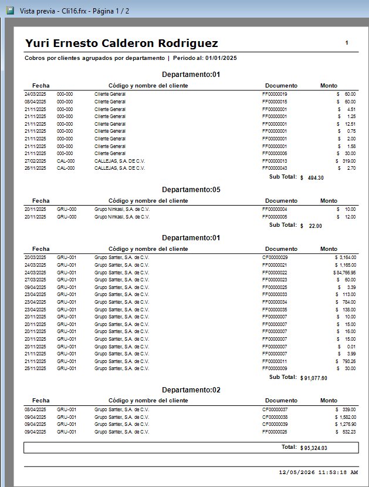{ align = center }**

??? abstract "1.6 Cobros por departamento - Descargas de ejemplo"
    - **[Descargar versión PDF :fontawesome-regular-file-pdf:](../../assets/reportes/clientes/CLI16.PDF){ .md-button }**
    - **[Descargar versión Excel (Consolidado) :material-microsoft-excel:](../../assets/reportes/clientes/CLI16_CON.xlsx){ .md-button }**
    - **[Descargar versión Excel (Plano) :material-microsoft-excel:](../../assets/reportes/clientes/CLI16_PLN.xlsx){ .md-button }**

---

### 1.7 Listado de documentos emitidos

!!! info "Descripción del reporte"
    Este reporte muestra un formato que contiene un listado de documentos emitidos, puede ser filtrado por medio de los siguientes parámetros:

    - Fecha
    - Tipo de documento
    - Clientes (Todos o bloques)
    - Departamento
    - Mostrar los documentos invalidados/anulados.
    
    También permite ser ordenado por tipo de documento, fecha, cliente o documento.

    **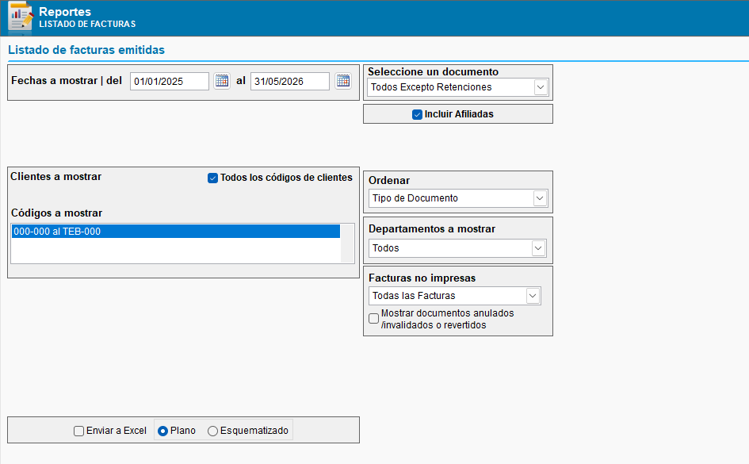{ align= center }**

    Es posible exportarlo a formato Excel.

Vista previa del reporte **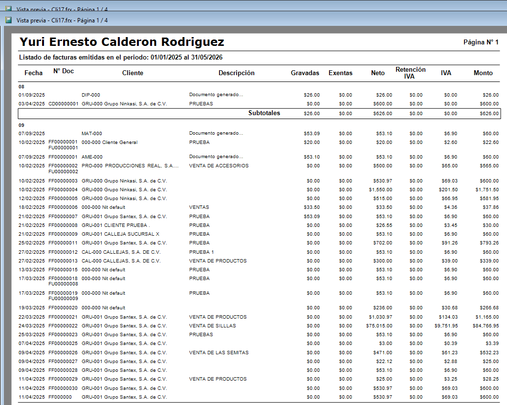{ align = center }**

??? abstract "1.7 Listado de documentos emitidos - Descargas de ejemplo"
    - **[Descargar versión PDF :fontawesome-regular-file-pdf:](../../assets/reportes/clientes/CLI17.PDF){ .md-button }**
    - **[Descargar versión Excel :material-microsoft-excel:](../../assets/reportes/clientes/CLI17_PLN.xlsx){ .md-button }**

---

### 1.11 Reporte de productos vendidos

!!! info "Descripción del reporte"
    Este reporte muestra un formato que contiene un listado de productos vendidos, puede ser filtrado por medio de los siguientes parámetros:

    - Fecha
    - Tipo de documento
    - Clientes (Todos o bloques)
    - Departamento
    - Mostrar los documentos invalidados/anulados.

    También permite ser ordenado por tipo de documento, fecha, cliente o documento.

    **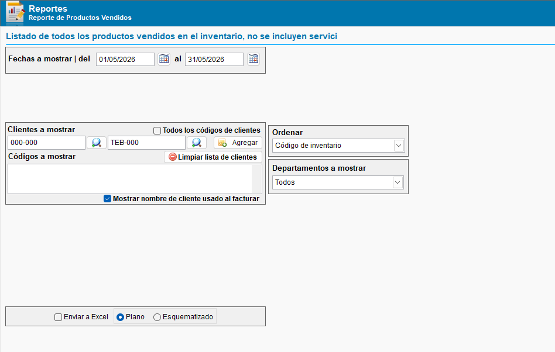{ align= center }**

    Es posible exportarlo a formato Excel.

Vista previa del reporte **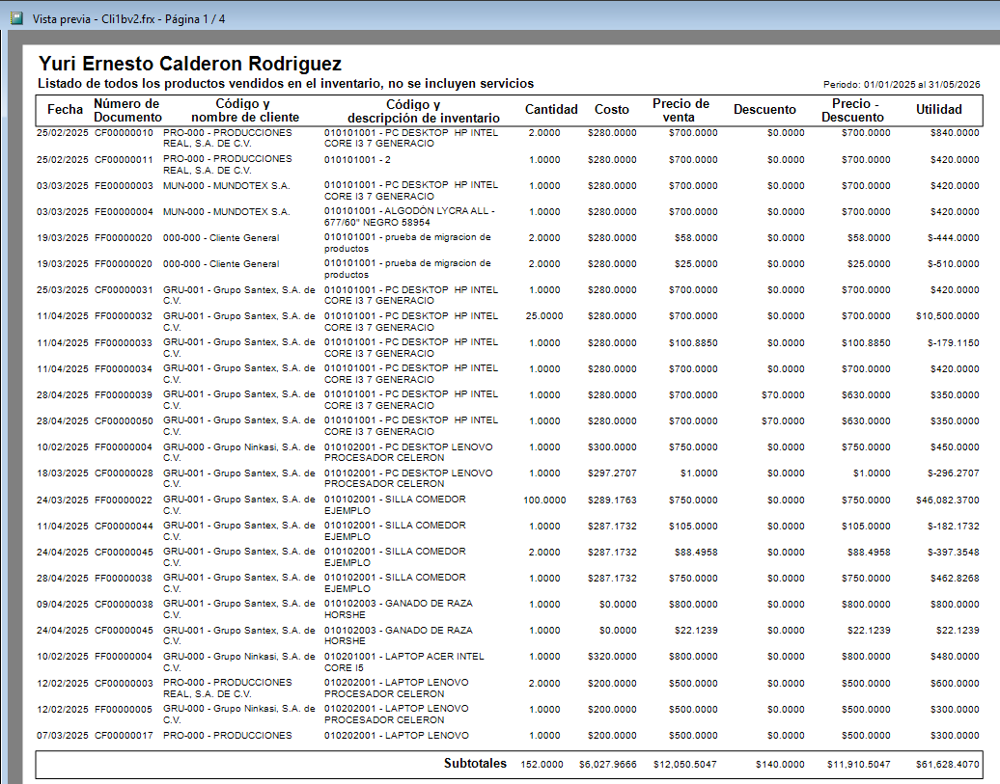{ align = center }**

??? abstract "1.11 Reporte de productos vendidos - Descargas de ejemplo"
    - **[Descargar versión PDF :fontawesome-regular-file-pdf:](../../assets/reportes/clientes/CLI1B.PDF){ .md-button }**
    - **[Descargar versión Excel (Consolidado) :material-microsoft-excel:](../../assets/reportes/clientes/CLI1B_CON.xlsx){ .md-button }**
    - **[Descargar versión Excel (Plano) :material-microsoft-excel:](../../assets/reportes/clientes/CLI1B_PLN.xlsx){ .md-button }**

---

### 1.12  Listado de facturas de sujeto excluido

!!! info "Descripción del reporte"
    Este reporte muestra un formato que contiene un listado de facturas de sujeto excluido emitidas desde el módulo de facturación, puede ser filtrado por medio de los siguientes parámetros:

    - Fecha
    - Proveedor (Todos o bloques)
    - Permite incluir documentos invalidados

    **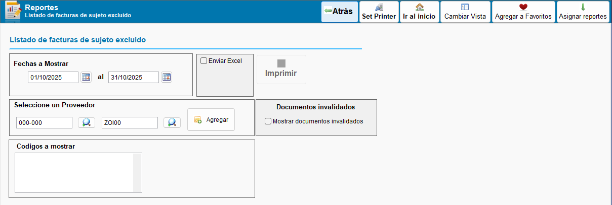{ align= center }**

    Es posible exportarlo a formato Excel, ya sea de forma agrupada (Esquematizado) o detallada (Plano).

Vista previa del reporte **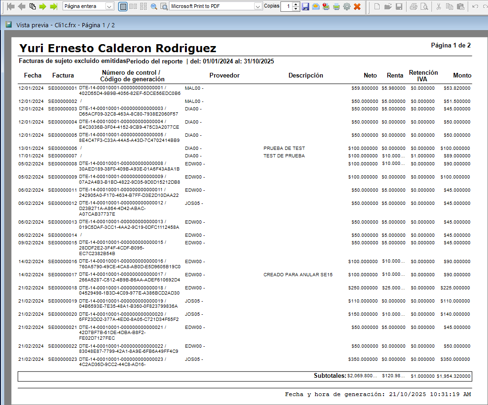{ align = center }**

??? abstract "1.12 Listado de facturas de sujeto excluido emitidas - Descargas de ejemplo"
    - **[Descargar versión PDF :fontawesome-regular-file-pdf:](../../assets/reportes/clientes/CLI1C.PDF){ .md-button }**
    - **[Descargar versión Excel (Consolidado) :material-microsoft-excel:](../../assets/reportes/clientes/CLI1C_CON.xlsx){ .md-button }**
    - **[Descargar versión Excel (Plano) :material-microsoft-excel:](../../assets/reportes/clientes/CLI1C_PLN.xlsx){ .md-button }**

---

### 1.13  Listado de cotizaciones emitidas

!!! info "Descripción del reporte"
    Este reporte muestra un formato que contiene un listado de cotizaciones emitidas desde el módulo de facturación, puede ser filtrado por medio de los siguientes parámetros:

    - Fecha
    - Clientes (Todos o bloques)
    - Códigos de inventario (Todos o bloques)
    - Permite incluir servicios (Línea descriptivas sin código vinculado)
    - Departamento (Centro de costo)

    **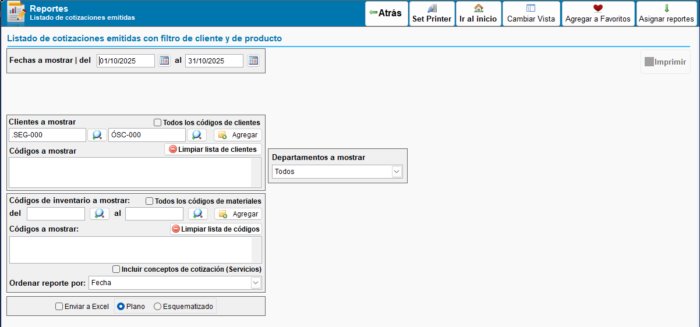{ align=left }**

    El reporte de listado de cotizaciones puede ser ordenado por las siguientes columnas:

    - Fecha
    - Número de documento
    - Cliente
    - Código de inventario
    - Cantidad de unidades
    - Porcentaje de descuento
    - Monto de descuento
    - Monto total
    - Monto total con descuento

    **Nota: En el caso de la exportación a excel en modo esquematizado el orden seleccionado también hace que los registros se agrupen por la misma columna** 

    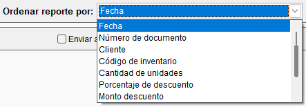

    Es posible exportarlo a formato Excel, ya sea de forma agrupada (Esquematizado) o detallada (Plano).

Vista previa del reporte **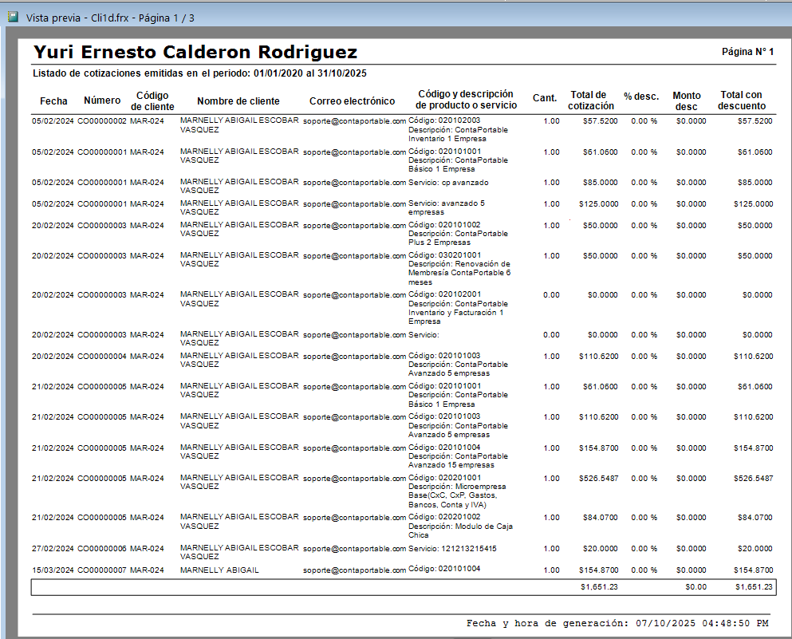{ align=left }**

??? abstract "1.13 Listado de cotizaciones emitidas - Descargas de ejemplo"
    - **[Descargar versión PDF :fontawesome-regular-file-pdf:](../../assets/reportes/clientes/1.13-COT-LIST.pdf){ .md-button }**
    - **[Descargar versión Excel (Consolidado) :material-microsoft-excel:](../../assets/reportes/clientes/1.13-COT-LIST-CON.xlsx){ .md-button }**
    - **[Descargar versión Excel (Plano) :material-microsoft-excel:](../../assets/reportes/clientes/1.13-COT-LIST-PLN.xlsx){ .md-button }**

---

### 1.14  Listado de comprobantes con documentos relacionados

!!! info "Descripción del reporte"
    Este reporte muestra un formato que contiene un listado de comprobantes con documento relacionado, esto incluye notas de crédito, notas de débito, notas de remisión y comprobantes de retención, puede ser filtrado por medio de los siguientes parámetros:

    - Rango de fechas
    - Clientes (Todos o bloques)
    - Permite incluir documentos anulados/ invalidados o revertidos

    **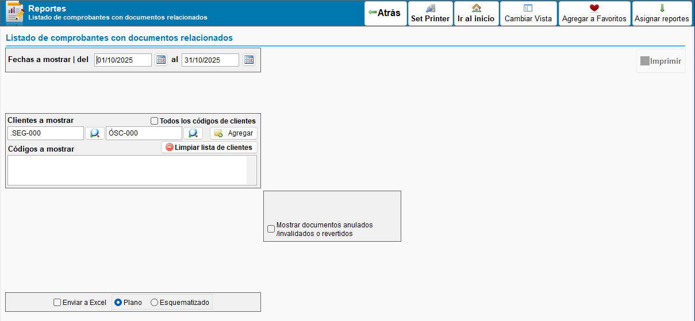{ align= center }**

    Es posible exportarlo a formato Excel, ya sea de forma agrupada (Esquematizado) o detallada (Plano).

Vista previa del reporte **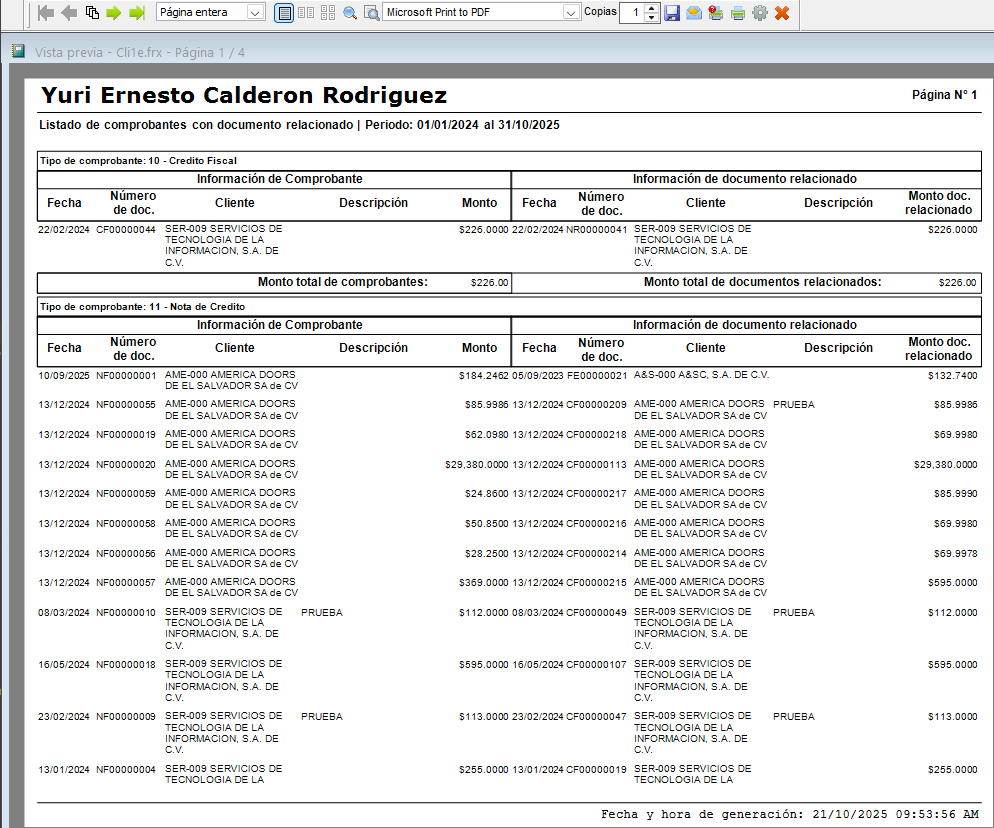{ align= center }**

??? abstract "1.14 Listado de comprobantes con documentos relacionados - Descargas de ejemplo"
    - **[Descargar versión PDF :fontawesome-regular-file-pdf:](../../assets/reportes/clientes/CLI1E.PDF){ .md-button }**
    - **[Descargar versión Excel (Consolidado) :material-microsoft-excel:](../../assets/reportes/clientes/CLI1E_CON.xlsx){ .md-button }**
    - **[Descargar versión Excel (Plano) :material-microsoft-excel:](../../assets/reportes/clientes/CLI1E_PLN.xlsx){ .md-button }**

---

### 1.17  Gestión y envío de email de avisos de cobro

!!! info "Descripción del reporte"
    Este reporte muestra un formato que contiene un listado de facturas pendientes por cliente con información de los días y saldos pendientes de las documentos emitidos que no han sido cobrados, puede ser filtrado por medio de los siguientes parámetros:

    - Fecha de corte
    - Clientes (Todos o bloques)
    - Permite seleccionar si se usará la fecha de quedan para el cálculo
    - Cuentas bancarias a mostrar en el reporte para efectuar depósitos
    - Correo a mostrar en el reporte
    - Departamento (Centro de costo)

    **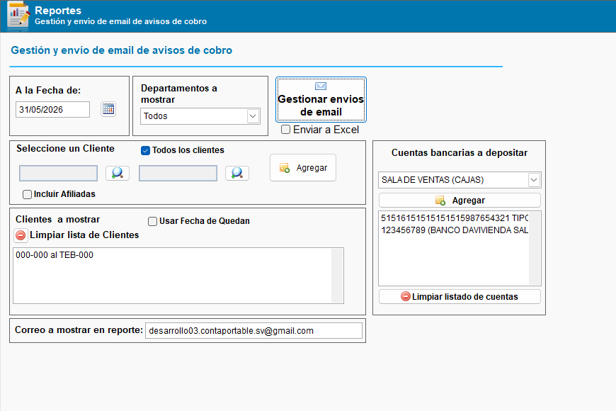{ align= center }**

    Es posible exportarlo a formato Excel y también a PDF directamente desde la interfaz.

    **Nota importante**: Este reporte además incluye una interfaz que permite gestionar el envío por correo de las notificaciones/avisos de cobro a los clientes. 
    Para más información, consulte:
    **[Interfaz de gestión y envío de avisos de cobro :material-arrow-right-bold-box-outline:](CLI1H.md){ .md-button}** 

Vista previa del reporte **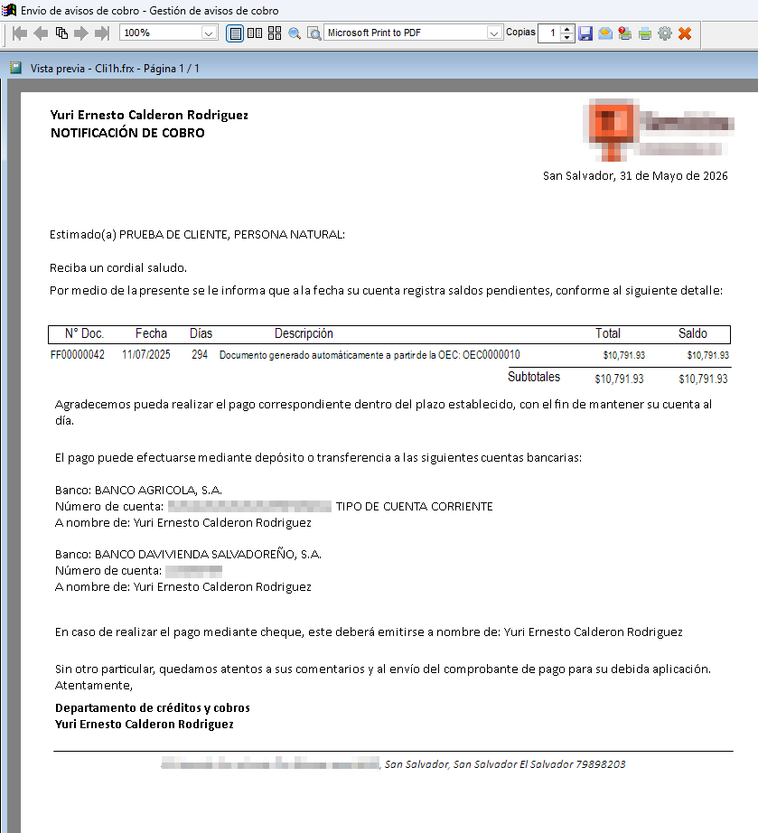{ align = center }**

??? abstract "1.17 Gestión y envío de email de avisos de cobro - Descargas de ejemplo"
    - **[Descargar versión PDF :fontawesome-regular-file-pdf:](../../assets/reportes/clientes/CLI1H.PDF){ .md-button }**
    - **[Descargar versión Excel (Consolidado) :material-microsoft-excel:](../../assets/reportes/clientes/CLI1H_CON.xlsx){ .md-button }**
    - **[Descargar versión Excel (Plano) :material-microsoft-excel:](../../assets/reportes/clientes/CLI1H_PLN.xlsx){ .md-button }**

---

### 1.18 Productos vendidos agrupados por familia de inventario

!!! info "Descripción del reporte"
    Este reporte muestra un resumen de los productos vendidos en un rango de fechas específico, agrupado por familias de inventario. Puede ser filtrado por medio de los siguientes parámetros:

    - Rango de fechas
    - Códigos de inventario (Todos o bloques)
    - Clientes (Todos o bloques)

    **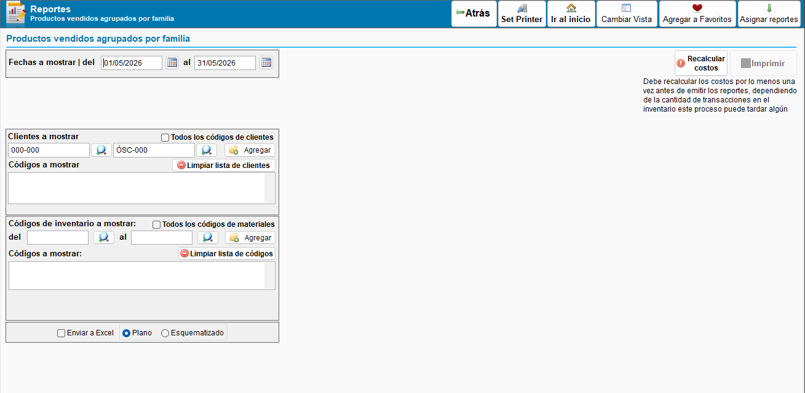{ align= center }**

    Es posible exportarlo a formato Excel ya sea de forma consolidada o detallada.

Vista previa del reporte **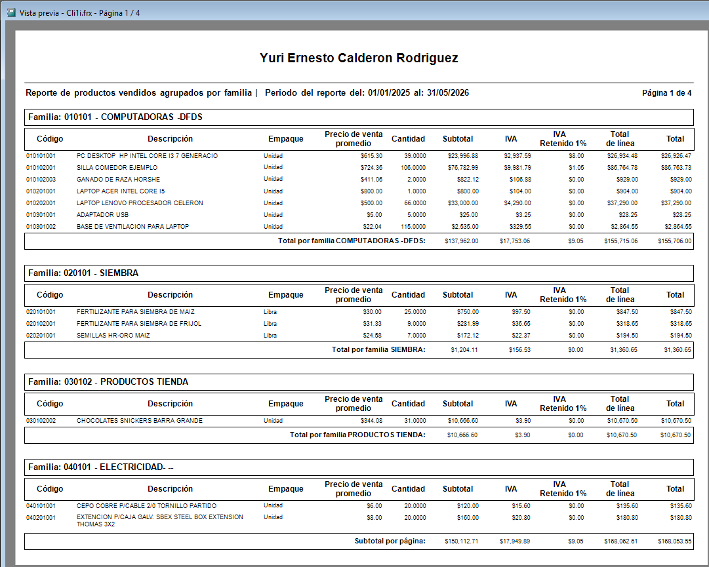{ align = center }**

??? abstract "1.18 Productos vendidos agrupados por familia de inventario - Descargas de ejemplo"
    - **[Descargar versión PDF :fontawesome-regular-file-pdf:](../../assets/reportes/clientes/CLI1I.PDF){ .md-button }**
    - **[Descargar versión Excel (Consolidado) :material-microsoft-excel:](../../assets/reportes/clientes/CLI1I_CON.xlsx){ .md-button }**
    - **[Descargar versión Excel (Plano) :material-microsoft-excel:](../../assets/reportes/clientes/CLI1I_PLN.xlsx){ .md-button }**
---

## **2. Saldos por antigüedad**

## **3. Resúmenes y estadísticas de venta**

<!-- Se agrega el código mermaid para diagramar el listado de reportes dentro de la subcategoría de estadísticas -->
!!! tip "Diagrama de los reportes contenidos en la subcategoría **Resúmenes y estadísticas de venta**"
    ``` mermaid
    graph LR
      A[Estadísticas de venta]:::root

      subgraph "Listado de reportes:"

        B[3.1 Clientes con más facturación CLI31]
        C[3.2 Estadísticas CLI32]
      end

      A --> B
      A --> C

    click B "#31-clientes-con-mas-facturacion-cli31" "Ir a Clientes con más facturación"
    click C "#32-estadisticas-cli32" "Ir a Estadísticas"
    ```
---

### 3.1 Clientes con más facturación (CLI31)

!!! info "Descripción del reporte"
    Este reporte permite visualizar un top de los clientes con mayor facturación.
    Se ha habilitado la **Exportación a Excel**.

Vista previa del reporte **{ align = center }**

---

### 3.2 Estadísticas (CLI32)

!!! info "Descripción del reporte"
    Reporte complementario de estadísticas de venta.
    Se ha habilitado la **Exportación a Excel**.

Vista previa del reporte **{ align = center }**

## **5. Control de cobros y comisiones**

<!-- Se agrega el código mermaid para diagramar el listado de reportes dentro de la subcategoría de Control de cobros y comisiones -->
!!! tip "Diagrama de los reportes contenidos en la subcategoría **Control de cobros y comisiones**"
    ``` mermaid
    graph LR
      A[Información de clientes]:::root

      subgraph "Listado de reportes:"

        B[5.1 Detalle de cobros y comisiones]
        C[5.2 Cobros y comisiones tabulados]
      end

      A --> B
      A --> C

    click B "#51-detalle-de-cobros-y-comisiones" "Ir a reporte de detalle de cobros y comisiones"
    click C "#52-cobros-y-comisiones-tabulados" "Ir a reporte de cobros y comisiones tabulados"
    ```
---

### 5.1 Detalle de cobros y comisiones

!!! info "Descripción del reporte"
    Este reporte muestra un detalle de cobros y comisiones para los productos vendidos, puede ser filtrado por medio de los siguientes parámetros:

    - Rango de fechas
    - Días para el cálculo de la fecha de vencimiento (En el cuál aplica la comisión a partir del cobro de la factura)

    **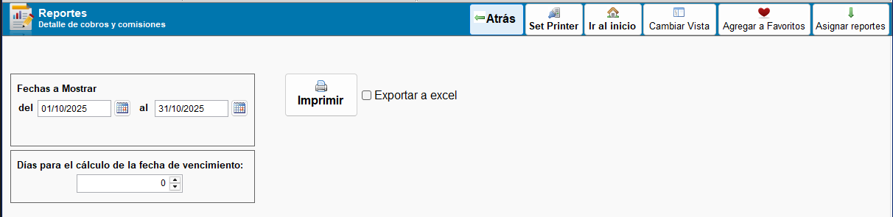{ align= center }**

    De la misma forma es posible exportarlo a formato Excel.

Vista previa del reporte

**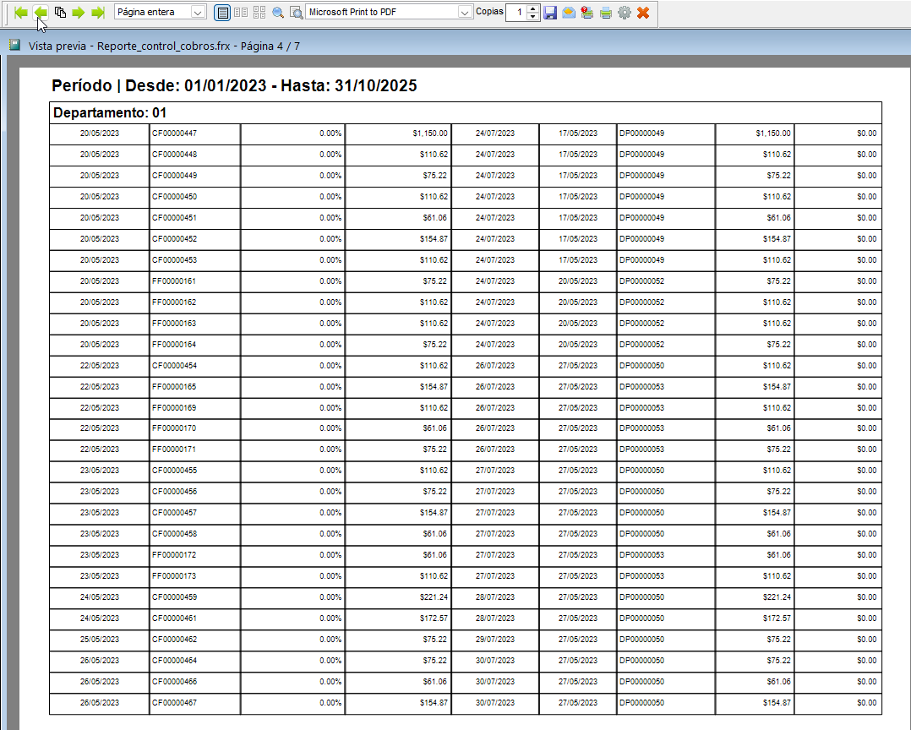{ align = center }**

??? abstract "5.1 Detalle de cobros y comisiones - Descargas de ejemplo"
    - **[Descargar versión PDF :fontawesome-regular-file-pdf:](../../assets/reportes/clientes/CLI51.PDF){ .md-button }**
    - **[Descargar versión Excel (Detalle) :material-microsoft-excel:](../../assets/reportes/clientes/CLI51_EXCEL.xlsx){ .md-button }**

---

### 5.2 Cobros y comisiones tabulados

!!! info "Descripción del reporte"
    Este reporte muestra un archivo de excel con la tabulación de los cobros y comisiones para los productos vendidos, puede ser filtrado por medio de los siguientes parámetros:

    - Rango de fechas
    - Días para el cálculo de la fecha de vencimiento (En el cuál aplica la comisión a partir del cobro de la factura)

    **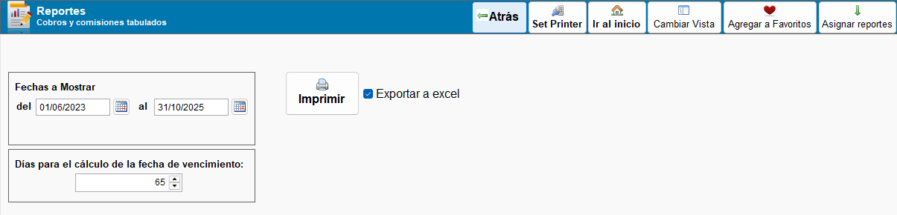{ align= center }**

    **Nota: Solamente se puede exportar a Excel**

Vista previa del reporte

**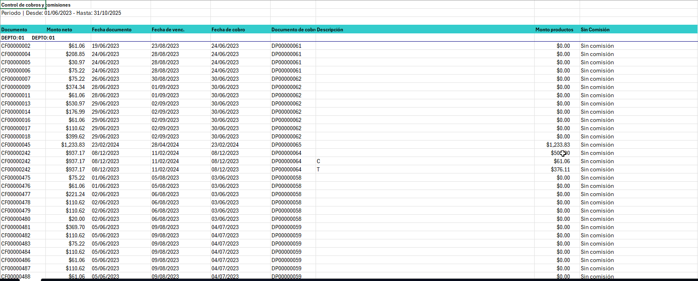{ align = center }**

??? abstract "5.2 Cobros y comisiones tabulados - Descargas de ejemplo"
    - **[Descargar versión Excel (Tabulado) :material-microsoft-excel:](../../assets/reportes/clientes/CLI52_EXCEL.xlsx){ .md-button }**

---

## **6. Información de clientes**

<!-- Se agrega el código mermaid para diagramar el listado de reportes dentro de la subcategoría de Información de clientes -->
!!! tip "Diagrama de los reportes contenidos en la subcategoría **Información de clientes**"
    ``` mermaid
    graph LR
      A[Información de clientes]:::root

      subgraph "Listado de reportes:"

        B[6.1 Listado de clientes]
        C[6.2 Listado de clientes con información de contactos y cuentas por cobrar]
        D[6.3 Listado de clientes con información de contactos]
      end

      A --> B
      A --> C
      A --> D

    click B "#61-listado-de-clientes" "Ir a reporte de Listado de clientes"
    click C "#62-listado-de-clientes-con-informacion-de-contactos-y-cuentas-por-cobrar" "Ir a reporte de listado de clientes con información de contactos y cuentas por cobrar"
    click D "#63-listado-de-clientes-con-informacion-de-contactos" "Ir a reporte de listado de clientes con información de contactos"
    ```
---

### 6.1 Listado de clientes

!!! info "Descripción del reporte"
    Este reporte muestra un listado de clientes existentes en el sistema con información de números de documentos (NRC y NIT), dirección y código de actividad, puede ser filtrado por medio de los siguientes parámetros:

    - Clientes (Todos o bloques)
    - Departamento (centro de costo)

    **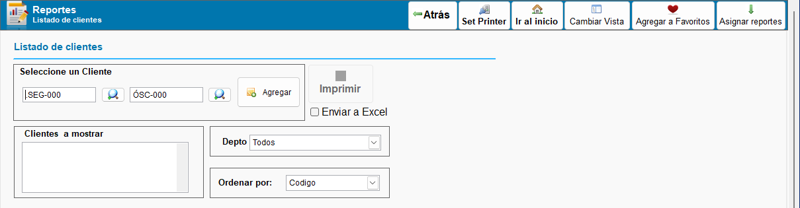{ align=left }**

    El reporte de listado de clientes puede ser ordenado por las siguientes columnas:

    - Código de cliente
    - Nombre de cliente
    - Departamento de empresa
    - Municipio
    - Registro de IVA
    - NIT

    **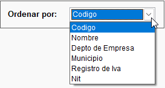{ align=center }**

    De la misma forma es posible exportarlo a formato Excel.

Vista previa del reporte

**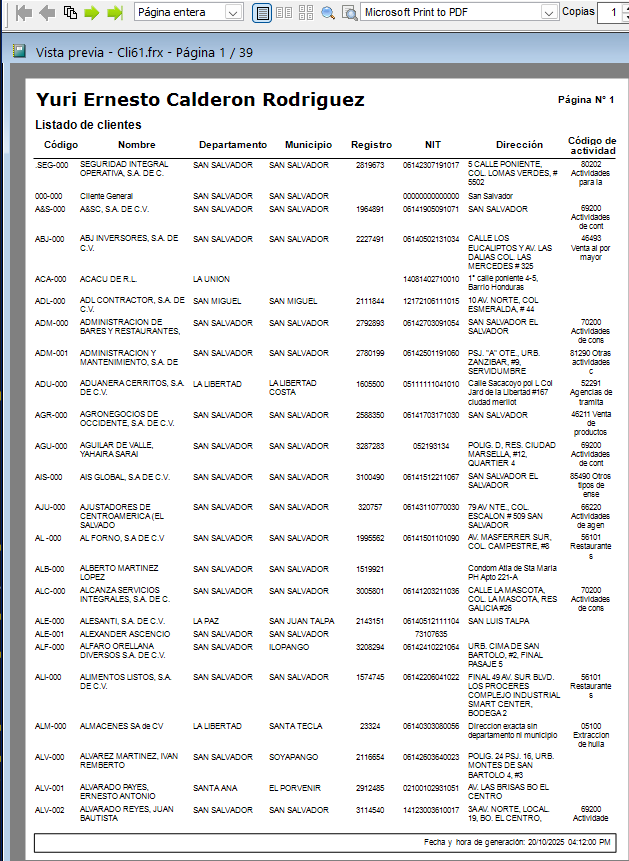{ align=center }**

??? abstract "6.1 Listado de clientes - Descargas de ejemplo"
    - **[Descargar versión PDF :fontawesome-regular-file-pdf:](../../assets/reportes/clientes/CLI61.PDF){ .md-button }**
    - **[Descargar versión Excel (Consolidado) :material-microsoft-excel:](../../assets/reportes/clientes/CLI61_EXCEL.xlsx){ .md-button }**

---

### 6.2 Listado de clientes con información de contactos y cuentas por cobrar

!!! info "Descripción del reporte"
    Este reporte muestra un formato con un listado de clientes con información de contactos y cuentas por cobrar, puede ser filtrado por medio de los siguientes parámetros:

    - Clientes (Todos o bloques)
    - Departamento (Centro de costo)

    **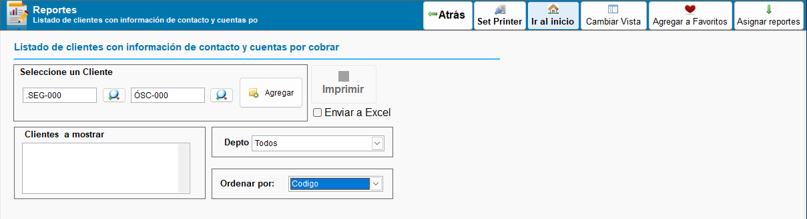{ align=center }**

    - Código de cliente
    - Nombre de cliente
    - Departamento de empresa
    - Municipio
    - Registro de IVA
    - NIT

    **{ align=center }**

    De la misma forma es posible exportarlo a formato Excel.

Vista previa del reporte **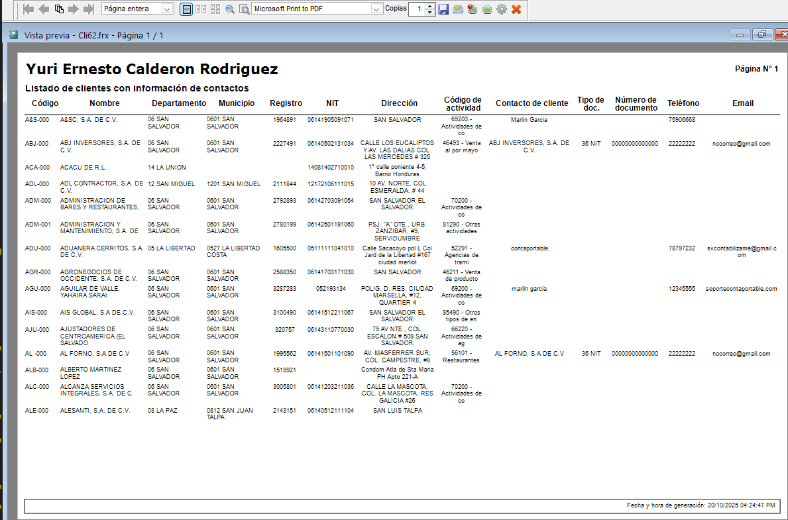{ align= center }**

??? abstract "6.2 Listado de clientes con información de contactos y cuentas por cobrar - Descargas de ejemplo"
    - **[Descargar versión PDF :fontawesome-regular-file-pdf:](../../assets/reportes/clientes/CLI62.PDF){ .md-button }**
    - **[Descargar versión Excel (Puede usarse como plantilla de importación de clientes) :material-microsoft-excel:](../../assets/reportes/clientes/CLI62_EXCEL.xlsx){ .md-button }**

---

### 6.3 Listado de clientes con información de contactos

!!! info "Descripción del reporte"
    Este reporte muestra un formato con un listado de clientes con información de contactos, puede ser filtrado por medio de los siguientes parámetros:

    - Clientes (Todos o bloques)
    - Departamento (Centro de costo)

    **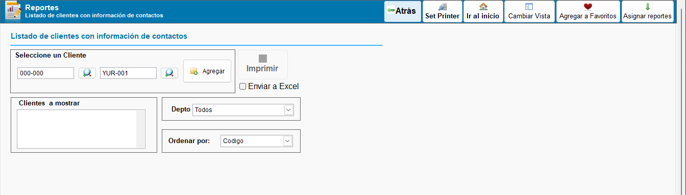{ align=center }**

    - Código de cliente
    - Nombre de cliente
    - Departamento de empresa
    - Municipio
    - Registro de IVA
    - NIT

    **{ align=center }**

    De la misma forma es posible exportarlo a formato Excel.

Vista previa del reporte **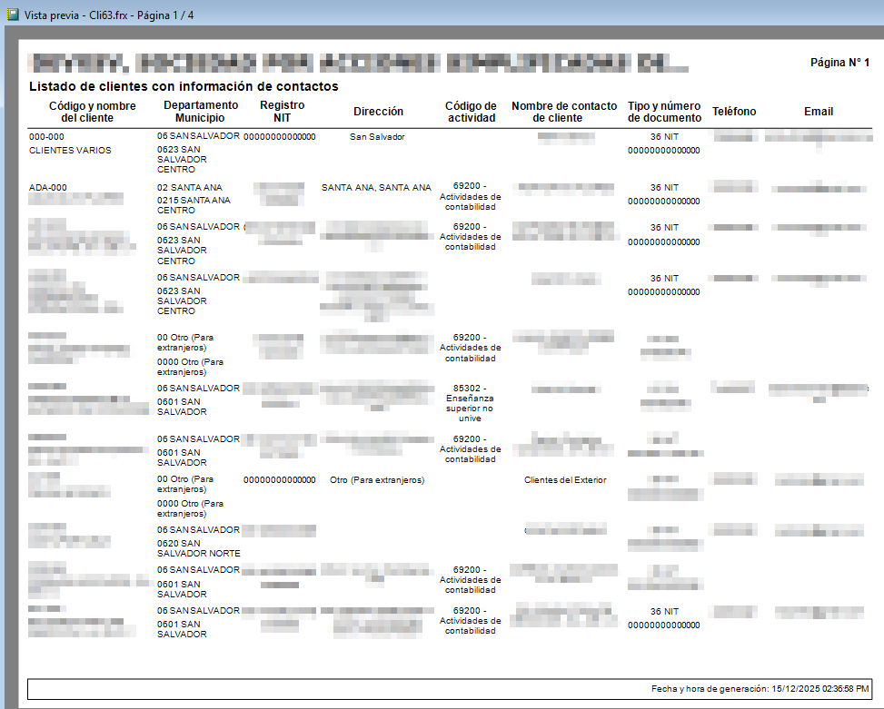{ align= center }**

??? abstract "6.3 Listado de clientes con información de contactos - Descargas de ejemplo"
    - **[Descargar versión PDF :fontawesome-regular-file-pdf:](../../assets/reportes/clientes/CLI63.PDF){ .md-button }**
    - **[Descargar versión Excel (Puede usarse como plantilla de importación de clientes) :material-microsoft-excel:](../../assets/reportes/clientes/CLI63_EXCEL.xlsx){ .md-button }**
