# **Reportes de impuestos**

Esta página reúne el detalle de los reportes incluídos en la categoría de impuestos en el sistema **ContaPortable**.

<!-- Se agrega el código mermaid para diagramar las subcategorías de impuestos -->
!!! tip "Diagrama de las subcategorías contenidas en **Reportes de impuestos**"
    ``` mermaid
    graph TD
      A[Reportes de impuestos]:::root

      subgraph "Subcategorías"
        B[1. Libros de IVA]
        C[2. Otros reportes de IVA]
        D[3. Reportes de renta]
        E[4. Libros de IVA DTE's Tamaño Carta]
        F[5. Libros de IVA DTE's Tamaño Oficio]
        G[6. Libros de IVA DTE's agrupados por establecimiento, punto de venta y departamento]
        H[7. Libros de IVA DTE's con contribuciones especiales]
      end

      A --> B
      A --> C
      A --> D
      A --> E
      A --> F
      A --> G
      A --> H
    
    click B "#1-libros-de-iva" "Ir a Libros de IVA"
    click C "#2-otros-reportes-de-iva" "Ir a otros reportes de IVA"
    click D "#3-reportes-de-renta" "Ir a reportes de renta"
    click E "#4-libros-de-iva-dtes-tamano-carta" "Ir a Libros de IVA DTE's Tamaño Carta"
    click F "#5-libros-de-iva-dtes-tamano-oficio" "Ir a Libros de IVA DTE's Tamaño Oficio"
    click G "#6-libros-de-iva-dtes-agrupados-por-establecimiento-punto-de-venta-y-departamento" "Ir a Libros de IVA DTE's agrupados por establecimiento, punto de venta y departamento"
    click H "#7-libros-de-iva-dtes-con-contribuciones-especiales" "Ir a Libros de IVA DTE's con contribuciones especiales"
    ```
---

## **1. Libros de IVA**

<!-- Se agrega el código mermaid para diagramar el listado de reportes dentro de la subcategoría de Libros de IVA -->
!!! tip "Diagrama de los reportes contenidos en la subcategoría **Libros de IVA**"
    ``` mermaid
    graph LR
      A[Libros de IVA]:::root

      subgraph "Listado de reportes:"
        B[1.1 Libro de ventas consumidor]
        C[1.2 Libro de ventas al contribuyente]
        D[1.3 Libro de compras]
        E[1.4 Listado de facturas de IVA]
        F[1.5 Resumen de liquidación de IVA]
      end

      A --> B
      A --> C
      A --> D
      A --> E
      A --> F

    click B "#11-libros-de-ventas-consumidor" "Ir a Libro de ventas consumidor"
    click C "#12-libro-de-ventas-al-contribuyente" "Ir a Libro de ventas a contribuyente"
    click D "#13-libro-de-compras" "Ir a Libro de compras"
    click E "#14-listado-de-facturas-de-iva" "Ir a listado de facturas de IVA"
    click F "#15-resumen-de-liquidacion-de-iva" "Ir a resumen de liquidación de IVA"
    ```
---

### **1.1  Libros de ventas consumidor**

!!! info "Descripción del reporte"
    Este reporte muestra un formato de libro de ventas al consumidor para declaración de impuestos, puede ser filtrado por medio de los siguientes parámetros:

    - Rango de fechas
    - Departamento (Centro de costo)

    **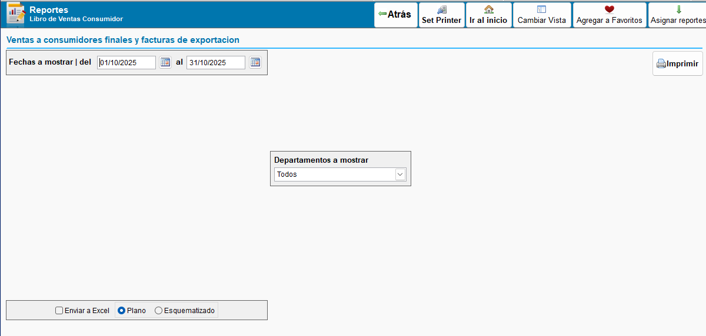{ align=left }**

    Es posible exportarlo a formato Excel, ya sea de forma consolidada o detallada (Plano).

Vista previa del reporte **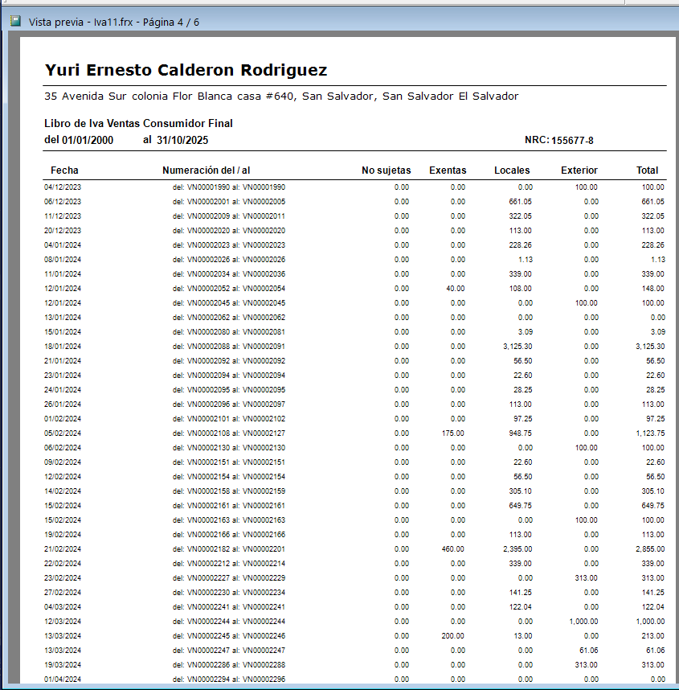{ align=left }**

??? abstract "1.1 Libro de ventas al consumidor - Descargas de ejemplo"
    - **[Descargar versión PDF :fontawesome-regular-file-pdf:](../../assets/reportes/impuestos/IVA11.PDF){ .md-button }**
    - **[Descargar versión Excel (Consolidado) :material-microsoft-excel:](../../assets/reportes/impuestos/IVA11_CON.xlsx){ .md-button }**
    - **[Descargar versión Excel (Plano) :material-microsoft-excel:](../../assets/reportes/impuestos/IVA11_PLN.xlsx){ .md-button }**

---

### **1.2  Libro de ventas al contribuyente**

!!! info "Descripción del reporte"
    Este reporte muestra un formato de libro de ventas al contribuyente para declaración de impuestos, puede ser filtrado por medio de los siguientes parámetros:

    - Rango de fechas
    - Departamento (Centro de costo)

    **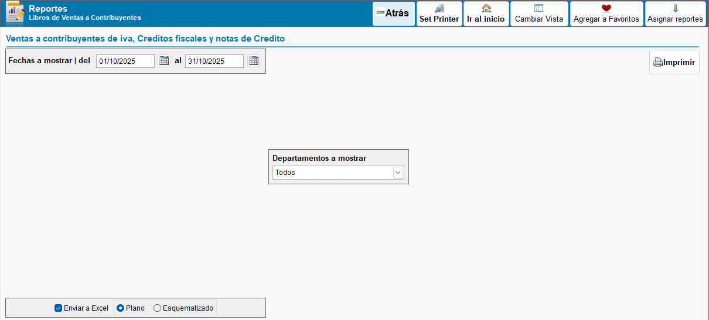{ align=left }**

    Es posible exportarlo a formato Excel, ya sea de forma consolidada o detallada (Plano).

Vista previa del reporte **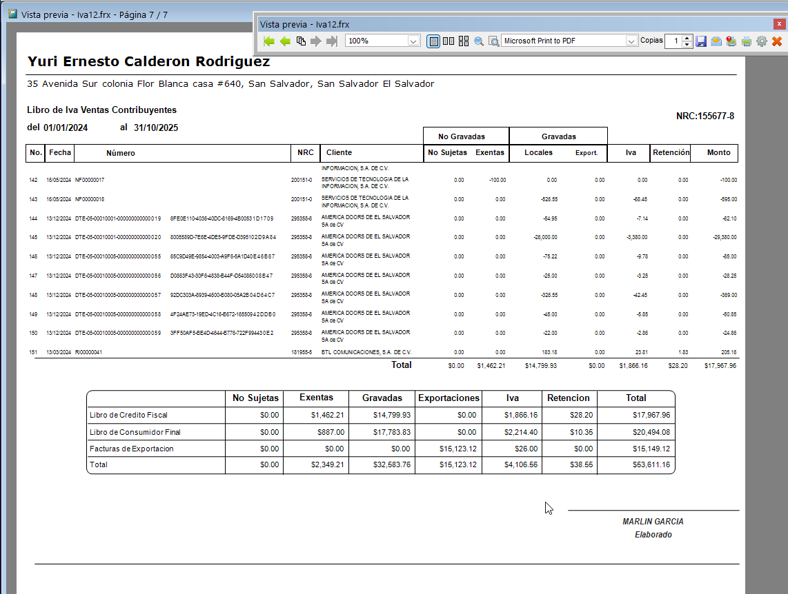{ align=left }**

??? abstract "1.2 Libro de ventas al contribuyente - Descargas de ejemplo"
    - **[Descargar versión PDF :fontawesome-regular-file-pdf:](../../assets/reportes/impuestos/IVA12.PDF){ .md-button }**
    - **[Descargar versión Excel (Consolidado) :material-microsoft-excel:](../../assets/reportes/impuestos/IVA12_CON.xlsx){ .md-button }**
    - **[Descargar versión Excel (Plano) :material-microsoft-excel:](../../assets/reportes/impuestos/IVA12_PLN.xlsx){ .md-button }**

---

### **1.3 Libro de compras**

!!! info "Descripción del reporte"
    Este reporte muestra un formato de libro de compras para declaración de impuestos, puede ser filtrado por medio de los siguientes parámetros:

    - Periodo (Mes - Año)
    - Imprimir un periodo vacío
    - Departamento (Centro de costo)

    **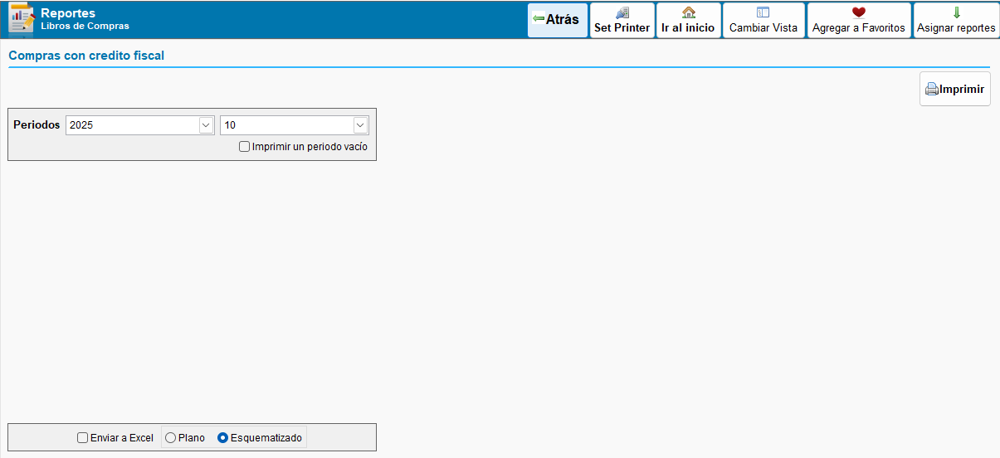{ align=left }**

    Es posible exportarlo a formato Excel, ya sea de forma consolidada o detallada (Plano).

Vista previa del reporte **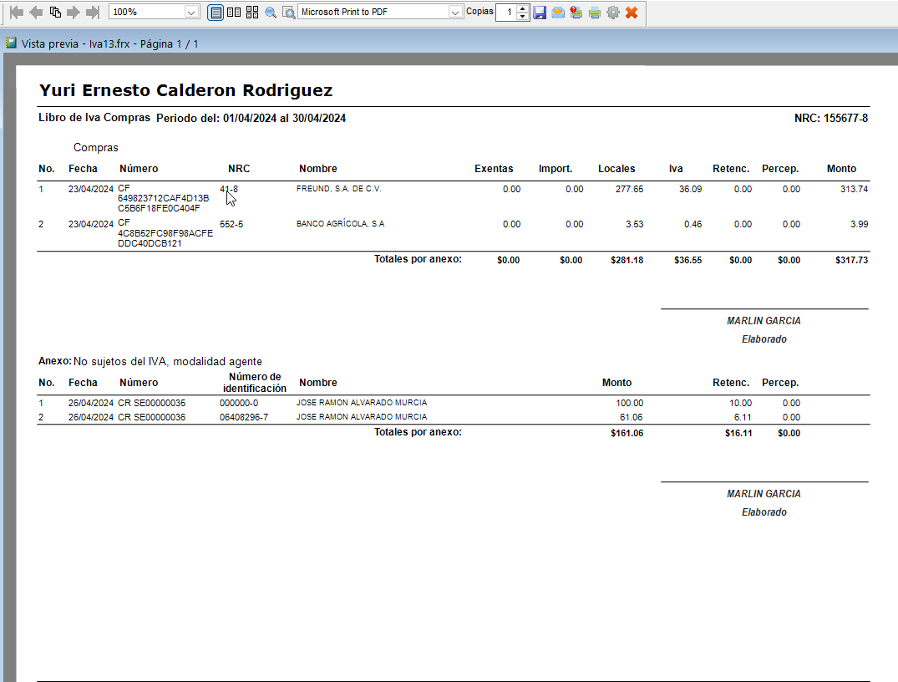{ align=left }**

??? abstract "1.3 Libro de compras - Descargas de ejemplo"
    - **[Descargar versión PDF :fontawesome-regular-file-pdf:](../../assets/reportes/impuestos/IVA13.PDF){ .md-button }**
    - **[Descargar versión Excel (Consolidado) :material-microsoft-excel:](../../assets/reportes/impuestos/IVA13_CON.xlsx){ .md-button }**
    - **[Descargar versión Excel (Plano) :material-microsoft-excel:](../../assets/reportes/impuestos/IVA13_PLN.xlsx){ .md-button }**

---

### **1.4 Listado de facturas de IVA**

!!! info "Descripción del reporte"
    Este reporte muestra un formato de listado de facturas tomadas desde los libros de IVA, puede ser filtrado por medio de los siguientes parámetros:

    - Rango de fechas
    - Departamento (Centro de costo)

    **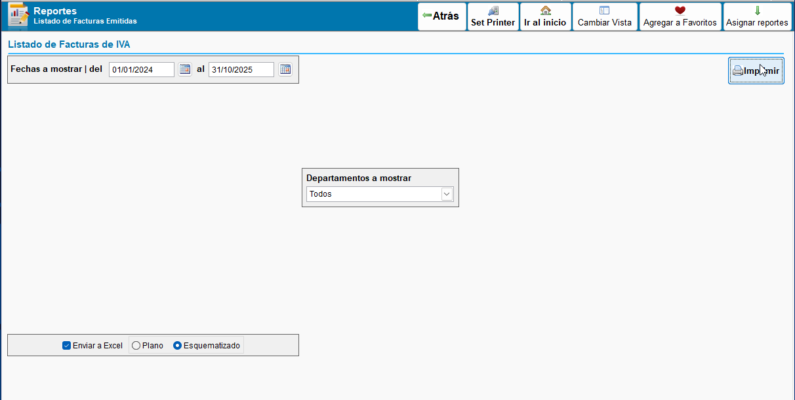{ align=left }**

    Es posible exportarlo a formato Excel, ya sea de forma consolidada o detallada (Plano).

Vista previa del reporte **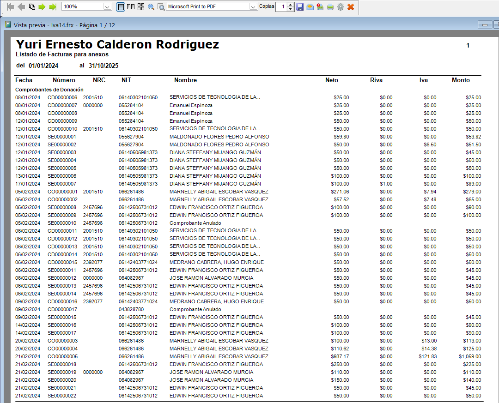{ align=left }**

??? abstract "1.4 Listado de facturas de IVA - Descargas de ejemplo"
    - **[Descargar versión PDF :fontawesome-regular-file-pdf:](../../assets/reportes/impuestos/IVA14.PDF){ .md-button }**
    - **[Descargar versión Excel (Consolidado) :material-microsoft-excel:](../../assets/reportes/impuestos/IVA14_CON.xlsx){ .md-button }**
    - **[Descargar versión Excel (Plano) :material-microsoft-excel:](../../assets/reportes/impuestos/IVA14_PLN.xlsx){ .md-button }**

---

### **1.5  Resumen de liquidación de IVA**

!!! info "Descripción del reporte"
    Este reporte genera un resumen consolidado de la liquidación del Impuesto al Valor Agregado (IVA) para un periodo determinado. Su propósito es presentar de forma clara los **débitos fiscales** (ventas) y los **créditos fiscales** (compras), calcular el impuesto resultante y determinar si existe un **saldo a pagar** o un **remanente** trasladable al siguiente periodo.

    El reporte puede ser filtrado por medio de los siguientes parámetros:

    - Periodo (Mes - Año)
    - Remanente del periodo anterior (SI APLICA. Calculada desde la liquidación de IVA anterior)

    <!-- filtros del reporte -->
    **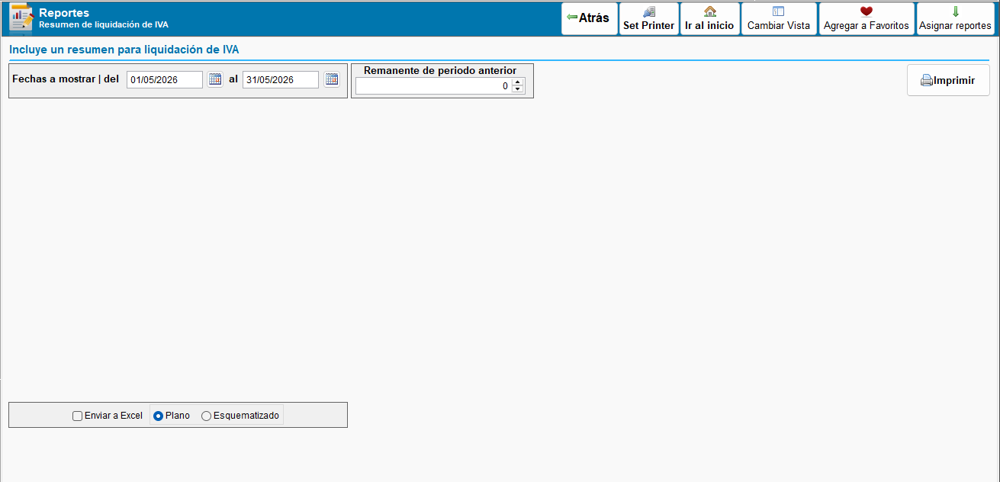{ align=left }**

#### Estructura del reporte

El resumen se divide en tres secciones principales:

=== "Sección de Ventas (Débito Fiscal)"

    !!! note "VENTAS — Débito Fiscal"
        Detalla todos los montos de IVA generados por las ventas del periodo:

        | Campo | Descripción |
        |-------|-------------|
        | **Ventas con crédito fiscal** | Ventas realizadas a contribuyentes (facturas de crédito fiscal). |
        | **Ventas consumidor final** | Ventas realizadas a consumidores finales. |
        | **Ventas con facturas de exportación** | Ventas de exportación registradas en el periodo. |
        | **Notas de crédito (ventas)** | Notas de crédito emitidas — se **restan** del total de ventas. |
        | **Total Débito Fiscal** | Suma neta del IVA generado por ventas. |

    <!-- Sección de ventas del resumen de liquidación de IVA -->
    **{ align=left }**

=== "Sección de Compras (Crédito Fiscal)"

    !!! note "COMPRAS — Crédito Fiscal"
        Detalla todos los montos de IVA acreditables provenientes de las compras del periodo:

        | Campo | Descripción |
        |-------|-------------|
        | **Compras internas** | Compras realizadas a proveedores nacionales. |
        | **Compras al exterior** | Importaciones y adquisiciones internacionales. |
        | **Compras a sujetos excluidos** | Compras realizadas a sujetos excluidos del IVA. |
        | **Notas de crédito (compras)** | Notas de crédito recibidas — se **restan** del total de compras. |
        | **Total Crédito Fiscal** | Suma neta del IVA acreditable por compras. |

    <!-- Sección de compras del resumen de liquidación de IVA -->
    **{ align=left }**

=== "Resumen de Liquidación"

    !!! note "RESUMEN DE LIQUIDACIÓN"
        Calcula el resultado final de la liquidación del IVA para el periodo:

        | Campo | Descripción |
        |-------|-------------|
        | **Total Débito Fiscal** | IVA total generado por ventas. |
        | **Total Crédito Fiscal** | IVA total acreditable por compras. |
        | **Remanente del periodo anterior** | Campo editable para ingresar el remanente (excedente de crédito fiscal) del periodo anterior. El sistema **guarda automáticamente** el último valor ingresado. |
        | **TOTAL A PAGAR IVA** | Monto final a pagar en concepto de IVA. 
        | **Remanente para el próximo periodo** | Si el crédito fiscal excede al débito fiscal, el excedente se traslada al siguiente periodo. También se muestra al final del resumen. |

    <!-- Resumen de liquidación del reporte -->
    **{ align=left }**

#### Fórmula de cálculo

```
Liquidación = Total Débito Fiscal − Total Crédito Fiscal − Remanente Periodo Anterior

Si Liquidación > 0 → TOTAL A PAGAR IVA = Liquidación
Si Liquidación ≤ 0 → Remanente para el próximo periodo = |Liquidación|
```

#### Vista previa del reporte

<!-- PLACEHOLDER: Insertar captura completa del reporte de liquidación de IVA -->
Vista previa del reporte **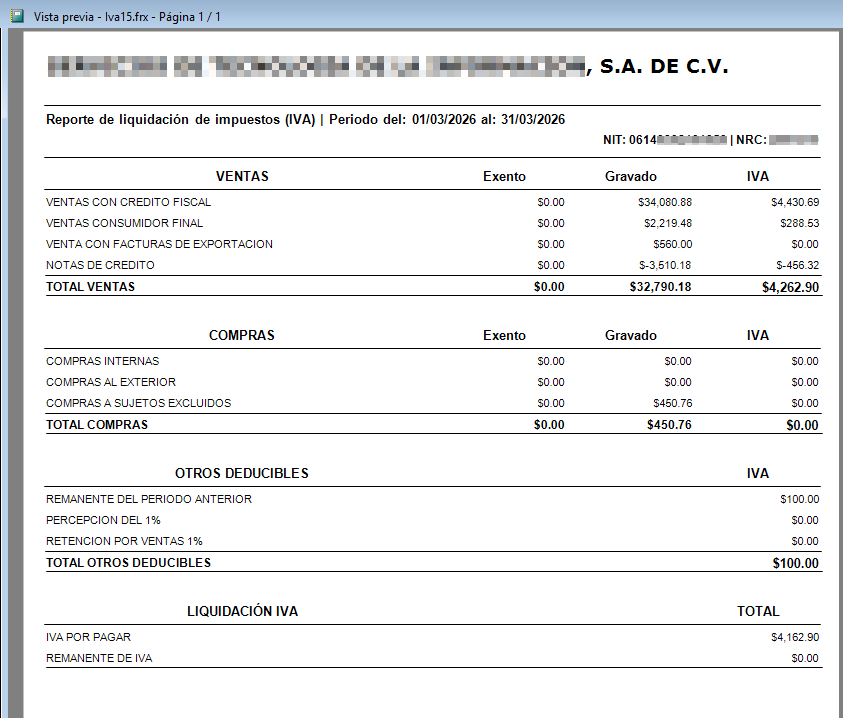{ align=left }**

??? abstract "1.5 Resumen de liquidación de IVA - Descargas de ejemplo"
    - **[Descargar versión PDF :fontawesome-regular-file-pdf:](../../assets/reportes/impuestos/IVA15.PDF){ .md-button }**
    - **[Descargar versión Excel :material-microsoft-excel:](../../assets/reportes/impuestos/IVA15_CON.xls){ .md-button }**

---

## **3. Reportes de renta**

<!-- Se agrega el código mermaid para diagramar el listado de reportes dentro de la subcategoría de Reportes de renta -->
!!! tip "Diagrama de los reportes contenidos en la subcategoría **Reportes de renta**"
    ``` mermaid
    graph LR
      A[Reportes de renta]:::root

      subgraph "Listado de reportes:"
        B[3.1 Reporte de renta]
        C[3.2 Reporte de renta por NIT]
        D[3.3 Constancias de renta]
      end

      A --> B
      A --> C
      A --> D

    click B "#31-reporte-de-renta" "Ir a Reporte de renta"
    click C "#32-reporte-de-renta-por-nit" "Ir a Reporte de renta por NIT"
    click D "#33-constancias-de-renta" "Ir a Constancias de renta"
    ```
---

### **3.1  Reporte de renta**

!!! info "Descripción del reporte"
    Este reporte muestra un formato de retenciones de renta para declaración de impuestos, puede ser filtrado por medio de los siguientes parámetros:

    - Periodo (Mes - Año)

    **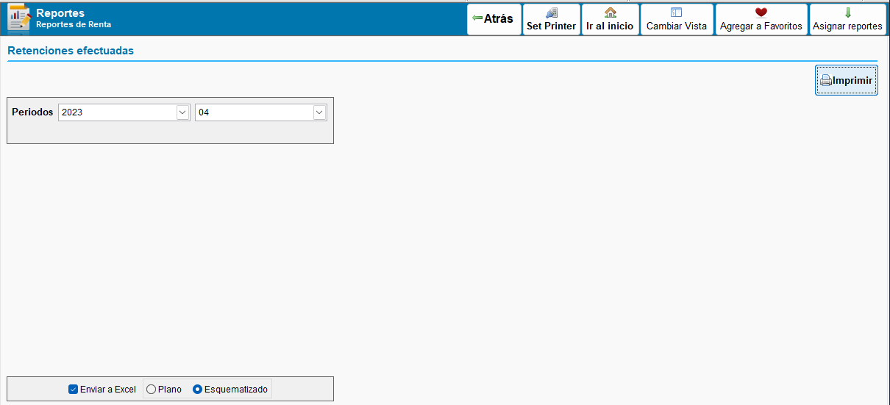{ align=left }**

    Es posible exportarlo a formato Excel, ya sea de forma consolidada o detallada (Plano).

Vista previa del reporte **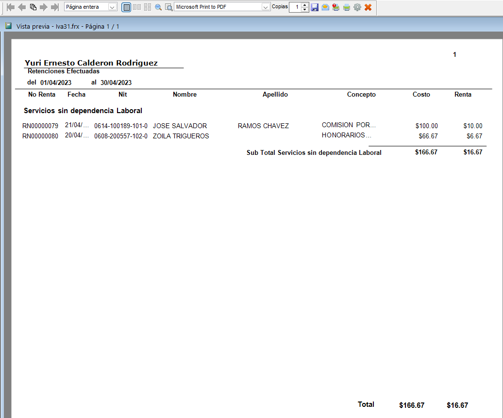{ align=left }**

??? abstract "3.1 Reporte de renta - Descargas de ejemplo"
    - **[Descargar versión PDF :fontawesome-regular-file-pdf:](../../assets/reportes/impuestos/IVA31.PDF){ .md-button }**
    - **[Descargar versión Excel (Consolidado) :material-microsoft-excel:](../../assets/reportes/impuestos/IVA31_CON.xlsx){ .md-button }**
    - **[Descargar versión Excel (Plano) :material-microsoft-excel:](../../assets/reportes/impuestos/IVA31_PLN.xlsx){ .md-button }**

---

### **3.2  Reporte de renta por NIT**

!!! info "Descripción del reporte"
    Este reporte muestra un formato de retenciones de renta por NIT para declaración de impuestos, puede ser filtrado por medio de los siguientes parámetros:

    - Periodo (Mes - Año)

    **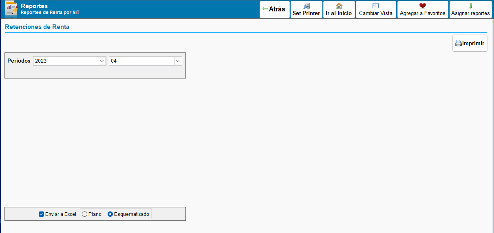{ align=left }**

    Es posible exportarlo a formato Excel, ya sea de forma consolidada o detallada (Plano).

Vista previa del reporte **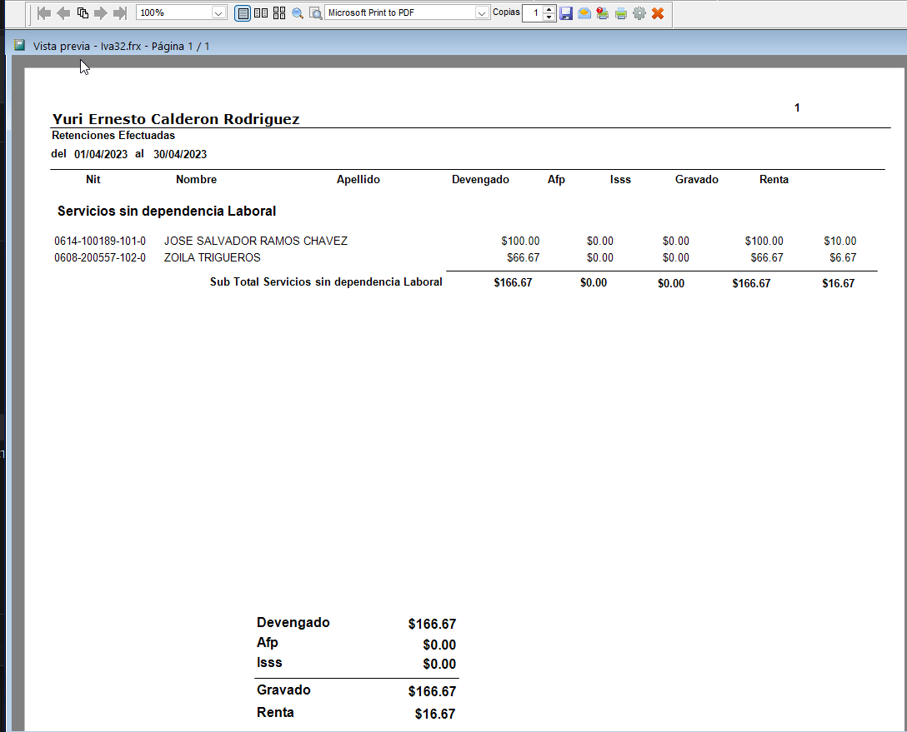{ align=left }**

??? abstract "3.2 Reporte de renta por NIT - Descargas de ejemplo"
    - **[Descargar versión PDF :fontawesome-regular-file-pdf:](../../assets/reportes/impuestos/IVA32.PDF){ .md-button }**
    - **[Descargar versión Excel (Consolidado) :material-microsoft-excel:](../../assets/reportes/impuestos/IVA32_CON.xlsx){ .md-button }**
    - **[Descargar versión Excel (Plano) :material-microsoft-excel:](../../assets/reportes/impuestos/IVA32_PLN.xlsx){ .md-button }**

---

### **3.3  Constancias de renta**

!!! info "Descripción del reporte"
    Este reporte muestra un formato de constancias de renta para declaración de impuestos, puede ser filtrado por medio de los siguientes parámetros:

    - Periodo (Mes - Año)

    **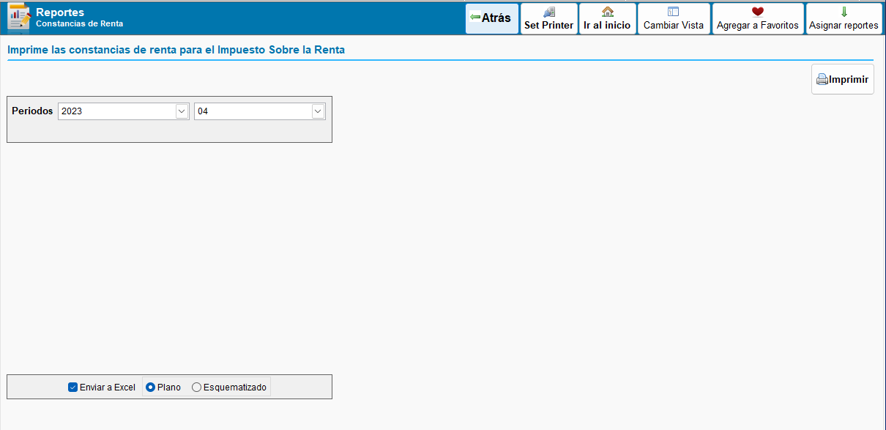{ align=left }**

    Es posible exportarlo a formato Excel, ya sea de forma consolidada o detallada (Plano).

Vista previa del reporte **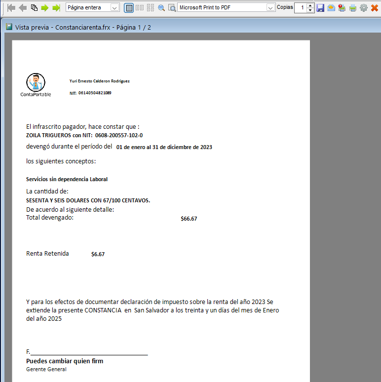{ align=left }**

??? abstract "3.3 Constancia de renta - Descargas de ejemplo"
    - **[Descargar versión PDF :fontawesome-regular-file-pdf:](../../assets/reportes/impuestos/IVA33.PDF){ .md-button }**
    - **[Descargar versión Excel (Consolidado) :material-microsoft-excel:](../../assets/reportes/impuestos/IVA33_CON.xlsx){ .md-button }**
    - **[Descargar versión Excel (Plano) :material-microsoft-excel:](../../assets/reportes/impuestos/IVA33_PLN.xlsx){ .md-button }**

---

## **4. Libros de IVA DTE's Tamaño Carta**
<!-- Se agrega el código mermaid para diagramar el listado de reportes dentro de la subcategoría de Libros de IVA DTE's Tamaño Carta -->
!!! tip "Diagrama de los reportes contenidos en la subcategoría **Libros de IVA DTE's Tamaño Carta**"
    ``` mermaid
    graph LR
      A[Libros de IVA DTE's Tamaño Carta]:::root

      subgraph "Listado de reportes:"
        B[4.1 Libro de ventas al consumidor DTE's Tamaño Carta]
        C[4.2 Libro de ventas al contribuyente DTE's Tamaño Carta]
        D[4.3 Libro de compras DTE's Tamaño Carta]
      end

      A --> B
      A --> C
      A --> D

    click B "#41-libro-de-ventas-al-consumidor-dtes-tamano-carta" "Ir a libro de ventas al consumidor DTE's tamaño carta"
    click C "#42-libro-de-ventas-al-contribuyente-dtes-tamano-carta" "Ir a Libro de ventas al contribuyente DTE's tamaño carta"
    click D "#43-libro-de-compras-dtes-tamano-carta" "Ir a libro de compras DTE's tamaño carta"
    ```
---

### **4.1  Libro de ventas al consumidor DTE's Tamaño Carta**

!!! info "Descripción del reporte"
    Este reporte muestra un formato en tamaño carta del libro de ventas al consumidor orientado a DTE's para declaración de impuestos, puede ser filtrado por medio de los siguientes parámetros:

    - Rango de fechas
    - Departamento (Centro de costo)

    **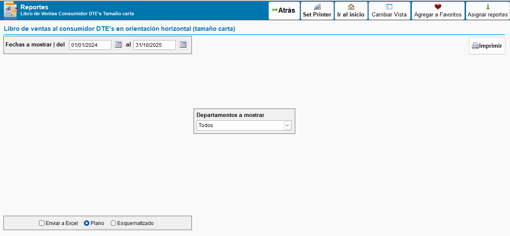{ align=left }**

    Es posible exportarlo a formato Excel, ya sea de forma consolidada o detallada (Plano).

Vista previa del reporte **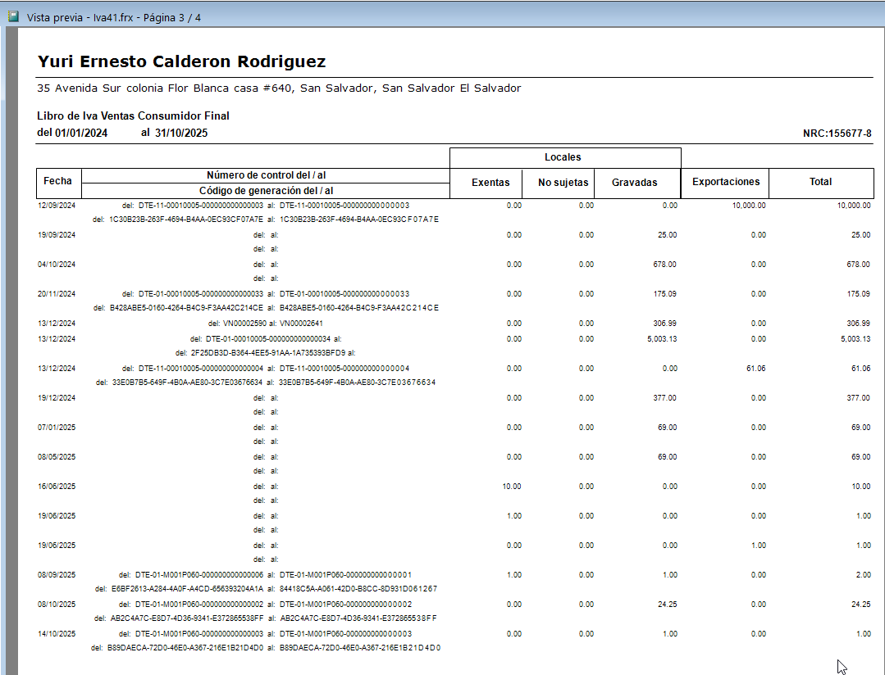{ align=left }**

??? abstract "4.1 Libro de ventas al consumidor DTE's Tamaño Carta - Descargas de ejemplo"
    - **[Descargar versión PDF :fontawesome-regular-file-pdf:](../../assets/reportes/impuestos/IVA41.PDF){ .md-button }**
    - **[Descargar versión Excel (Consolidado) :material-microsoft-excel:](../../assets/reportes/impuestos/IVA41_CON.xlsx){ .md-button }**
    - **[Descargar versión Excel (Plano) :material-microsoft-excel:](../../assets/reportes/impuestos/IVA41_PLN.xlsx){ .md-button }**

---

### **4.2  Libro de ventas al contribuyente DTE's Tamaño Carta**

!!! info "Descripción del reporte"
    Este reporte muestra un formato en tamaño carta del libro de ventas al contribuyente orientado a DTE's para declaración de impuestos, puede ser filtrado por medio de los siguientes parámetros:

    - Rango de fechas
    - Departamento (Centro de costo)

    **{ align=left }**

    Es posible exportarlo a formato Excel, ya sea de forma consolidada o detallada (Plano).

Vista previa del reporte **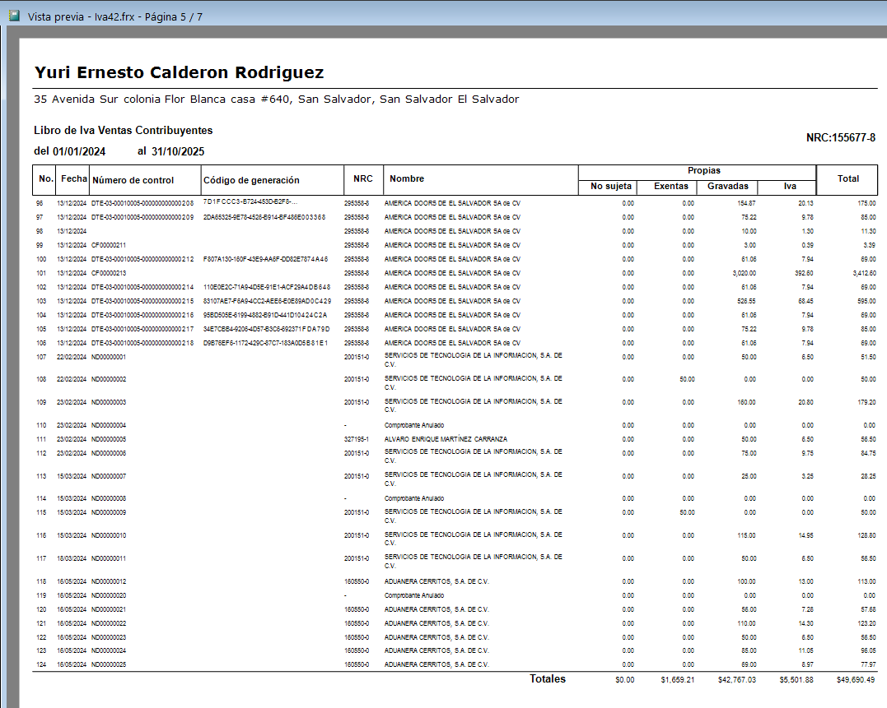{ align=left }**

??? abstract "4.2 Libro de ventas al contribuyente DTE's Tamaño Carta - Descargas de ejemplo"
    - **[Descargar versión PDF :fontawesome-regular-file-pdf:](../../assets/reportes/impuestos/IVA42.PDF){ .md-button }**
    - **[Descargar versión Excel (Consolidado) :material-microsoft-excel:](../../assets/reportes/impuestos/IVA42_CON.xlsx){ .md-button }**
    - **[Descargar versión Excel (Plano) :material-microsoft-excel:](../../assets/reportes/impuestos/IVA42_PLN.xlsx){ .md-button }**

---

### **4.3  Libro de compras DTE's Tamaño Carta**

!!! info "Descripción del reporte"
    Este reporte muestra un formato en tamaño carta del libro de compras orientado a DTE's para declaración de impuestos, puede ser filtrado por medio de los siguientes parámetros:

    - Periodo (Mes - Año)

    **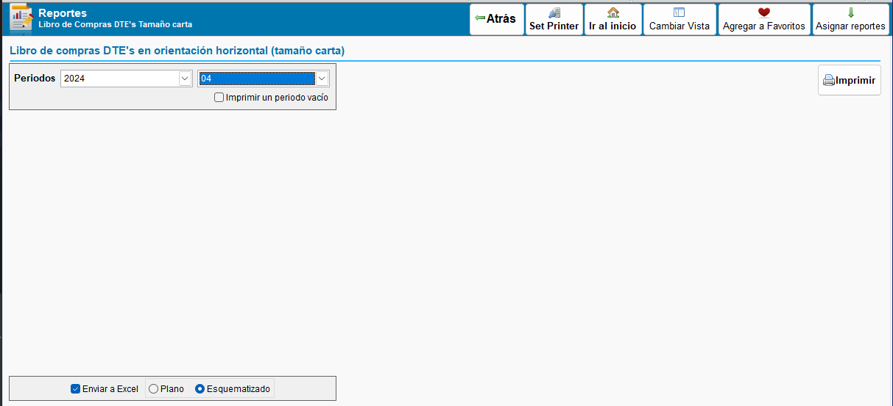{ align=left }**

    Es posible exportarlo a formato Excel, ya sea de forma consolidada o detallada (Plano).

Vista previa del reporte **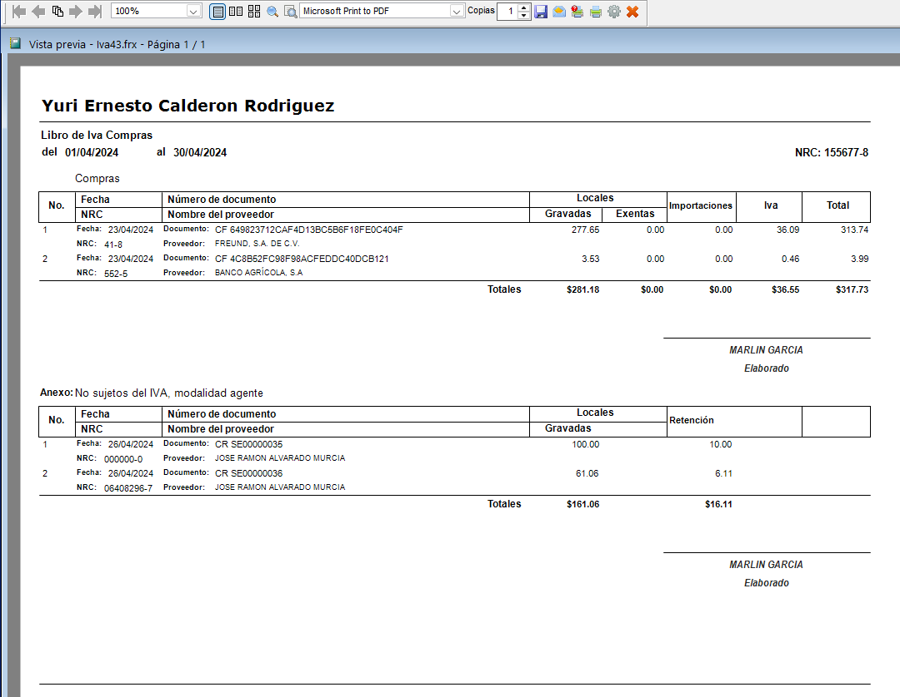{ align=left }**

??? abstract "4.3 Libro de compras DTE's Tamaño Carta - Descargas de ejemplo"
    - **[Descargar versión PDF :fontawesome-regular-file-pdf:](../../assets/reportes/impuestos/IVA43.PDF){ .md-button }**
    - **[Descargar versión Excel (Consolidado) :material-microsoft-excel:](../../assets/reportes/impuestos/IVA43_CON.xlsx){ .md-button }**
    - **[Descargar versión Excel (Plano) :material-microsoft-excel:](../../assets/reportes/impuestos/IVA43_PLN.xlsx){ .md-button }**

---

## **5. Libros de IVA DTE's Tamaño Oficio**
<!-- Se agrega el código mermaid para diagramar el listado de reportes dentro de la subcategoría de Libros de IVA DTE's Tamaño Oficio -->
!!! tip "Diagrama de los reportes contenidos en la subcategoría **Libros de IVA DTE's Tamaño Oficio**"
    ``` mermaid
    graph LR
      A[Libros de IVA DTE's Tamaño Oficio]:::root

      subgraph "Listado de reportes:"
        B[5.1 Libro de ventas al consumidor DTE's Tamaño Oficio]
        C[5.2 Libro de ventas al contribuyente DTE's Tamaño Oficio]
        D[5.3 Libro de compras DTE's Tamaño Oficio]
      end

      A --> B
      A --> C
      A --> D

    click B "#51-libro-de-ventas-al-consumidor-dtes-tamano-oficio" "Ir a libro de ventas al consumidor DTE's tamaño oficio"
    click C "#52-libro-de-ventas-al-contribuyente-dtes-tamano-oficio" "Ir a Libro de ventas al contribuyente DTE's tamaño oficio"
    click D "#53-libro-de-compras-dtes-tamano-oficio" "Ir a libro de compras DTE's tamaño oficio"
    ```
---

### **5.1  Libro de ventas al consumidor DTE's Tamaño oficio**

!!! info "Descripción del reporte"
    Este reporte muestra un formato en tamaño oficio del libro de ventas al consumidor orientado a DTE's para declaración de impuestos, puede ser filtrado por medio de los siguientes parámetros:

    - Rango de fechas
    - Departamento (Centro de costo)

    **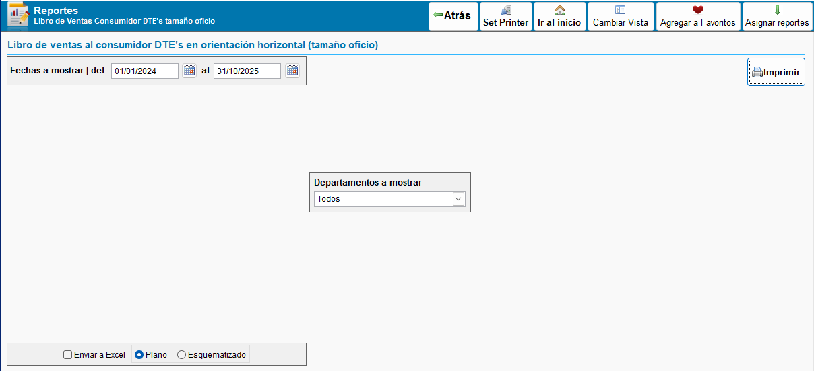{ align=left }**

    Es posible exportarlo a formato Excel, ya sea de forma consolidada o detallada (Plano).

Vista previa del reporte **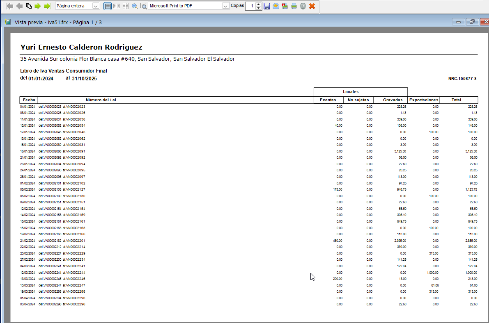{ align=left }**

??? abstract "5.1 Libro de ventas al consumidor DTE's Tamaño Oficio - Descargas de ejemplo"
    - **[Descargar versión PDF :fontawesome-regular-file-pdf:](../../assets/reportes/impuestos/IVA51.PDF){ .md-button }**
    - **[Descargar versión Excel (Consolidado) :material-microsoft-excel:](../../assets/reportes/impuestos/IVA51_CON.xlsx){ .md-button }**
    - **[Descargar versión Excel (Plano) :material-microsoft-excel:](../../assets/reportes/impuestos/IVA51_PLN.xlsx){ .md-button }**

---

### **5.2  Libro de ventas al contribuyente DTE's Tamaño Oficio**

!!! info "Descripción del reporte"
    Este reporte muestra un formato en tamaño oficio del libro de ventas al contribuyente orientado a DTE's para declaración de impuestos, puede ser filtrado por medio de los siguientes parámetros:

    - Rango de fechas
    - Departamento (Centro de costo)

    **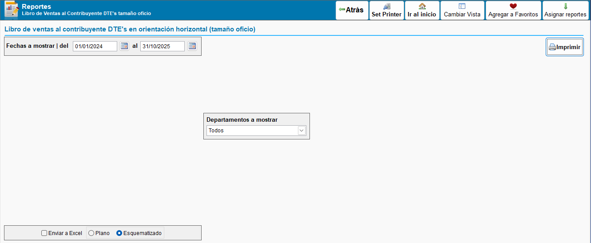{ align=left }**

    Es posible exportarlo a formato Excel, ya sea de forma consolidada o detallada (Plano).

Vista previa del reporte **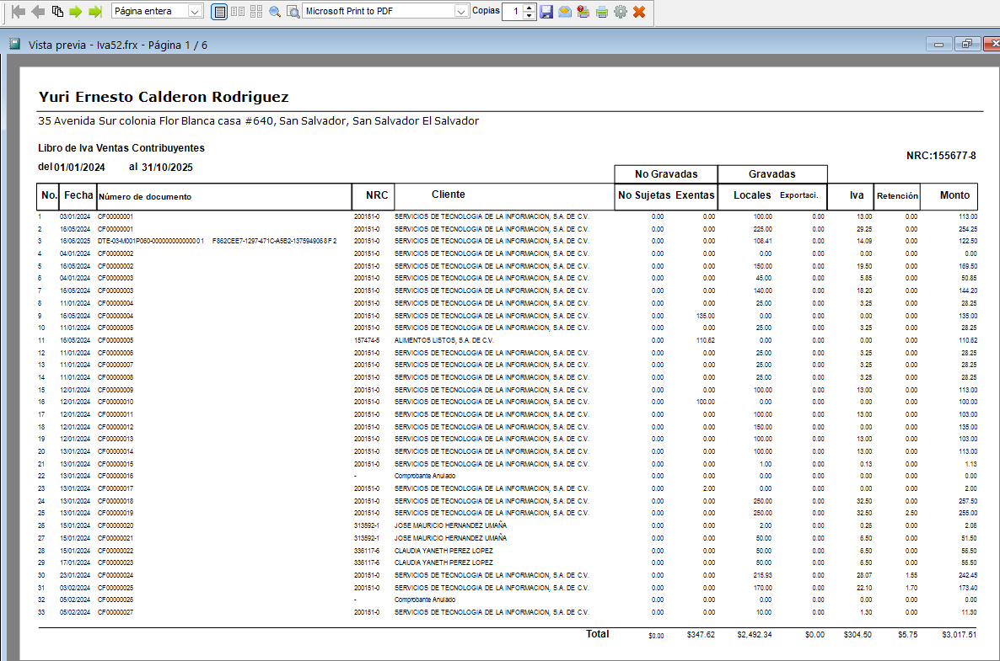{ align=left }**

??? abstract "5.2 Libro de ventas al contribuyente DTE's Tamaño Oficio - Descargas de ejemplo"
    - **[Descargar versión PDF :fontawesome-regular-file-pdf:](../../assets/reportes/impuestos/IVA52.PDF){ .md-button }**
    - **[Descargar versión Excel (Consolidado) :material-microsoft-excel:](../../assets/reportes/impuestos/IVA52_CON.xlsx){ .md-button }**
    - **[Descargar versión Excel (Plano) :material-microsoft-excel:](../../assets/reportes/impuestos/IVA52_PLN.xlsx){ .md-button }**

---

### **5.3  Libro de compras DTE's Tamaño Oficio**

!!! info "Descripción del reporte"
    Este reporte muestra un formato en tamaño oficio del libro de compras orientado a DTE's para declaración de impuestos, puede ser filtrado por medio de los siguientes parámetros:

    - Periodo (Mes - Año)

    **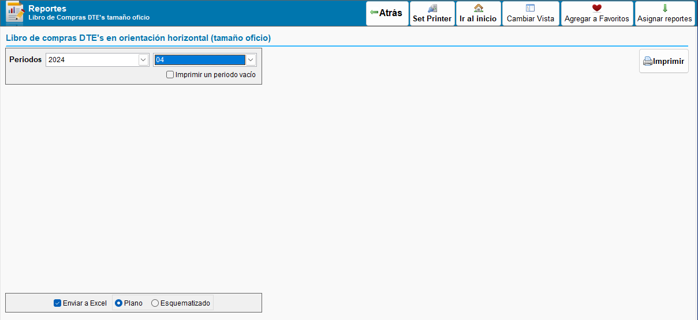{ align=left }**

    Es posible exportarlo a formato Excel, ya sea de forma consolidada o detallada (Plano).

Vista previa del reporte **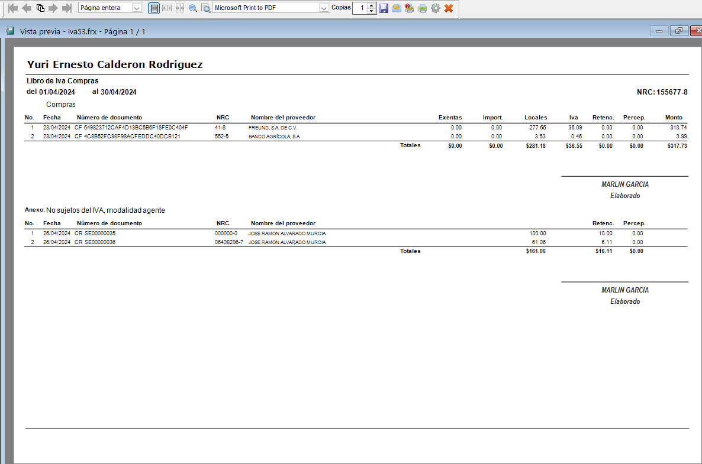{ align=left }**

??? abstract "5.3 Libro de compras DTE's Tamaño Oficio - Descargas de ejemplo"
    - **[Descargar versión PDF :fontawesome-regular-file-pdf:](../../assets/reportes/impuestos/IVA53.PDF){ .md-button }**
    - **[Descargar versión Excel (Consolidado) :material-microsoft-excel:](../../assets/reportes/impuestos/IVA53_CON.xlsx){ .md-button }**
    - **[Descargar versión Excel (Plano) :material-microsoft-excel:](../../assets/reportes/impuestos/IVA53_PLN.xlsx){ .md-button }**

---

## **6. Libros de IVA DTE's agrupados por establecimiento, punto de venta y departamento**

<!-- Se agrega el código mermaid para diagramar el listado de reportes dentro de la subcategoría de Libros de IVA DTE's agrupados por establecimiento, punto de venta y departamento -->
!!! tip "Diagrama de los reportes contenidos en la subcategoría **Libros de IVA DTE's agrupados por establecimiento, punto de venta y departamento**"
    ``` mermaid
    graph LR
      A[Libros de IVA DTE's agrupados por establecimiento, punto de venta y departamento]:::root

      subgraph "Listado de reportes:"
        B[6.1 Libro de ventas al consumidor DTE's por establecimiento y punto de venta]
        C[6.2 Libro de ventas al contribuyente DTE's por establecimiento y punto de venta]
        D[6.3 Libro de compras DTE's por departamento]
      end

      A --> B
      A --> C
      A --> D

    click B "#61-libro-de-ventas-al-consumidor-dtes-por-establecimiento-y-punto-de-venta" "Ir a libro de ventas al consumidor DTE's por establecimiento y punto de venta"
    click C "#62-libro-de-ventas-al-contribuyente-dtes-por-establecimiento-y-punto-de-venta" "Ir a Libro de ventas al contribuyente DTE's por establecimiento y punto de venta"
    click D "#63-libro-de-compras-dtes-por-departamento" "Ir a libro de compras DTE's por departamento"
    ```
---

### **6.1  Libro de ventas al consumidor DTE's por establecimiento y punto de venta**

!!! info "Descripción del reporte"
    Este reporte muestra un formato del libro de ventas al consumidor orientado a DTE's agrupado por departamento y puntoo de venta para declaración de impuestos, puede ser filtrado por medio de los siguientes parámetros:

    - Rango de fechas
    - Departamento (Centro de costo)

    **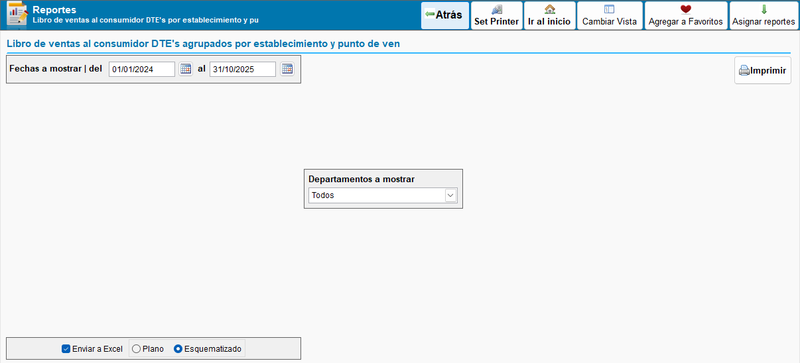{ align=left }**

    Es posible exportarlo a formato Excel, ya sea de forma consolidada o detallada (Plano).

Vista previa del reporte **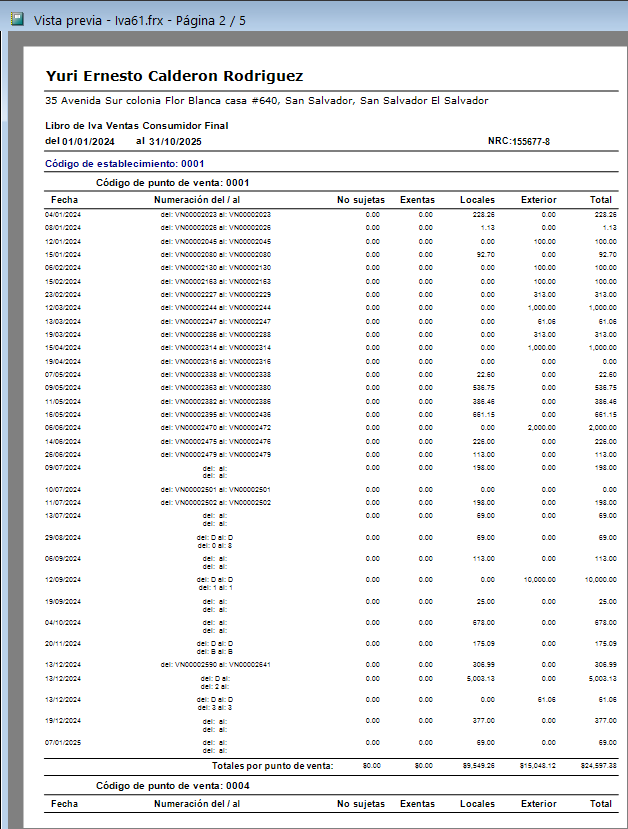{ align=center }**

??? abstract "6.1 Libro de ventas al consumidor DTE's por establecimiento y punto de venta - Descargas de ejemplo"
    - **[Descargar versión PDF :fontawesome-regular-file-pdf:](../../assets/reportes/impuestos/IVA61.PDF){ .md-button }**
    - **[Descargar versión Excel (Consolidado) :material-microsoft-excel:](../../assets/reportes/impuestos/IVA61_CON.xlsx){ .md-button }**
    - **[Descargar versión Excel (Plano) :material-microsoft-excel:](../../assets/reportes/impuestos/IVA61_PLN.xlsx){ .md-button }**

---

### **6.2  Libro de ventas al contribuyente DTE's por establecimiento y punto de venta**

!!! info "Descripción del reporte"
    Este reporte muestra un formato del libro de ventas al contribuyente orientado a DTE's agrupado por establecimiento y punto de venta para declaración de impuestos, puede ser filtrado por medio de los siguientes parámetros:

    - Rango de fechas
    - Departamento (Centro de costo)

    **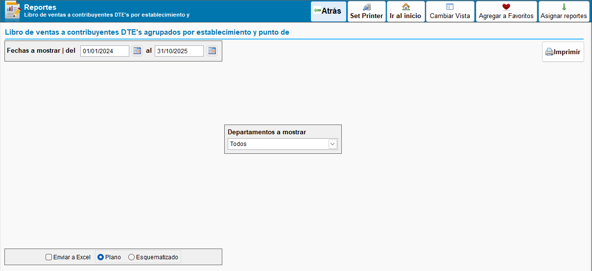{ align=left }**

    Es posible exportarlo a formato Excel, ya sea de forma consolidada o detallada (Plano).

Vista previa del reporte **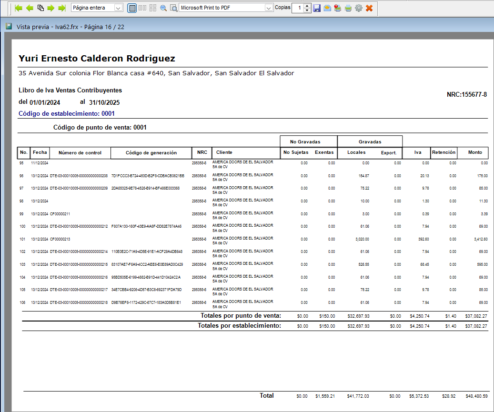{ align=left }**

??? abstract "6.2 Libro de ventas al contribuyente DTE's por establecimiento y punto de venta - Descargas de ejemplo"
    - **[Descargar versión PDF :fontawesome-regular-file-pdf:](../../assets/reportes/impuestos/IVA62.PDF){ .md-button }**
    - **[Descargar versión Excel (Consolidado) :material-microsoft-excel:](../../assets/reportes/impuestos/IVA62_CON.xlsx){ .md-button }**
    - **[Descargar versión Excel (Plano) :material-microsoft-excel:](../../assets/reportes/impuestos/IVA62_PLN.xlsx){ .md-button }**

---

### **6.3  Libro de compras DTE's por departamento**

!!! info "Descripción del reporte"
    Este reporte muestra un formato del libro de compras orientado a DTE's agrupado por departamento para declaración de impuestos, puede ser filtrado por medio de los siguientes parámetros:

    - Periodo (Mes - Año)

    **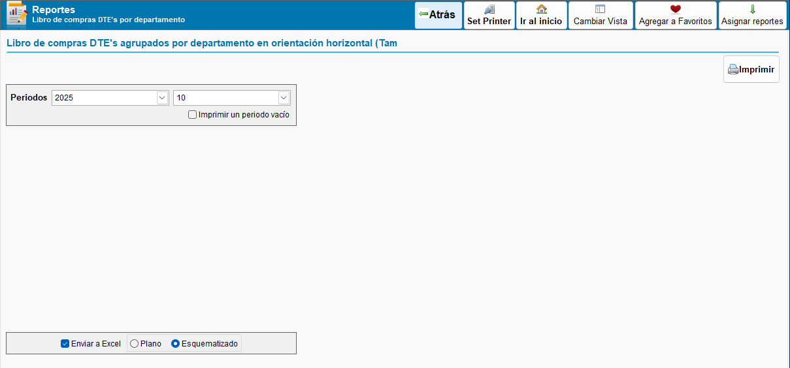{ align=left }**

    Es posible exportarlo a formato Excel, ya sea de forma consolidada o detallada (Plano).

Vista previa del reporte **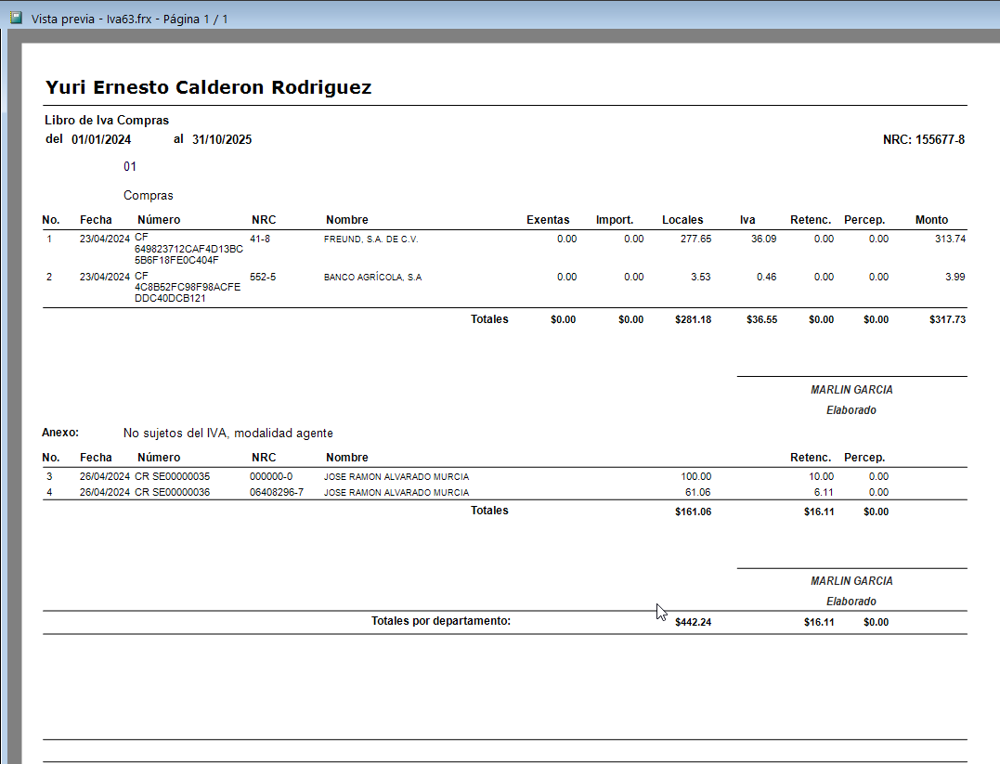{ align=left }**

??? abstract "6.3 Libro de compras DTE's por departamento - Descargas de ejemplo"
    - **[Descargar versión PDF :fontawesome-regular-file-pdf:](../../assets/reportes/impuestos/IVA63.PDF){ .md-button }**
    - **[Descargar versión Excel (Consolidado) :material-microsoft-excel:](../../assets/reportes/impuestos/IVA63_CON.xlsx){ .md-button }**
    - **[Descargar versión Excel (Plano) :material-microsoft-excel:](../../assets/reportes/impuestos/IVA63_PLN.xlsx){ .md-button }**

---

## **7. Libros de IVA DTE's con contribuciones especiales**

<!-- Se agrega el código mermaid para diagramar el listado de reportes dentro de la subcategoría de Libros de IVA DTE's con contribuciones especiales -->
!!! tip "Diagrama de los reportes contenidos en la subcategoría **Libros de IVA DTE's con contribuciones especiales**"
    ``` mermaid
    graph LR
      A[Libros de IVA DTE's con contribuciones especiales]:::root

      subgraph "Listado de reportes:"
        B[7.1 Libro de ventas al consumidor Incluye Fovial y Cotrans]
        C[7.2 Libro de ventas al contribuyente Incluye Fovial y Cotrans]
      end

      A --> B
      A --> C

    click B "#71-libro-de-ventas-al-consumidor-incluye-fovial-y-cotrans" "Ir a libro de ventas al consumidor incluye fovial y cotrans"
    click C "#72-libro-de-ventas-al-contribuyente-incluye-fovial-y-cotrans" "Ir a Libro de ventas al contribuyente incluye fovial y cotrans"
    ```
---

### **7.1 Libro de ventas al consumidor Incluye Fovial y Cotrans**

!!! info "Descripción del reporte"
    Este reporte muestra un formato del libro de ventas al consumidor orientado a DTE's detallando las contribuciones de fovial y cotrans para declaración de impuestos, puede ser filtrado por medio de los siguientes parámetros:

    - Rango de fechas
    - Departamento (Centro de costo)

    **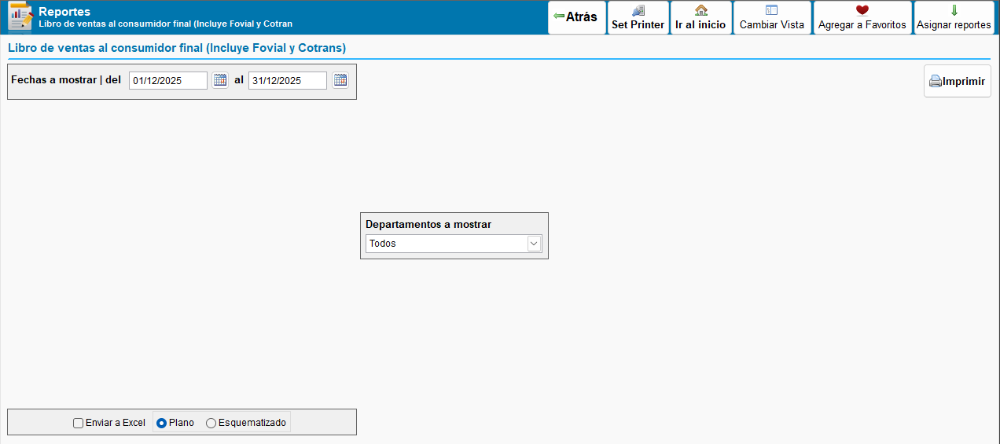{ align=left }**

    Es posible exportarlo a formato Excel, ya sea de forma consolidada o detallada (Plano).

Vista previa del reporte **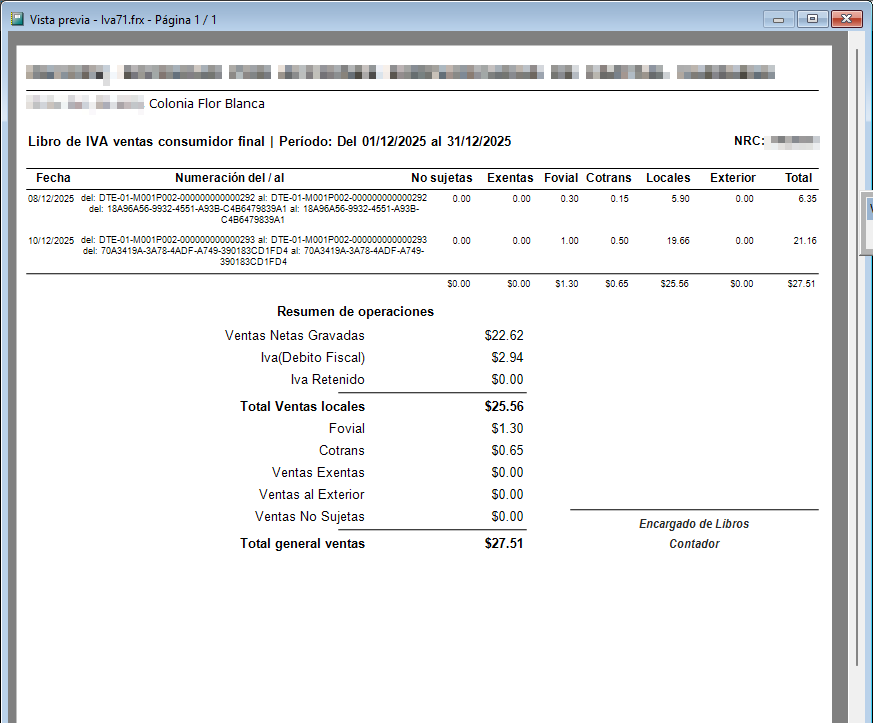{ align=center }**

??? abstract "7.1 Libro de ventas al consumidor DTE's (Incluye Fovial y Cotrans) - Descargas de ejemplo"
    - **[Descargar versión PDF :fontawesome-regular-file-pdf:](../../assets/reportes/impuestos/IVA71.PDF){ .md-button }**
    - **[Descargar versión Excel (Consolidado) :material-microsoft-excel:](../../assets/reportes/impuestos/IVA71_CON.xlsx){ .md-button }**
    - **[Descargar versión Excel (Plano) :material-microsoft-excel:](../../assets/reportes/impuestos/IVA71_PLN.xlsx){ .md-button }**

---

### **7.2 Libro de ventas al contribuyente Incluye Fovial y Cotrans**

!!! info "Descripción del reporte"
    Este reporte muestra un formato del libro de ventas al contribuyente orientado a DTE's detallando las contribuciones de fovial y cotrans para declaración de impuestos, puede ser filtrado por medio de los siguientes parámetros:

    - Rango de fechas
    - Departamento (Centro de costo)

    **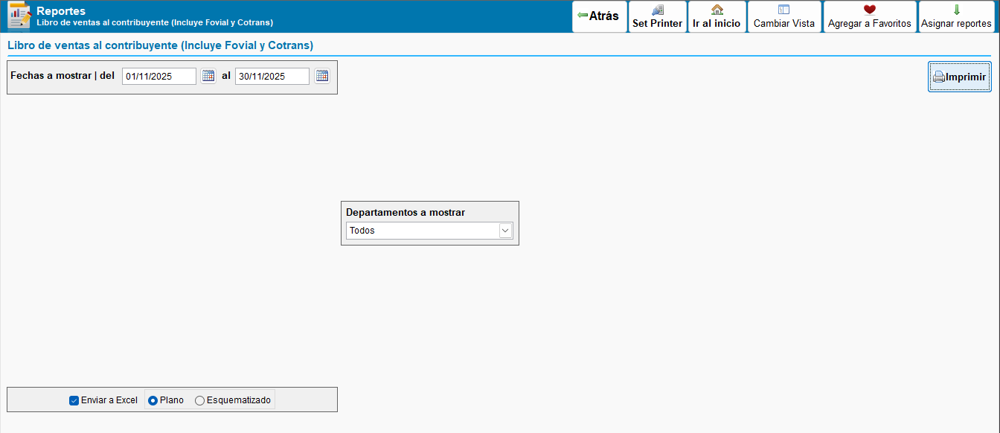{ align=left }**

    Es posible exportarlo a formato Excel, ya sea de forma consolidada o detallada (Plano).

Vista previa del reporte **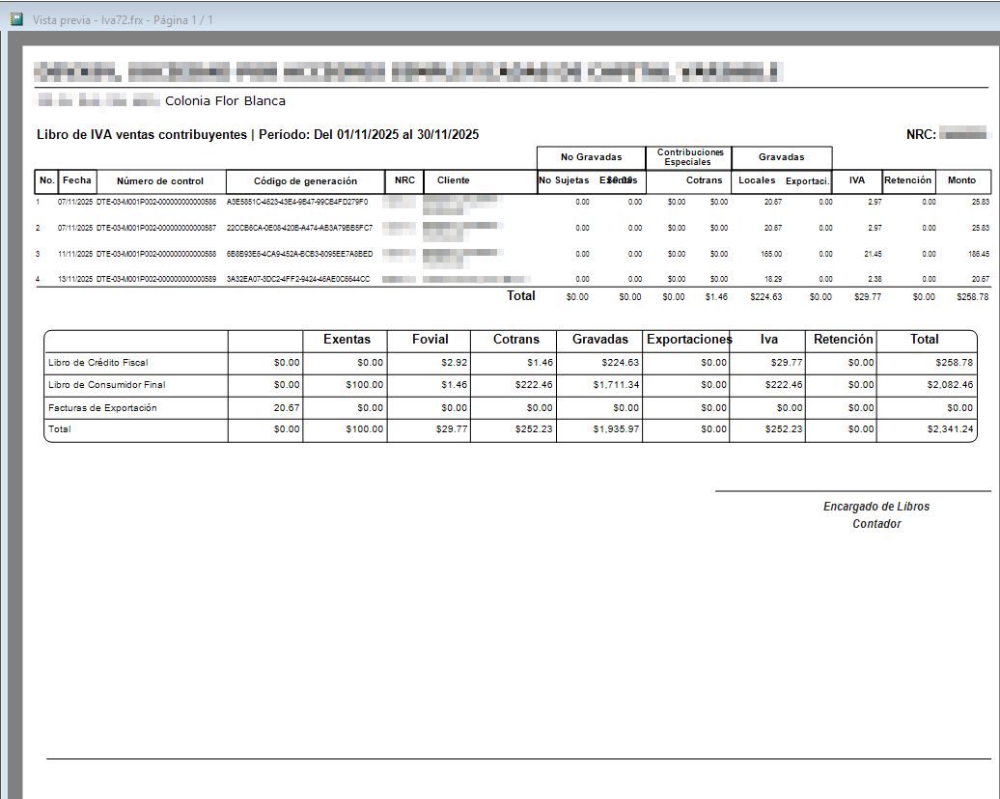{ align=left }**

??? abstract "7.2 Libro de ventas al contribuyente DTE's (Incluye Fovial y Cotrans) - Descargas de ejemplo"
    - **[Descargar versión PDF :fontawesome-regular-file-pdf:](../../assets/reportes/impuestos/IVA72.PDF){ .md-button }**
    - **[Descargar versión Excel (Consolidado) :material-microsoft-excel:](../../assets/reportes/impuestos/IVA72_CON.xlsx){ .md-button }**
    - **[Descargar versión Excel (Plano) :material-microsoft-excel:](../../assets/reportes/impuestos/IVA72_PLN.xlsx){ .md-button }**

---
