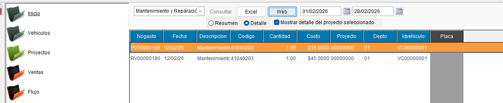
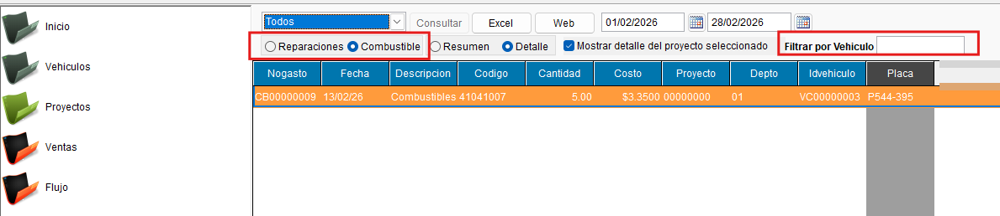
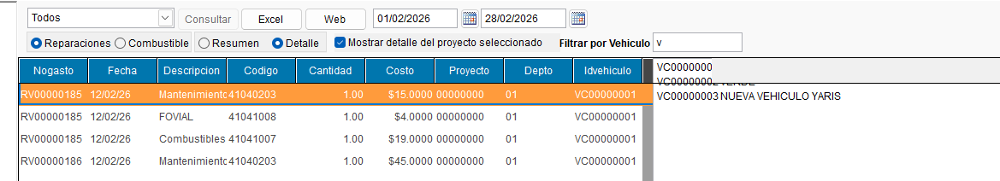
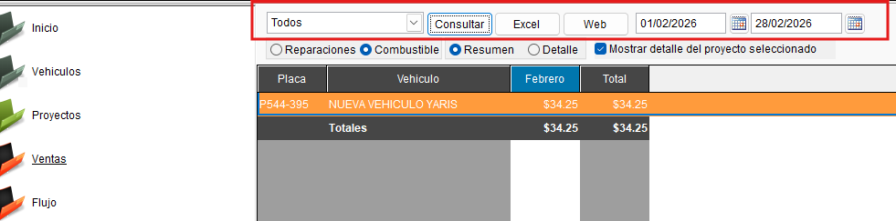
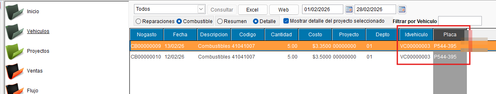
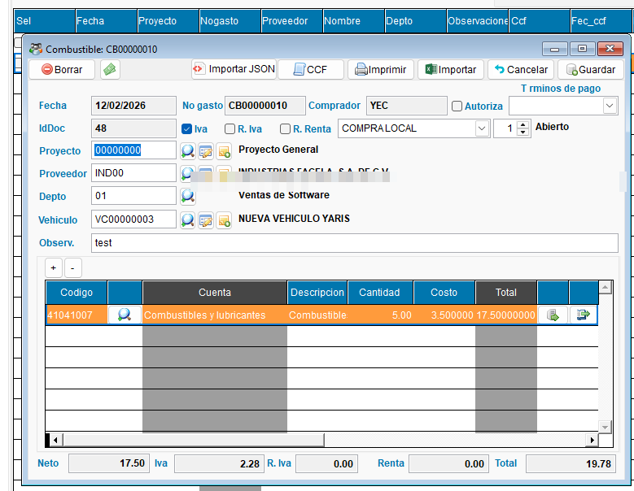
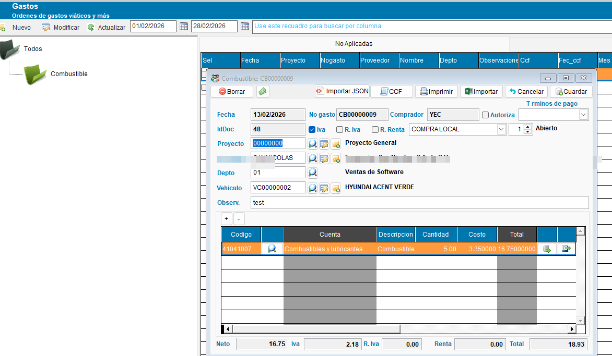
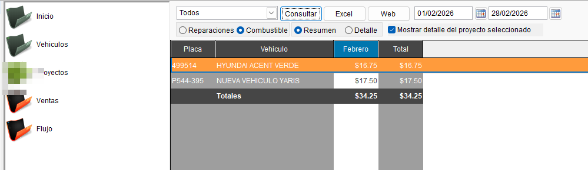

<!---
description: Documentación de las mejoras al módulo de Vehículos — selección de vehículo en Órdenes de Gasto (CB y RV) y filtros por tipo de gasto y vehículo en el reporte gerencial de mantenimiento. Issue #552.
--->

# Reporte de Mantenimiento de Vehículos

## 📌 Introducción

!!! abstract "Mejoras al Módulo de Vehículos"
    Las mejoras en el registo de OG por mantenimiento de Vehículos se extienden al reporte gerencial de mantenimiento de vehiculos, con filtros dinámicos para consultar gastos de combustible (CB), reparaciones (RV) y filtrar por vehículo específico.

---

## 🎯 Objetivo

!!! info "Propósito"
    - Mejorar el reporte gerencial de mantenimiento para incluir gastos de combustible (antes solo mostraba reparaciones) y agregar un filtro por vehículo.

---

## 🔍 Alcance

!!! note "Módulos y funciones afectadas"
    - **Módulo:** Compras → Órdenes de Gasto (OG) — tipos CB (combustible) y RV (reparación de vehículo)
    - **Reportes:** Reportes Gerenciales → Vista detalle de mantenimiento de vehículos
    - **Funciones cubiertas:**
        - Selección de vehículo en OG tipo CB y RV (campo VALID + VISTA)
        - Filtro por tipo de OG (CB o RV) en reporte gerencial
        - Filtro por vehículo en reporte gerencial
        - Actualización dinámica de cuentas en dropdown según tipo seleccionado (CB o RV)

---

## ✨ Solución Implementada

!!! abstract "Descripción de la solución"
    Se implementan dos mejoras independientes que trabajan en conjunto: la integración del vehículo en las OG y la extensión del reporte gerencial con filtros dinámicos.

### 📊 Filtros en reporte gerencial de mantenimiento

!!! note "Extensión del reporte con filtros dinámicos"
    Se extiende la vista detalle del reporte gerencial de mantenimiento de vehículos para incluir:

    - **Filtro por tipo de OG:** CB (combustible) o RV (reparación). Antes el reporte solo mostraba RV.
    - **Filtro por vehículo:** permite consultar el historial de gastos de una unidad específica.
    - **Dropdown de cuentas dinámico:** las cuentas disponibles en el dropdown se actualizan según el tipo seleccionado (CB o RV), basadas en las cuentas asociadas a los documentos de ese tipo.

    { align=center }

    { align=center }

    { align=center }

    { align=center }

    { align=center }

    { align=center }

    { align=center }

    { align=center }

---

## ⚙️ Configuración Requerida

!!! note "Requisitos previos"
    | Requisito | Descripción |
    | --------- | ----------- |
    | **Vehículos registrados** | Los vehículos deben estar dados de alta en el módulo de Vehículos para que aparezcan en el selector de las OG y en el filtro del reporte. |
    | **OG tipificadas como CB o RV** | Las Órdenes de Gasto de combustible deben usar el tipo CB y las de reparación el tipo RV para que los filtros del reporte las clasifiquen correctamente. |
    | **Cuentas contables vinculadas** | Las cuentas de gasto deben estar asociadas a los documentos de tipo CB y RV (iddoc correspondiente) para que el dropdown las muestre correctamente por tipo. |

---

## 🔄 Flujo Funcional

!!! example "Flujo de uso de las mejoras"

    === "1️⃣ Registrar gasto de combustible vinculado al vehículo"
        1. Crear o abrir una Orden de Gasto de tipo **CB** (combustible).
        2. En el campo de vehículo (VALID/VISTA), seleccionar la unidad correspondiente.
        3. Completar los datos del gasto (monto, proveedor, cuenta, etc.).
        4. Guardar la OG — el vehículo queda vinculado al registro de gasto.

    === "2️⃣ Consultar reporte gerencial con filtros"
        1. Acceder al reporte gerencial de mantenimiento de vehículos.
        2. Seleccionar el tipo de gasto a consultar: **CB** (combustible) o **RV** (reparación).
        3. El dropdown de cuentas se actualiza automáticamente mostrando las cuentas del tipo seleccionado.
        4. Opcionalmente, seleccionar un vehículo específico en el filtro por vehículo.
        5. Ejecutar el reporte para visualizar el historial de gastos filtrado.

---

## ☑️ Validaciones y Pruebas Realizadas 🧪

!!! info "Compilado validado"
    Las pruebas se realizaron sobre el compilado **EXE_2026_02_16**.

!!! example "Tipos de validaciones y pruebas Realizadas"
    ??? example "Filtro de cuentas dinámico por tipo de OG"
        Se validó que el dropdown de cuentas en el reporte muestra únicamente las cuentas relacionadas a los documentos del tipo seleccionado, basándose en las cuentas vinculadas a los documentos con iddoc correspondiente.

        - :material-check-circle: Dropdown de cuentas para CB muestra cuentas de combustible: **confirmado**
        - :material-check-circle: Dropdown de cuentas para RV muestra cuentas de reparación: **confirmado**

        { align=center }

    ??? example "OG de CB integradas y filtros por tipo y vehículo"
        Se validó la integración completa: las OG de combustible aparecen en el reporte, los filtros por tipo (CB/RV) y por vehículo funcionan correctamente, y el resultado final queda solventado.

        - :material-check-circle: OG tipo CB visibles en reporte (antes solo RV): **confirmado**
        - :material-check-circle: Filtro por tipo CB activo y funcional: **confirmado**
        - :material-check-circle: Filtro por tipo RV activo y funcional: **confirmado**
        - :material-check-circle: Filtro por vehículo específico: **confirmado**
        - :material-check-circle: Resultado validado en área de gastos: **solventado**

        { align=center }

        { align=center }

        { align=center }

        { align=center }

        { align=center }

        { align=center }

        { align=center }

---
