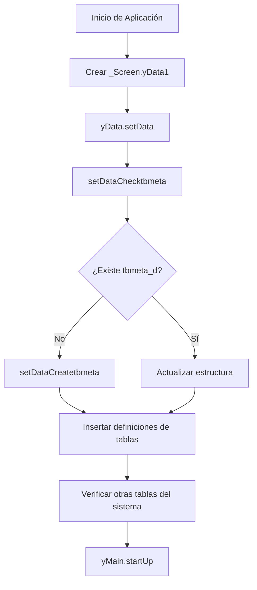

# Clase yData

## Descripción General

La clase `yData` es un componente fundamental del sistema que gestiona la estructura de datos y las tablas utilizadas en la aplicación. Se crea como un objeto de pantalla (`_Screen.yData1`) durante la inicialización del sistema en [definemain.prg](../../../../../../../NIXON/FOX/SEPT2025DTEMANAGEMENTHUB/APP/LIB1.0/definemain.prg).

## Propósito

Esta clase es responsable de:
- Crear y mantener la estructura de tablas del sistema
- Verificar la existencia de archivos de base de datos
- Gestionar la tabla de metadatos `tbmeta_d.dbf`
- Actualizar estructuras de tablas según cambios en el sistema

## Ubicación

La clase `yData` se define en el archivo principal de inicio de la aplicación y se instancia automáticamente al iniciar el sistema:

```foxpro
IF VARTYPE(_Screen.yData1) == "U"
    _Screen.NewObject("yData1", "yData", .null.)
ENDIF
```

## Métodos Principales

### setData()

**Propósito:** Método principal que ejecuta los procedimientos para crear la estructura de datos y las tablas del sistema.

**Descripción:**
- Orquesta la creación y actualización de todas las estructuras de datos
- Verifica y crea tablas necesarias para el funcionamiento del sistema
- Llama a `_Screen.yMain1.startUp()` al finalizar para reiniciar la aplicación con las nuevas estructuras

**Uso:**
```foxpro
_Screen.yData1.setData()
```

---

### setDataCheck(tcyDataCheckfile)

**Propósito:** Verifica si un archivo (base de datos o tabla) existe en el sistema.

**Parámetros:**
- `tcyDataCheckfile` (String): Ruta completa del archivo a verificar

**Retorna:**
- `.T.` (Verdadero) si el archivo existe
- `.F.` (Falso) si el archivo no existe

**Uso:**
```foxpro
IF _Screen.yData1.setDataCheck("C:\Ruta\Tabla.dbf")
    * El archivo existe
ENDIF
```

---

### setDataChecktbmeta()

**Propósito:** Verifica la existencia de la tabla `tbmeta_d.dbf` y la actualiza si es necesario.

**Descripción:**
- Si la tabla `tbmeta_d.dbf` existe, la actualiza incorporando nuevos campos o tablas
- Si no existe, llama a `setDataCreatetbmeta()` para crearla
- Garantiza que la estructura de metadatos esté siempre actualizada

**Características:**
- Mantiene la integridad de los metadatos del sistema
- Permite evolución de la estructura sin pérdida de datos
- Se ejecuta automáticamente durante el inicio del sistema

---

### setDataCreatetbmeta()

**Propósito:** Crea la tabla `tbmeta_d` e inserta los registros con la estructura de las tablas del sistema.

**Descripción:**
Esta tabla es fundamental para el sistema ya que define la estructura de campos de todas las tablas utilizadas. Contiene metadatos sobre:

#### Estructura de tbmeta_d

| Campo | Tipo | Descripción |
|-------|------|-------------|
| Nombre | C(100) | Nombre de la tabla |
| Campo | C(50) | Nombre del campo |
| Precision | C(10) | Tipo y tamaño del campo (ej: "C(10)", "I", "D") |
| DB | C(100) | Base de datos contenedora |
| Indice | L | Indica si el campo forma parte de un índice |
| Tipo | C(25) | Tipo de tabla (REGULAR, etc.) |

#### Tablas Definidas

##### 1. TREEMENU
Estructura del menú en árbol del sistema.

**Campos:**
- `LINE` (I): Número de línea
- `KEY` (C(4)): Clave única del elemento
- `PARENT` (C(4)): Clave del elemento padre
- `TEXT` (C(60)): Texto a mostrar
- `FORM` (C(60)): Formulario asociado
- `ESTADO` (C(2)): Estado del elemento

##### 2. CLIENTES_H
Historial de cambios en clientes.

**Campos:**
- `LINE` (I): Número de línea
- `IDCLIENTE` (C(10)): Identificador del cliente
- `AUPD_FEC` (D): Fecha de actualización
- `AUPD_USR` (C(10)): Usuario que realizó la actualización
- `DESCRIP` (C(254)): Descripción del cambio
- `DESCRIP2` (C(254)): Descripción adicional 2
- `DESCRIP3` (C(254)): Descripción adicional 3

##### 3. JSLINKPAGO
Registro de links de pago generados para ventas.

**Campos principales:**
- `LINE` (I(4)): Número de línea
- `IDVENTA` (C(10)): Identificador de la venta
- `IDDOC` (C(4)): Identificador del documento
- `IDURLPAGO` (C(240)): ID único del link de pago
- `URLPAGO` (C(240)): URL corta del link de pago
- `URLPGLARGE` (C(240)): URL completa del link de pago
- `URLQRIMAGE` (C(240)): URL de la imagen QR
- `URLENPROD` (L(1)): Indica si está en producción
- `PLATAFORMA` (C(100)): Plataforma de pago (ej: Wompi)
- `ESTADO` (C(100)): Estado del link de pago
- `DESCRIP1` a `DESCRIP73` (C(254)): Campos adicionales para almacenar respuestas JSON y metadata de la plataforma de pago

**Propósito:** Almacena la información de links de pago generados para documentos de venta, permitiendo rastrear transacciones y respuestas de pasarelas de pago.

---

### setDataTableCreateAlterTable2()

**Propósito:** Método auxiliar para crear o alterar tablas con una estructura definida.

**Parámetros:**
- Nombre de la tabla
- Array con definición de campos
- Campo de línea/clave primaria
- Campos para índices
- Categoría de la tabla
- Descripción de la tabla

**Características:**
- Crea tablas si no existen
- Modifica estructuras existentes agregando campos faltantes
- Preserva datos existentes durante actualizaciones
- Genera índices automáticamente según especificación

---

## Integración con el Sistema

### Inicialización

La clase `yData` se inicializa automáticamente en [definemain.prg](../../../../../../../NIXON/FOX/SEPT2025DTEMANAGEMENTHUB/APP/LIB1.0/definemain.prg#L14-L16):

```foxpro
IF VARTYPE(_Screen.yData1) == "U"
    _Screen.NewObject("yData1", "yData", .null.)
ENDIF
```

### Relación con yMain

La clase `yData` trabaja en conjunto con la clase `yMain` para:
- Verificar estructuras de datos antes del inicio de la aplicación
- Actualizar tablas según cambios en el sistema
- Garantizar integridad de datos durante actualizaciones

## Flujo de Ejecución



## Notas Importantes

1. **Tabla tbmeta_d**: Es el corazón del sistema de gestión de estructura de datos. Toda tabla del sistema debe tener su definición en esta tabla.

2. **Campos DESCRIP**: Muchas tablas utilizan múltiples campos `DESCRIP` (hasta 73 en JSLINKPAGO) para almacenar información JSON y metadatos extensos de respuestas de APIs.

3. **Índices**: Los campos marcados con `Indice = .T.` son utilizados para crear índices que optimizan las consultas.

4. **Actualización Automática**: El sistema actualiza automáticamente las estructuras de tablas al detectar cambios en tbmeta_d, sin necesidad de scripts manuales.

## Historial de Modificaciones

- **08/01/2026**: Agregada estructura para tabla TREEMENU
- **09/01/2026**: Agregadas estructuras para tablas CLIENTES_H y JSLINKPAGO

## Ver También

- [Clase yMain](../yMain.md) - Gestión de inicio y configuración de la aplicación
- [Contabilización Automática](contabilizacion_automatica.md)
- [Gestión de Links de Pago - Wompi](../../facturacion/linksPago/wompi/linkPagoWompi.md)