<!---
description: Función de agrupación en el Anexo Consumidor Final — el CSV puede generarse en modo detallado (por documento) o agrupado por día y tipo de documento. Aplica también a la contabilización agrupada. Issue #637.
--->

# Informes y Anexos — Generación de CSV para Anexo Consumidor Final agrupado por día

El anexo de ventas consumidor final incorpora la opción de generar el CSV en dos modalidades: **detallado** (un registro por documento) o **agrupado por día y tipo de documento**

---

## 📌 Introducción

!!! abstract "Agrupación de DTE en Anexo Consumidor Final"
    Al generar el CSV del anexo de ventas consumidor final, el sistema presenta un menú con dos opciones: el formato detallado tradicional (un registro por documento) y el nuevo formato agrupado por día, que consolida las ventas del mismo tipo de documento por fecha.

---

## 🎯 Objetivo

!!! info "Propósito"
    - Permitir al usuario elegir entre CSV detallado y CSV agrupado por día al exportar el anexo de ventas consumidor final.
    - Agrupar las ventas por fecha y tipo de documento tanto en la importación de JSON como al cargar documentos generados.

---

## ✨ Solución Implementada

!!! abstract "Descripción de la solución"
    Se agrega un menú de selección al botón **Generar CSV** del anexo consumidor final, permitiendo elegir entre el formato detallado y el agrupado por día. La misma lógica aplica a la contabilización del anexo.

    ### 📋 Menú de opciones al generar CSV

    !!! note "Dos modalidades de exportación"
        Al dar clic en el botón **Generar CSV**, el sistema muestra un menú con dos opciones exclusivas para el anexo de ventas consumidor final:

        - **Anexo detallado** — un registro por cada documento (comportamiento original).
        - **Anexo agrupado por día** — consolida los documentos del mismo tipo y fecha en un solo registro.

        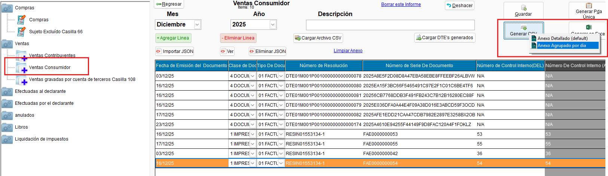{ align=center }

        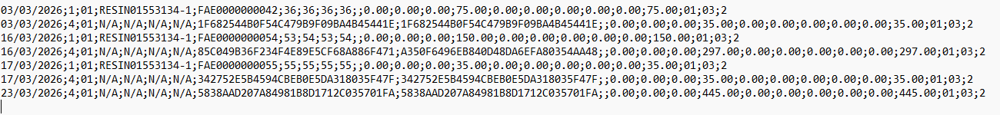{ align=center }

### 🔍 Diferencia entre los formatos

!!! note "Anexo Detallado vs Anexo Agrupado por Día"
    El formato **detallado** muestra cada documento individualmente con su propio número de correlativo, fecha y monto:

    - Una fila por documento (por cada factura impresa o DTE).
    - Incluye número de resolución, serie, correlativo del documento.

    El formato **agrupado por día** consolida los documentos del mismo tipo de documento (impreso o DTE) y misma fecha:

    - Una fila por día y tipo de documento (clase de documento).
    - Los rangos de correlativos se consolidan (del primero al último del día).
    - Los montos se suman por tipo de documento y fecha.

    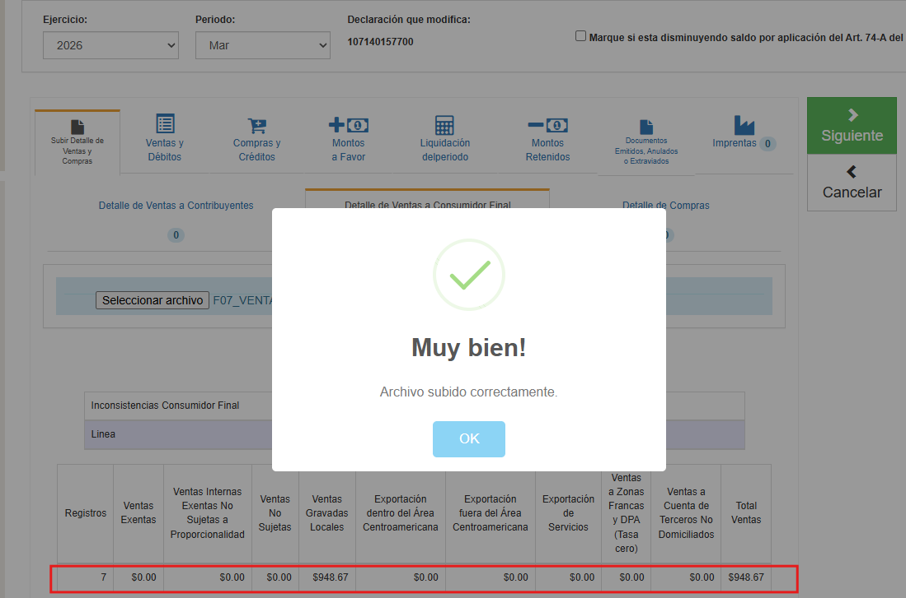{ align=center }

    **Ejemplo comparativo:**

    === "1️⃣ Anexo Detallado"
        Cada documento aparece en una fila individual:

        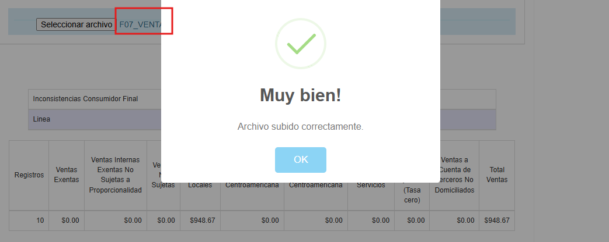{ align=center }

        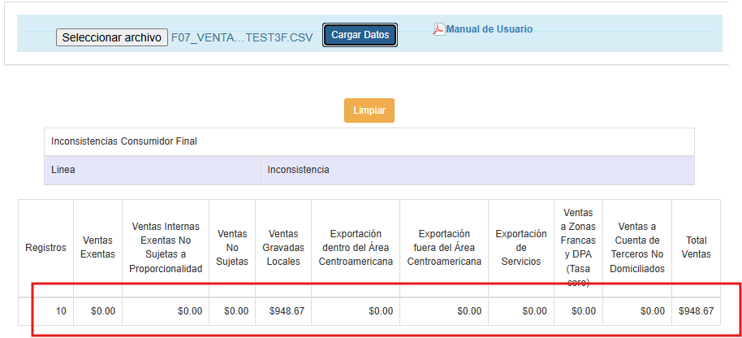{ align=center }

    === "2️⃣ Anexo Agrupado por Día"
        Los documentos del mismo tipo se consolidan por fecha:

        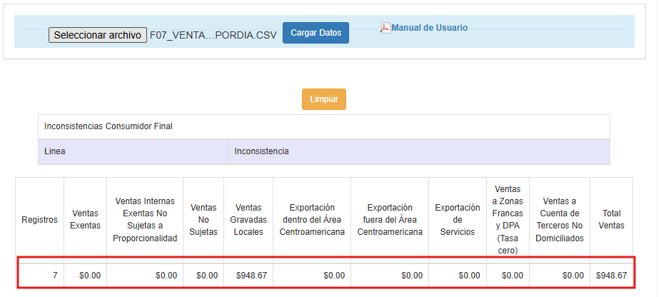{ align=center }

---

## 🔄 Flujo Funcional

!!! example "Flujo de generación del CSV con agrupación"

    === "1️⃣ Generar CSV agrupado"
        1. Ir a Informes → Anexo de ventas consumidor final.
        2. Cargar los documentos (vía importación JSON o botón "Cargar documentos generados").
        3. Dar clic en **Generar CSV**.
        4. En el menú de opciones, seleccionar **Anexo agrupado por día**.
        5. El CSV generado consolida los documentos del mismo tipo y fecha en una sola fila.

    === "2️⃣ Generar CSV detallado"
        1. Ir a Informes → Anexo de ventas consumidor final.
        2. Cargar los documentos.
        3. Dar clic en **Generar CSV**.
        4. En el menú de opciones, seleccionar **Anexo detallado**.
        5. El CSV generado mantiene una fila por cada documento individual.

---

## ☑️ Validaciones y Pruebas Realizadas 🧪

!!! info "Compilado validado"
    Las pruebas se realizaron sobre el compilado **EXE_2026_05_08.exe**.

!!! example "Tipos de validaciones y pruebas Realizadas"
    ??? example "Estructura y datos del CSV agrupado por día"
        Se confirmó que el CSV agrupado por día funciona correctamente en estructura y en datos.

        - :material-check-circle: Menú de selección (Detallado / Agrupado) visible al generar CSV: **confirmado**
        - :material-check-circle: CSV agrupado por día — estructura correcta: **confirmada**
        - :material-check-circle: CSV agrupado por día — datos consolidados correctamente: **confirmados**
        - :material-check-circle: CSV detallado — sin cambios en comportamiento original: **confirmado**

        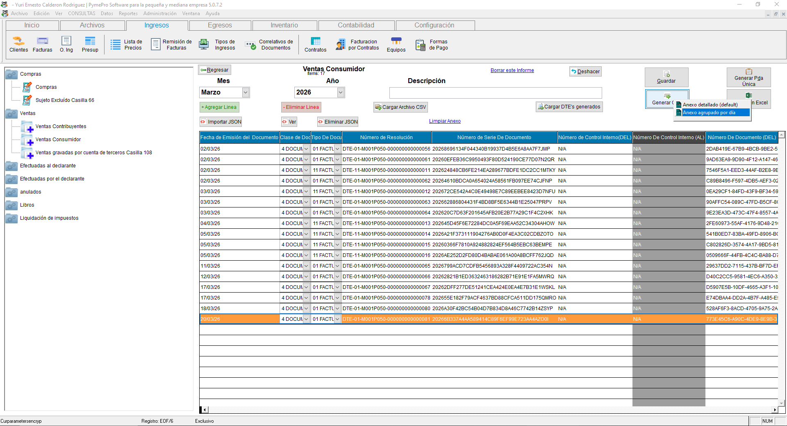{ align=center }

        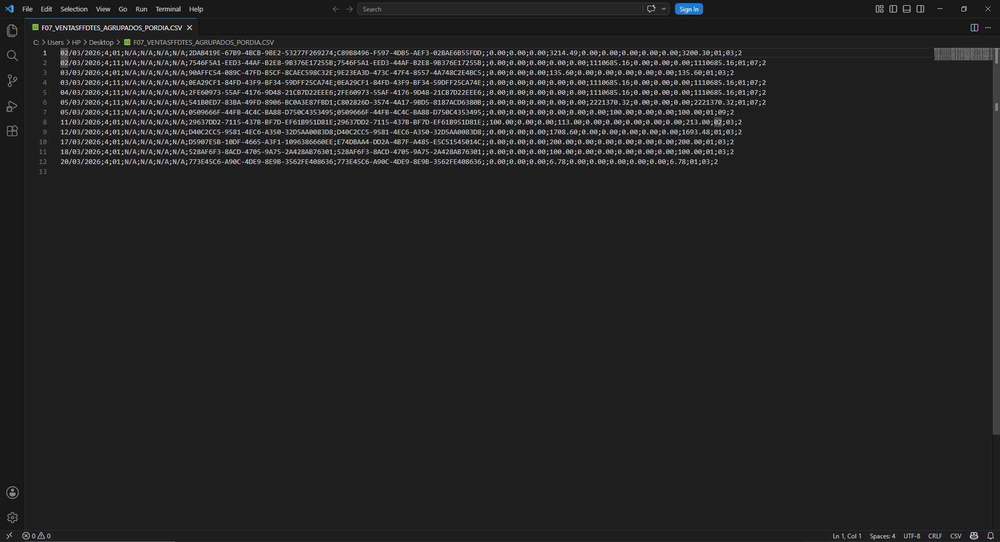{ align=center }

        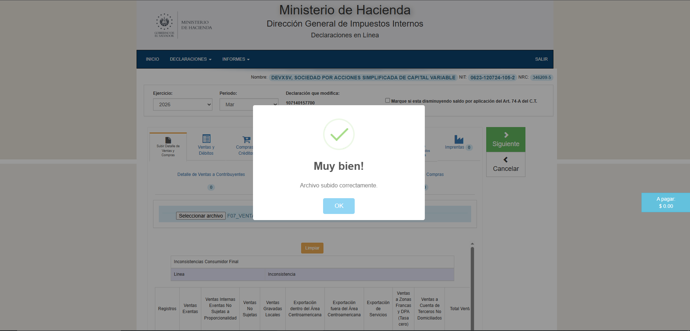{ align=center }

        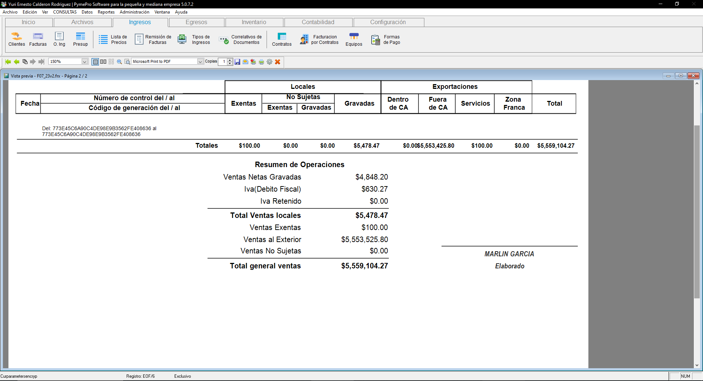{ align=center }

        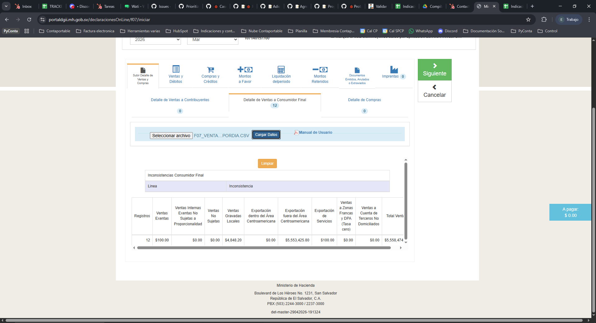{ align=center }

---