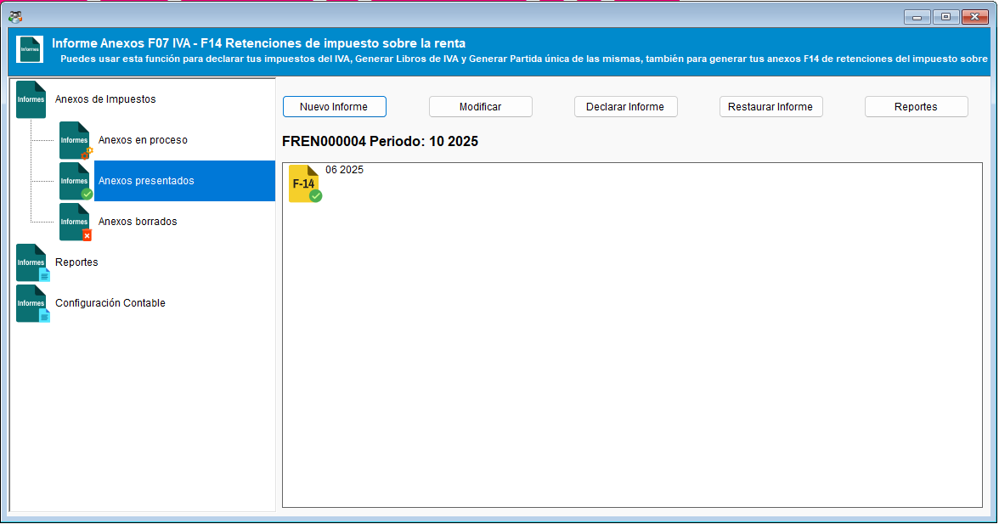
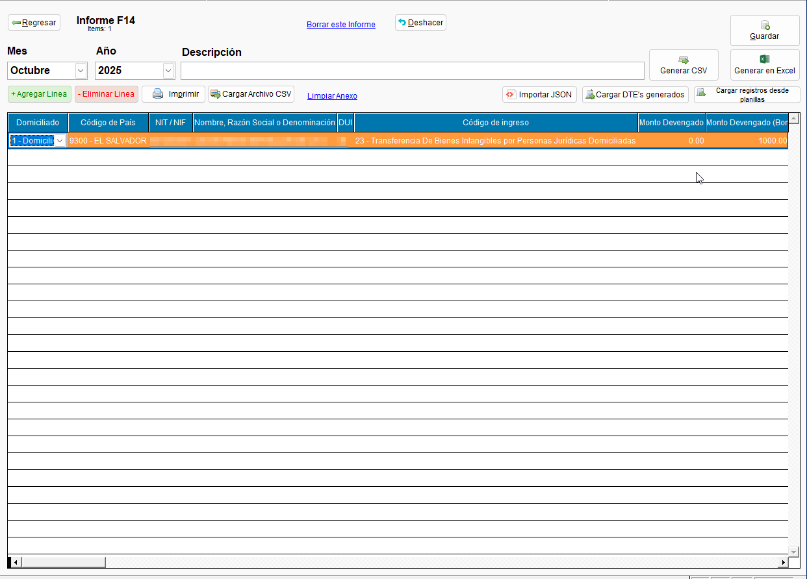
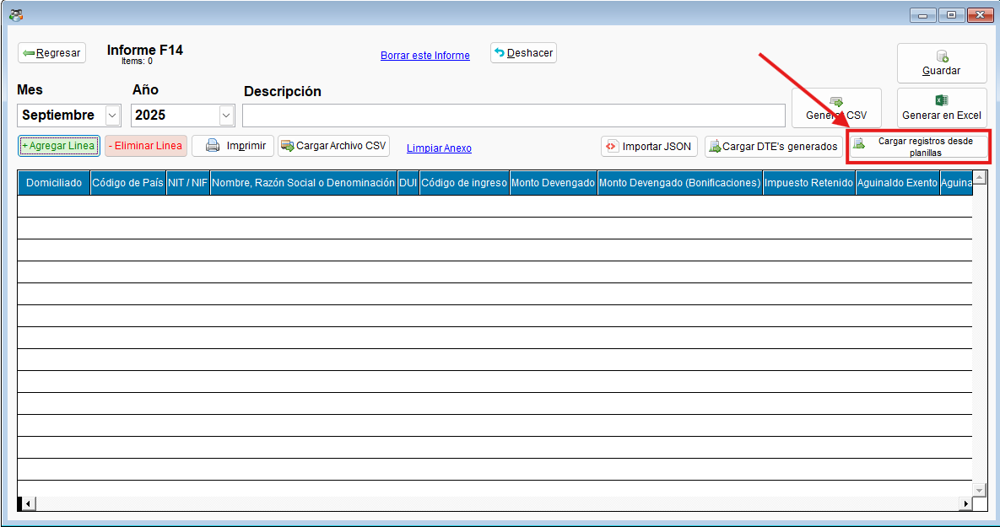
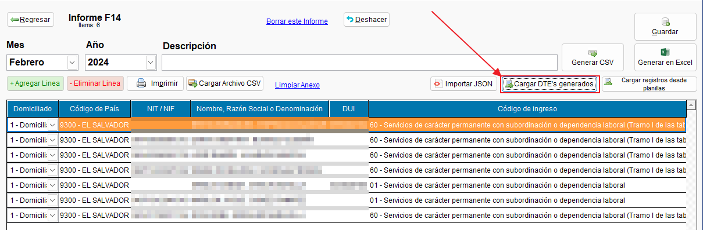
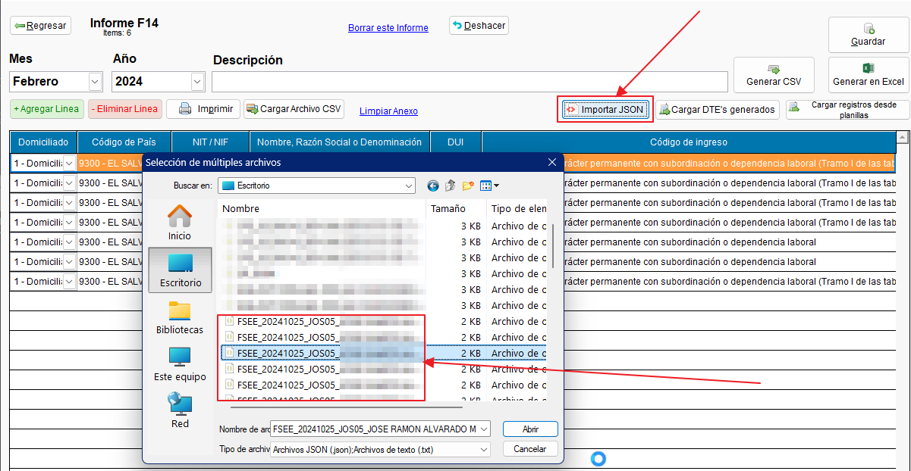
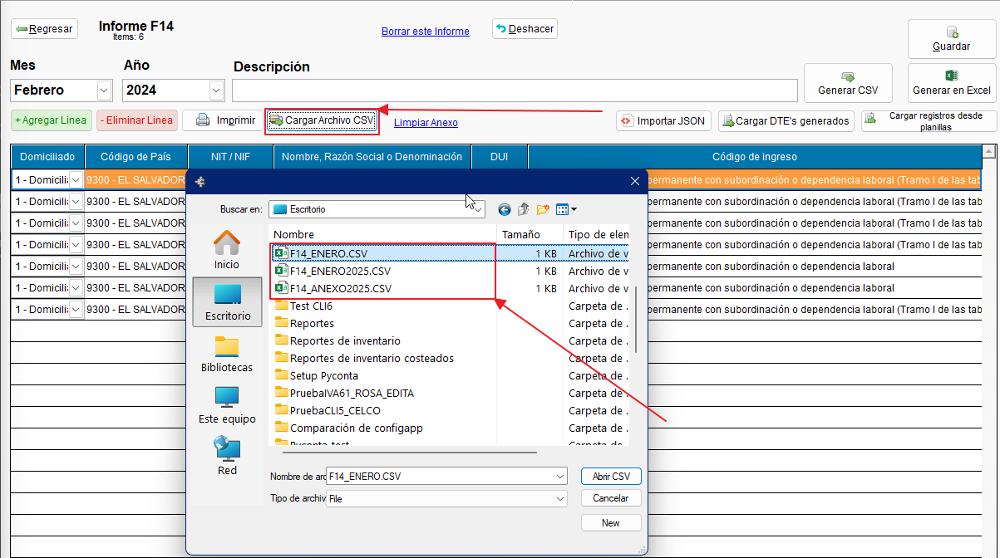
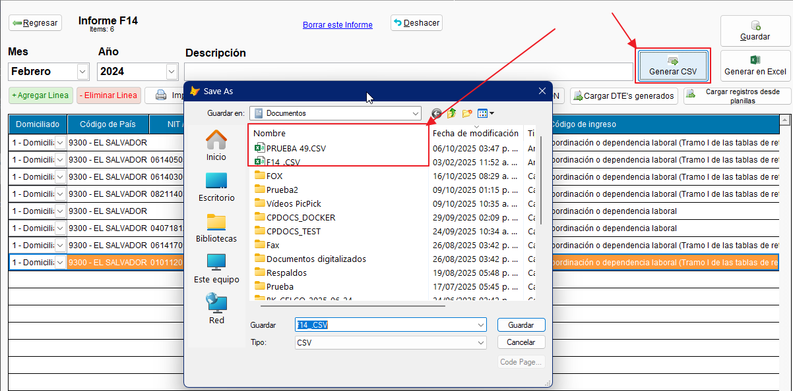

# Documentación - Anexo F14

!!! tip " **Informes - Anexo F14**"
    ``` mermaid
    graph TD
      A[Índice de contenidos]:::root

      subgraph "Subcategorías"
        B[1. Descripción del informe F14 y uso general]
        C[2. Carga de DTE's generados]
        D[3. Importación de JSON]
        E[4. Carga de archivo CSV]
        F[5. Generación de archivo CSV]
      end

      A --> B
      A --> C
      A --> D
      A --> E
      A --> F

    click B "#1-importacion-de-registros-desde-planillas" "Ir a Importación de registros desde planillas"
    click C "#2-carga-de-dtes-generados" "Ir a carga de DTE generados (Importación de sujetos excluidos)"
    click D "#3-importacion-de-json" "Ir a importación de JSON (Importación de sujetos excluidos)"
    click E "#4-carga-de-archivo-csv" "Ir a la carga de archivo CSV"
    click F "#5-generacion-de-archivo-csv" "Ir a la generación de archivo CSV"
    ```
---

## 1. Descripción del informe F14 y uso general 
!!! abstract " Anexo de retención de renta F14"

    La opción del informe de pago a cuenta y retención de renta F14, fue creado con el propósito de alinearse a las disposiciones contenidas en el manual del Ministerio de Hacienda.  
    
    En este informe es posible añadir registros y completarlos manualmente, importar un DTE en formato JSON (Facturas de sujeto excluido), importar archivos con registros CSV (Se puede utilizar la **[Plantilla oficial de ContaPortable :material-web:](https://www.contaportable.com/anexos-f07-f14){ .ms-button align=left }**).
    
    Es posible también exportar los registros ingresados en esta interfaz a formato CSV, imprimir el reporte mensual o consolidar estos informes mensuales en un solo reporte (Lo que será de utilidad para presentar el informe F910).

    ??? abstract "1.1 Enlace Manual de usuario para la carga de archivo del anexo de retenciones de impuesto sobre la renta"
        - **[Descargar manual del Ministerio de Hacienda en versión PDF :fontawesome-regular-file-pdf:](../../../assets/Informes_anexos/F14/F14_Manual_MH_V16_Octubre_2025.pdf){ .md-button }**

        **[DescargarSitio oficial del ContaPortable :material-web:](https://www.contaportable.com/anexos-f07-f14){ .md-button align=left }**
    ---
---

## 2. Pantalla Principal (Gestor de Anexos)

Esta es la primera pantalla que se visualiza al entrar al módulo. Permite gestionar los diferentes informes (anexos), esto va desde la creación, hasta la modificación, declaración, restauración y acceso a los reportes consolidados.

**{ align=left }**

### Componentes de la Pantalla Principal

* **Panel de Navegación (Izquierda):**
    * **Anexos en proceso:** Informes que estás preparando pero que aún no has finalizado o declarado.
    * **Anexos presentados:** Historial de informes que ya fueron generados y/o declarados.
    * **Anexos borrados:** Una papelera para informes eliminados que podrías necesitar restaurar.
* **Área de Trabajo (Derecha):**
    * Muestra los informes F14 pertenecientes a la categoría seleccionada en el panel de navegación.
    * Puedes ver un resumen de cada informe, como su número de referencia (ej. `FREN000004`) y el período (ej. `10 2025`).

### Botones y Acciones (Pantalla Principal)

Esta barra de botones te permite realizar acciones generales sobre los informes.

* **Nuevo Informe:** Inicia el asistente o formulario para crear un nuevo informe F14 desde cero para un período específico.
* **Modificar:** Abre el informe F14 que tengas seleccionado en el área de trabajo para editar sus detalles y registros.
* **Declarar Informe:** Comienza el proceso para marcar un informe como "declarado". Esto puede bloquear el informe para futuras ediciones y prepararlo para la generación del CSV final.
* **Restaurar Informe:** Se activa cuando estás en "Anexos borrados" y te permite mover un informe borrado de vuelta a "Anexos en proceso".
* **Reportes:** Genera vistas previas o documentos imprimibles (diferentes al CSV de declaración) del informe seleccionado.

---

## Editor de Informe F14 y Funcionalidades

Al crear un "Nuevo Informe" o "Modificar" uno existente, accederás a esta pantalla de detalle donde se ingresan los registros.

**{ align=left }**

### Componentes Principales del Editor

* **Cabecera del Informe:**
    * **Mes:** El mes al que corresponde la declaración (ej. Octubre).
    * **Año:** El año fiscal de la declaración (ej. 2025).
    * **Descripción:** Un campo opcional para agregar notas internas sobre el informe.
* **Cuadrícula de Registros (Grid):**
    * Es la tabla principal donde se añade cada registro de retención.
    * Columnas clave incluyen: Domiciliado, Código de País, NIT/NIF, Nombre o Razón Social, DUI, Código de ingreso, Monto Devengado, Monto Retenido, etc.

### Botones y Acciones Generales

Estos controles te permiten gestionar el informe activo y sus datos (son los botones que no están incluidos en el diagrama de flujo de más abajo).

* **Guardar:** Salva todos los cambios realizados en la cabecera y en la cuadrícula de registros.
* **Borrar este informe:** Elimina el informe F14 que estás editando actualmente.
* **Deshacer:** Revierte la última acción realizada, como la adición o eliminación de una línea.
* **+ Agregar Línea:** Añade una nueva fila vacía a la cuadrícula para que puedas ingresar manualmente un nuevo registro de retención.
* **- Eliminar Línea:** Quita la fila (registro) que tengas seleccionada en la cuadrícula.
* **Imprimir:** Genera una versión impresa del detalle de todos los registros del informe.
* **Limpiar Anexo:** Borra *todos* los registros (líneas) del informe actual, dejando la cuadrícula vacía.
* **Generar en Excel:** Exporta los datos de la cuadrícula a un archivo de Microsoft Excel, útil para revisiones internas.

---

### Funcionalidades de Importación y Exportación
!!! tip "Diagrama de las funcionalidades contenidas en **Informes F14**"
    ``` mermaid
    graph TD
      A[Funcionalidades en informes F14]:::root

      subgraph "Subcategorías"
        B[1. Importación de registros desde planillas]
        C[2. Carga de DTE's generados]
        D[3. Importación de JSON]
        E[4. Carga de archivo CSV]
        F[5. Generación de archivo CSV]
      end

      A --> B
      A --> C
      A --> D
      A --> E
      A --> F

    click B "#1-importacion-de-registros-desde-planillas" "Ir a Importación de registros desde planillas"
    click C "#2-carga-de-dtes-generados" "Ir a carga de DTE generados (Importación de sujetos excluidos)"
    click D "#3-importacion-de-json" "Ir a importación de JSON (Importación de sujetos excluidos)"
    click E "#4-carga-de-archivo-csv" "Ir a la carga de archivo CSV"
    click F "#5-generacion-de-archivo-csv" "Ir a la generación de archivo CSV"
    ```
---

### 1. Importación de registros desde planillas

!!! abstract "Descripción de la importación de registros planillas"

    En el módulo de Anexos F14, es posible importar los registros desde planillas desde el mes y el año del período solicitado
    
    **{ align=left }**
---

### 2. Carga de DTE's generados

!!! abstract "Descripción de la carga de DTE's generados"

    En el módulo de Anexos F14, es posible importar los registros de sujetos excluidos emitidos desde el módulo de facturación en el mes y el año del período solicitado:
    
    **{ align=left }**
---

### 3. Importación de JSON

!!! abstract "Descripción de la importación de JSON"

    En el módulo de Anexos F14, es posible importar archivos en formato JSON del tipo de documento sujeto excluido como registro en el mes y el año del período solicitado:
    
    **{ align=left }**
---

### 4. Carga de archivo CSV

!!! abstract "Descripción de la carga de archivo CSV"

    En el módulo de Anexos F14, es posible importar un archivo en formato CSV y hacer de cada línea contenida en el mismo un registro en el mes y el año del período solicitado:
    
    **{ align=left }**
---

### 5. Generación de archivo CSV

!!! abstract "Descripción de la generación de archivo CSV"

    En el módulo de Anexos F14, es posible generar los registros ingresados en el informe para el mes y el año indicados en formato CSV:
    
    **{ align=left }**
---