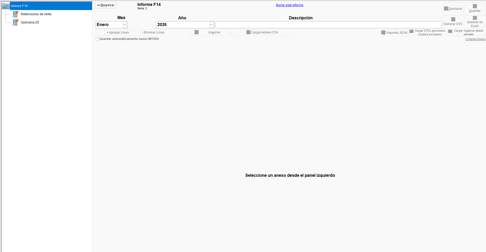
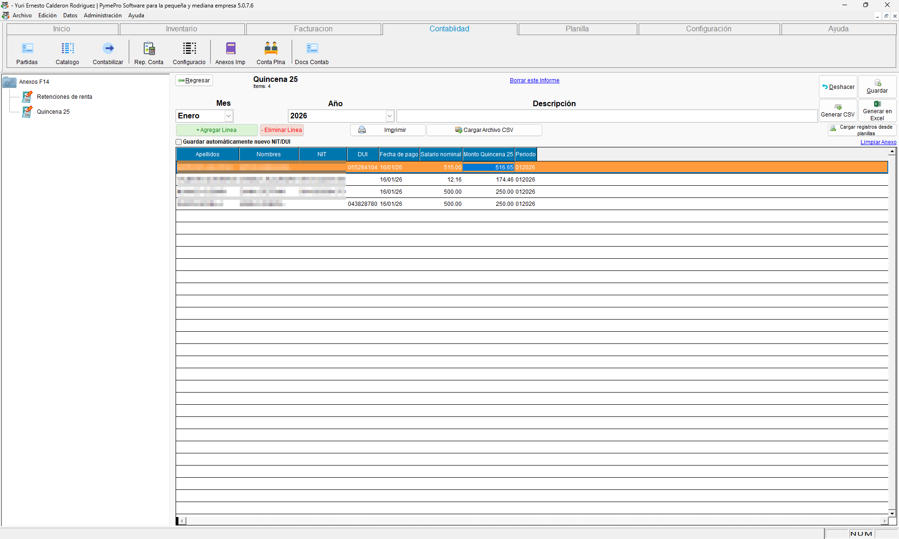
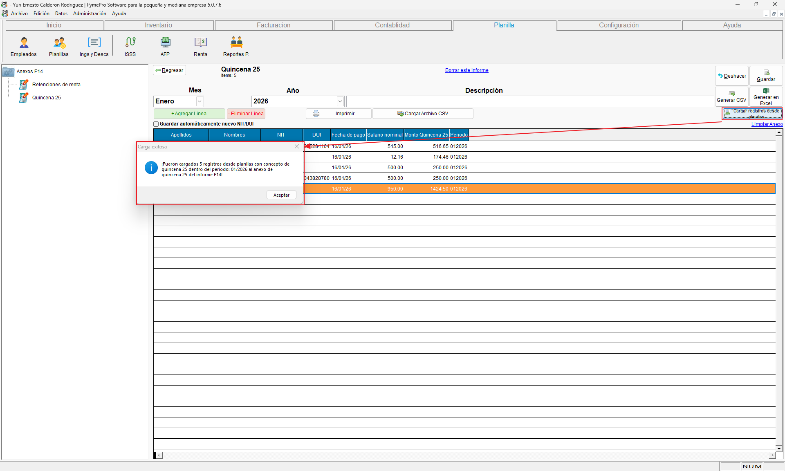
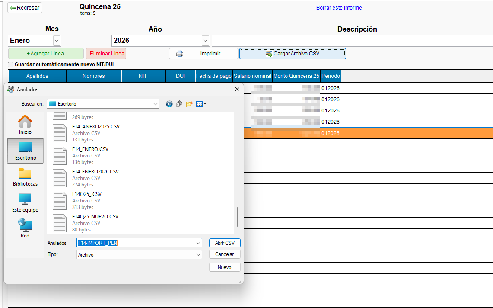
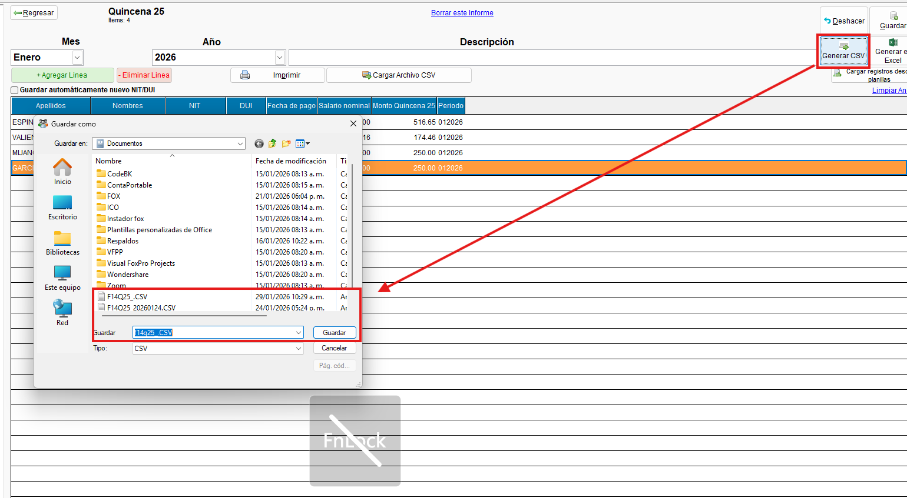

# Documentación - Anexo de Pago de Quincena 25 (F14)

!!! tip " **Informes - Anexo de Pago de Quincena 25**"
    ``` mermaid
    graph TD
      A[Índice de contenidos]:::root

      subgraph "Subcategorías"
        B[1. Selector de Anexos F14]
        C[2. Menú de gestión de anexos]
        D[3. Importación desde planillas]
        E[4. Carga de archivo CSV]
        F[5. Generación de archivo CSV]
        G[6. Manual de carga de anexo de planilla Q25]
      end

      A --> B
      A --> C
      A --> D
      A --> E
      A --> F
      A --> G

    click B "#1-selector-de-anexos-f14" "Ir a Selector de Anexos F14"
    click C "#2-menu-de-gestion-de-anexos" "Ir a Menú de gestión de anexos"
    click D "#3-importacion-desde-planillas" "Ir a Importación desde planillas"
    click E "#4-carga-de-archivo-csv" "Ir a Carga de archivo CSV"
    click F "#5-generacion-de-archivo-csv" "Ir a Generación de archivo CSV"
    click G "#6-manual-de-carga-de-anexo-de-planilla-q25" "Ir a Manual de carga de anexo de planilla Q25"
    ```
---

## 1. Selector de Anexos F14

!!! abstract "Selector de Anexos F14"

    Dentro del informe F14, se ha añadido un nuevo selector que permite elegir entre los **"Anexos de retenciones de renta"** y el **"Anexo quincena 25"**. Esta funcionalidad permite a los usuarios navegar y gestionar de forma independiente cada tipo de anexo. 
    
    El anexo de "Pago de quincena 25" es una prestación anual que se reporta en el mes de enero.

    **{ align=left }**

---

## 2. Menú de gestión de anexos

!!! abstract "Menú de gestión de anexos"

    El menú de gestión de anexos para la quincena 25 permite realizar las operaciones básicas de creación, edición y eliminación de anexos. Desde esta pantalla se puede acceder a las diferentes funcionalidades de importación y exportación de datos.

    **{ align=left }**

---

## 3. Importación desde planillas

!!! abstract "Importación desde planillas"

    El sistema permite la importación de datos directamente desde una plantilla de hoja de cálculo. Esta opción es ideal para usuarios que prefieren preparar la información en un archivo de Excel antes de subirla al sistema.

    **{ align=left }**

---

## 4. Carga de archivo CSV

!!! abstract "Carga de archivo CSV"

    Esta funcionalidad permite la carga masiva de datos para el anexo Q25 mediante un archivo CSV. El sistema procesará el archivo y registrará cada línea como una entrada individual en el anexo, optimizando el tiempo de ingreso de la información.

    **{ align=left }**

---

## 5. Generación de archivo CSV

!!! abstract "Generación de archivo CSV"

    El sistema permite generar un archivo CSV a partir de los datos ingresados en el anexo de la quincena 25. Este archivo puede ser utilizado para realizar declaraciones o para análisis posteriores.

    **{ align=left }**

---

## 6. Manual de carga de anexo de planilla Q25

!!! abstract "Manual de carga de anexo de planilla Q25"

    Para una guía más detallada sobre el proceso de carga de la planilla para el anexo de la quincena 25, puede consultar el siguiente manual oficial del Ministerio de Hacienda:

    - **[Descargar Manual de carga de anexo de planilla Q25 en versión PDF :fontawesome-regular-file-pdf:](../../../assets/Informes_anexos/F14/Manual%20de%20carga%20de%20anexo%20de%20planilla%20Q25.pdf){ .md-button }**
---