<!--- description: Documentación del modulo de anexos F07 ----->

# Anexos F07 - Documentación <!-- Subtítulo de nivel 1 -->

## ⚙️ Parámetros / Configuraciones

!!! Note "VALIDATEISRFIELDSANEXOS"

    En base al [Requerimiento en el Issues#109](https://github.com/YECAPP/CP2025/issues/109)
    Se ha creado el parámetro VALIDATEISRFIELDSANEXOS Para permitir guardar anexos sin configurar los campos de ISR 
    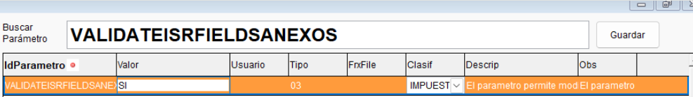{.align=center}
    
    **Valor default: SI**

    - Si esta activo (valor en SI) valida los campos de ISR para que sean necesarios llenarlos (de lo contrario no permite guardar)
    - Al desactivarse (valor en NO) permitirá guardar el anexo sin necesidad de configurar los campos de ISR, permitiendo exportar a excel
    - Los anexos vinculados a este parámetro son: **Compras, Ventas Contribuyentes, ventas Consumidor Final, Casilla #66**
    
    !!! example "Ejemplo con el valor default del parametro (activo), lo que impide guardar sin configurar los campos de ISR"
        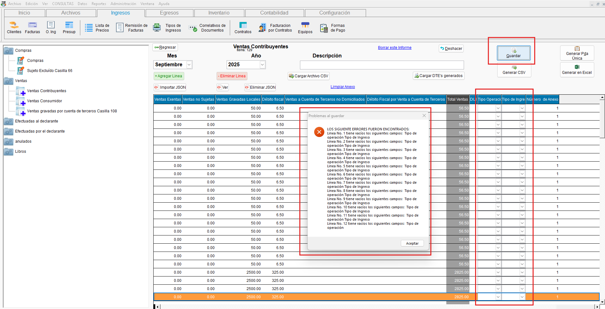{.align=center}
    
    !!! example "Ejemplo al desactivar el parametro, permitiendo guardar el anexo sin configurar los campos ISR (útil para guardar temporalmente, o para generar a excel y configurarlos los campos del ISR posteriormente)" 
        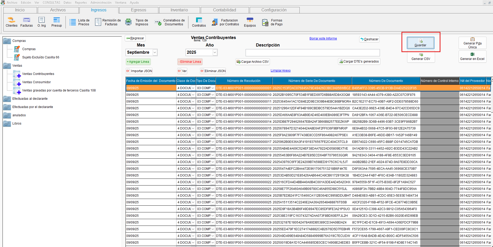{.align=center}

    !!! Tip "Configuración contable"
        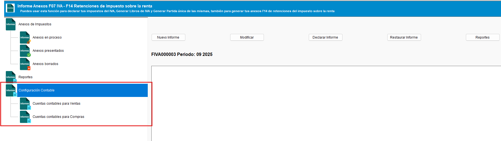{.align=center}    

        ??? Tip "Definir cuantas contables de ventas"
            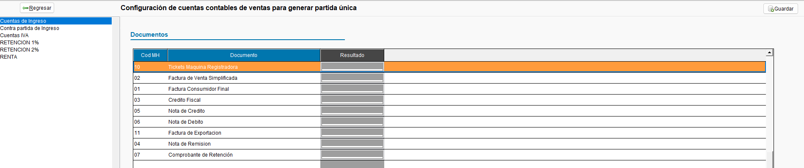{.align=center}

        ??? Tip "Definir cuantas contables de compras"
            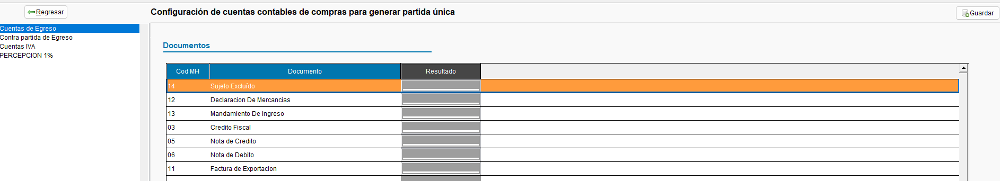{.align=center}
---

## 📚 USO GENERAL

!!! Tip "Permite Generar los CSV de los distintos anexos correspondientes al informe F07 (Clasificarlos en proceso, presentados y eliminados), también permite generar los libros de IVA en base a los anexos y contabilizarlos"
    - Ingresar comprobantes al anexos manualmente
    - Importar Dte al anexo
    - Cargar Dte´s emitidos desde contaportable
    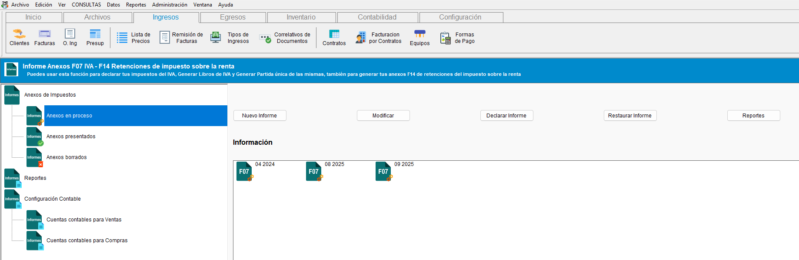{.align=center}
    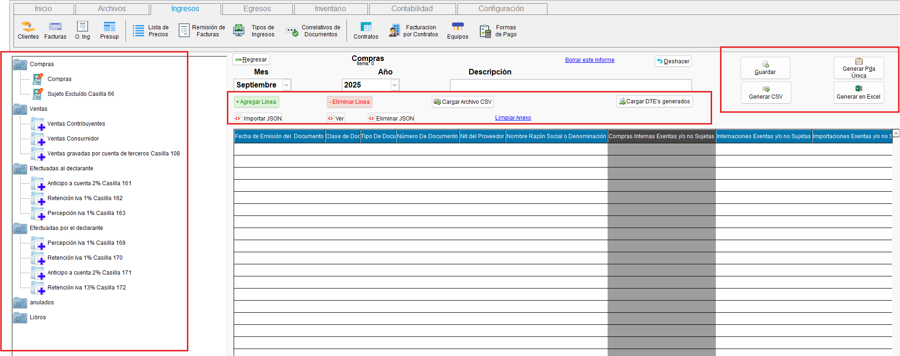{.align=center}

---

## 📄 Reportes

!!! abstract "Versiones alternativas de reportes de ventas al consumidor y contribuyente"

    - Se han creado versiones para los reportes de ventas al consumidor y ventas al contribuyente, las cuales incluyen diseños de reportes alternativos para la visualización de los mismos:

    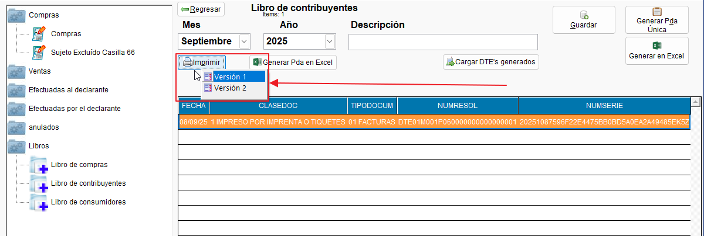{.align=center}

    - En el caso de las ventas al consumidor, es posible agrupar los registros por día, esto le logra seleccionando la versión 2 y marcando el cheque de agrupación que se muestra en la siguiente captura:

    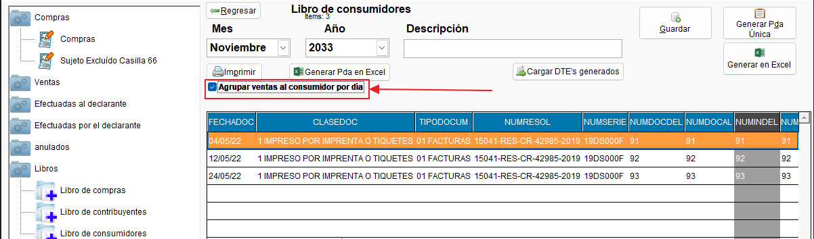{.align=center}

    ??? abstract "Libros de ventas al contribuyente - Descargas de ejemplo"
        - **[Descargar versión 1 en PDF :fontawesome-regular-file-pdf:](../../assets/Informes_anexos/F07/F07_22v1.PDF){ .md-button }**
        - **[Descargar versión 2 en PDF :fontawesome-regular-file-pdf:](../../assets/Informes_anexos/F07/F07_22v2.PDF){ .md-button }**

    ??? abstract "Libros de ventas al consumidor  - Descargas de ejemplo"
        - **[Descargar versión 1 en PDF :fontawesome-regular-file-pdf:](../../assets/Informes_anexos/F07/F07_23v1.PDF){ .md-button }**
        - **[Descargar versión 2 en PDF :fontawesome-regular-file-pdf:](../../assets/Informes_anexos/F07/F07_23v2.PDF){ .md-button }**

---

### Liquidación de IVA

!!! info "Descripción"
    Desde el módulo de Anexos F07 es posible generar el **Resumen de Liquidación de IVA**. Este reporte consolida los **débitos fiscales** (ventas) y **créditos fiscales** (compras) registrados en los anexos del periodo, calculando el impuesto resultante y determinando si existe un **saldo a pagar** o un **remanente** trasladable al siguiente periodo.

    **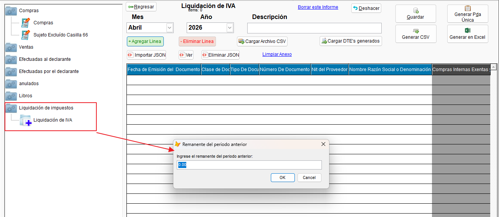{ .align=center }**

El reporte toma como base la información registrada en los anexos del F07:

=== "Sección de Ventas (Débito Fiscal)"

    !!! note "VENTAS — Débito Fiscal"
        Detalla todos los montos de IVA generados por las ventas del periodo:

        | Campo | Descripción |
        |-------|-------------|
        | **Ventas con crédito fiscal** | Ventas realizadas a contribuyentes (facturas de crédito fiscal). |
        | **Ventas consumidor final** | Ventas realizadas a consumidores finales. |
        | **Ventas con facturas de exportación** | Ventas de exportación registradas en el periodo. |
        | **Notas de crédito (ventas)** | Notas de crédito emitidas — se **restan** del total de ventas. |
        | **Total Débito Fiscal** | Suma neta del IVA generado por ventas. |

    <!-- Sección de ventas del resumen de liquidación de IVA -->
    **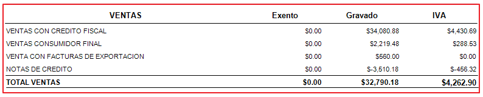{ align=left }**

=== "Sección de Compras (Crédito Fiscal)"

    !!! note "COMPRAS — Crédito Fiscal"
        Detalla todos los montos de IVA acreditables provenientes de las compras del periodo:

        | Campo | Descripción |
        |-------|-------------|
        | **Compras internas** | Compras realizadas a proveedores nacionales. |
        | **Compras al exterior** | Importaciones y adquisiciones internacionales. |
        | **Compras a sujetos excluidos** | Compras realizadas a sujetos excluidos del IVA. |
        | **Notas de crédito (compras)** | Notas de crédito recibidas — se **restan** del total de compras. |
        | **Total Crédito Fiscal** | Suma neta del IVA acreditable por compras. |

    <!-- Sección de compras del resumen de liquidación de IVA -->
    **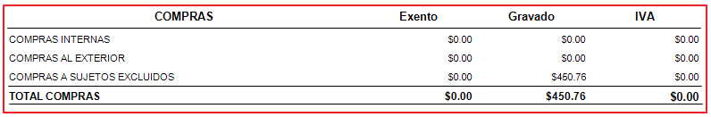{ align=left }**

=== "Resumen de Liquidación"

    !!! note "RESUMEN DE LIQUIDACIÓN"
        Calcula el resultado final de la liquidación del IVA para el periodo:

        | Campo | Descripción |
        |-------|-------------|
        | **Total Débito Fiscal** | IVA total generado por ventas. |
        | **Total Crédito Fiscal** | IVA total acreditable por compras. |
        | **Remanente del periodo anterior** | Campo editable para ingresar el remanente (excedente de crédito fiscal) del periodo anterior. El sistema **guarda automáticamente** el último valor ingresado. |
        | **TOTAL A PAGAR IVA** | Monto final a pagar en concepto de IVA. 
        | **Remanente para el próximo periodo** | Si el crédito fiscal excede al débito fiscal, el excedente se traslada al siguiente periodo. También se muestra al final del resumen. |

    <!-- Resumen de liquidación del reporte -->
    **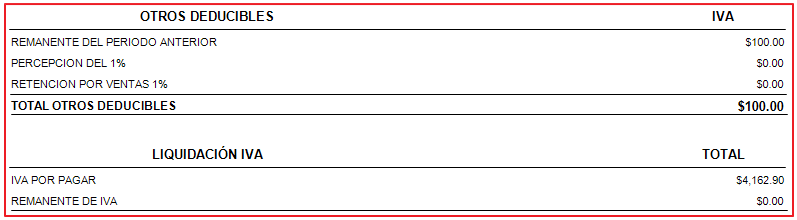{ align=left }**
