<!---
description: Optimización del proceso de importación de archivos JSON en los anexos de ventas (contribuyentes y consumidor final). Reducción de tiempo de 3 minutos a 3 segundos en bases de datos con más de 25K registros. Issue #649.
--->

# Informes y Anexos — Optimización de Importación de JSON

El proceso de importación de archivos JSON en todos los anexos fue refactorizado para eliminar cuellos de botella causados por la acumulación de registros históricos en las tablas AJSON, reduciendo el tiempo de importación de 5 archivos de 3 minutos a 3 segundos para bases de datos con más de 25,000 registros.

---

## 📌 Introducción

!!! abstract "Optimización de importación de JSON en anexos de ventas"
    Se identificó que la importación de archivos JSON en los anexos de ventas (consumidor final y contribuyentes) se volvía cada vez más lenta con el tiempo, a medida que se acumulaban registros históricos en las tablas AJSON. La refactorización del proceso elimina estos cuellos de botella y normaliza el tiempo de importación independientemente del volumen histórico acumulado.

---

## 🎯 Objetivo

!!! info "Propósito"
    - Eliminar la lentitud en la importación de archivos JSON en los anexos de ventas.
    - Resolver el patrón de degradación progresiva donde la importación se vuelve más lenta con el tiempo y la acumulación de JSONs.
    - Mejorar la experiencia del usuario con una barra de progreso porcentual durante la importación.

---

## 🔍 Alcance

!!! note "Módulos y funciones afectadas"
    - **Módulo:** Informes y Anexos → Anexo de ventas contribuyentes / Anexo de ventas consumidor final
    - **Proceso afectado:** Importación de archivos JSON (DTE)
    - **Causa raíz:** Bases de datos con más de 25,000 registros históricos en una sola tabla AJSON generaban cuellos de botella severos
    - **Cambio de UX:** Sustitución de `progresBarWithGif` por `progresBarWithPorcentaje`

---

## 📋 Requerimiento Original

!!! example "Solicitud — Issue #649"
    **Origen:** Módulo de Informes / Anexos

    **Problema reportado:** La importación de 5 archivos JSON en el anexo de ventas consumidor final tardaba aproximadamente **3 minutos**, impactando directamente la operación del cliente.

    **Causa identificada:** La tabla `AJSON2025D` tenía **26,998 registros históricos** del año anterior. Con este volumen, el proceso de importación generaba cuellos de botella severos que se agravaban a medida que la tabla crecía.

    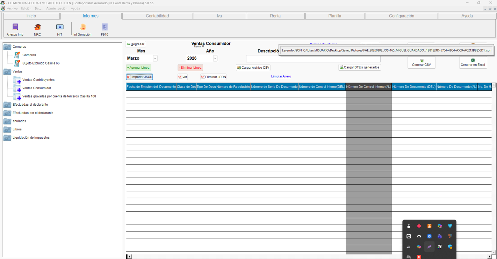{ align=center }

    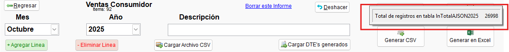{ align=center }

---

## ✨ Solución Implementada

!!! abstract "Descripción de la solución"
    Se refactorizó la importación de archivos JSON eliminando los cuellos de botella en la consulta a la base de datos. La optimización aplica tanto al anexo de ventas contribuyentes, consumidor final y demas anexos, y soluciona también el patrón de degradación progresiva con el tiempo.

### ⚡ Refactorización del proceso de importación

!!! note "Optimización del query de importación"
    El proceso de importación fue reescrito para evitar consultas ineficientes sobre las tablas AJSON con grandes volúmenes históricos. La solución:

    - Elimina los cuellos de botella generados por tablas con más de 25K registros.
    - Normaliza el tiempo de importación sin importar el volumen histórico acumulado.
    - Las pruebas se realizaron en la base de datos del cliente afectado y en la base de desarrollo.

    **Resultado:** importación de 5 DTEs pasa de **~3 minutos a ~3 segundos** en bases con muchos registros.

    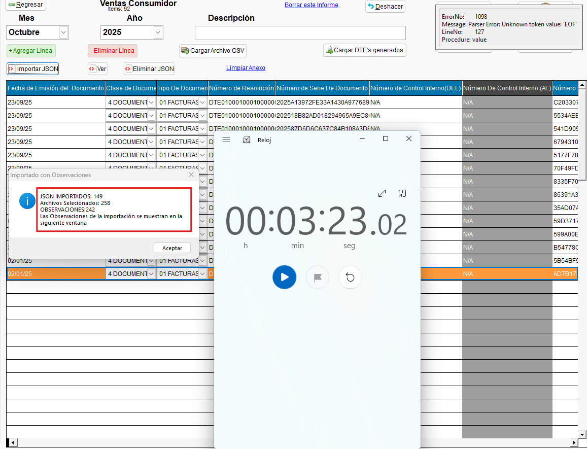{ align=center }

    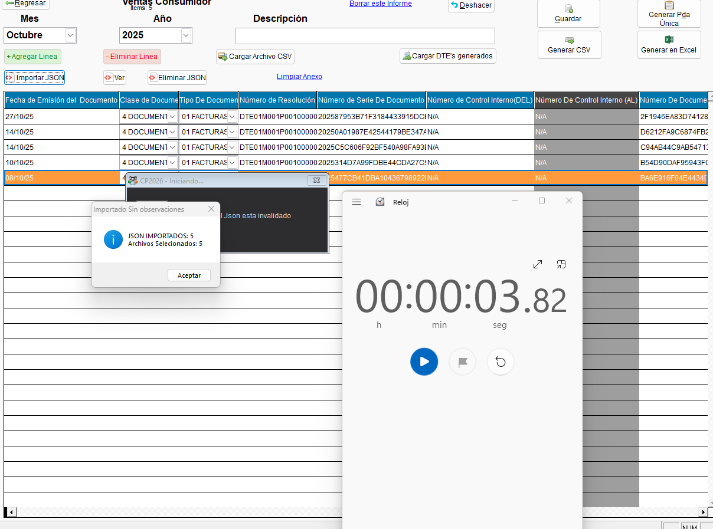{ align=center }

    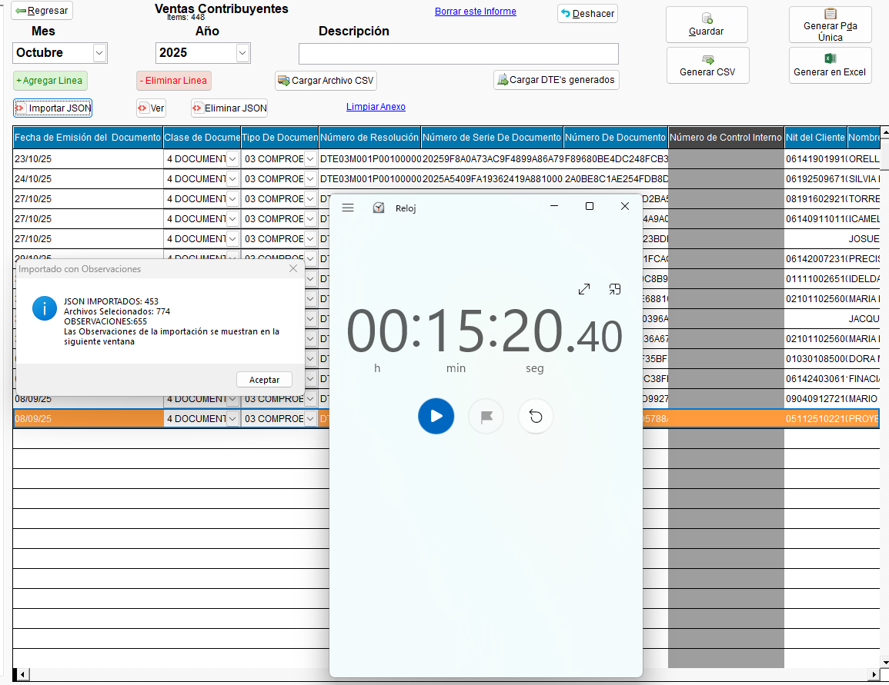{ align=center }

### 📊 Mejora de UX — Barra de progreso porcentual

!!! note "Sustitución de barra de progreso animada por porcentual"
    - Durante la primera optimizacion se agrego como progress bar el gif de inicio del sistema.
      - posteriormente se reemplazó `progresBarWithGif` (GIF animado sin indicador de avance) por `progresBarWithPorcentaje` (barra con porcentaje de avance), proporcionando al usuario información precisa del progreso durante la importación.

    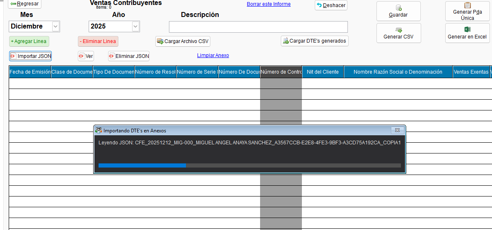{ align=center }

---

## 🔄 Flujo Funcional

!!! example "Proceso de importación optimizado"

    === "1️⃣ Anexo ventas contribuyentes"
        1. Acceder al módulo de Informes → Anexo de ventas contribuyentes.
        2. Seleccionar los archivos JSON (DTE) a importar.
        3. La barra de progreso porcentual indica el avance en tiempo real.
        4. El tiempo de importación es consistente independientemente del volumen histórico en AJSON.

    === "2️⃣ Anexo ventas consumidor final"
        1. Acceder al módulo de Informes → Anexo de ventas consumidor final.
        2. Seleccionar los archivos JSON (DTE) a importar.
        3. La importación se completa en segundos incluso en bases de datos con más de 25K registros históricos.
        4. El archivo generado puede cargarse directamente en el Portal DGII.

---

## ☑️ Validaciones y Pruebas Realizadas 🧪

!!! info "Compilado validado"
    Las pruebas internas se realizaron sobre el compilado **EXE_2026_04_16.exe**.

!!! example "Tipos de validaciones y pruebas Realizadas"
    ??? example "Test interno — Anexo ventas contribuyentes y consumidor final"
        Se validó la mejora en el tiempo de lectura en ambos tipos de anexo y se verificó la carga correcta en el Portal DGII.

        - :material-check-circle: Tiempo de importación mejorado en anexo contribuyentes: **confirmado**
        - :material-check-circle: Tiempo de importación mejorado en anexo consumidor final: **confirmado**
        - :material-check-circle: Carga en Portal DGII sin errores: **confirmada**

        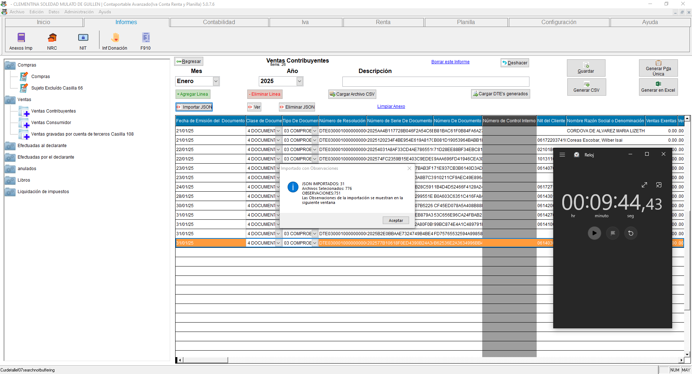{ align=center }

        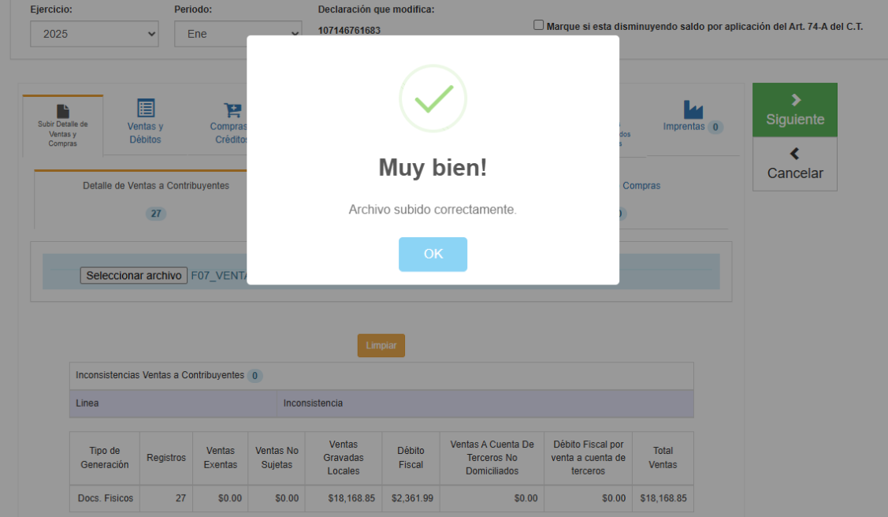{ align=center }

        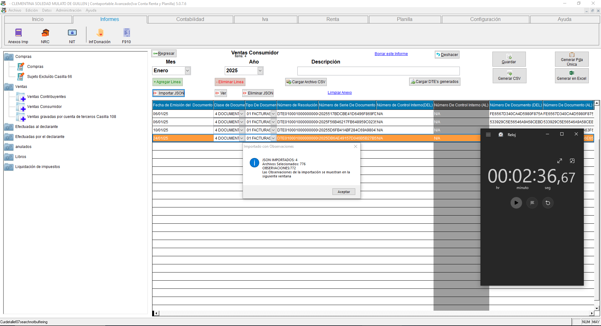{ align=center }

        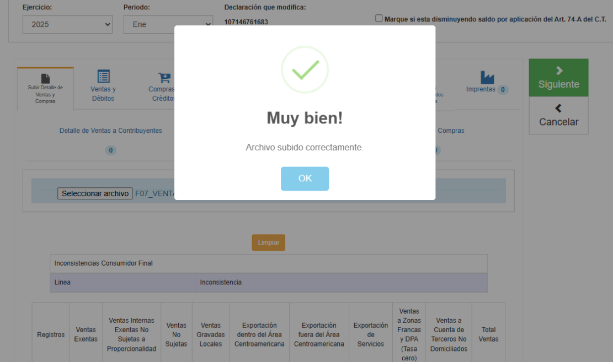{ align=center }

    ??? example "Test externo — confirmación del cliente (27/04/2026)"
        El cliente confirmó el **27/04/2026** que la actualización mejoró considerablemente el tiempo de importación. Aproximadamente **600 documentos DTE** se procesan en alrededor de **6 minutos**, una mejora sustancial respecto al comportamiento original donde 5 archivos tardaban 3 minutos.

        - :material-check-circle: Mejora confirmada por cliente externo: **validada**
        - :material-check-circle: ~600 DTEs procesados en ~6 minutos: **confirmado**

        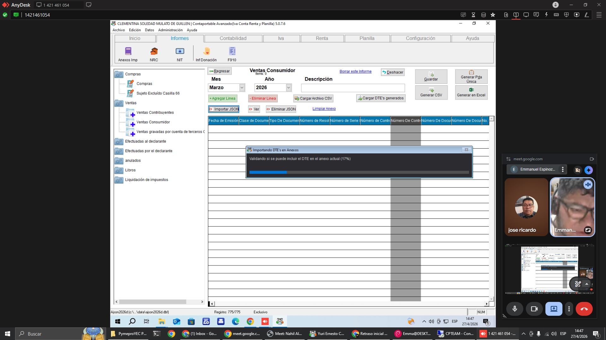{ align=center }

---
