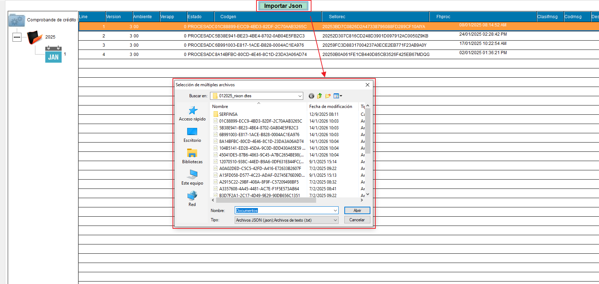
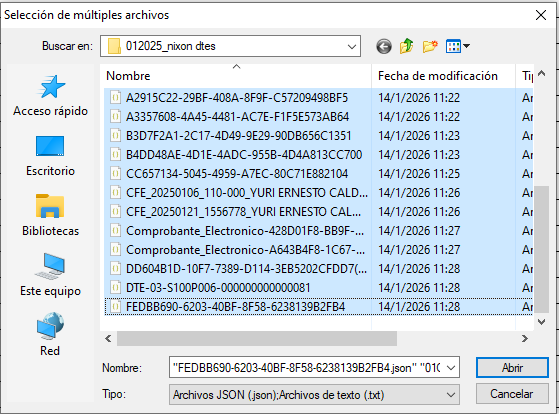
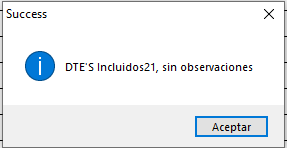
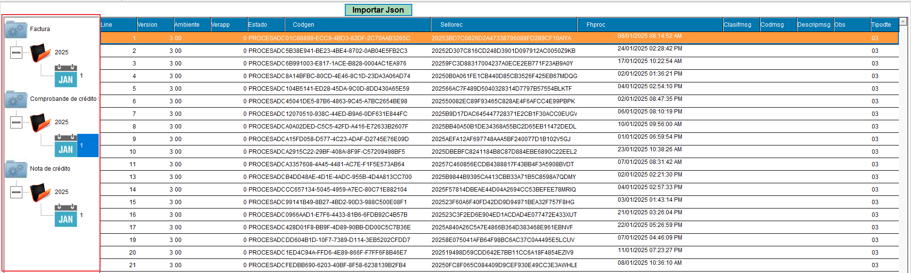

# Visor JSON - Importar Comprobantes de Crédito

Esta funcionalidad permite importar múltiples comprobantes de crédito desde archivos JSON generados por el sistema.

## Proceso de Importación

### Paso 1: Acceder al botón "Importar Json"

Desde la pantalla de **Comprobante de crédito**, localice y haga clic en el botón **"Importar Json"** ubicado en la parte superior de la interfaz.

### Paso 2: Seleccionar los archivos JSON

Se abrirá un cuadro de diálogo de **"Selección de múltiples archivos"** donde podrá:

1. Navegar hasta la carpeta que contiene los archivos JSON (por ejemplo: `01205_nixon dtes`)
2. Seleccionar uno o varios archivos JSON de la lista
3. Los archivos mostrarán información como:
   - **Nombre**: Identificador del archivo
   - **Fecha de modificación**: Última fecha de cambio
   - **Tipo**: Archivo JSON

**Nota:** El cuadro de diálogo permite visualizar diferentes ubicaciones:
- Acceso rápido
- Escritorio
- Bibliotecas
- Este equipo
- Red

### Paso 3: Confirmar la importación

1. En el campo **"Nombre"**, puede mantener el valor predeterminado "Documentos"
2. Verifique que el **"Tipo"** sea: **"Archivos JSON (.json)/Archivos de texto (.txt)"**
3. Haga clic en el botón **"Abrir"**

### Paso 4: Resultado de la importación

El sistema procesará los archivos seleccionados y mostrará un mensaje de éxito:

**"DTE 5 incluidos21, sin observaciones"**

Este mensaje indica:
- **Cantidad de DTEs procesados**: En este ejemplo, 21 documentos
- **Incluidos**: Número de documentos importados exitosamente
- **Observaciones**: Estado de la importación (sin errores)

Haga clic en **"Aceptar"** para finalizar el proceso.

## Agrupación de los DTE's

En la parte izquierda de la pantalla, los DTE's se agrupan de la siguiente manera:

- **Tipo de documento**: Por ejemplo, Factura, Comprobante de crédito, Nota de crédito.
- **Año**: Cada tipo de documento se organiza por año.
- **Mes**: Dentro de cada año, los documentos se agrupan por mes.

Esta estructura facilita la navegación y búsqueda de los comprobantes importados, permitiendo al usuario localizar rápidamente los documentos según su tipo, año y mes de emisión.

## Notas Importantes

- Los archivos JSON deben estar en el formato correcto generado por el sistema
- Se pueden seleccionar múltiples archivos simultáneamente para importación masiva
- El sistema validará cada archivo antes de procesarlo
- En caso de errores, el mensaje mostrará las observaciones correspondientes

## Campos Visibles en la Tabla

Después de la importación, los comprobantes se mostrarán en la tabla con las siguientes columnas:

- **Line**: Número de línea
- **Version**: Versión del documento (3.00)
- **Ambiente**: Ambiente de procesamiento
- **Verapp**: Versión de la aplicación
- **Estado**: Estado del proceso (0 = Procesado)
- **Codgen**: Código generado del DTE
- **Sellorac**: Sello del receptor/acuse
- **Fhproc**: Fecha y hora de procesamiento
- **Clasifmsg**: Clasificación del mensaje
- **Codmag**: Código del almacén
- **Des**: Descripción adicional