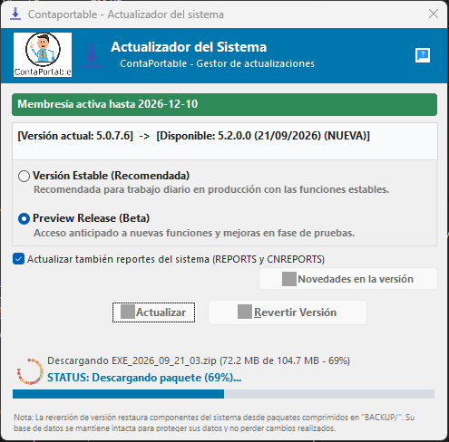
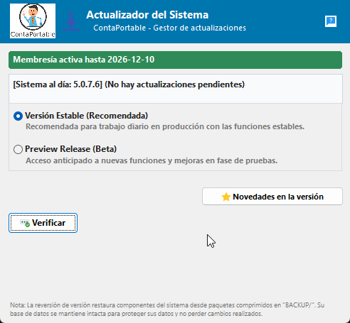
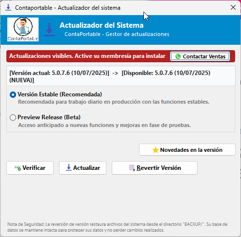
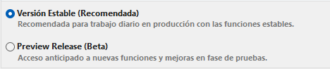
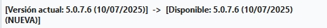
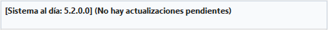

<!---
description: Documentación oficial de usuario para el Actualizador de ContaPortable (updater.exe / updater.scx / Defineupdater.prg). Canales Estable y Preview (Beta), validación de membresía activa, respaldos automáticos y reversión de versiones.
--->

# Actualizador de ContaPortable

El **Actualizador de ContaPortable** es la herramienta oficial diseñada para mantener el sistema al día con las últimas mejoras, corrección de errores reportados, funcionalidades y nuevas características, garantizando la continuidad de su trabajo y apegandonos a las disposiciones más recientes del Ministerio de Hacienda.

---

## 📌 Introducción

!!! abstract ""
    El actualizador centraliza la verificación, descarga, descompresión e instalación de nuevos ejecutables y componentes del sistema. Además, incluye un sistema automático de respaldo previo a cada instalación que permite restaurar la versión anterior en caso de ser necesario.

    El actualizador notifica si el sistema se encuentra al día o si existe una nueva versión lista para su descarga según el canal de distribución seleccionado (Versión estable o beta).

    { align=center}

---

## 📦 Requisitos y Membresía Activa

!!! info "Requisitos Previos"
    - **Conexión a Internet:** Requerida para verificar versiones y descargar paquetes de actualización, esto es muy importante.
    - **Membresía activa de ContaPortable:** Es indispensable contar con una suscripción a la membresía vigente asociada a la clave de licencia registrada en el sistema para disponer de acceso a las nuevas actualizaciones del software.
    - **Cierre de módulos:** Asegurarse de que ContaPortable y sus módulos asociados se encuentren cerrados antes de iniciar la instalación, para evitar conflictos durante el proceso de actualización.

### 🔒 Política de Membresía

!!! note "Validación de Licencia"
    El actualizador consulta en tiempo real el estado de su membresía :

    - **Membresía Activa:** Se muestra el distintivo verde :material-check-circle: **Membresía Activa** indicando la fecha de vigencia. Permite descargar e instalar actualizaciones tanto en canal **Estable** como **Preview Release (Beta)**.
    - **Membresía Inactiva o Vencida:** El actualizador muestra el distintivo amarillo/rojo :material-alert-circle: **Membresía Requerida**. El sistema le permitirá verificar si existen versiones nuevas disponibles para su conocimiento, pero el botón de descarga e instalación permanecerá bloqueado.

    { align=center }
    { align=center }

    Si requiere renovar o activar su membresía, presione el botón **Contactar Ventas** para comunicarse directamente con el equipo de ventas de ContaPortable vía WhatsApp.

---

## ⚙️ Canales de Actualización (Estable y Beta)

!!! info "Selector de Canales"
    ContaPortable ofrece dos canales de actualización oficiales para adaptarse a sus necesidades:

    { align=center }

| Canal | Tipo de Distribución | Recomendado para | Características |
| :--- | :--- | :--- | :--- |
| **Versión Estable (Recomendada)** | Oficial de Producción | Usar las funciones de ContaPortable con la mayor estabilidad posible | Máxima estabilidad probada y certificada para sus procesos diarios. |
| **Preview Release (Beta)** | Acceso Anticipado | Pruebas de nuevas funciones | Novedades, pre-lanzamientos y optimizaciones antes de su publicación general. |

!!! tip "Gestión de Descargas y Repositorios Oficiales por Canal"
    El actualizador conecta con dos repositorios dedicados para garantizar descargas aisladas y seguras:

    | Canal | Contenido y Empaquetado |
    | :--- | :--- |
    | **Versión Estable** | Paquetes oficiales probados y compilados para producción general. |
    | **Preview Release (Beta)** | Compilados preliminares con las funciones más recientes para pruebas. |

    Al cambiar entre **Versión Estable** y **Preview Release (Beta)**, el actualizador consulta y descarga directamente desde el repositorio correspondiente al canal elegido, así se pueden descargar dos versiones diferentes de forma aislada. Ambos canales exigen contar con membresía activa de ContaPortable.

---

## 📚 Flujo de Actualización Paso a Paso

=== "1️⃣ Detección de versiones"
    Al abrir el actualizador, el sistema efectúa la consulta remota y actualiza la tarjeta de estado:

    - **Escenario A (Actualización disponible):** Muestra la versión instalada actual y la nueva versión disponible (ej. `5.0.0.0` :material-arrow-right: `5.0.7.7`). El botón **Bajar e Instalar** se habilita.
    - **Escenario B (Sistema al día):** Si ya cuenta con la versión más reciente, se indicará el mensaje **Sistema al día** y se deshabilitará la descarga innecesaria.

    {align=center}
    {align=center}

=== "2️⃣ Revisión de novedades"
    Antes de instalar, puede consultar los cambios incluidos presionando **Ver notas de versión / Novedades**:

    - Se desplegará el panel lateral con el resumen de mejoras, correcciones y ajustes tributarios.
    - Opcionalmente puede presionar **Abrir en el Navegador** para consultar el registro detallado en la documentación oficial en línea.

    { align=center }

=== "3️⃣ Descarga e instalación"
    1. Presione el botón **Bajar e Instalar**.
    2. Marque la casilla **Actualizar Reportes y Formatos** si desea refrescar las plantillas de reportes del sistema.
    3. Confirme el cuadro de diálogo de inicio de actualización.
    4. El sistema creará automáticamente un snapshot de respaldo en la carpeta `BACKUP\` antes de modificar cualquier archivo.
    5. La barra de progreso indicará el avance porcentual de descarga y la extracción de archivos.

    { align=center }

=== "4️⃣ Finalización e inicio"
    Al concluir la instalación con éxito, el actualizador mostrará el mensaje de confirmación y le ofrecerá dos alternativas:

    - **Sí:** Iniciar ContaPortable de inmediato con la nueva versión instalada.
    - **No:** Cerrar el actualizador y continuar sus labores posteriormente.

    { align=center }

---

## 🔁 Reversión de Versión

!!! note "Seguridad y Tranquilidad Operativa"
    El actualizador incorpora una política de protección basada en **snapshots de respaldo**:

    - Cada vez que instala una actualización, se respalda la versión anterior en un archivo comprimido identificado con fecha y hora dentro de `BACKUP\`.
    - Se conservan rotativamente los últimos **3 respaldos**, eliminando automáticamente los más antiguos para ahorrar espacio en disco.

    { align=center }

### 🛡️ Protección de base de datos

!!! danger "Preservación Absoluta de la Información Contable"
    El proceso de **reversión de versión** restaura únicamente los ejecutables (`.exe`), librerías (`.dll`) y reportes (`.frx`/`.frt`).

    **BAJO NINGUNA CIRCUNSTANCIA se tocan, reemplazan ni modifican archivos de bases de datos,** Su información contable, partidas, facturas y demás registros permanecen 100% intactos y protegidos.

---

## ❓ Preguntas Frecuentes

??? info "¿Por qué el actualizador indica que hay una nueva versión pero no me permite descargarla?"
    Esto ocurre cuando su suscripción de membresía no se encuentra activa o ha vencido. El actualizador le informa con transparencia que existe una mejora disponible, pero la descarga requiere activar su membresía. Presione **Contactar Ventas** para ponerse en contacto con representantes de ContaPortable y poder adquirir o renovar su membresía.

??? info "¿Puedo volver a la versión estable si instalé una versión beta?"
    Sí. Si se encuentra en el canal **Preview Release (Beta)** y desea regresar a la versión estable, puede seleccionar **Versión Estable** y consultar la versión correspondiente, o bien presionar **Revertir Versión** para restaurar el respaldo previo generado automáticamente.

??? info "¿Qué debo hacer si aparece el aviso 'Archivos en uso'?"
    Cierre todas las instancias abiertas de ContaPortable, del servidor de datos o de módulos auxiliares (facturación, planillas, etc.). Si el problema persiste, verifique en el Administrador de Tareas de Windows que no existan procesos residuales ejecutándose en segundo plano.

??? info "¿Dónde puedo consultar la lista completa de cambios históricos?"
    Puede acceder a la documentación web oficial en [docs.contaportable.com/changelog](https://docs.contaportable.com/changelog) directamente desde el botón de novedades en el actualizador.

---