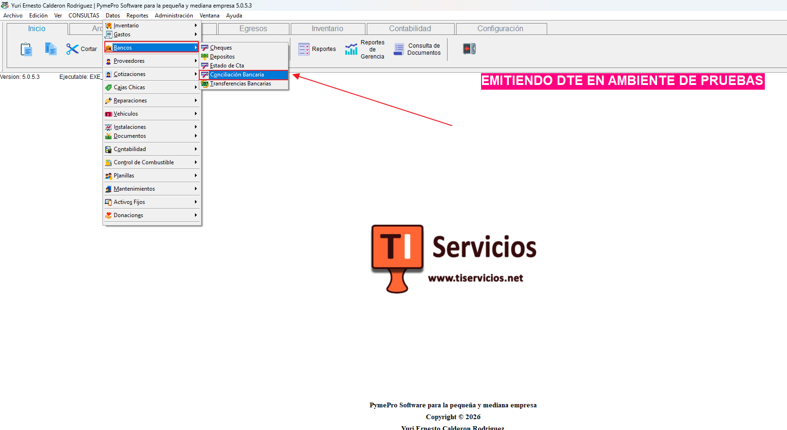
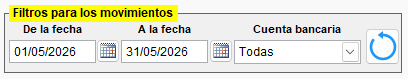
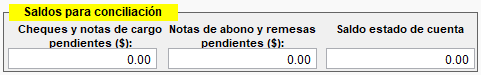
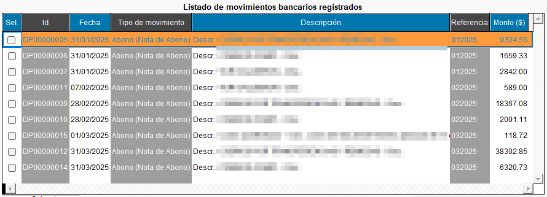
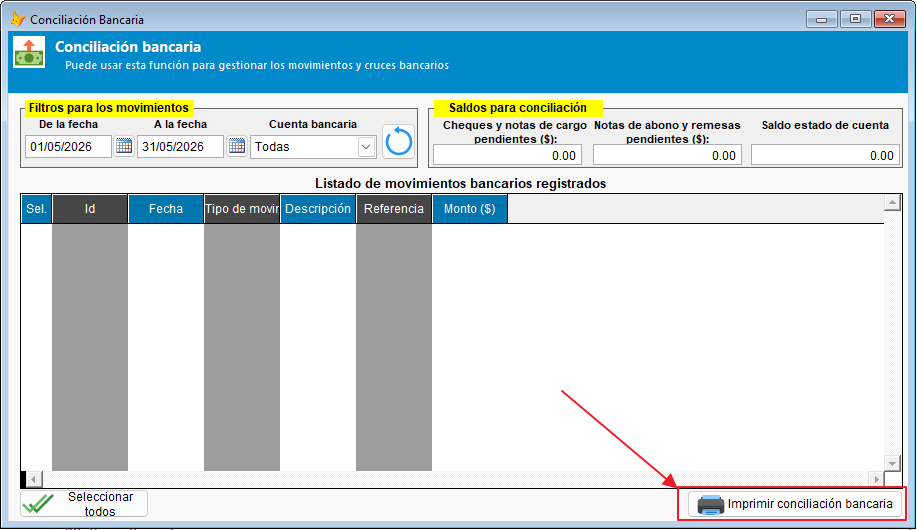
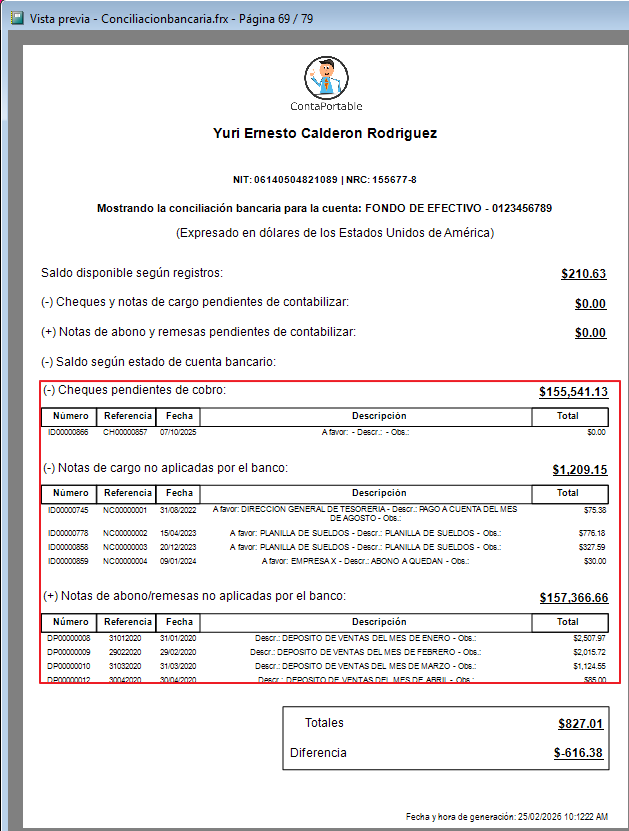

# Conciliación Bancaria

## Descripción General

El módulo de **Conciliación Bancaria** permite gestionar y cruzar los movimientos bancarios registrados en el sistema con los estados de cuenta proporcionados por el banco. Su objetivo es identificar las diferencias entre los saldos del sistema y los saldos reportados por la institución bancaria, facilitando la detección de cualquier discrepancia financiera en los registros existentes.

> **Acceso:** Menú Datos → **BANCOS** → **Conciliación Bancaria**

---

## Interfaz del Formulario

Al abrir el módulo, se presenta una interfaz que permite gestionar los movimientos bancarios, al final se presenta un reporte como resultado de la conciliación bancaria efectuada por el usuario.

La vista de interfaz principal se divide en tres secciones:

### 1. Filtros para los Movimientos

{ align=center }

| Control | Descripción |
|---|---|
| **De la fecha** | Fecha de inicio del rango a consultar. Por defecto se establece el primer día del mes actual. |
| **A la fecha** | Fecha final del rango. Por defecto se establece el último día del mes actual. |
| **Cuenta bancaria** | Lista desplegable con las cuentas bancarias registradas. Incluye la opción "Todas" para ver el consolidado de todas las cuentas. |
| **Botón Actualizar** (↻) | Aplica los filtros seleccionados y actualiza la grilla de movimientos. |

> **Nota:** Al cambiar los filtros y presionar Actualizar, el sistema solicitará confirmación si ya existen movimientos seleccionados previamente, ya que se perderá la selección actual, así que es importante seleccionar la cuenta especifica de la cual se hará la conciliación, antes de empezar a marcar movimientos.

---

### 2. Saldos para Conciliación

Panel ubicado en la parte superior derecha con tres campos numéricos para que puedan ser completados por el usuario, según la información del estado de cuenta bancario:

| Campo | Descripción |
|---|---|
| **Cheques y notas de cargo pendientes ($)** | Monto total de los cheques y notas de cargo que aún no han sido cobrados por el banco. **Este campo es editable** y debe ingresarse manualmente según el extracto bancario recibido. |
| **Notas de abono y remesas pendientes ($)** | Monto total de los depósitos y notas de abono que el banco aún no ha acreditado. **Este campo es editable** y debe ingresarse manualmente según el extracto bancario recibido. |
| **Saldo estado de cuenta bancario** | Saldo que reporta el banco en su estado de cuenta. **Este campo es editable** y debe ingresarse manualmente según el extracto bancario recibido. |

---

### 3. Listado de Movimientos Bancarios

Una listado que muestra todos los movimientos del período establecido en los filtros, con la opción de seleccionar los que ya están reflejados en el estado de cuenta bancario, presenta las siguientes columnas:

| Columna | Descripción |
|---|---|
| **Sel.** | Casilla de selección (checkbox). Marque los movimientos que ya están reflejados en el estado de cuenta bancario. |
| **Id** | Identificador único del movimiento (cargo o abono). |
| **Fecha** | Fecha en que se registró el movimiento. |
| **Tipo de movimiento** | Indica si es un **Cargo** (cheque, nota de cargo) o un **Abono** (depósito, remesa, nota de abono), junto con el tipo de documento asociado. |
| **Descripción** | Detalle del movimiento incluyendo beneficiario, descripción y observaciones. |
| **Referencia** | Número de referencia bancaria del movimiento. |
| **Monto ($)** | Importe del movimiento. |

> Los movimientos se muestran ordenados cronológicamente.

---

## Acciones Disponibles

### Seleccionar Todos

- **Botón:** "Seleccionar todos" (esquina inferior izquierda).
- **Función:** Marca todos los movimientos del listado como seleccionados (conciliados).
- Antes de ejecutar, el sistema pedirá confirmación.
- Si no hay registros cargados, se mostrará un mensaje informativo.

### Imprimir Conciliación Bancaria

- **Botón:** "Imprimir conciliación bancaria" (esquina inferior derecha).
- **Función:** Genera e imprime el reporte formal de conciliación bancaria.

#### Requisitos previos para imprimir

1. Debe tener registros cargados en el listado de movimientos y seleccionar los que ya están reflejados en el estado de cuenta bancario.
2. Debe seleccionar una **cuenta bancaria específica**.

#### Información incluida en el reporte

- Nombre del banco y número de cuenta.
- Disponibilidad de la cuenta en el período.
- Saldo según estado de cuenta bancario.
- Cheques y notas de cargo pendientes.
- Notas de abono y remesas pendientes.
- **Detalle de movimientos pendientes** (no seleccionados), agrupados por tipo de documento.
- Total de la conciliación y diferencia final.

## Vídeo guía del uso de la conciliación bancaria

<iframe width="725" height="408" src="https://www.loom.com/embed/a8668a1af63947ef8ec15279ad7f7459" title="YouTube video player" frameborder="0" allow="accelerometer; autoplay; clipboard-write; encrypted-media; gyroscope; picture-in-picture; web-share" referrerpolicy="strict-origin-when-cross-origin" allowfullscreen></iframe>

---

## Preguntas Frecuentes

### ¿Qué sucede si cambio los filtros después de seleccionar movimientos?

El sistema le pedirá confirmación antes de actualizar, indicando que perderá la selección previa. Si confirma, todos los movimientos se recargarán sin ninguna selección.

### ¿Por qué no puedo imprimir la conciliación?

Verifique que:

- Haya una cuenta bancaria específica seleccionada (no el item de "Todas").
- Existan movimientos cargados.

### ¿Qué significan los movimientos de tipo "Cargo" y "Abono"?

- **Cargo:** Salidas de dinero de la cuenta (cheques, notas de cargo, transferencias de salida).
- **Abono:** Entradas de dinero a la cuenta (depósitos, remesas, notas de abono, transferencias de entrada).

### ¿Cómo se calcula la diferencia en la conciliación?

La fórmula utilizada es:

$$\text{Total} = \text{Disponibilidad} - \text{Ch. y NC pendientes} + \text{Remesas y NA pendientes} - \text{Saldo Edo. Cuenta} - \text{Cargos no conciliados} + \text{Abonos no conciliados}$$

$$\text{Diferencia} = \text{Disponibilidad} - \text{Total Conciliación}$$

Si la diferencia es **$0.00**, los saldos están cuadrados.

---

## Glosario

| Término | Definición |
|---|---|
| **Conciliación bancaria** | Proceso de comparación entre los registros contables de la empresa y el estado de cuenta del banco. |
| **Cheques en circulación** | Cheques emitidos por la empresa pero que aún no han sido cobrados en el banco. |
| **Depósitos en tránsito** | Depósitos realizados por la empresa que aún no aparecen en el estado de cuenta. |
| **Nota de cargo** | Documento bancario que disminuye el saldo de la cuenta (comisiones, cargos por servicio, etc.). |
| **Nota de abono** | Documento bancario que incrementa el saldo de la cuenta (intereses, transferencias recibidas, etc.). |
