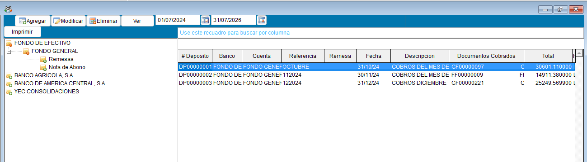
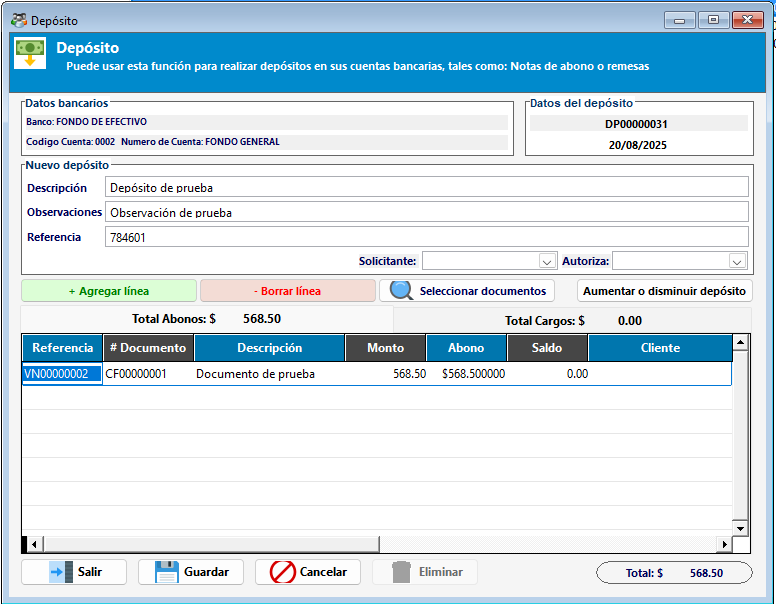
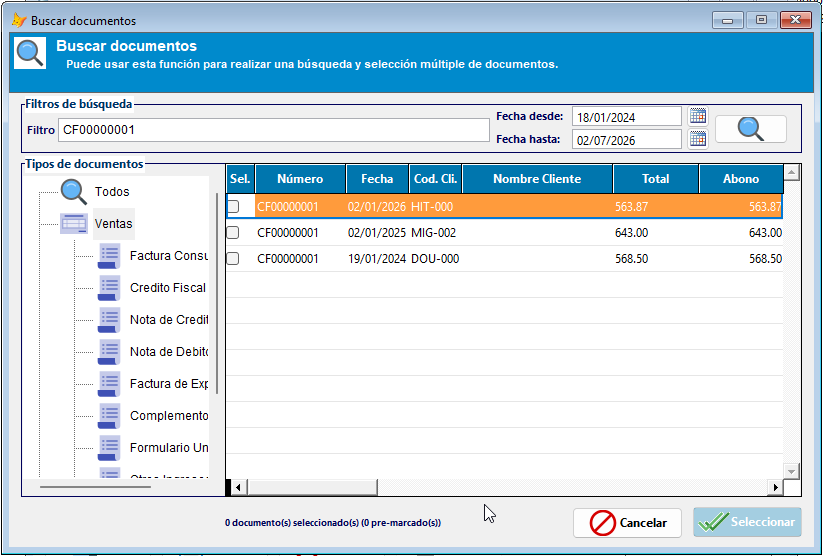
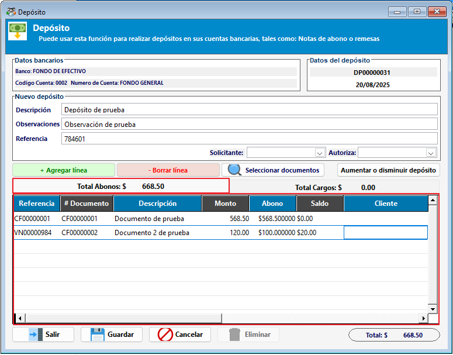
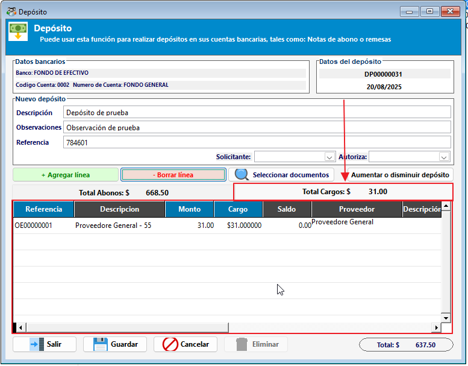
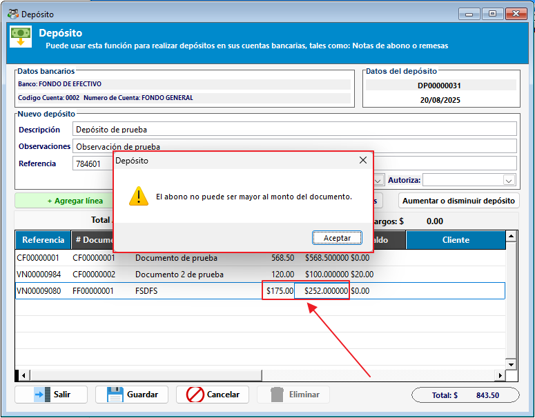

# 💵 Depósitos bancarios

El módulo de depósitos bancarios permite registrar los ingresos recibidos en una cuenta bancaria y vincularlos con los documentos que deben quedar compensados.

!!! tip "Flujo de depósito en ContaPortable"
    ``` mermaid
    flowchart LR
      A[Datos generales del depósito]:::root --> B[Documentos aplicados]
      B --> C[Cargos para equilibrar]
      C --> D[Validación y guardar]

      click A "#3-datos-generales-del-deposito" "Ir a sección de datos generales"
      click B "#4-registrar-los-documentos-aplicados-abonos" "Ir a sección de documentos aplicados"
      click C "#5-registrar-cargos-para-equilibrar-el-movimiento" "Ir a sección de cargos"
      click D "#6-guardar-y-validar" "Ir a sección de validación y guardado"
    ```

## 1. ¿Para qué sirve este módulo?

Use este módulo para:

- Registrar un depósito con fecha, referencia, cuenta y monto.
- Asociar varios documentos en una sola operación.
- Registrar los documentos que se están aplicando al depósito.
- Registrar cargos o deducciones aplicadas por el banco para equilibrar el movimiento.
- Consultar y revisar el comprobante del depósito.

!!! tip "Pantalla principal"
    La pantalla principal muestra el listado de depósitos registrados, los documentos aplicados y los botones para guardar, cancelar o buscar documentos.



## 2. Flujo recomendado

1. Ingrese al módulo de depósitos bancarios.
2. Seleccione la cuenta donde se hizo el depósito.
3. Cree un nuevo registro.
4. Capture los datos generales: fecha, referencia, banco, cuenta y monto.
5. Vincule los documentos que se van a aplicar.
6. Registre los cargos si el banco aplicó comisiones o retenciones.
7. Revise el saldo del movimiento y guarde.

## 3. Datos generales del depósito

Al crear un nuevo registro, complete la información básica del movimiento:

- Cuenta bancaria.
- Fecha del movimiento.
- Referencia o número de boleta.
- Monto total del depósito.
- Descripción u observaciones.

!!! tip "Validación de datos"
    Revise que la cuenta, la fecha y la referencia estén correctas antes de asociar los documentos.



## 4. Registrar los documentos aplicados (abonos)

En esta etapa se registran los documentos que se están cobrando o compensando con el depósito. Este paso corresponde a los abonos del movimiento.

- Busque los documentos pendientes.
- Seleccione los que corresponden al depósito.
- Revise el monto pendiente y el valor que se aplica a cada uno.

!!! tip "Selección de documentos"
    La ventana de búsqueda permite revisar varios documentos y seleccionarlos de forma masiva. Si el listado es amplio, use filtros de fecha o cliente para reducirlo.



Una vez seleccionados, el sistema muestra el detalle del depósito con los documentos aplicados. Aquí se valida que cada registro quede asociado correctamente.



## 5. Registrar cargos para equilibrar el movimiento

Si el banco aplicó una comisión, retención u otro cargo en la misma operación, regístrelo en la sección de cargos. Este valor permite equilibrar el depósito para que el movimiento quede consistente al generar la partida contable.

- Revise el monto del cargo.
- Use este valor para mantener la conciliación entre la operación bancaria y la contabilidad.



## 6. Guardar y validar

Antes de guardar, verifique:

- Que el monto total del depósito esté correcto.
- Que los documentos aplicados estén asociados.
- Que el cargo, si existe, esté registrado.

> Si el sistema detecta una inconsistencia en el detalle o datos generales, no permitirá guardar el registro hasta solventar los avisos.



## 7. Buenas prácticas

- Use referencias claras para facilitar la consulta posterior.
- Revise los cargos antes de guardar, especialmente si el banco aplica comisiones.
- Mantenga los depósitos organizados por fecha para consultar el historial con rapidez.
- Imprima o archive el comprobante cuando necesite soporte documental.

## 8. Módulos relacionados

- [Mantenimiento de bancos, cuentas y chequeras](mantenimiento_bancos_cuentas_chequeras.md)
- [Conciliación bancaria](Conciliacionbancaria.md)
- [Transferencias bancarias](transferenciasBancarias.md)
