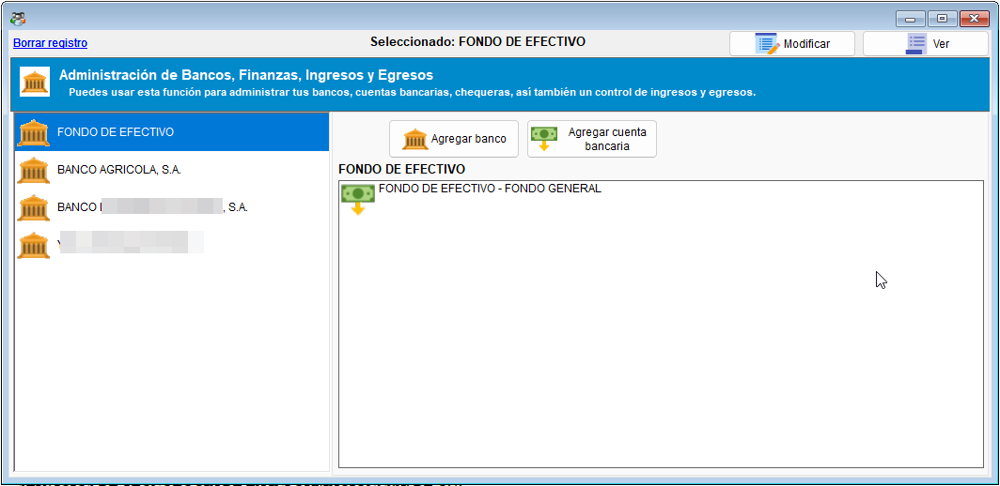
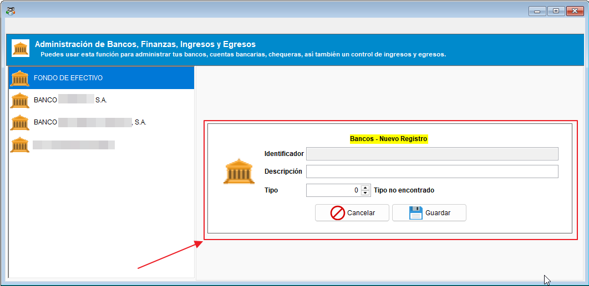
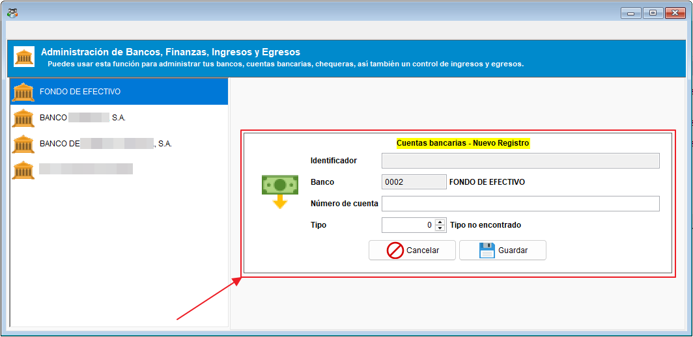
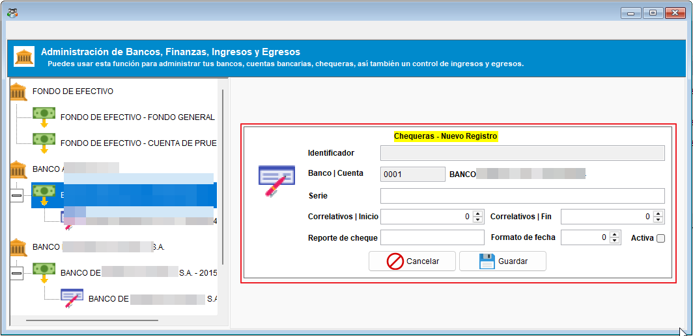

# 🏦 Bancos, cuentas bancarias y chequeras

Esta interfaz corresponde al mantenimiento de bancos, cuentas bancarias y chequeras del módulo bancario, permitiendo configurar los registros base que luego se usarán en procesos de movimientos, conciliaciones y reportes financieros.

Use esta pantalla cuando necesite:

- Crear o modificar un banco.
- Definir cuentas bancarias para la empresa.
- Configurar chequeras y sus datos asociados.

!!! tip "Importante"
    Si lo que necesita es registrar un depósito, el flujo correspondiente está en la [guía de depósitos bancarios](depositos_documentos_multiples.md). Esta pantalla es de configuración y mantenimiento.

!!! tip "Diagrama del flujo de mantenimiento"
    ``` mermaid
    flowchart LR
      A[Configuración de bancos]:::root --> B[Cuentas bancarias]
      B --> C[Chequeras]

    click A "#2-gestion-de-bancos" "Ir a la sección de gestión de bancos"
    click B "#3-gestion-de-cuentas-bancarias" "Ir a la sección de gestión de cuentas bancarias"
    click C "#4-gestion-de-chequeras" "Ir a la sección de gestión de chequeras"
    ```

## 1. ¿Qué se puede administrar en este módulo?

En esta interfaz podrá gestionar información bancaria básica relacionada con:

- Bancos.
- Cuentas bancarias.
- Chequeras.

La lógica principal es la configuración previa para que luego las operaciones bancarias puedan ejecutarse con los datos correctos.



## 2. Gestión de bancos

En la sección de bancos puede registrar la entidad financiera y su tipo. Este registro es la base para luego asociar cuentas y chequeras.

### Datos que suele pedir el formulario

- Código o identificador del banco.
- Descripción o nombre del banco.
- Tipo de banco o clasificación.



## 3. Gestión de cuentas bancarias

Las cuentas bancarias son los vínculos entre el banco y las operaciones reales del sistema. Aquí se define la cuenta que luego se usará al registrar depósitos, conciliaciones o pagos.

### Información importante al crear una cuenta

- Número de cuenta.
- Banco asociado.
- Tipo de cuenta.



## 4. Gestión de chequeras

Las chequeras permiten vincular el uso de cheques a una cuenta bancaria específica. Este registro es especialmente útil cuando la empresa necesita controlar números de cheques, rangos y estados activos.

### Datos que se revisan en una chequera

- Código de la chequera.
- Serie o prefijo.
- Rango inicial y final.
- Cuenta bancaria asociada.
- Estado activo o inactivo.
- Reporte de cheque si corresponde.



## 5. Relación con otros módulos

Esta interfaz se relaciona con distintos procesos del sistema, como:

- [Depósitos](depositos_documentos_multiples.md).
- [Conciliación bancaria](Conciliacionbancaria.md).
- [Transferencias](../transferenciasBancarias).
- [Reportes bancarios](../../Reports/categorias/bancos.md).

La correcta administración de bancos, cuentas y chequeras resulta fundamental para que el resto del módulo funcione con información correcta.
