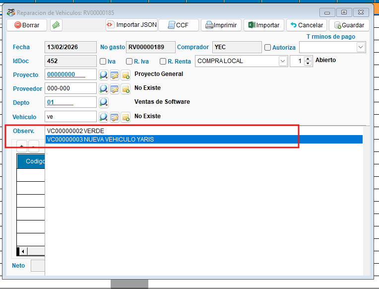
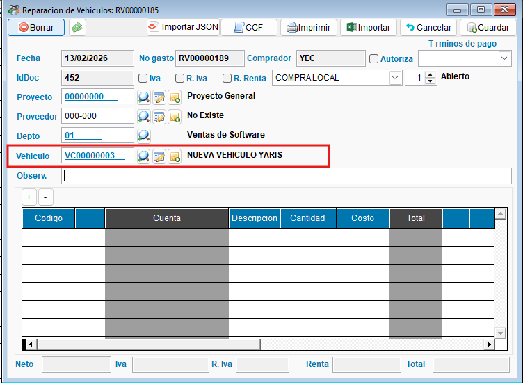

<!---
description: Documentación de las mejoras al módulo de Vehículos — selección de vehículo en Órdenes de Gasto (CB y RV) y filtros por tipo de gasto y vehículo en el reporte gerencial de mantenimiento. Issue #552.
--->

# Registro de Órdenes de Gasto (OG) por Mantenimiento de Vehículos

Las mejoras incorporan la selección de vehículo en Órdenes de Gasto (OG) por combustible y reparación, y se extienden al reporte gerencial de mantenimiento de vehiculos agregando nuevos nuevos filtros

---

## 📌 Introducción

!!! abstract "Mejoras al Módulo de Vehículos"
    Con el objetivo de ofrecer mayor valor en el ERP, se realizan correcciones y ampliaciones a las Órdenes de Gasto (OG) sin necesidad de un rediseño completo. Las mejoras se centran en dos puntos: la vinculación del vehículo en las Órdenes de Gasto de combustible y reparación, y la incorporación de filtros  por tipo de gasto y por vehículo en el reporte gerencial existente, permitiendo consultar gastos de combustible (CB), reparaciones (RV) y filtrar por vehículo específico.

---

## 🎯 Objetivo

!!! info "Propósito"
    - Agregar el campo de selección de vehículo en las Órdenes de Gasto CB y RV
    - Extender el reporte gerencial de mantenimiento para incluir gastos de combustible (antes solo mostraba reparaciones) y agregar un filtro por vehículo.
    - Solventar el bug que impedía seleccionar correctamente el vehículo en gastos CB y RV.

---

## ✨ Solución Implementada

!!! abstract "Descripción de la solución"
    Se implementan dos mejoras independientes que trabajan en conjunto: la integración del vehículo en las OG y la extensión del reporte gerencial con filtros dinámicos.

### 🚗 Selección de vehículo en OG (CB y RV)

!!! note "Campo de vehículo en Órdenes de Gasto"
    Se agrega el campo de selección de vehículo, directamente en las Órdenes de Gasto de tipo:

    - **CB** — Compras de Combustible: permite vincular el vehículo al que se carga el gasto de combustible.
    - **RV** — Reparación de vehículo: el vehículo ya estaba relacionado pero se corrige el comportamiento del selector.

    Con este cambio, cada OG queda amarrada al vehículo correspondiente, facilitando la trazabilidad del gasto por unidad.

    { align=center }

    { align=center }

## ⚙️ Configuración Requerida

!!! note "Requisitos previos"
    | Requisito | Descripción |
    | --------- | ----------- |
    | **Vehículos registrados** | Los vehículos deben estar dados de alta en el módulo de Vehículos para que aparezcan en el selector de las OG y en el filtro del reporte. |
    | **OG tipificadas como CB o RV** | Las Órdenes de Gasto de combustible deben usar el tipo CB y las de reparación el tipo RV para que los filtros del reporte las clasifiquen correctamente. |
    | **Cuentas contables vinculadas** | Las cuentas de gasto deben estar asociadas a los documentos de tipo CB y RV (iddoc correspondiente) para que el dropdown las muestre correctamente por tipo. |

---

## ☑️ Validaciones y Pruebas Realizadas 🧪

!!! info "Compilado validado"
    Las pruebas se realizaron sobre el compilado **EXE_2026_02_16**.

!!! example "Tipos de validaciones y pruebas Realizadas"
    ??? example "Corrección de bug — selección de vehículo en CB y RV"
        Se validó que el selector de vehículo funciona correctamente en las OG de tipo CB (combustible) y RV (reparación de vehículo). El bug que impedía la selección fue solventado.

        - :material-check-circle: Selección de vehículo en OG tipo CB: **funcionando correctamente**
        - :material-check-circle: Selección de vehículo en OG tipo RV: **funcionando correctamente**

        { align=center }

    ??? example "Filtro de cuentas dinámico por tipo de OG"
        Se validó que el dropdown de cuentas en el reporte muestra únicamente las cuentas relacionadas a los documentos del tipo seleccionado, basándose en las cuentas vinculadas a los documentos con iddoc correspondiente.

        - :material-check-circle: Dropdown de cuentas para CB muestra cuentas de combustible: **confirmado**
        - :material-check-circle: Dropdown de cuentas para RV muestra cuentas de reparación: **confirmado**

        { align=center }

    ??? example "OG de CB integradas y filtros por tipo y vehículo"
        Se validó la integración completa: las OG de combustible aparecen en el reporte, los filtros por tipo (CB/RV) y por vehículo funcionan correctamente, y el resultado final queda solventado.

        - :material-check-circle: OG tipo CB visibles en reporte (antes solo RV): **confirmado**
        - :material-check-circle: Filtro por tipo CB activo y funcional: **confirmado**
        - :material-check-circle: Filtro por tipo RV activo y funcional: **confirmado**
        - :material-check-circle: Filtro por vehículo específico: **confirmado**
        - :material-check-circle: Resultado validado en área de gastos: **solventado**

        { align=center }

        { align=center }

        { align=center }

        { align=center }

        { align=center }

        { align=center }

        { align=center }

---
