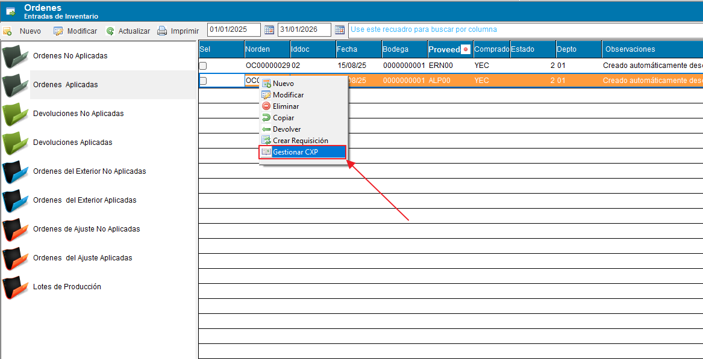
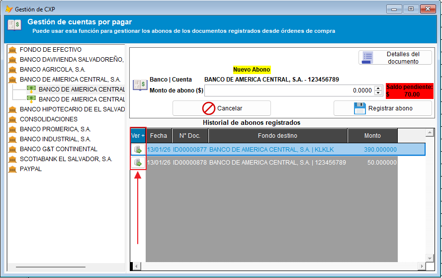
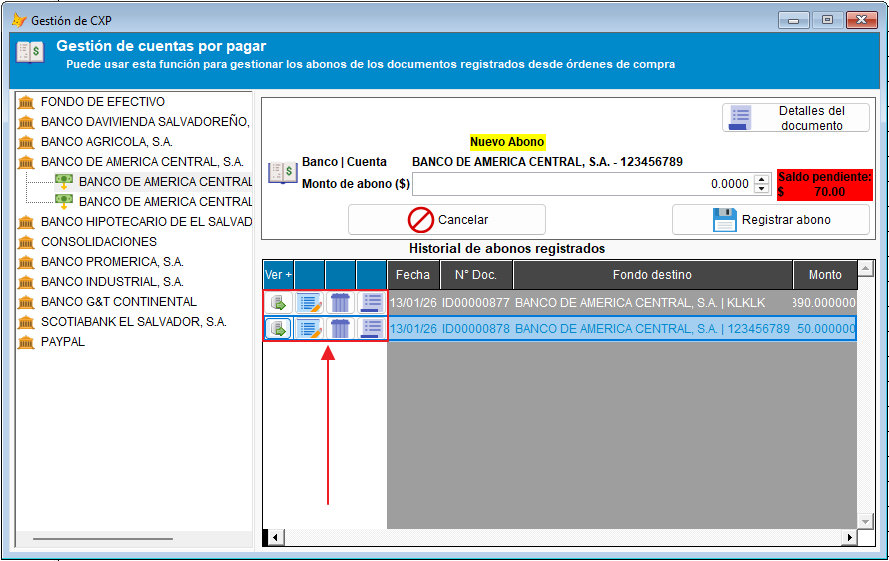
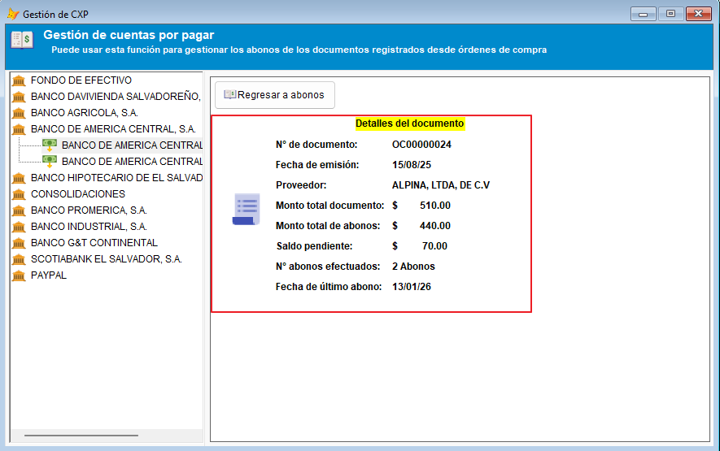

# Gestión de Cuentas por Pagar (CXP)

A continuación se detalla el proceso para utilizar la opción de gestión de CXP directamente desde los documentos de compras. Esta funcionalidad permite registrar, modificar y eliminar pagos, así como visualizar el estado de la cuenta por pagar.

!!! tip " **Compras - Gestión de CXP**"
    ``` mermaid
    graph TD
      A[Índice de contenidos]:::root

      subgraph "Subcategorías"
        B[1. Acceso desde compras]
        C[2. Ventana de Gestión de CXP]
        D[3. Gestión de pagos]
        E[4. Detalles del documento]
        F[5. Gestión de Bancos]
      end

      A --> B
      A --> C
      A --> D
      A --> E
      A --> F

    click B "#1-acceso-desde-compras" "Ir al acceso desde compras"
    click C "#2-ventana-de-gestion-de-cxp" "Ir a la ventana de gestión de CXP"
    click D "#3-gestion-de-pagos" "Ir a la gestión de pagos"
    click E "#4-detalles-del-documento" "Ir a detalles del documento"
    click F "#5-gestion-de-bancos" "Ir a la gestión de bancos"
    ```
---

## 1. Acceso desde Órdenes de compra

Para comenzar, diríjase al módulo de órdenes de compras.

1. Localice la orden de compra a la cuál se le estará gestionando la cuenta por pagar desde el listado.
2. Haga **clic derecho** sobre el documento.
3. Seleccione la opción de **Gestionar CXP** en el menú contextual que se despliega.



---

## 2. Ventana de Gestión de CXP

Al seleccionar la opción, se abrirá la ventana emergente **Gestión de Cuentas por Pagar**.

* **Funcionalidad:** Esta interfaz permite añadir, modificar y eliminar los pagos o abonos efectuados al documento seleccionado. En la parte izquierda, se podría ubicar un listado de las cuentas bancarias de la empresa desde las cuales se pueden emitir los pagos.


---

## 3. Gestión de Pagos

Dentro del listado de pagos existentes en la ventana de gestión, es posible desplegar opciones adicionales para cada registro.

1. Localice el pago específico que desea gestionar.
2. Expanda la **botonera de acciones** (Por medio de un botón al inicio del registro).



3. Se mostrarán los botones de acción disponibles, que usualmente son:
    * ✏️ **Modificar**
    * 🗑️ **Eliminar**
    * 📄 **Ver detalles**



---

## 4. Detalles del Documento

Al hacer clic en una opción para **ver los detalles del documento**, el sistema debería desplegar información específica sobre el estado financiero del mismo.

!!! note "Información Visible"
    Aquí podrá visualizar el saldo pendiente de pago, el total abonado y otros datos relevantes de la CXP para el documento que está siendo gestionado.
    
    

---

## 5. Gestión de Bancos

Dentro del módulo de compras, también puede administrar sus **bancos y cuentas bancarias** sin necesidad de moverse a otro módulo. Esto es útil para mantener al día las cuentas desde las cuales se registran los pagos a proveedores.

### ¿Qué puede hacer desde aquí?

- **Consultar** las cuentas bancarias disponibles para registrar pagos.
- **Agregar** nuevas cuentas bancarias o bancos.
- **Modificar** la información de una cuenta existente (número de cuenta, banco, tipo, etc.).

> El listado de cuentas en la ventana de gestión de CXP se actualiza automáticamente al guardar cualquier cambio realizado desde aquí.

