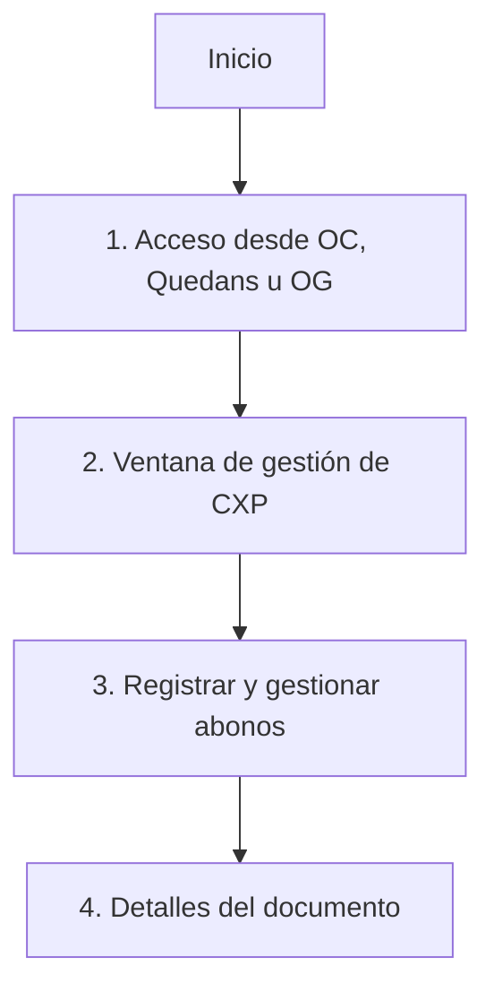
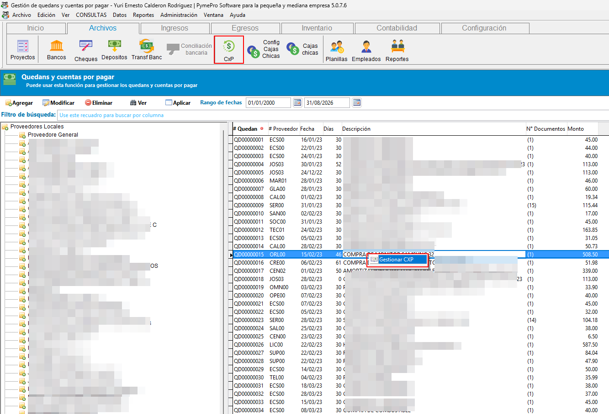
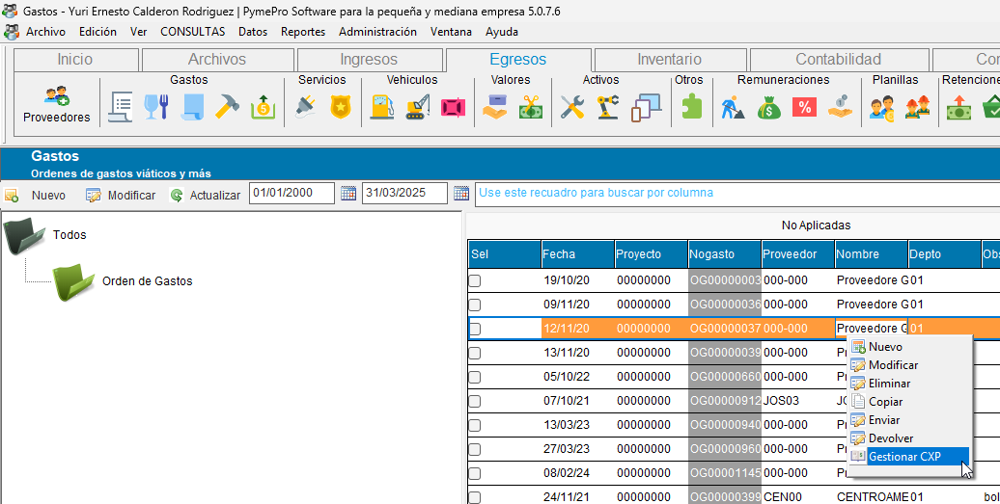

# 💰 **Gestión de Cuentas por Pagar (CXP)**

La gestión de CXP es la interfaz con la que se registran, modifican y eliminan los pagos aplicados a un documento de compras, y desde la que se consulta en todo momento su saldo pendiente.

Es la misma ventana para los tres documentos que generan una cuenta por pagar en el sistema: **Órdenes de Compra**, **Quedans** y **Órdenes de Gasto**.

!!! tip "¿Busca cómo registrar una Orden de Gasto?"
    Esta página cubre la gestión de pagos sobre un documento ya guardado. Para registrar el encabezado, el detalle y los impuestos de una Orden de Gasto nueva, vea [Registro de Órdenes de Gasto (OG)](registro_ordenes_gasto.md).

!!! tip "¿Cuándo usar esta función?"
    - Cuando necesite **registrar un abono** (pago total o parcial) a un proveedor sobre una orden de compra, un quedan o una orden de gasto.
    - Cuando necesite **modificar o eliminar** un abono ya registrado.
    - Cuando quiera **consultar rápidamente** el saldo pendiente, el total pagado o la fecha del último abono de un documento, sin tener que buscarlo en un reporte.

!!! tip "Flujo rápido"
    1. Ingresar al listado de órdenes de compra, órdenes de gasto o quedans.
    2. Ubicar el registro (fila) del documento en el listado correspondiente.
    3. Hacer clic derecho sobre el registro.
    4. Elegir la opción **"Gestionar CXP"** del menú contextual.
    5. Registrar o ajustar abonos y revisar los detalles del documento.

---

## 🚪 **1. Acceso desde Órdenes de Compra, Quedans y Órdenes de Gasto**

El acceso a la gestión de CXP se realiza de la misma forma en las tres interfaces del módulo de compras:

- **Órdenes de compra.**
- **Quedans.**
- **Órdenes de gasto.**

En cada caso, el proceso es idéntico:

1. Localice el documento en la lista correspondiente.
2. Haga clic derecho sobre el registro.
3. Seleccione la opción **"Gestionar CXP"** en el menú contextual.

{ align=center }

{ align=center }

{ align=center }

---

## 🖥️ **2. Ventana de gestión de CXP**

Al seleccionar la opción, se abre la ventana de gestión de cuentas por pagar. Es la misma ventana sin importar desde cuál de los tres documentos se haya invocado; solo cambia el documento que se está gestionando.

La ventana se organiza en dos pestañas:

- **Abonos** — listado de los abonos ya registrados al documento, con acceso para agregar uno nuevo.
- **Detalles del documento** — resumen financiero del documento (ver [sección 4](#4-detalles-del-documento)).

En el panel izquierdo se muestra un árbol con los **bancos y cuentas bancarias** de la empresa, del cual se elige la cuenta desde la que se realizará el pago. Este árbol únicamente permite **seleccionar** una cuenta ya existente; si necesita crear o modificar bancos y cuentas, hágalo desde la [gestión de bancos, cuentas y chequeras](../bancos/mantenimiento_bancos_cuentas_chequeras.md).

---

## 💰 **3. Registrar y gestionar abonos**

### Registrar un nuevo abono

1. En la pestaña **Abonos**, seleccione el banco y la cuenta desde la que se pagará (panel izquierdo).
2. Indique el monto del abono.
3. Confirme el registro.

El abono aparece de inmediato en el listado y el saldo pendiente del documento se actualiza.

### Modificar, eliminar o ver detalles de un abono existente

1. Localice el abono que desea gestionar dentro del listado.
2. Expanda la botonera de acciones del registro (botón al inicio de la fila).
3. Elija entre las opciones disponibles:
    - ✏️ **Modificar**
    - 🗑️ **Eliminar**
    - 📄 **Ver detalles**

{ align=center }

{ align=center }

---

## 📄 **4. Detalles del documento**

Desde la pestaña **Detalles del documento** (o desde la opción "Ver detalles" de un abono) el sistema muestra el estado financiero completo del documento:

- **Monto total del documento**
- **N° de documento**
- **Fecha de emisión**
- **Saldo pendiente**
- **N° de abonos efectuados**
- **Fecha del último abono**
- **Monto total de abonos**

Un botón **"Regresar a abonos"** permite volver al listado de abonos sin cerrar la ventana.

{ align=center }

---

## 📌 **5. Buenas prácticas**

- Confirme el banco y la cuenta antes de registrar el abono, ya que determinan el movimiento bancario asociado.
- Revise el saldo pendiente después de cada abono para verificar que el documento quede correctamente aplicado.
- Elimine un abono únicamente cuando se trate de un registro erróneo; si el pago cambió de monto, prefiera modificarlo.

## 🔗 **6. Páginas relacionadas**

- [Gestión de Cuentas por Cobrar (CXC)](../facturacion/gestion_cuentas_por_cobrar.md) — la misma lógica de abonos, aplicada del lado de facturación.
- [Gestión de bancos, cuentas y chequeras](../bancos/mantenimiento_bancos_cuentas_chequeras.md) — para crear o modificar los bancos y cuentas que aparecen en el selector de esta ventana.
- [Registro de Órdenes de Compra (OC) y Ajuste (OA)](registro_ordenes_compra.md)
- [Registro de Órdenes de Gasto (OG)](registro_ordenes_gasto.md)
