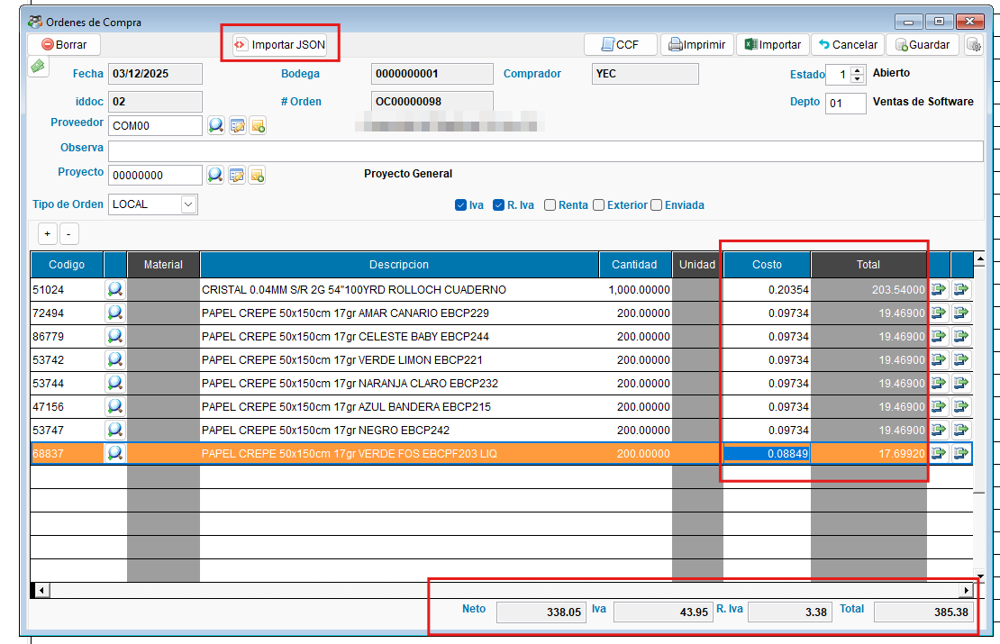
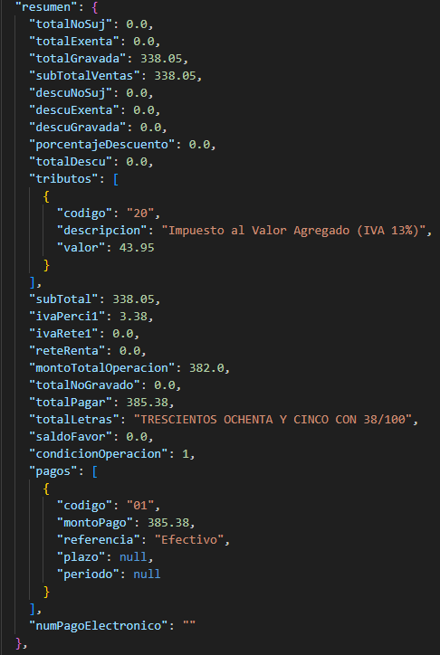

<!---
description: Documentación de la funcionalidad de importación de archivos JSON (DTE) en el módulo de Órdenes de Gasto, incluyendo asignación automática de cuenta de gasto, extensión de decimales y validación anti-duplicado. Issue #550.
--->

# Importación de JSON en Órdenes de Gasto

 En las ordenes de Gasto, se incorpora la capacidad de importar archivos JSON de Documentos Tributarios Electrónicos (DTE) directamente desde el formulario, vinculando automáticamente la información fiscal del proveedor al detalle de la orden.

---

## 📌 Introducción

!!! abstract "Importación de JSON en Órdenes de Gasto"
    Esta funcionalidad permite cargar un DTE en formato JSON directamente desde la Orden de Gasto (OG), evitando el flujo alternativo de importación desde el libro de compras que no vinculaba el documento a la orden. Al importar, el sistema asigna automáticamente la cuenta de gasto configurada en la ficha del contribuyente y aplica la precisión de 6 decimales para mantener la exactitud en los cálculos.

---

## 🎯 Objetivo

!!! info "Propósito"
    - Permitir la carga de JSON (DTE) directamente desde la Orden de Gasto, vinculando el documento al registro de la orden.
    - Asignar automáticamente la cuenta de gasto configurada en la ficha del contribuyente a todas las líneas del detalle.
    - Evitar la duplicidad de documentos en el libro de compras mediante validación al momento de importar.
    - Extender la precisión de decimales en OG a 6 cifras para eliminar descuadres al operar sobre los ítems.

---

## ✨ Solución Implementada

!!! abstract "Descripción de la solución"
    Se implementaron tres mejoras en el módulo de Órdenes de Gasto y una validación transversal que aplica también a Órdenes de Compra.

    ### 🗂️ Carga de JSON en Orden de Gasto

    !!! note "Importación de DTE desde la OG"
        Se agrega el botón de importación de JSON directamente en la interfaz de la Orden de Gasto, con el mismo comportamiento ya existente en Órdenes de Compra. El sistema procesa el archivo JSON del DTE y carga la información del proveedor, los ítems y los montos (incluyendo retención e IVA percepción cuando aplica).

        { align=center }

        { align=center }

    ### 💰 Cuenta de gasto desde ficha del contribuyente

    !!! note "Asignación automática de cuenta contable"
        Al importar el JSON, el sistema consulta la cuenta de gasto configurada en la ficha del contribuyente (proveedor) y la asigna automáticamente a todas las líneas del detalle de la Orden de Gasto. Esto elimina la necesidad de asignar la cuenta manualmente para cada ítem.

### 🛡️ Validación anti-duplicado al importar

!!! note "Detección de DTE ya importado"
    Se agrega una validación en el proceso de importación que detecta si el DTE que se intenta cargar ya fue importado previamente en otra Orden de Gasto u Orden de Compra. El sistema muestra un mensaje de alerta informando al usuario de la duplicidad antes de permitir el guardado.

---

## ⚙️ Configuración Requerida

!!! note "Requisitos previos"
    | Requisito | Descripción |
    | --------- | ----------- |
    | **Cuenta de gasto en contribuyente** | Configurar la cuenta contable de gasto en la ficha del proveedor dentro de la tabla de contribuyentes. El sistema la asignará automáticamente al importar el JSON. |
    | **Archivo JSON del DTE** | El archivo debe corresponder a un DTE válido emitido por el proveedor (formato JSON estándar del Ministerio de Hacienda). |
    | **Tipo de DTE soportado** | Comprobante de Crédito Fiscal (CCF/CFE) incluyendo retención e IVA percepción. |

---

## 🔄 Flujo Funcional

!!! example "Flujo de importación de JSON en Órdenes de Gasto"

    === "1️⃣ Importar DTE en OG"
        1. Abrir o crear una Orden de Gasto.
        2. Seleccionar la opción de importar JSON/DTE desde la interfaz de la OG.
        3. Seleccionar el archivo JSON del DTE proporcionado por el proveedor.
        4. El sistema valida si el DTE ya fue importado en otra OG u OC.
        5. Si existe duplicado: el sistema muestra una alerta informando el documento existente.
        6. Si no existe duplicado: el sistema carga los datos del DTE — proveedor, ítems, montos, retenciones.
        7. La cuenta de gasto del proveedor se asigna automáticamente a cada línea del detalle.
        8. Revisar y confirmar los datos importados.
        9. Guardar la Orden de Gasto.

    === "2️⃣ Validación de duplicidad"
        1. El sistema verifica el número de control o código de generación del DTE.
        2. Si el DTE ya existe en otra OG: alerta visible antes del guardado.
        3. Si el DTE ya existe en una OC: alerta también visible.
        4. El usuario puede decidir continuar o cancelar la importación.

---

## ☑️ Validaciones y Pruebas Realizadas 🧪

!!! info "Compilado validado"
    Las pruebas se realizaron sobre el compilado **EXE_2026_02_16**.

!!! example "Tipos de validaciones y pruebas Realizadas"
    ??? example "Importación DTE CFE con retención y percepción"
        Se validó la importación de un DTE tipo CFE (Comprobante de Crédito Fiscal Electrónico) que incluye cálculos de retención e IVA percepción, comparando el resultado contra el mismo documento importado en una Orden de Compra.

        - :material-check-circle: Importación de DTE CFE: **exitosa**
        - :material-check-circle: Cálculo de retención e IVA percepción: **correcto**

    ??? example "Ajuste de decimales a 6 cifras en OG"
        Para evitar descuadres con algunos DTE´s, se extendió la precisión a 6 decimales y se verificó que el descuadre desaparece.

        - :material-check-circle: Identificación del descuadre por límite de decimales: **confirmada**
        - :material-check-circle: Corrección con 6 decimales en OG: **aplicada y validada**

    ??? example "Validación de duplicidad al importar JSON en OG"
        Se identificó que al cargar un JSON y guardar sin entrar a la opción CCF, el sistema no validaba si el DTE ya estaba registrado, generando duplicados en el libro de compras. Se implementó la alerta de duplicidad al momento de importar.

        - :material-check-circle: Bug de duplicidad identificado: **confirmado**
        - :material-check-circle: Validación al importar con alerta de duplicidad: **implementada**
        - :material-check-circle: Prevención de duplicados en libro de compras: **validada**

---
