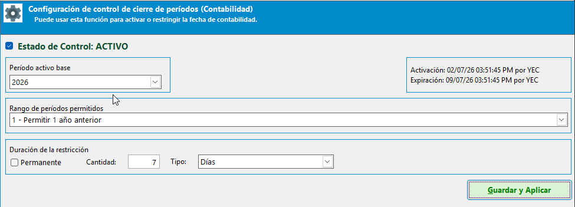
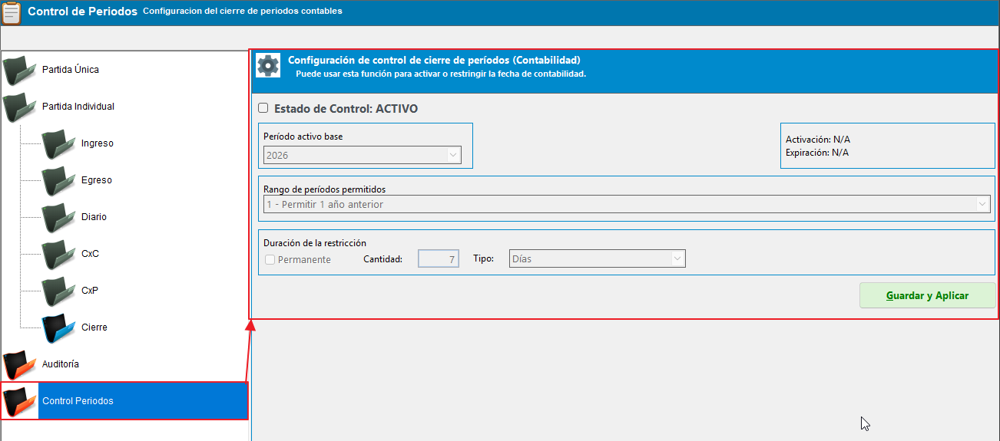
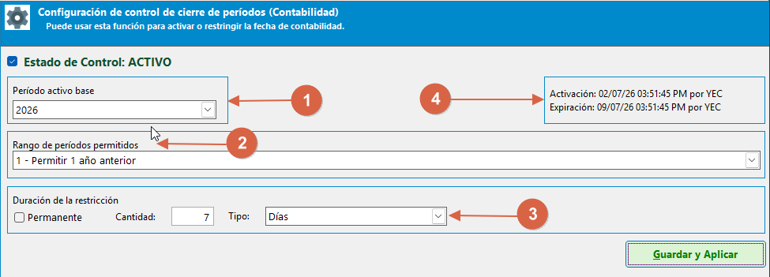
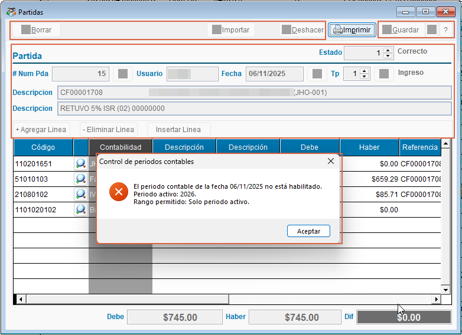
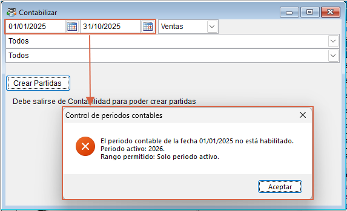

# ⚙️ **Control de cierre de períodos contables**

Este control ayuda a mantener la integridad del historial contable al impedir que se registren o modifiquen transacciones fuera del rango de años autorizado por la empresa. Se aplica a operaciones manuales, procesos por lote y a la generación de partidas resumen.

## 🛂 **1. ¿Qué permite este control?**

{ align=center }

Con esta función puede:

1. Definir el período contable activo (año base para la operación diaria).
2. Autorizar un rango de años anteriores para operar.
3. Evitar la creación o modificación de registros en periodos cerrados o no autorizados.
4. Registrar trazabilidad de activaciones, expiraciones y bloqueos.

!!! tip "Nivel de acceso"
    La configuración solo debe ser modificada por usuarios con permisos administrativos.

## 📄 **2. Acceso y configuración**

{ align=center }

Pasos para revisar o ajustar la configuración:

1. Abra el módulo de Contabilidad.
2. Vaya a Partidas → Control de períodos.
3. Defina el `Período activo` y el `Rango permitido` (número de años anteriores).
4. Seleccione la duración de la política: `Temporal` (con fecha de expiración) o `Permanente`.
5. Guarde los cambios para que entren en vigor.

## 📊 **3. Parámetros principales**

{ align=center }

1. Período activo: año que se considera vigente para la operación.
2. Rango permitido: número de años anteriores permitidos (0 = solo periodo activo).
3. Duración: `PERMANENTE` o rango temporal con fecha de activación/expiración.
4. Fecha de activación / Fecha de expiración: opcionales, usadas para vigencia automática.
5. Usuarios/perfiles autorizados: perfiles que pueden activar o modificar la política.

## 🚫 **4. Comportamiento al bloquear**

{ align=center }

Cuando una fecha está fuera del rango autorizado:

1. En pantallas de edición: la acción de guardar queda bloqueada y la UI puede abrir en solo lectura.
2. En procesos masivos (importaciones, contabilizaciones por lote): el sistema valida cada registro y detiene el proceso o marca los documentos inválidos.
3. En la generación de partidas resumen o anexos: se evita crear asientos inválidos y se informa al usuario.

## 📊 **5. Validación en procesos masivos**

{ align=center }

1. Las cargas y contabilizaciones por lotes validan fecha por registro antes de publicar.
2. Si algún registro está fuera del rango, el lote se detiene o se marca para revisión, según la pantalla.

## 📅 **6. Procedimiento si aparece un bloqueo (qué debe hacer el usuario)**

1. Lea el mensaje que indica la fecha y el motivo del bloqueo.
2. Verifique si la fecha del documento es correcta; corríjala si corresponde.
3. Si la fecha es correcta y necesita registrarse, solicite a un administrador apertura temporal o ampliación del rango.
4. Una vez corregido o autorizado, reintente la operación.

!!! tip "Recomendación"
    En solicitudes de excepción incluya: motivo, lista de documentos y rango de fechas requerido.

## 📌 **7. Recomendaciones de uso**

1. Revise la política activa al inicio de cada ejercicio.
2. Mantenga el `Rango permitido` lo más restrictivo posible salvo necesidad real.
3. Documente cambios y excepciones para auditoría interna.
4. Notifique a los usuarios operativos antes de cambios en el periodo activo.
