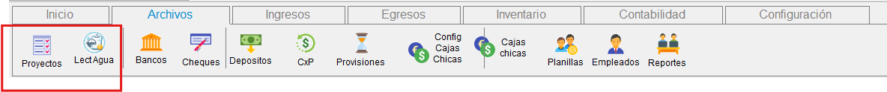
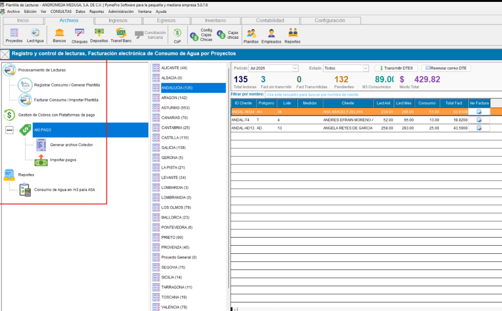
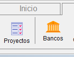
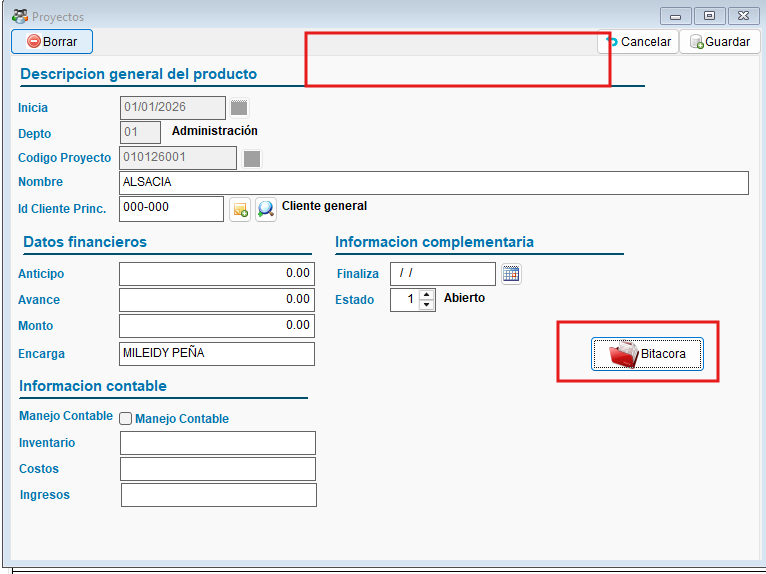

<!---
description: Documentación del módulo/plugin ConAgua para facturación por consumo de agua potable. Activado mediante el parámetro ACTIVATEMODCONAGUA. Issue #566.
--->

# Módulo / Plugin : ConAgua — Facturación por Consumo de Agua

El módulo ConAgua extiende el sistema ContaPortable como módulo independiente con un flujo  para el registro y control de lecturas por consumo de agua, permitiendola generación masiva de facturas electrónicas por proyectos, y envio masivo de correos por entregas de DTE, asi como la gestion de cobros con la plataforma de pago AKI PAGO .

---

## 📌 Generales, Instalación y Configuración del módulo -

!!! abstract "Módulo ConAgua"
     **[Ver instalación del módulo ConAgua :material-arrow-right-bold-box-outline:](../instaladorModulesCp365.md){ .md-button }**

    Despues de instalar el modulo y reiniciar el sistema, se habilitará el acceso al módulo/plugin CONAGUA, para poder realizar registros y facturación por consumo de agua potable en base a lecturas. El módulo comparte la interfaz con el modulo de Proyectos pero opera con base de datos y recursos propios e independientes. Permite gestionar múltiples clientes por proyecto, registrar lecturas de consumo, exportar plantillas Excel con fórmulas y generar facturas en masa listas para transmitir y generar el DTE.

---

## 🎯 Objetivo

!!! info "Propósito"
    - Automatizar el proceso de facturación por consumo de agua, generalmente manejado por proyectos, sin duplicar fichas de clientes.
    - Automatizar el cálculo de consumo, cargos por distribución, canon, saldo pendiente y mora.
    - Generar facturas electrónicas en masa en estado "Generado" para transmitirlas en bloque posterior.
    - Permitir trabajo desde el sistema o desde plantilla Excel con fórmulas incluidas.

---

## 🔍 Alcance

!!! note "Funciones del módulo"
    - **Proyectos:** configuración de factores (distribución, canon, mora), tipo de factura y clientes por proyecto.
    - **Pestaña 1 — Lecturas:** registro de consumo, descarga de plantilla Excel, importación desde plantilla.
    - **Pestaña 2 — Facturación:** traslado de lecturas registradas, conversión automática a facturas.
    - **Base de datos y recursos independientes** de la interfaz de Proyectos estándar.
    - **Desactivado:** si el modulo/plugin no esta activo, la interfaz de Proyectos vuelve a su estado original sin pestañas para configuración relacionada al modulo/plugin CONAGUA.

---

## ✨ Solución Implementada

!!! abstract "Descripción de la solución"
    Se implementan dos pestañas integradas al módulo de Proyectos — una para el registro de lecturas y otra para la facturación — junto con la configuración de parámetros de cobro por proyecto y la gestión de clientes asociados.

     { align=center }

### ⚙️ Configuración de proyectos y clientes

!!! note "Configuración en Proyectos"
    Al activar el módulo, la sección Parámetros en Proyectos se habilita para configurar por cada proyecto:

    - Factores de utilidad y costos por distribución
    - Canon y mora
    - Tipo de factura a emitir

    También permite **asociar múltiples clientes al proyecto** sin duplicar su ficha, junto con datos de última lectura, última fecha de factura, etc. Se incluye opción de exportar e importar clientes desde Excel.

    { align=center }

    { align=center }

### DASBOARD - MENU DEL MODULO

!!! note "Registro de consumo"
    Al ingresar al módulo encontra el menu de navegación con las siguientes opciones:
    - Procesamiento de lecturas
        -- Registrar Consumo / Geneerar Plantilla de lectura
        -- Facturar Consumo / Importar Plantilla
    - Gestión de Cobros con Plataformas de pago
        -- AKI PAGO
            --- Generar Archivo Colector
            --- Importar Pagos
    -Reportes
        --Consumo de Agua en m3

    { align=center }

    El Dasboard permite conocer rapidamente datos como el total de lecturas, facturas generadas sin transmitir, facturas transmitidas, facturas pendientes, m3 consumidos y monto total facturado por cada proyecto
     
     Tambien permite conocer las lecturas y facturas por proyecto, filtrarlas por periodo y por estado

     Acceso rapido a las opciones de transmitir DTES por proyectos y Reenvio de correos del DTE por proyectos, Consultar y visualizar facturas por proyectos

### 🔒 Comportamiento con módulo desactivado

!!! note "Módulo CONAGUA desactivado"
    Cuando el parámetro `ACTIVATEMODCONAGUA = NO`, la interfaz de Proyectos mantiene su comportamiento original: sin pestaña de lecturas ni facturación de agua. El acceso a la bitácora se mantiene mediante el botón correspondiente.

    { align=center }

    { align=center }

---

## ⚙️ Configuración Requerida

### 🔧 Formas de instalación del módulo

!!! note "Opción 1 — Instalación mediante formulario (recomendada)"
    La forma recomendada de instalar el módulo ConAgua es usando el **formulario de instalación de módulos y plugins**, accesible desde el menú del sistema en **Datos Generales → Instalar plugin/módulo**. Este método activa automáticamente el módulo sin necesidad de configuración manual.

    **[Ver guía del instalador de módulos :material-arrow-right-bold-box-outline:](../instaladorModulesCp365.md){ .md-button }**

!!! tip "Recursos independientes"
    Al activar el módulo, el sistema genera automáticamente una carpeta con los recursos propios (Base de datos y archivos) del módulo ConAgua, separados de los recursos del sistema estándar.

---

## 🔄 Flujo Funcional

!!! example "Flujo completo de facturación de agua"

    === "1️⃣ Configurar proyecto y clientes"
        1. Ir a Proyectos →  pestaña de control de consumo por proyecto.
        2. En la sección Parámetros de control de consumo por proyecto, configurar factores de utilidad,costo de produccion, costo por distribución, canon, mora y tipo de factura.
        3. Asociar los clientes del proyecto (sin necesidad de duplicar fichas de clientes).
        4. Opcionalmente el sistema permite exportar/importar el listado de clientes ligados al proyecto desde Excel.

    === "2️⃣ Registrar lecturas (Pestaña 1)"
        5. Seleccionar el proyecto a facturar.
        6. Elegir modalidad: registrar el consumo directamente en el sistema o descargar plantilla Excel asignar la lectura segun medidor.
        7. Ingresar la lectura actual de cada cliente o importar plantilla trabajada para calcular el consumo y demas costos.
        8. Guardar las lecturas — quedan disponibles para la pestaña de facturación y para las nuevas exportaciones de plantillas, en donde se corvertira en la lectura anterior.

    === "3️⃣ Generar facturas (Pestaña 2)"
        9. En la Pestaña 2, usar **Importar desde sistema** (traslada lecturas de Pestaña 1) o **Importar desde Excel** (carga plantilla externa).
        10. Revisar los datos de consumo y montos calculados.
        11. Ejecutar **Convertir a facturas**.
        12. El sistema genera las facturas en estado **Generado** — los registros con consumo=0 se omiten automáticamente.
        13. Transmitir las facturas en bloque generadas de forma masiva.

---

## ☑️ Validaciones y Pruebas Realizadas 🧪

!!! example "Tipos de validaciones y pruebas Realizadas"
    ??? example "Configuración de proyectos y registro de lecturas"
        Se validó la configuración de parámetros por proyecto, la asociación de clientes y el registro de lecturas desde sistema.

        - :material-check-circle: Configuración de factores por proyecto: **confirmada**
        - :material-check-circle: Asociación de clientes sin duplicar ficha: **confirmada**
        - :material-check-circle: Registro de lecturas por proyecto: **funcional**

        { align=center }

        { align=center }

    ??? example "Generación automática de facturas"
        Se validó el flujo completo desde la importación de lecturas hasta la generación de facturas en estado Generado.

        - :material-check-circle: Importación de lecturas desde sistema: **exitosa**
        - :material-check-circle: Conversión a facturas en estado Generado: **confirmada**
        - :material-check-circle: Facturas listas para transmisión masiva: **confirmadas**

        { align=center }

    ??? example "Consumo cero — omisión de factura y Canon como No Sujeto"
        Se confirmó que los registros con consumo igual a cero se omiten al generar facturas automáticas. Adicionalmente, el ítem Canon se agrega como No Sujeto en el detalle de la factura.

        - :material-check-circle: Registros con consumo=0 omitidos al generar facturas: **confirmado en EXE_2026_03_04**
        - :material-check-circle: Canon agregado como ítem No Sujeto en detalle de factura: **confirmado**
        - :material-check-circle: Facturas a cero no generadas (ni invalidadas ni generadas): **confirmado**

        { align=center }

        { align=center }

---
