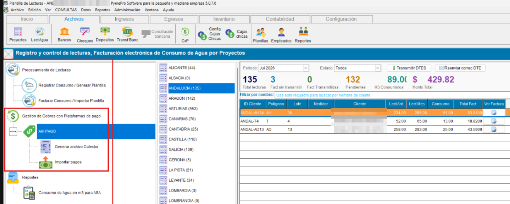
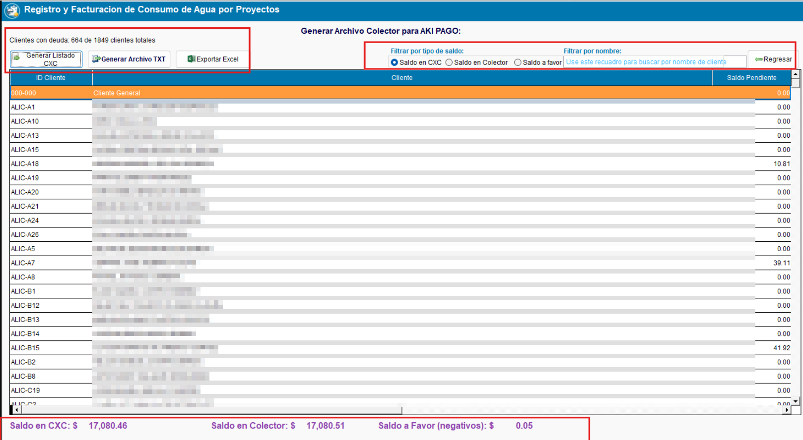
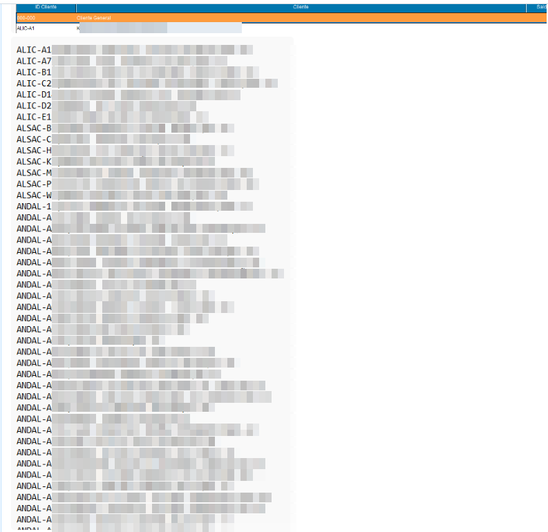
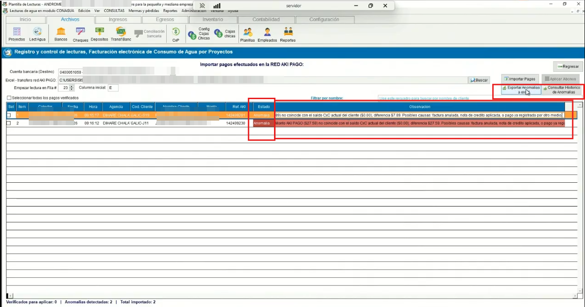
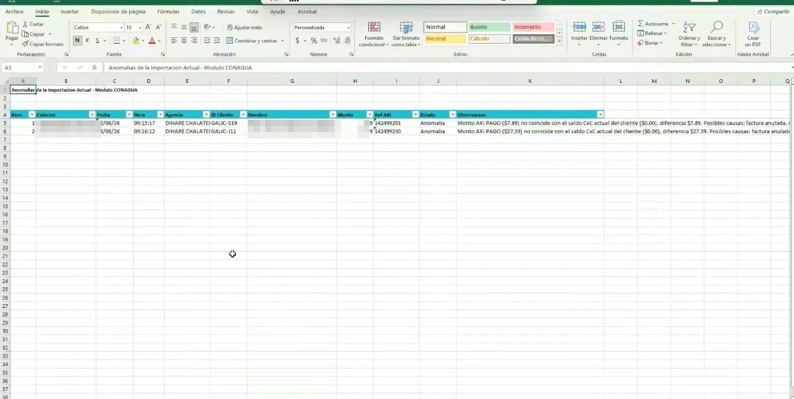
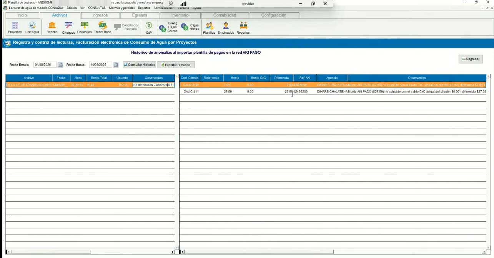

<!---
description: Documentación del módulo/plugin ConAgua para facturación por consumo de agua potable. Activado mediante el parámetro ACTIVATEMODCONAGUA. Issue #566.
--->

# Modulo / Plugin : ConAgua — Facturación por Consumo de Agua

El módulo ConAgua extiende el sistema ContaPortable como módulo independiente con un flujo  para el registro y control de lecturas por consumo de agua, permitiendola generación masiva de facturas electrónicas por proyectos, y envio masivo de correos por entregas de DTE, asi como la gestion de cobros con la plataforma de pago AKI PAGO .

### ACCESO DESDE EL MENU

{ align=center }

### 💳 💵 Gestión de cobros con Plataformas de pago

!!! note "Menu — Gestion de Cobros con Plataformas de Pago"

    !!! note "Generación de Archivo Colector para plataforma AKI PAGO"
        Paso1: Click en generar listado CXC

        Una vez generado se muestran los saldos por cliente en el grid y se podra filtrar por el tipo de saldo y nombre de cliente:

        tipos de saldo:
        1-Saldo en CXC (saldo completo en cxc, considerando la resta de saldo a favor por valores negativos)
        2-Saldo en Colector (corresponde al saldo real de la deuda de los clientes, unicamente saldos > 0 )
        3-Saldo a favor (saldo generado en base a negativos, dependera de la depuracion de la base de datos)

        De esta forma el usuario podra conocer el dato exacto de su cxc y de cuales saldos se incluyeron en el archivo colector para AKI PAGO con la estructura solicitada por la pataforma

        { align=center }

        Archivo Colector.txt con la estructura requerida por la plataforma de Aki Pago
        { align=center }
    
    !!! note "Importar Transacciones aplicadas en la red AKI PAGO"
        Al importarse el sistema valida contra la cxc actual y genera las observaciones y unicamente permitira aplicar los abonos que cuadren contra la cxc

        { align=center }

       -El sistema mostrara las observaciones tras validar contra la cxc actual y determinara cuales abonos esta verificados y listos para aplicarse (se marcaran en color verde, el resto de abonos que no coincidan con el saldo actual en cxc se clasificaran como anamalias y no podran aplicarse estos abonos)

        Podra seleccionar 1 o mas abonos a aplicar, pero si selecciona un abono que contenga anomalia, no podra aplicar ese abono, por lo tanto el usuario debera de revisar y aplicarlo manualmente, ya que solo son permitirdos los abonos que cuadren con la cxc actual

    !!! note "Exportar Anonalias"

        El sistema permite exportar las observaciones / anomalias encontradas a excel, para que los usuarios puedan revisar

        { align=center }

        { align=center }

    !!! note "Historio de Anonalias"

        Los usuarios también podran consultar el historico de anomalias, almacenado en la bitacora del modulo

        { align=center }
