<!---
description: Documentación del módulo/plugin ConAgua para facturación por consumo de agua potable. Activado mediante el parámetro ACTIVATEMODCONAGUA. Issue #566.
--->

# Modulo / Plugin : ConAgua — Facturación por Consumo de Agua

El módulo ConAgua extiende el sistema ContaPortable como módulo independiente con un flujo  para el registro y control de lecturas por consumo de agua, permitiendola generación masiva de facturas electrónicas por proyectos, y envio masivo de correos por entregas de DTE, asi como la gestion de cobros con la plataforma de pago AKI PAGO .

### ACCESO DESDE EL MENU

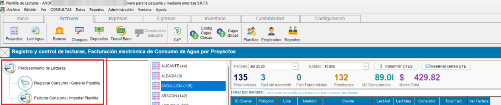{ align=center }

### 🧭💧Procesamiento de lecturas

!!! note "Registro de consumo / Generar Plantilla"

    - Trabajar las lecturas de agua desde el sistema usando la opción borador, permitiendo guardar su progreso 

    - Descargar / generar plantilla en excel (con fórmulas incluidas) para que los usuarios digiten las lecturas y posteriormente se importen al sistema

    El registro se organiza por proyecto y puede buscarse por cliente. Los datos se guardan para facturar posteriormente.
    
    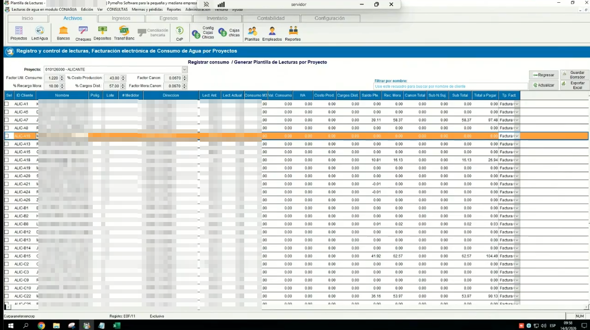{ align=center }

    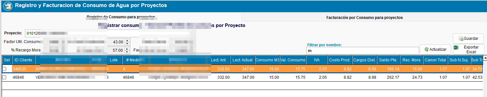{ align=center }

    ###📊 Plantilla Excel con fórmulas

    El sistema genera una plantilla Excel con las fórmulas necesarias para calcular el consumo y los cargos. El cliente puede completar las lecturas en campo y luego importarla al sistema para generar las facturas.

    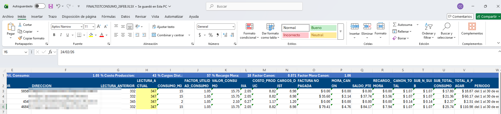{ align=center }

#### 📄 Pestaña 2 — Facturación automática de Consumo / Importar Plantilla

!!! note "Generación de facturas"
    En la segunda pestaña el operador puede:

    - **Importar desde Borrador:** traslada automáticamente las lecturas registradas en la opción de registro de consumo.
    
    - **Importar desde Excel:** carga la plantilla completada externamente.

    Al ejecutar **Convertir a facturas**, el sistema crea todas las facturas automáticamente en estado **Generado**, listas para transmisión masiva posterior. Los registros con consumo igual a cero se omiten — no se generan facturas invalidadas ni generadas para ellos.

    El ítem **Canon** se agrega como **No Sujeto** en el detalle de la factura.

    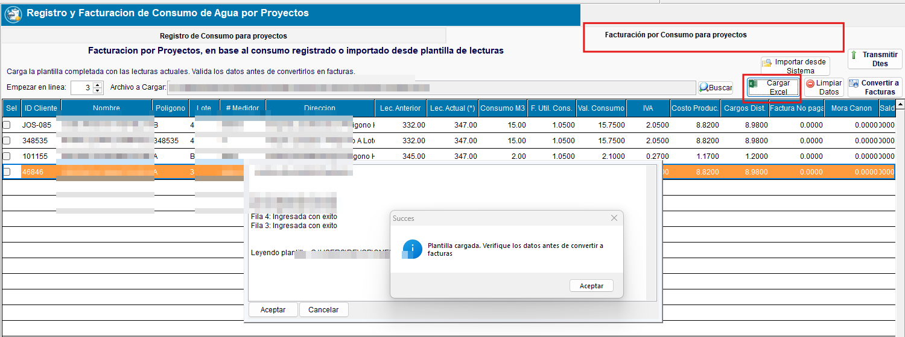{ align=center }

    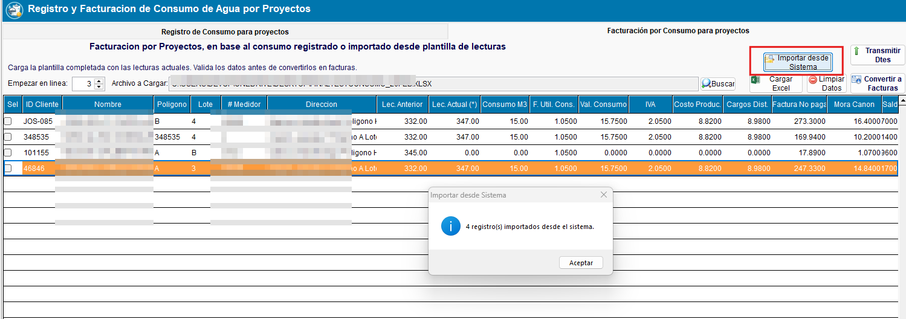{ align=center }

    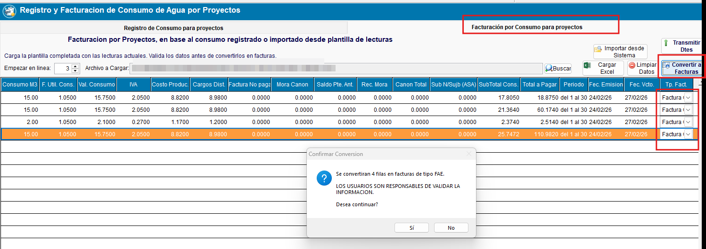{ align=center }

    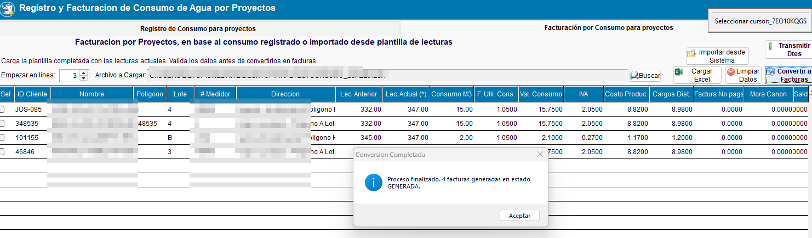{ align=center }

    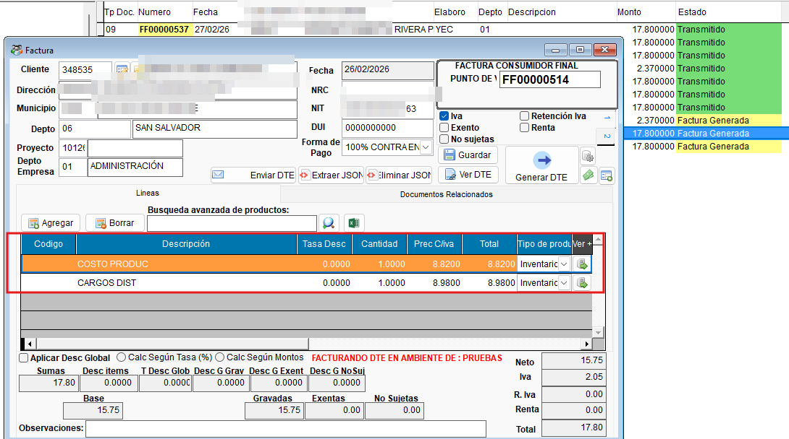{ align=center }

    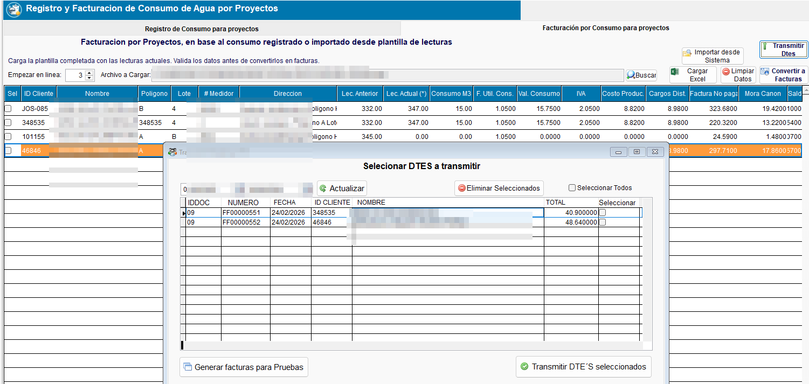{ align=center }

## 🔄 Flujo Funcional

!!! example "Flujo completo de facturación de agua"

    === "1️⃣ Configurar proyecto y clientes"
        1. Ir a Proyectos →  pestaña de control de consumo por proyecto.
        2. En la sección Parámetros de control de consumo por proyecto, configurar factores de utilidad,costo de produccion, costo por distribución, canon, mora y tipo de factura.
        3. Asociar los clientes del proyecto (sin necesidad de duplicar fichas de clientes).
        4. Opcionalmente el sistema permite exportar/importar el listado de clientes ligados al proyecto desde Excel.

    === "2️⃣ Registrar lecturas (Pestaña 1)"
        5. Seleccionar el proyecto a facturar.
        6. Elegir modalidad: registrar el consumo directamente en el sistema o descargar plantilla Excel asignar la lectura segun medidor.
        7. Ingresar la lectura actual de cada cliente o importar plantilla trabajada para calcular el consumo y demas costos.
        8. Guardar las lecturas — quedan disponibles para la pestaña de facturación y para las nuevas exportaciones de plantillas, en donde se corvertira en la lectura anterior.

    === "3️⃣ Generar facturas (Pestaña 2)"
        9. En la Pestaña 2, usar **Importar desde sistema** (traslada lecturas de Pestaña 1) o **Importar desde Excel** (carga plantilla externa).
        10. Revisar los datos de consumo y montos calculados.
        11. Ejecutar **Convertir a facturas**.
        12. El sistema genera las facturas en estado **Generado** — los registros con consumo=0 se omiten automáticamente.
        13. Transmitir las facturas en bloque generadas de forma masiva.

---

## ☑️ Validaciones y Pruebas Realizadas 🧪

!!! example "Tipos de validaciones y pruebas Realizadas"
    ??? example "Configuración de proyectos y registro de lecturas"
        Se validó la configuración de parámetros por proyecto, la asociación de clientes y el registro de lecturas desde sistema.

        - :material-check-circle: Configuración de factores por proyecto: **confirmada**
        - :material-check-circle: Asociación de clientes sin duplicar ficha: **confirmada**
        - :material-check-circle: Registro de lecturas por proyecto: **funcional**

        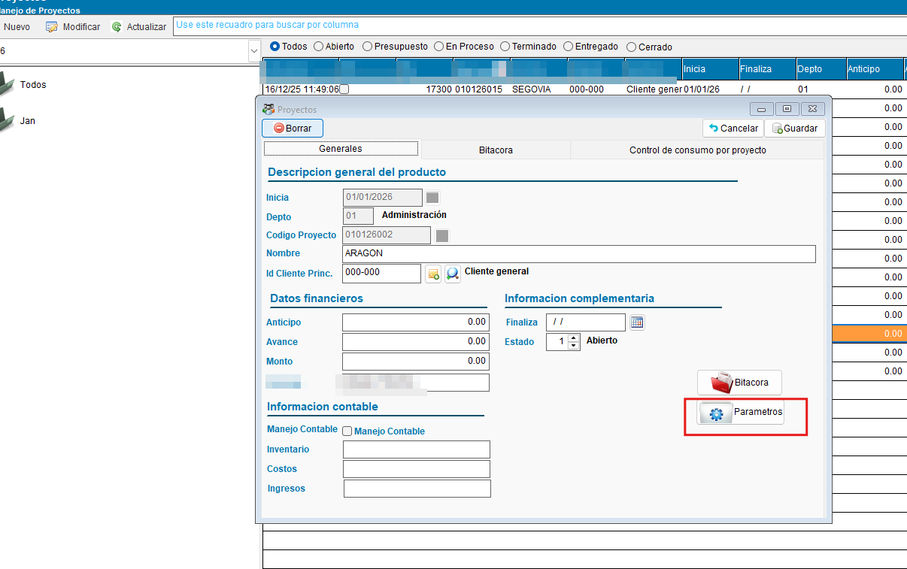{ align=center }

        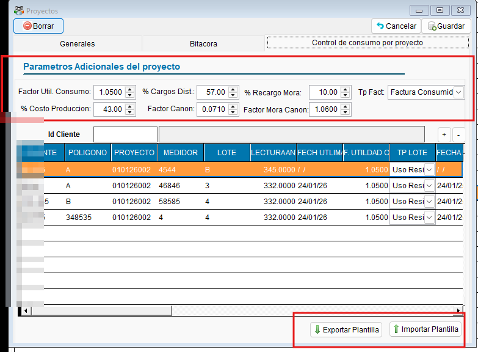{ align=center }

    ??? example "Generación automática de facturas"
        Se validó el flujo completo desde la importación de lecturas hasta la generación de facturas en estado Generado.

        - :material-check-circle: Importación de lecturas desde sistema: **exitosa**
        - :material-check-circle: Conversión a facturas en estado Generado: **confirmada**
        - :material-check-circle: Facturas listas para transmisión masiva: **confirmadas**

        { align=center }

    ??? example "Consumo cero — omisión de factura y Canon como No Sujeto"
        Se confirmó que los registros con consumo igual a cero se omiten al generar facturas automáticas. Adicionalmente, el ítem Canon se agrega como No Sujeto en el detalle de la factura.

        - :material-check-circle: Registros con consumo=0 omitidos al generar facturas: **confirmado en EXE_2026_03_04**
        - :material-check-circle: Canon agregado como ítem No Sujeto en detalle de factura: **confirmado**
        - :material-check-circle: Facturas a cero no generadas (ni invalidadas ni generadas): **confirmado**

        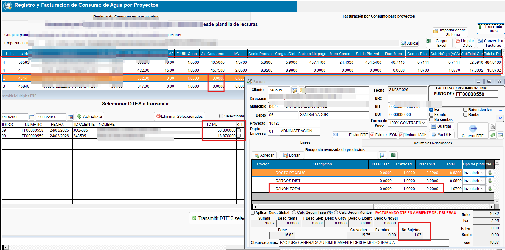{ align=center }

        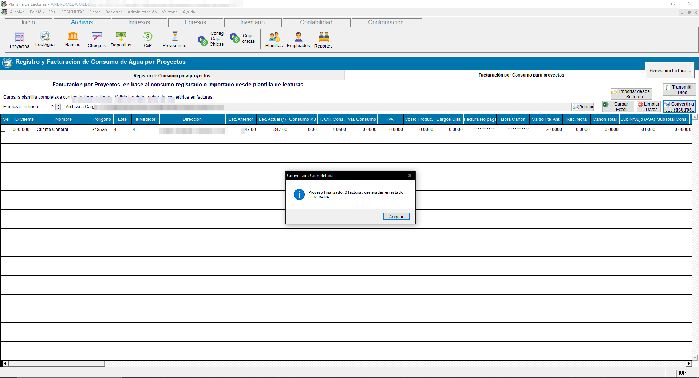{ align=center }

---
