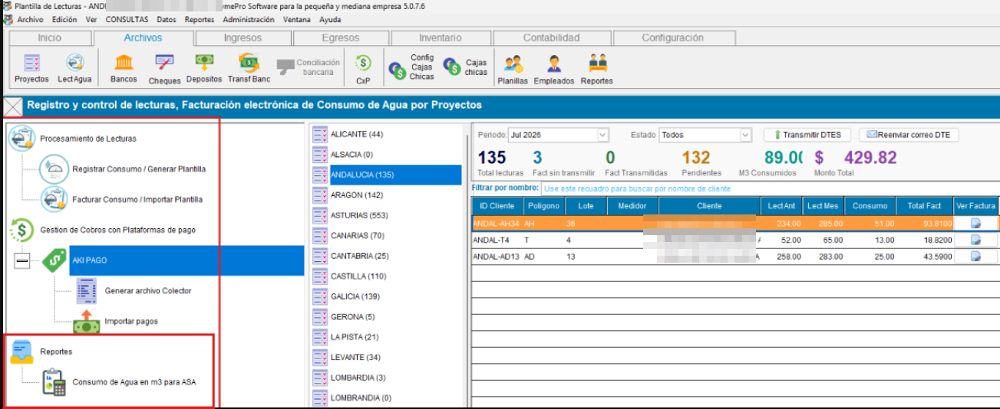
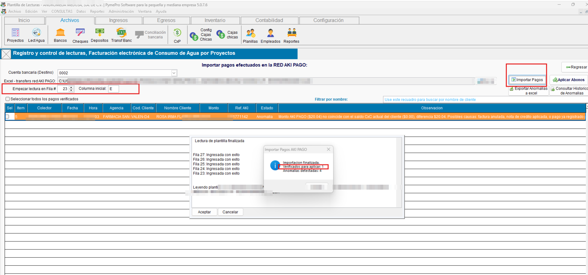

<!---
description: Documentación del módulo/plugin ConAgua para facturación por consumo de agua potable. Activado mediante el parámetro ACTIVATEMODCONAGUA. Issue #566.
--->

# Modulo / Plugin : ConAgua — Facturación por Consumo de Agua

El módulo ConAgua extiende el sistema ContaPortable como módulo independiente con un flujo  para el registro y control de lecturas por consumo de agua, permitiendola generación masiva de facturas electrónicas por proyectos, y envio masivo de correos por entregas de DTE, asi como la gestion de cobros con la plataforma de pago AKI PAGO .

### ACCESO DESDE EL MENU

{ align=center }

### 📈 Reportes

!!! note "Menu — Consumo de agua en M3"

    Al importarse el sistema valida contra la cxc actual y genera las observaciones y unicamente permitira aplicar los abonos que cuadren contra la cxc

    { align=center }

    -El sistema mostrara las observaciones tras validar contra la cxc actual y determinara cuales abonos se puede aplicar

    Podra seleccionar 1 o mas abonos a aplicar, pero si selecciona un abono que contenga anomalia, no podra aplicar ese abono, por lo tanto el usuario debera de revisar y aplicarlo manualmente, ya que solo son permitirdos los abonos que cuadren con la cxc actual 

---
