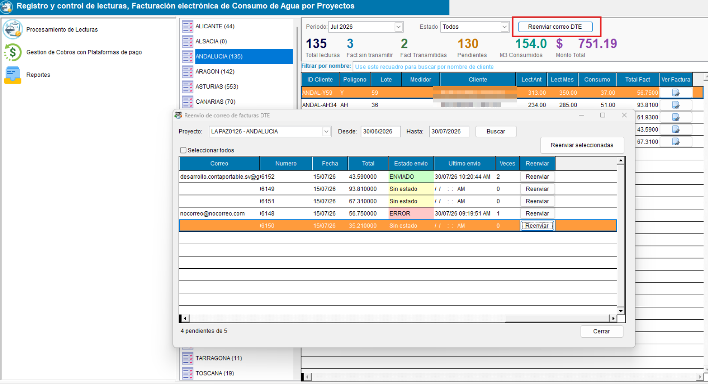

<!---
description: Documentación del módulo/plugin ConAgua para facturación por consumo de agua potable. Activado mediante el parámetro ACTIVATEMODCONAGUA. Issue #566.
--->

# Modulo / Plugin : ConAgua — Facturación por Consumo de Agua

El módulo ConAgua extiende el sistema ContaPortable como módulo independiente con un flujo  para el registro y control de lecturas por consumo de agua, permitiendola generación masiva de facturas electrónicas por proyectos, y envio masivo de correos por entregas de DTE, asi como la gestion de cobros con la plataforma de pago AKI PAGO .

### ACCESO DESDE EL DASBOARD

### ✉️ Envío masivo de emails

!!! note "Desde el Dasboard — Envio de emails"

    Desde el dasboard se podrán enviar los DTE por correo electrónico masivamente 
    Nota: Es importante tener una cuenta de correo institucional, no utilizar una cuenta de correo personal para esta opción debido a que las cuentas gratuitas poseen limites de envios diarios 

    { align=center }

    Si el receptor no tiene correo configurado podrá asignarle un correo para el envío haciendo clic derecho en el registro seleccionado, se habilitará el menú y podrá modificar la columna para definir el correo electrónico

    La opción manejara un log de envio de correo y podra conocer el estado del envió 

!!! note "Desde el Dasboard — Transmitir Facturas generadas"
    Desde el dasboard tambien podra transmitir las facturas generadas para el proyecto seleccionado, y que aun no han sido transmitidas (clasificadas como pendientes)

---
