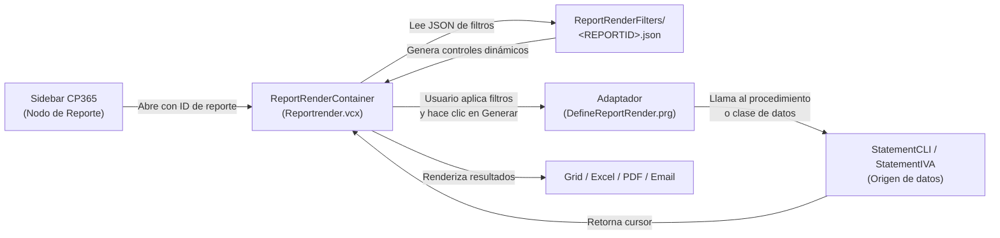

# ReporteadorCP — Motor de Reportería de CP365

## 1. Descripción General

El **ReporteadorCP** es el motor genérico de reportes integrado en CP365. Permite a los usuarios generar, filtrar, exportar y enviar por correo informes de ventas, clientes e IVA, todo desde una interfaz unificada sin necesidad de navegar por múltiples pantallas.

<!-- IMAGEN: Captura general del motor de reportería con el panel de filtros y el grid de resultados visibles -->

---

## 2. Arquitectura del Sistema

El ReporteadorCP sigue una arquitectura basada en configuración JSON, lo que permite agregar nuevos reportes sin modificar el código visual.

### Flujo de trabajo completo

1. El usuario selecciona un reporte desde el **sidebar** de Resumen de Facturas.
2. El sistema carga el archivo JSON del reporte correspondiente desde `REPORTS\ReportRenderFilters\`.
3. Se renderizan dinámicamente los controles de filtro (fechas, combos, checkboxes, rangos de clientes, etc.).
4. El usuario configura los filtros y hace clic en **Generar**.
5. El **adaptador** del reporte mapea los filtros al procedimiento/clase de datos correspondiente.
6. El resultado se muestra en el grid. Desde ahí el usuario puede exportar a Excel, PDF o enviar por correo.

---

## 3. Interfaz del Motor de Reportería

### 3.1 Panel de Filtros

Al abrir un reporte, el sistema muestra los filtros disponibles para ese informe específico. Los filtros son definidos en el JSON de cada reporte y pueden ser de los siguientes tipos:

| Tipo de filtro | Descripción | Ejemplo |
|---|---|---|
| `DATE` | Selector de fecha individual o rango. | Fecha de inicio / Fecha de corte |
| `TEXT` | Campo de texto libre. | Buscar por nombre |
| `COMBO` | Lista desplegable de opciones. | Tipo de documento |
| `CHECK` | Casilla de verificación (Sí / No). | Mostrar anulados |
| `RANGE` | Selector de rango de clientes o artículos. | Clientes del CLI001 al CLI999 |
| `SPINNER` | Valor numérico ajustable. | Número de registros máximo |

<!-- IMAGEN: Captura del panel de filtros de un reporte CLI, con los diferentes tipos de control visibles -->

### 3.2 Grid de Resultados

Una vez generado el reporte, los resultados se muestran en un grid tabular interactivo. El usuario puede:

- **Ordenar** las columnas haciendo clic en el encabezado.
- **Exportar a Excel** con un clic desde la barra de acciones.
- **Generar PDF** para vista previa e impresión.
- **Navegar** entre páginas si el resultado es extenso.

<!-- IMAGEN: Captura del grid de resultados de un reporte con datos de ejemplo y la barra de exportación visible -->

### 3.3 Barra de Acciones del Reporteador

| Botón | Función |
|---|---|
| **Generar** | Ejecuta el reporte con los filtros actuales. |
| **Excel** | Exporta el resultado actual a un archivo `.xlsx`. |
| **PDF** | Genera un PDF del reporte para impresión. |
| **Imprimir** | Envía el reporte directamente a la impresora. |
| **Enviar correo** | Adjunta el reporte y lo envía a uno o varios destinatarios. |
| **Guardar preset** | Guarda la configuración de filtros actual con un nombre. |
| **Cargar preset** | Recupera una configuración de filtros guardada anteriormente. |
| **Volver a filtros** | Regresa al panel de filtros para ajustar los parámetros. |

<!-- IMAGEN: Captura de la barra de acciones del motor de reportería con todos los botones visibles -->

### 3.4 Presets de Filtros

El sistema permite guardar y reutilizar configuraciones de filtros frecuentes. Los presets se almacenan en `REPORTS\ReportPresets\` y son específicos por reporte.

<!-- IMAGEN: Captura del diálogo de presets con una lista de configuraciones guardadas -->

---

## 4. Familias de Reportes

Los reportes están organizados en **familias** identificadas por un prefijo de tres letras. Cada reporte tiene un ID único compuesto por el prefijo de la familia y un sufijo numérico o alfanumérico.

### 4.1 Familia CLI — Reportes de Clientes

Los reportes de la familia **CLI** proporcionan información sobre los movimientos de clientes, facturación, cobros y estados de cuenta.

<!-- IMAGEN: Captura del nodo CLI en el sidebar con todos los reportes de la familia listados -->

| ID | Nombre del Reporte | Descripción |
|---|---|---|
| `CLI11` | Movimientos por cliente | Detalle de todos los movimientos (facturas, abonos, notas) de uno o varios clientes en un período. |
| `CLI12` | Facturas pendientes por cliente | Listado de facturas con saldo pendiente de cobro a una fecha de corte. |
| `CLI13` | Facturas por cliente | Historial de facturas emitidas a uno o varios clientes en un rango de fechas. |
| `CLI14` | Cobros por cliente y departamento | Resumen de cobros agrupados por cliente y departamento geográfico. |
| `CLI16` | Cobros por cliente y departamento (variante) | Variante del CLI14 con opciones de filtrado adicionales por afiliación. |
| `CLI17` | Listado de facturas emitidas | Listado general de todos los documentos emitidos con filtros por tipo, fecha y cliente. |
| `CLI18` | Listado de facturas con retención | Variante del CLI17 que incluye documentos con retención de IVA. |
| `CLI19` | Facturas pendientes (variante cobro) | Versión alternativa de pendientes enfocada en gestión de cobros. |
| `CLI1A` | Avisos de cobro | Generación y envío masivo de avisos de cobro a clientes con saldo pendiente. |
| `CLI1B` | (Reservado) | — |
| `CLI1C` | (Reservado) | — |
| `CLI1D` | (Reservado) | — |
| `CLI1E` | (Reservado) | — |
| `CLI1F` | (Reservado) | — |
| `CLI1G` | Documentos emitidos con forma de pago | Listado de documentos agrupados por forma de pago registrada. |
| `CLI1H` | Gestión y envío de avisos de cobro | Interfaz completa para gestión y envío masivo de avisos de cobro por email. Consulte: [CLI1H.md](../../Reports/categorias/CLI1H.md) |
| `CLI1I` | (Reservado) | — |
| `CLI21` | Estado de cuenta por cliente | Estado de cuenta completo con saldos iniciales, movimientos y saldo final. |
| `CLI22` – `CLI26` | Variantes de estado de cuenta | Versiones alternativas del estado de cuenta con diferentes agrupaciones. |
| `CLI31` – `CLI35` | Análisis de cartera | Reportes de antigüedad de saldos y análisis de cartera vencida. |
| `CLI41` | Resumen de ventas por cliente | Resumen consolidado de ventas agrupado por cliente. |
| `CLI51` – `CLI52` | Ventas por artículo | Cruce de ventas con el detalle de artículos vendidos por cliente. |
| `CLI61` – `CLI63` | Comisiones y métricas | Reportes de comisiones de vendedores y métricas de desempeño comercial. |

<!-- IMAGEN: Captura del reporte CLI11 (Movimientos por cliente) con datos de ejemplo en el grid -->

<!-- IMAGEN: Captura del reporte CLI12 (Facturas pendientes) mostrando los filtros de fecha de corte -->

---

### 4.2 Familia IVA — Reportes de Impuestos

Los reportes de la familia **IVA** son esenciales para la declaración tributaria mensual. Incluyen los libros de ventas y compras, liquidaciones y resúmenes requeridos por el Ministerio de Hacienda.

<!-- IMAGEN: Captura del nodo IVA en el sidebar con los reportes de la familia listados -->

| ID | Nombre del Reporte | Descripción |
|---|---|---|
| `IVA11` | Libro de ventas consumidor final | Registro de ventas a consumidores finales (facturas sin NRC). |
| `IVA12` | Libro de ventas contribuyentes | Registro de ventas a contribuyentes (CCF con NRC). |
| `IVA13` | Libro de compras | Registro de compras con crédito fiscal recibido. |
| `IVA14` | Resumen de IVA | Cuadro resumen mensual de débitos y créditos fiscales. |
| `IVA15` | Liquidación de IVA | Liquidación del período (F07 / F11 / F14). |
| `IVA41` – `IVA43` | Ventas por tipo de documento | Desglose de ventas clasificadas por tipo de documento tributario. |
| `IVA51` – `IVA53` | Compras por proveedor | Detalle de compras agrupadas por proveedor y tipo de documento. |
| `IVA61` – `IVA63` | Retenciones y percepciones | Reportes de retenciones de IVA y renta aplicadas o recibidas. |
| `IVA71` – `IVA72` | Exportaciones e importaciones | Registro de operaciones de comercio exterior. |

<!-- IMAGEN: Captura del reporte IVA11 (Libro de Ventas – Consumidor Final) con datos del período -->

<!-- IMAGEN: Captura del reporte IVA14 (Resumen de IVA) mostrando el cuadro de débitos y créditos -->

---

## 5. Navegación Relacionada

| Sección | Referencia |
|---|---|
| Panel Central de CP365 | [ResumenFacturas.md](ResumenFacturas.md) |
| Gestión y envío de avisos de cobro (CLI1H) | [CLI1H.md](../../Reports/categorias/CLI1H.md) |
| Introducción a CP365 | [Introduccion_CP365.md](Introduccion_CP365.md) |
| Reportes de Clientes | [clientes.md](../../Reports/categorias/clientes.md) |
| Reportes de Impuestos | [impuestos.md](../../Reports/categorias/impuestos.md) |

> :material-code-braces: **¿Es desarrollador?** Consulte la [Referencia Técnica del ReporteadorCP](ReporteadorCP_Desarrollador.md) para conocer la arquitectura interna, estructura de JSONs, clases, procedimientos y cómo agregar nuevos reportes.
