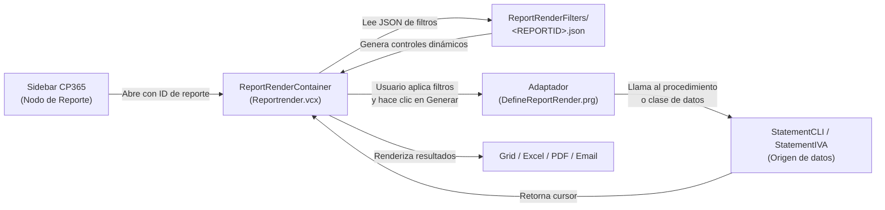

# ReporteadorCP — Referencia Técnica para Desarrolladores

> **Documentación orientada a usuario final:** Si busca la guía de uso del motor de reportería (filtros, exportación, familias de reportes), consulte **[ReporteadorCP.md](ReporteadorCP.md)** en la rama `main`.

---

## 1. Arquitectura del Sistema

El ReporteadorCP sigue una arquitectura basada en configuración JSON, lo que permite agregar nuevos reportes sin modificar el código visual.

| Componente | Archivo | Rol |
|---|---|---|
| **Clase visual** | `LIB1.0\Reportrender.vcx` (`ReportRenderContainer`) | Renderiza la UI de filtros, el grid de resultados y las opciones de exportación. |
| **Motor de configuración** | `LIB1.0\DefineReportRender.prg` | Define los filtros de cada reporte mediante archivos JSON y conecta cada reporte con su adaptador de datos. |

> **Fuentes técnicas de referencia:**
>
> - `LIB1.0\Reportrender.vc2` — Código fuente de las clases visuales.
> - `LIB1.0\Definereportrender.prg` — Procedimientos de configuración, adaptadores y utilidades.



### Flujo de trabajo completo

1. El usuario selecciona un reporte desde el **sidebar** de Resumen de Facturas.
2. El sistema carga el archivo JSON del reporte correspondiente desde `REPORTS\ReportRenderFilters\`.
3. Se renderizan dinámicamente los controles de filtro (fechas, combos, checkboxes, rangos de clientes, etc.).
4. El usuario configura los filtros y hace clic en **Generar**.
5. El **adaptador** del reporte mapea los filtros al procedimiento/clase de datos correspondiente.
6. El resultado se muestra en el grid. Desde ahí el usuario puede exportar a Excel, PDF o enviar por correo.

---

## 2. Estructura de un JSON de Reporte

Cada reporte está definido por un archivo JSON ubicado en `REPORTS\ReportRenderFilters\`. El JSON tiene la siguiente estructura:

```json
{
  "reportId": "CLI11",
  "title": "Movimientos por cliente",
  "adapter": "RR_StatementCLI_Generic",
  "procedure": "CLI11MovimientosPorCliente",
  "procedureClass": "StatementCLI",
  "takesClientList": true,
  "resultCursor": "CLI11",
  "filters": [
    {
      "name": "fechaInicio",
      "caption": "Fecha inicio",
      "type": "DATE",
      "defval": "=DATE()",
      "row": 1,
      "col": 1
    },
    {
      "name": "fechaFin",
      "caption": "Fecha fin",
      "type": "DATE",
      "defval": "=DATE()",
      "row": 1,
      "col": 2
    },
    {
      "name": "clientes",
      "caption": "Clientes a mostrar",
      "type": "RANGE",
      "defval": "",
      "argOrder": 1,
      "argSource": "clientlist:clientes",
      "row": 2,
      "col": 1
    }
  ]
}
```

### Campos del JSON

| Campo | Tipo | Descripción |
|---|---|---|
| `reportId` | String | ID único del reporte (ej: `CLI11`). Debe coincidir con el nombre del archivo JSON. |
| `title` | String | Título del reporte mostrado en la interfaz. |
| `adapter` | String | Nombre del procedimiento adaptador en `DefineReportRender.prg`. |
| `procedure` | String | Nombre del procedimiento de datos en la clase de negocio. |
| `procedureClass` | String | Nombre de la clase que contiene el procedimiento (`StatementCLI`, `StatementIVA`, etc.). |
| `takesClientList` | Boolean | Si `true`, el reporte acepta un rango o lista de clientes como filtro. |
| `resultCursor` | String | Alias del cursor que retorna el adaptador con los datos. |
| `filters` | Array | Lista de controles de filtro a renderizar dinámicamente. |

### Campos de un Filtro Individual

| Campo | Tipo | Descripción |
|---|---|---|
| `name` | String | Nombre interno del filtro (sin espacios). |
| `caption` | String | Etiqueta visible en la interfaz. |
| `type` | String | Tipo de control: `DATE`, `TEXT`, `COMBO`, `CHECK`, `RANGE`, `SPINNER`. |
| `defval` | String | Valor por defecto. Puede ser una expresión VFP precedida de `=`. |
| `items` | String | Opciones para el tipo `COMBO`, separadas por coma. |
| `row` / `col` | Number | Posición del control en la grilla de filtros (fila y columna). |
| `argOrder` | Number | Orden del argumento al llamar al procedimiento de datos. |
| `argSource` | String | Fuente del valor: `filter:nombre`, `clientlist:campo`, etc. |

---

## 3. Clases Principales del Motor (`Reportrender.vcx`)

| Clase | Tipo Base | Descripción |
|---|---|---|
| `ReportRenderContainer` | `Container` | Contenedor principal del motor. Renderiza filtros y resultados. |
| `ReportRenderPresets` | `Form` | Formulario de gestión de presets guardados. |
| `AvisoCobroEmailHostForm` | `Form` | Formulario host para el módulo de avisos de cobro (CLI1H). |

---

## 4. Procedimientos Clave en `DefineReportRender.prg`

| Procedimiento | Descripción |
|---|---|
| `RR_EnsureCLIFilters()` | Genera / actualiza todos los JSON de la familia CLI en disco. |
| `RR_EnsureIVAFilters()` | Genera / actualiza todos los JSON de la familia IVA en disco. |
| `RR_EnsureFilterJsonExists(tcReportId)` | Verifica que el JSON de un reporte exista; lo crea si falta. |
| `RR_MakeFiltersJson(...)` | Ensambla el JSON completo de un reporte. |
| `RR_FJ(...)` | Construye un fragmento JSON para un filtro individual. |
| `RR_WriteJsonIfChanged(tcFile, tcJson)` | Escribe el JSON en disco solo si el contenido cambió (usa checksum). |
| `RR_JsonNeedsRefresh(tcReportId, tcNewJson)` | Compara el JSON en disco con el nuevo para detectar cambios. |
| `RR_BackupObsoleteJson(tcReportId)` | Respalda el JSON actual antes de sobreescribirlo. |
| `RR_GetFilterFolder()` | Retorna la ruta a `REPORTS\ReportRenderFilters\`. |
| `RR_GetPresetFolder()` | Retorna la ruta a `REPORTS\ReportPresets\`. |
| `RR_VerifyJsonCatalog()` | Verifica la integridad de todos los JSON del catálogo (CLI + IVA). |
| `RR_Log(tcMsg)` | Escribe una línea en el log `REPORTS\ReportRender_log.txt`. |

---

## 5. Log del Motor

El motor escribe un archivo de log en:

```
REPORTS\ReportRender_log.txt
```

Cada línea tiene el formato:

```
MM/DD/YYYY HH:MM:SS | [Mensaje de diagnóstico]
```

Este log es útil para diagnosticar problemas de rutas, JSON inválidos o errores en adaptadores.

---

## 6. Cómo agregar un nuevo reporte

1. **Crear el JSON de filtros** en `REPORTS\ReportRenderFilters\` con el nuevo ID (ej: `CLI1J.json`).
2. **Agregar el ID al catálogo canónico** en la función `RR_GetCanonicalFamilyIds("CLI")` dentro de `DefineReportRender.prg`.
3. **Crear el procedimiento adaptador** en `DefineReportRender.prg` (ej: `RR_CLI1J_Adapter`) o usar `RR_StatementCLI_Generic` si aplica.
4. **Implementar el procedimiento de datos** en la clase `StatementCLI` (o equivalente).
5. **Registrar el acceso en el sidebar** de `ResumenFacturas.sc2` para que aparezca en el árbol de reportes.
6. **Ejecutar `RR_VerifyJsonCatalog()`** para validar que todo el catálogo esté íntegro.

---

## 7. Administración del Log y Verificación

El administrador o desarrollador puede ejecutar la verificación del catálogo de JSONs desde la consola de VFP:

```foxpro
DO LIB1.0\DefineReportRender.prg
=RR_VerifyJsonCatalog()
```

El resultado se escribe en `REPORTS\ReportRender_verification.log` y en el log principal. El resumen indica:

- **esperados:** Número de reportes en el catálogo canónico.
- **archivos:** Número de archivos JSON encontrados en disco.
- **faltantes:** Reportes en el catálogo sin JSON correspondiente.
- **extra:** Archivos JSON en disco que no están en el catálogo canónico.
- **invalidos:** JSONs que no pueden ser parseados correctamente.
- **procedureIssues:** Procedimientos de datos referenciados que no se encontraron en el fuente.

---

## 8. Navegación Relacionada

| Sección | Referencia |
|---|---|
| Motor de Reportería (Guía de usuario) | [ReporteadorCP.md](ReporteadorCP.md) |
| Panel Central de CP365 | [ResumenFacturas.md](ResumenFacturas.md) |
| Gestión y envío de avisos de cobro (CLI1H) | [CLI1H.md](../../Reports/categorias/CLI1H.md) |
| Introducción a CP365 | [Introduccion_CP365.md](Introduccion_CP365.md) |
| Reportes de Clientes | [clientes.md](../../Reports/categorias/clientes.md) |
| Reportes de Impuestos | [impuestos.md](../../Reports/categorias/impuestos.md) |
