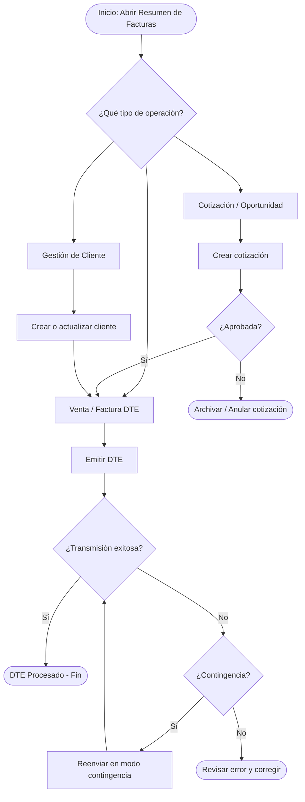

# Resumen de Facturas — Panel Central de CP365

## 1. Objetivo y Visión General

En la nueva versión **CP365**, el módulo **Resumen de Facturas** evoluciona de ser un simple emisor de DTEs a convertirse en el **Panel Central (Dashboard)** de navegación de toda la aplicación. A través de su barra lateral (sidebar) interactiva, los usuarios pueden desplazarse entre los diferentes módulos del ContaPortable sin necesidad de navegar por menús tradicionales desplegables.

Desde aquí se gestionan documentos de venta, comprobantes electrónicos (DTE), cotizaciones/oportunidades, reportes de IVA y de Clientes, la estructura operativa jerárquica (establecimientos y puntos de venta), el catálogo de clientes y la configuración general del módulo de ventas.

> **Archivo fuente principal:** `ResumenFacturas.sc2`

<!-- IMAGEN: Captura de pantalla de la vista general del módulo Resumen de Facturas, mostrando el sidebar, el grid principal y la barra de acciones -->

---

## 2. Estructura de la Interfaz

El formulario está compuesto por tres áreas funcionales:

| Área | Descripción |
|---|---|
| **Barra Lateral (Sidebar)** | Árbol de navegación jerárquico con todos los nodos disponibles. |
| **Listado Principal (Grid)** | Muestra los registros correspondientes al nodo seleccionado. |
| **Barra de Acciones** | Botones contextuales superiores e inferiores para operar sobre los registros. |

<!-- IMAGEN: Diagrama o captura anotada que muestre las tres áreas de la interfaz -->

---

## 3. Sidebar: Árbol de Navegación Lateral

El sidebar es el corazón de la navegación en CP365. Está organizado en secciones principales. Al hacer clic en cada nodo, el grid central carga los registros correspondientes y la barra de acciones ajusta sus botones al contexto.

<!-- IMAGEN: Captura del sidebar completo con todos los nodos visibles y expandidos -->

### 3.1 Dashboard

El nodo **Dashboard** es la pantalla de inicio del módulo. Muestra un resumen visual con indicadores clave del período actual:

- Totales de ventas del día, semana y mes.
- Número de DTEs emitidos y pendientes de transmisión.
- Alertas de documentos rechazados o con errores.
- Accesos directos a las secciones más utilizadas.

<!-- IMAGEN: Captura del dashboard con los indicadores clave de ventas -->

> **Nota:** Los indicadores del dashboard se actualizan automáticamente al abrir el formulario. El usuario puede refrescarlos desde el botón de actualización en la barra de acciones.

---

### 3.2 Oportunidades (Cotizaciones)

Esta sección gestiona el ciclo preventa. Las **oportunidades** son documentos de cotización que pueden convertirse en facturas o ventas definitivas.

<!-- IMAGEN: Captura del listado de oportunidades/cotizaciones con sus columnas de estado -->

#### ¿Qué puede hacer el usuario?

1. **Nueva cotización:** Crear una propuesta comercial para un cliente.
2. **Editar cotización:** Modificar precio, cantidad o condiciones de una cotización existente.
3. **Convertir a Venta/DTE:** Transformar la cotización aprobada en un documento de venta formal.
4. **Copiar documento:** Duplicar una cotización para agilizar una nueva.
5. **Anular cotización:** Marcar una cotización como cancelada sin eliminarla.
6. **Enviar por correo:** Enviar la cotización al cliente directamente desde el sistema.

<!-- IMAGEN: Captura del formulario de creación/edición de cotización -->

#### Columnas del listado

| Columna | Descripción |
|---|---|
| Número | Correlativo interno de la cotización. |
| Fecha | Fecha de emisión. |
| Cliente | Nombre y código del cliente. |
| Monto | Total de la cotización. |
| Estado | Pendiente / Convertida / Anulada. |

---

### 3.3 Ventas

La sección de **Ventas** es el núcleo operativo del módulo. Desde aquí se emiten y consultan los documentos de venta, incluyendo Facturas DTE, Notas de Crédito, Notas de Débito y otros documentos tributarios.

<!-- IMAGEN: Captura del listado de ventas/facturas con columnas de estado DTE -->

#### ¿Qué puede hacer el usuario?

1. **Nueva Venta:** Generar un documento de venta estándar o DTE electrónico.
2. **Nueva Factura DTE:** Emitir un Comprobante de Transmisión Electrónica ante el Ministerio de Hacienda.
3. **Ver detalle de transmisión:** Consultar el estado de un DTE (Procesado, Rechazado, Contingencia).
4. **Anular DTE:** Solicitar la invalidación de un comprobante ante el MH.
5. **Copiar documento:** Duplicar una factura existente para agilizar el registro de un nuevo documento similar.
6. **Enviar por correo:** Reenviar el DTE en PDF al cliente desde el sistema.
7. **Ver contactos:** Acceder a los datos de contacto del cliente asociado al documento.

<!-- IMAGEN: Captura del formulario de emisión de factura DTE con los campos principales -->

#### Columnas del listado de Ventas

| Columna | Descripción |
|---|---|
| Número | Correlativo del documento. |
| Tipo Doc. | Tipo de documento (Factura, CCF, Nota de Crédito, etc.). |
| Fecha | Fecha de emisión. |
| Cliente | Nombre del cliente receptor. |
| Monto | Total del documento. |
| Estado DTE | Estado de transmisión: Procesado / Rechazado / Contingencia / Pendiente. |
| Código de Generación | UUID del DTE emitido (cuando aplica). |

<!-- IMAGEN: Captura del visor de estado de transmisión de un DTE, mostrando el código de generación y sello de recepción -->

---

### 3.4 Establecimientos y Puntos de Venta

Esta sección del sidebar permite administrar la estructura operativa de la empresa, que es **indispensable** para la emisión de DTEs. Aquí se crean y mantienen los establecimientos (sucursales) y sus puntos de venta asociados.

> El formulario de mantenimiento se llama `SucursalPV.sc2`.

<!-- IMAGEN: Captura del árbol de establecimientos y puntos de venta en el sidebar -->

#### ¿Qué puede hacer el usuario?

1. Crear un nuevo establecimiento.
2. Crear un nuevo punto de venta vinculado a un establecimiento existente.
3. Consultar la información de un establecimiento o punto de venta.
4. Modificar establecimientos o puntos de venta registrados.
5. Asignar o retirar encargados a un punto de venta.

Para más detalles sobre el formulario de administración, consulte la sección **[4. Administración de Sucursales y Puntos de Venta](#4-administración-de-sucursales-y-puntos-de-venta)** de este mismo documento.

---

### 3.5 Clientes

La sección de **Clientes** permite gestionar el catálogo completo de clientes de la empresa directamente desde el panel central de ventas.

<!-- IMAGEN: Captura del listado de clientes con sus datos principales -->

#### ¿Qué puede hacer el usuario?

1. **Nuevo cliente:** Registrar un cliente con todos sus datos fiscales (NIT, NRC, razón social, dirección, etc.).
2. **Editar cliente:** Actualizar información de contacto, dirección o datos fiscales.
3. **Ver historial:** Consultar el historial de facturas emitidas a un cliente.
4. **Gestionar contactos:** Agregar o editar los contactos asociados a una empresa cliente.
5. **Buscar cliente:** Filtrar el listado por nombre, código, NIT o NRC.

<!-- IMAGEN: Captura del formulario de cliente con sus pestañas (Datos Generales, Contactos, Historial) -->

#### Campos principales del catálogo de clientes

| Campo | Descripción |
|---|---|
| Código | Identificador interno del cliente. |
| Nombre / Razón Social | Nombre legal del cliente. |
| NIT | Número de Identificación Tributaria. |
| NRC | Número de Registro de Contribuyente (para CCF). |
| Giro | Actividad económica del cliente. |
| Dirección | Dirección fiscal registrada. |
| Departamento / Municipio | Ubicación geográfica. |
| Email | Correo para envío de DTE y cotizaciones. |

---

### 3.6 Reportes

La sección de **Reportes** del sidebar da acceso al motor de reportería de CP365, que agrupa informes de clientes (familia `CLI`) e informes de IVA (familia `IVA`).

> **Documentación completa del sistema de reportes:** [ReporteadorCP.md](ReporteadorCP.md)

<!-- IMAGEN: Captura de los nodos de Reportes en el sidebar, mostrando las familias CLI e IVA desplegadas -->

#### Familias de reportes disponibles

| Familia | Prefijo | Descripción |
|---|---|---|
| **Clientes** | `CLI` | Movimientos, facturas pendientes, cobros, listados de facturas emitidas, avisos de cobro, etc. |
| **IVA** | `IVA` | Libro de ventas, compras, liquidaciones, resúmenes de impuestos, etc. |

Al seleccionar un reporte del sidebar, el sistema abre el **Motor de Reportería (`ReportRenderContainer`)** que renderiza los filtros definidos en su archivo JSON correspondiente y permite:

- Generar el reporte en pantalla (grid).
- Exportar a Excel.
- Generar PDF para impresión.
- Enviar por correo electrónico (según el tipo de reporte).
- Guardar y cargar presets de filtros.

<!-- IMAGEN: Captura del motor de reportería con los filtros de un reporte de la familia CLI -->

Para la referencia técnica completa del motor de reportes, incluyendo la arquitectura JSON, los adaptadores y la clase `ReportRenderContainer`, consulte: **[ReporteadorCP.md](ReporteadorCP.md)**

---

### 3.7 Configuración

La sección de **Configuración** del sidebar agrupa los parámetros y opciones que controlan el comportamiento del módulo de ventas en CP365.

<!-- IMAGEN: Captura del nodo de Configuración en el sidebar con sus sub-opciones -->

#### Opciones de configuración disponibles

##### Configuración de Correo Electrónico

Permite definir el proveedor de email para el envío de DTEs, cotizaciones y avisos de cobro. Soporta múltiples proveedores SMTP.

<!-- IMAGEN: Captura del formulario de configuración de email con los campos SMTP -->

- Servidor SMTP / Puerto.
- Credenciales (usuario y contraseña / OAuth2).
- Correo remitente y nombre del emisor.
- Prueba de conexión integrada.

> Para más detalles sobre esta configuración, consulte: [Configurar Email para envío de DTE o cotización](../../facturacion/configMultiProvEmail.md)

##### Parámetros de Facturación

Configuración de los parámetros generales que afectan la emisión de documentos de venta:

- Tipo de documento por defecto.
- Condiciones de pago predeterminadas.
- Activar/desactivar campos opcionales en el formulario de venta.
- Configuración de la secuencia de generación de DTEs.

<!-- IMAGEN: Captura del formulario de parámetros de facturación -->

##### Configuración de Transmisión DTE

Opciones relacionadas con la comunicación con el Ministerio de Hacienda (MH) para la emisión electrónica:

- Ambiente (Pruebas / Producción).
- Certificado digital.
- Modo de contingencia.
- Tiempo de espera para respuesta del MH.

<!-- IMAGEN: Captura de la configuración de transmisión DTE -->

---

## 4. Administración de Sucursales y Puntos de Venta

En CP365, la configuración de la estructura operativa es indispensable para la emisión de DTEs. Cada DTE debe asociarse a un establecimiento y punto de venta registrado y activo.

El árbol de ventas del sidebar muestra la jerarquía de establecimientos y puntos de venta. Desde allí se puede acceder al formulario de mantenimiento `SucursalPV.sc2`.

<!-- IMAGEN: Captura del formulario SucursalPV con la pestaña de Establecimiento abierta -->

### 4.1 Crear un nuevo establecimiento

1. En la barra lateral, seleccione el nodo raíz de **Ventas** o **Establecimientos**.
2. Haga clic en el botón **Nuevo establecimiento** en la barra de acciones (o clic derecho sobre el nodo).
3. Confirme el mensaje de creación.
4. El sistema abrirá el formulario `SucursalPV` en la pestaña **Establecimiento**.
5. Complete los datos obligatorios:

| Campo | Descripción | Ejemplo |
|---|---|---|
| Código | 4 caracteres, identificador único | `M001` |
| Nombre | Nombre comercial del establecimiento | `Sucursal Central` |
| Dirección | Dirección física | `Calle Principal #15` |
| Tipo de establecimiento DTE | Según catálogo del MH | `01 – Sucursal` |
| Departamento | Departamento donde opera | `San Salvador` |
| Municipio | Municipio donde opera | `San Salvador` |

6. Presione **Guardar**.

<!-- IMAGEN: Captura del formulario con los campos del establecimiento completos antes de guardar -->

### 4.2 Crear un nuevo punto de venta

1. Expanda el establecimiento en el árbol lateral y seleccione la opción **Nuevo punto de venta** (o use el menú contextual).
2. El formulario se abrirá en la pestaña **PV**.
3. Complete los datos:

| Campo | Descripción | Ejemplo |
|---|---|---|
| Código | Identificador del PV | `P001` |
| Nombre | Nombre del punto de venta | `Caja 1` |
| Encargado | Usuario responsable del PV (obligatorio) | `Vendedor01` |

4. Asegúrese de **asignar al menos un encargado** desde la lista de usuarios disponibles.
5. Presione **Guardar**.

<!-- IMAGEN: Captura del formulario PV con el campo de encargado asignado -->

### 4.3 Sincronización Automática

Al inicializar **Resumen de Facturas**, el sistema compara la tabla `AutoCorrel` con `SucursalPV`. Si detecta registros preexistentes de versiones anteriores (ContaPortable tradicional), los agrega automáticamente al árbol para facilitar la transición a CP365.

<!-- IMAGEN: Mensaje o log de sincronización automática detectado al abrir el módulo -->

### Requisitos previos

- El usuario debe tener acceso al módulo de ventas y a la configuración de sucursales / puntos de venta.
- Deben existir catálogos activos de departamentos, municipios, tipos de establecimiento y usuarios.

---

## 5. Acciones Disponibles en la Barra de Herramientas

La barra de acciones contextual cambia según el nodo seleccionado en el sidebar. A continuación se describen las acciones más comunes:

<!-- IMAGEN: Captura de la barra de acciones con todos los botones visibles, en el contexto del nodo Ventas -->

| Botón / Acción | Contexto | Descripción |
|---|---|---|
| **Nuevo** | Ventas / Cotizaciones / Clientes | Crea un nuevo documento o registro. |
| **Editar / Modificar** | Todos los nodos | Abre el formulario de edición del registro seleccionado. |
| **Anular** | Ventas / DTEs | Inicia el proceso de anulación o invalidación del documento. |
| **Copiar** | Ventas / Cotizaciones | Duplica el documento seleccionado. |
| **Ver estado DTE** | Ventas DTE | Muestra el estado de transmisión ante el MH. |
| **Enviar correo** | Ventas / Cotizaciones | Envía el documento por email al cliente. |
| **Ver contactos** | Ventas / Clientes | Muestra los contactos registrados del cliente. |
| **Actualizar** | Dashboard | Refresca los indicadores del panel principal. |
| **Exportar** | Reportes | Exporta el resultado del reporte a Excel o PDF. |

---

## 6. Flujo General de Trabajo

El siguiente diagrama muestra el flujo estándar de un documento desde su creación hasta la transmisión DTE:

---

## 7. Navegación Relacionada

| Sección | Referencia |
|---|---|
| Motor de Reportería (CLI / IVA) | [ReporteadorCP.md](ReporteadorCP.md) |
| Introducción a CP365 | [Introduccion_CP365.md](Introduccion_CP365.md) |
| Migración de Datos | [TBDataMigrate.md](TBDataMigrate.md) |
| Gestión de CXC | [Gestión de Cuentas por Cobrar](../../facturacion/gestion_cuentas_por_cobrar.md) |
| Configurar Email | [configMultiProvEmail.md](../../facturacion/configMultiProvEmail.md) |
| Parámetros de Facturación | [ParametrosEnFacturacion.md](../../../Parametros/Modulos/Facturación/ParametrosEnFacturacion.md) |
