<!---
description: Documentación del formulario para instalación y actualización autónoma de módulos y plugins de ContaPortable, entregados como compilados .app. Issue #652.
--->

# Instalador de Módulos y Plugins

El sistema ContaPortable incorpora un formulario dedicado para instalar o actualizar módulos y plugins de forma autónoma.
Los módulos se entregan como comprimidos `.zip` y el instalador gestiona automáticamente si es nueva instalación o actualización.

---

## 📌 Introducción

!!! abstract "Formulario de Instalación de Módulos y Plugins"
    Desde la sección de **Datos Generales** del menú del sistema, se accede al formulario de instalación. Este detecta automáticamente si el módulo ya fue instalado previamente para ofrecer las opciones de instalación nueva o actualización. El sistema gestiona los espacios de nombres, directorios y todos los componentes de cada módulo instalado.

    Con esta funionalidad se podran instalar nuevos plugin/módulos que seran parte de la estructura de CP, pero a la vez independientes en sus versiones, esto permitia actualizar el modulo unicamente sin tener que modificar todo el sistema.

---

## 🎯 Objetivo

!!! info "Propósito"
    - Permitir la instalación autónoma de módulos y plugins sin activación manual de parámetros.
    - Detectar instalaciones previas para ofrecer la opción de reinstalación o actualización.
    - Estandarizar la forma de entrega y despliegue de nuevos módulos mediante comprimidos `.zip`.
    - Gestionar el espacio de nombres de cada módulo.

---

## 🔍 Alcance

!!! note "Funciones del instalador"
    - **Acceso:** menú del sistema → sección Datos Generales → opción **Instalar plugin/módulo**.
    - **Instalación nueva:** instala el módulo desde cero, incluso cuando detecta una instalación anterior.
    - **Actualización:** actualiza un módulo ya instalado, detectando la versión existente.
    - **Formato de entrega:** comprimidos `.zip`.

---

## ✨ Solución Implementada

!!! abstract "Descripción de la solución"
    Se implementa el formulario de instalación accesible desde el menú principal. El sistema detecta automáticamente el estado de instalación del módulo y presenta las opciones correspondientes.

    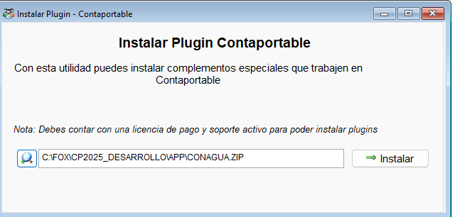{ align=center }

    **Espacio de nombres y directorios generados**
    
    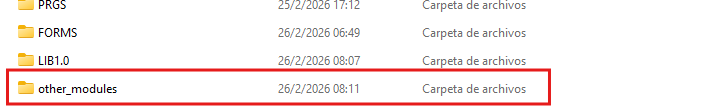{ align=center }

    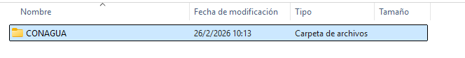{ align=center }

    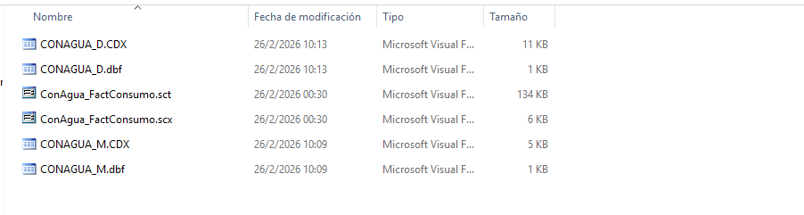{ align=center }

### 📍 Acceso desde el menú del sistema

!!! note "Ubicación del formulario"
    La opción de instalación de módulos se encuentra en:

    **Menú → Datos Generales → Instalar plugin/módulo**

    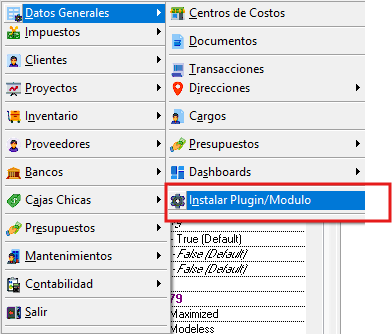{ align=center }

### 🆕 Instalación nueva (desde cero)

!!! note "Modo instalación nueva"
    Al seleccionar la instalación nueva, el sistema instala el módulo desde cero. Si detecta una instalación anterior, informa al usuario y permite continuar con la instalación limpia.

    { align=center }

    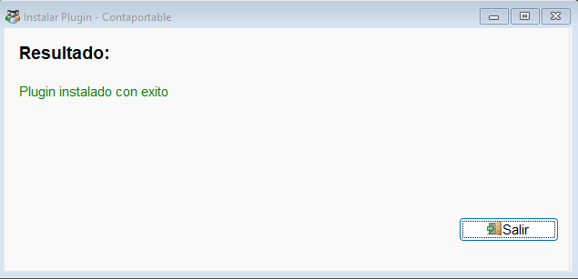{ align=center }

### 🔄 Actualización de módulo existente

!!! note "Modo actualización"
    Al seleccionar actualizar, el sistema detecta la instalación existente y aplica los cambios del nuevo compilado `.app` sobre la versión instalada.

    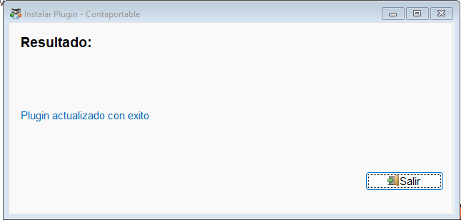{ align=center }

---

## ⚙️ Configuración Requerida

!!! note "Requisitos"
    | Requisito | Descripción |
    | --------- | ----------- |
    | **Comprimido `.zip`** | Archivo del módulo o plugin proporcionado por el equipo de desarrollo de ContaPortable. |
    | **Acceso al menú** | El usuario debe tener acceso a la sección Datos Generales del sistema. |

---

## 🔄 Flujo Funcional

!!! example "Flujo de instalación de un módulo"

    === "1️⃣ Instalación nueva"
        1. Abrir el menú del sistema → **Datos Generales → Instalar plugin/módulo**.
        2. Seleccionar el compilado `.app` del módulo a instalar.
        3. Elegir la opción **Instalación nueva**.
        4. Si el sistema detecta una instalación anterior, confirmar continuar con instalación limpia.
        5. El instalador crea el namespace del módulo mediante `NameSpaceForNewModule`.
        6. El módulo queda instalado y habilitado automáticamente.

    === "2️⃣ Actualización"
        1. Abrir el menú del sistema → **Datos Generales → Instalar plugin/módulo**.
        2. Seleccionar el compilado `.app` con la nueva versión del módulo.
        3. Elegir la opción **Actualizar**.
        4. El sistema detecta la versión instalada y aplica la actualización.
        5. El módulo queda actualizado manteniendo la configuración existente.

---

## ☑️ Validaciones y Pruebas Realizadas 🧪

!!! info "Compilado validado"
    Las pruebas se realizaron sobre el compilado **EXE_2026_05_19.exe**.

!!! example "Tipos de validaciones y pruebas Realizadas"
    ??? example "Proceso de instalación completo"
        Se confirmó que el proceso de instalación y actualización se realiza correctamente en el compilado EXE_2026_05_19.

        - :material-check-circle: Acceso al formulario desde menú Datos Generales: **confirmado**
        - :material-check-circle: Instalación nueva desde cero: **exitosa**
        - :material-check-circle: Detección de instalación anterior: **funcional**
        - :material-check-circle: Actualización de módulo existente: **confirmada**

        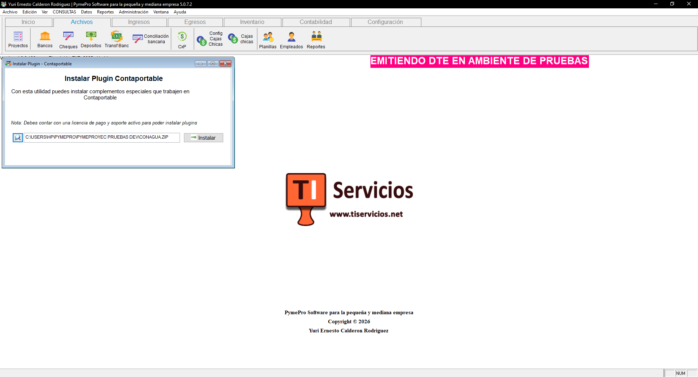{ align=center }

        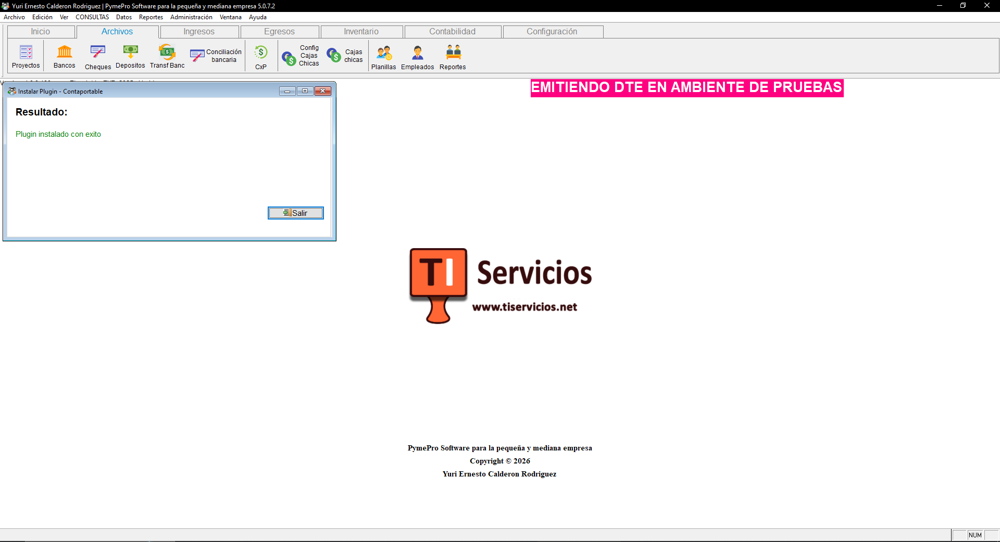{ align=center }

        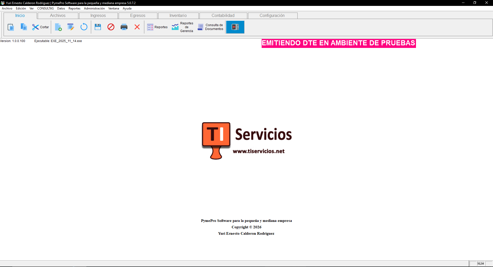{ align=center }

        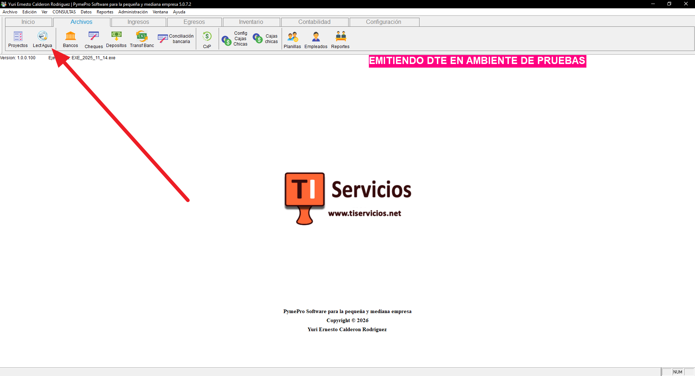{ align=center }

---