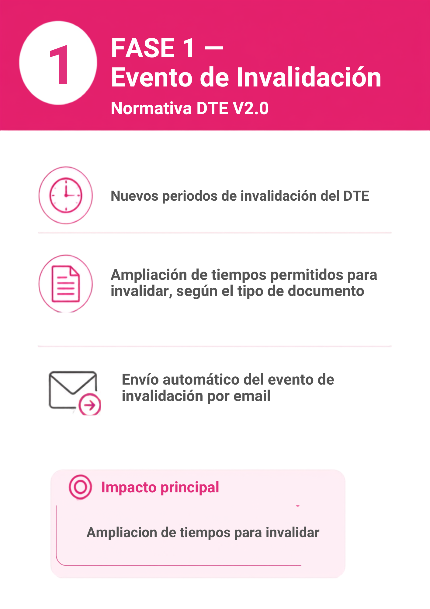

# DTE Normativa V2 — Fase 1: Evento de Invalidación

## 📌 Introducción

!!! abstract "Nuevo evento de invalidación"
    La Fase 1 de la implementación de la Normativa V2 introduce nuevos periodos para el evento de invalidación, ampliando los tiempos permitidos para invalidar un DTE según su tipo de documento.
    Nueva Representación Gráfica del evento de invalidación y envio del evento por email.

## ⚙️ Configuración

!!! note "Sin parametrización adicional"
    Activar fase1 desde el menu de instalación de implementación normativa v2

## 🚀 Implementación

 { align=center }

---
