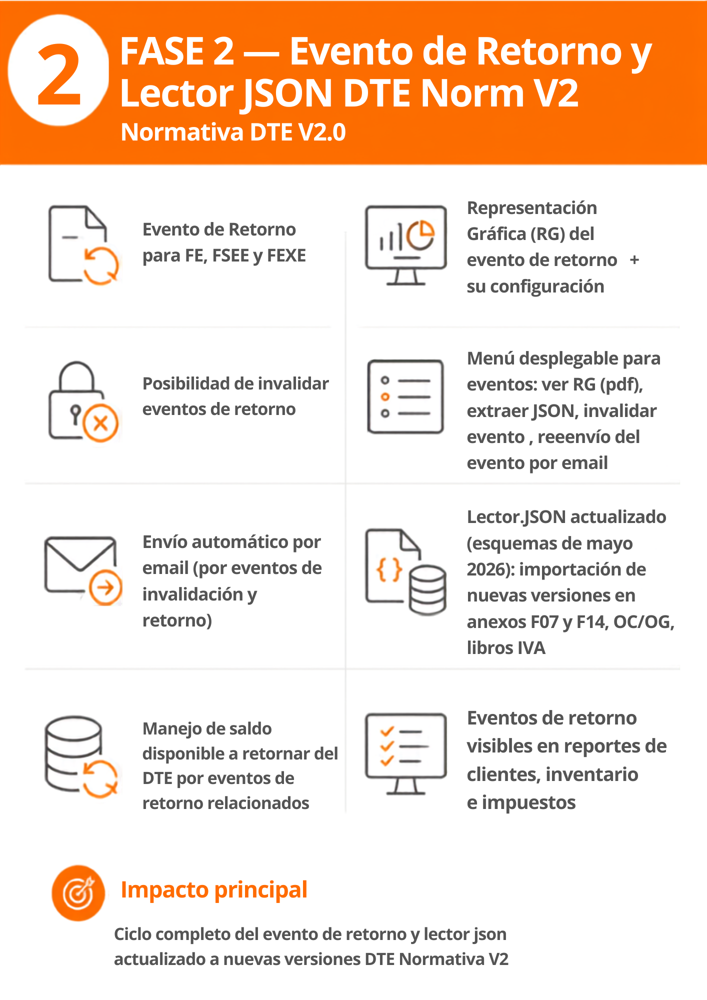

# DTE Normativa V2 — Fase 2: Evento de Retorno y Nuevas Versiones DTE

## 📌 Introducción

!!! abstract "Evento de Retorno para FE, FSEE y FEXE"
    La Fase 2 incorpora el Evento de Retorno para Factura Electrónica, FSEE y FEXE, junto con mejoras de flujo, notificación por email con RG del evento y actualización del lector de JSON schemas mayo 2025.

## ⚙️ Configuración

!!! note "Sin parametrización adicional"
    Activar fase2 desde el menu de instalación de implementación normativa v2

!!! note "Nuevas Representaciones Gráfica (RG) del evento de retorno"
    Se incluye el formato de la RG del evento de retorno y su configuración respectiva desde la opción de configuración de formatos.

!!! note "Envío automático por email"
    La función de envío automático por email se extiende a los eventos de invalidación y retorno cuando está activa la personalización del flujo de DTE (configurable desde el menú de permisos/privilegios de facturación).

## 🚀 Implementación

!!! info "Eventos de retorno e invalidación"
    - Se permite invalidar eventos de retorno.
    - Se agregaron los nodos/opciones en el menú de documentos del resumen de ventas para los eventos de invalidación y retorno.
    - Menú emergente especial al hacer clic derecho sobre un evento, con las opciones: Ver RG del evento, Extraer JSON del evento, Invalidar evento (solo visible para el evento de retorno) y Enviar email.
    - Envío del evento de retorno por email.
    - Se agrega el llenado por default de los datos de quien solicita la invalidación.
    - Manejo del saldo del DTE en base a los eventos de retorno relacionados.

!!! info "Actualización del Lector JSON"
    Actualización con los cambios de esquema publicados el 25 de mayo de 2026, aplicados en:

    - Módulo de Informes (Anexos)
    - Importación de DTEs emitidos desde el resumen de ventas
    - Importación de JSON en las distintas OC/OG
    - Libro de compras y libro de ventas

!!! info "Otras mejoras"
    - Eventos de retorno incluidos en los reportes de clientes, inventario e impuestos.
    - Asignación automática del departamento al importar JSON emitidos.
    - Mejoras al formulario de instalación de fases de implementación de la Normativa V2.
    - Corrección de bugs reportados y optimización de procesos en general.

 { width="480" align=center }

---
