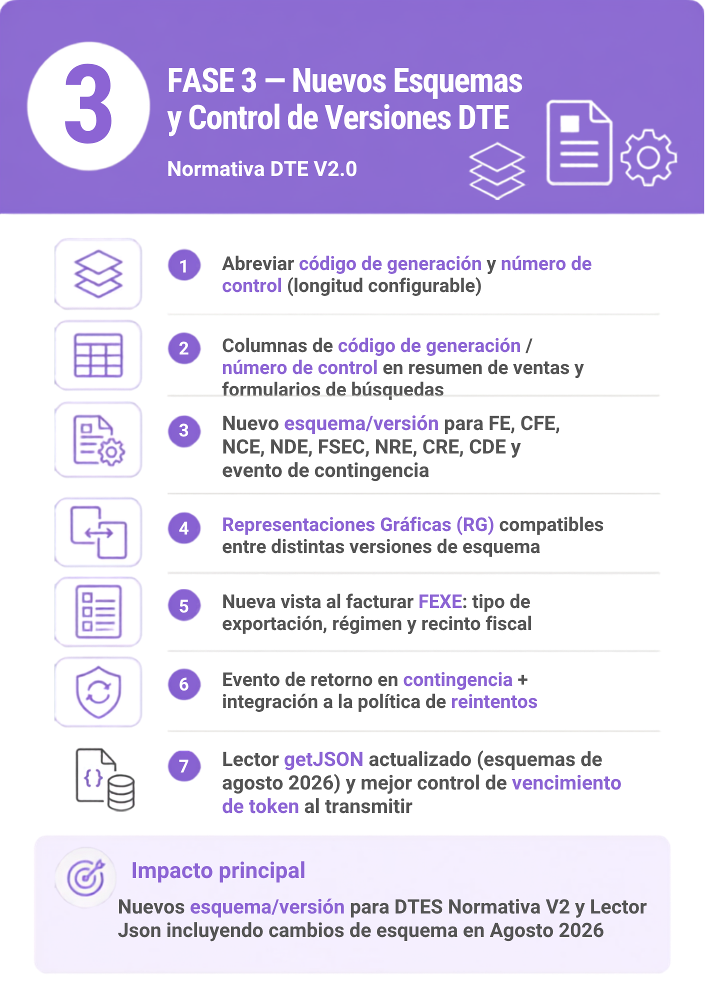

# DTE Normativa V2 — Fase 3: Control de Versiones de Esquemas DTE

## 📌 Introducción

!!! abstract "Control de versiones de esquemas DTE y mejoras de transmisión"
    La Fase 3 incorpora el control de versiones de los esquemas DTE, mejoras en la transmisión y visualización de código de generación/número de control, una nueva vista para FEXE, y mejoras adicionales al evento de retorno.

## ⚙️ Configuración

!!! note "Sin parametrización adicional"
    Activar fase3 desde el menu de instalación de implementación normativa v2

!!! note "Abreviar código de generación y número de control"
    Desde la configuración de permisos/privilegios de facturación se agrega la opción de abreviar el código de generación y número de control, personalizando la longitud mostrada en las diferentes interfaces del sistema (por ejemplo, resumen de ventas y formularios de búsqueda de facturas al facturar y al aplicar depósitos).

!!! note "Distrito del emisor"
    Se solicita configurar el distrito del emisor (si aún no se ha configurado) al activar la Fase 3.

## 🚀 Implementación

!!! info "Transmisión y visualización de DTE"
    - Mejoras en el control de vencimiento de token al transmitir DTEs.
    - Se agregan las columnas de código de generación y número de control en el resumen de ventas.

!!! info "Control de versiones de esquemas DTE"
    Nuevo esquema/versión para cada tipo de DTE:

    - FE, CFE, NCE, NDE, FSEE, FEXE, NRE, CRE, CDE
    - Evento de contingencia

    Se añade compatibilidad en las Representaciones Gráficas (RG) para utilizar la misma RG con distintas versiones de esquema del DTE — por default, las RG son compatibles al abrir DTEs con versiones antiguas y nuevas.

!!! info "Nueva vista al facturar FEXE"
    Se reordenan y muestran los campos: Tipo de exportación, Tipo de régimen (nuevo catálogo), Régimen y Recinto fiscal — con sus validaciones correspondientes según la Normativa V2.

!!! info "Mejoras en el evento de retorno"
    - Evento de retorno en contingencia (modelo de facturación 2).
    - Inclusión del correlativo interno del evento de retorno en el apéndice del JSON y en la Representación Gráfica.
    - Se integra el evento de retorno a la política de reintentos (consultando el estado del evento).

!!! info "Actualización del Lector JSON"
    Actualización con los cambios de esquema publicados por MH el 11 de agosto de 2026, aplicados en:

    - Importación de DTEs emitidos desde el resumen de ventas
    - Importación de JSON en las distintas OC/OG
    - Módulo de Informes (Anexos), incluyendo la importación del JSON de eventos de retorno en el anexo de ventas a consumidor final, y de eventos de invalidación y retorno

!!! info "Otras mejoras"
    - Corrección del bug al guardar la actividad económica en clientes no contribuyentes.
    - Corrección de bugs reportados y optimización de procesos en general.
  
{ width="480" align=center }

---
