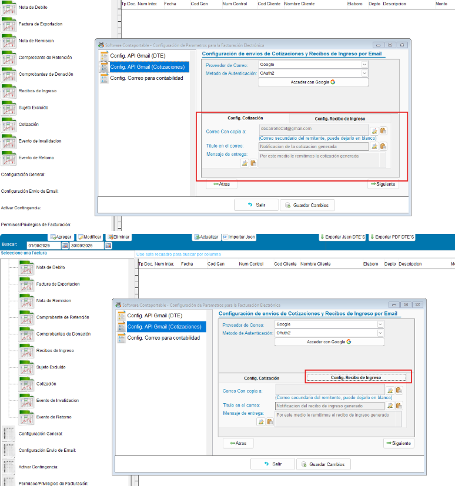
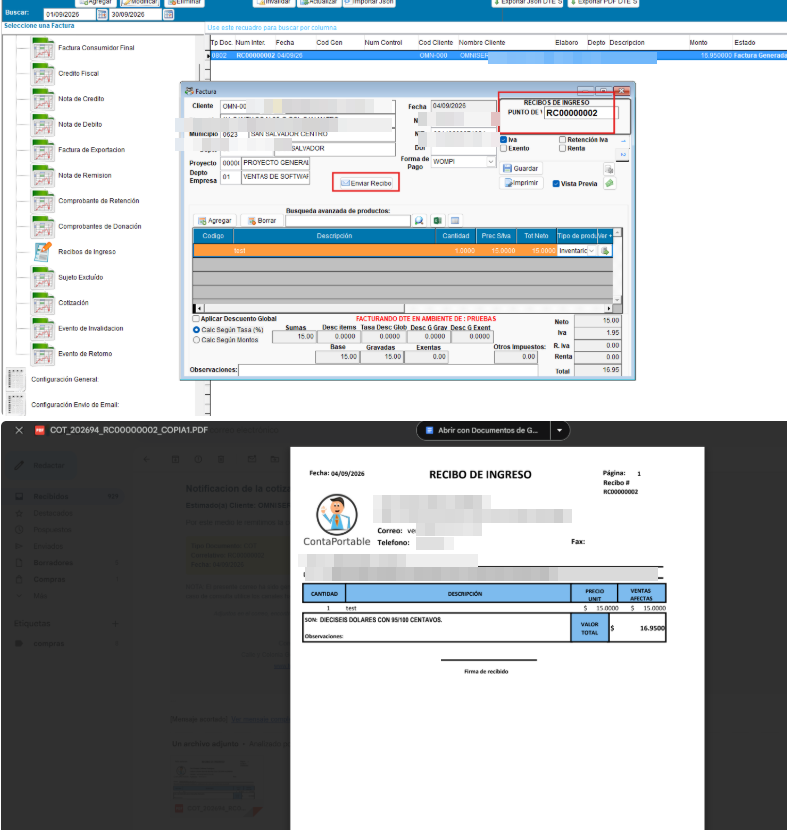
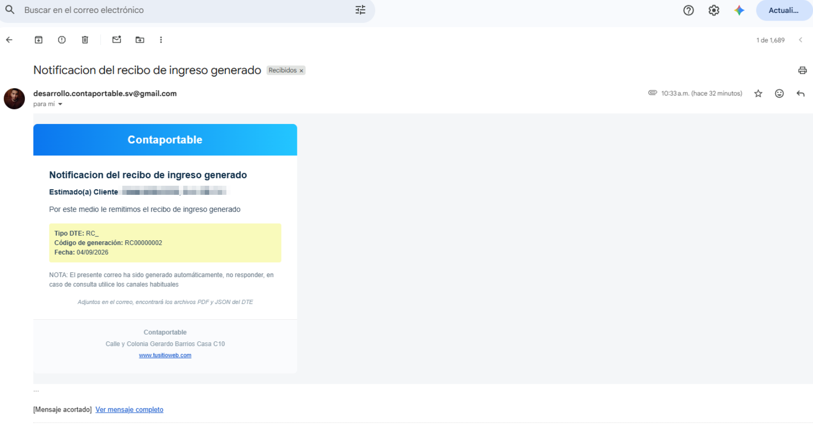

# Facturación — Envío de Recibos de Ingreso por Correo Electrónico

## 📌 Introducción

!!! abstract "Envío de Recibos de Ingreso por correo"
    Se agregó en el Recibo de Ingreso la opción de enviarlo por correo electrónico directamente desde el sistema, de forma similar al envío de Cotizaciones.

## ⚙️ Configuración

!!! note "Configuración de envíos de Cotizaciones y Recibos de Ingreso por Email"
    Desde la Configuración de Parámetros para la Facturación Electrónica utiliza el recibo de ingreso comparte la configuración del proveedor de correo y metodo de autenticación usada para las cotizaciones  se configura el proveedor de correo (Google, OAuth2 / Clave de aplicación) y, en la pestaña **Config. Recibo de Ingreso**, se puede configurar el correo con copia, el título del correo y el mensaje de entrega — de forma independiente a la configuración de Cotización.

    { align=center }

## 🚀 Implementación

!!! info "Interfaces / vistas en el sistema afectadas"
    - Ventana de Recibo de Ingreso — botón **Enviar Recibo**, y recibo generado (PDF)
    { align=center }

    - Correo recibido por el cliente con el recibo adjunto
    { align=center }
---
