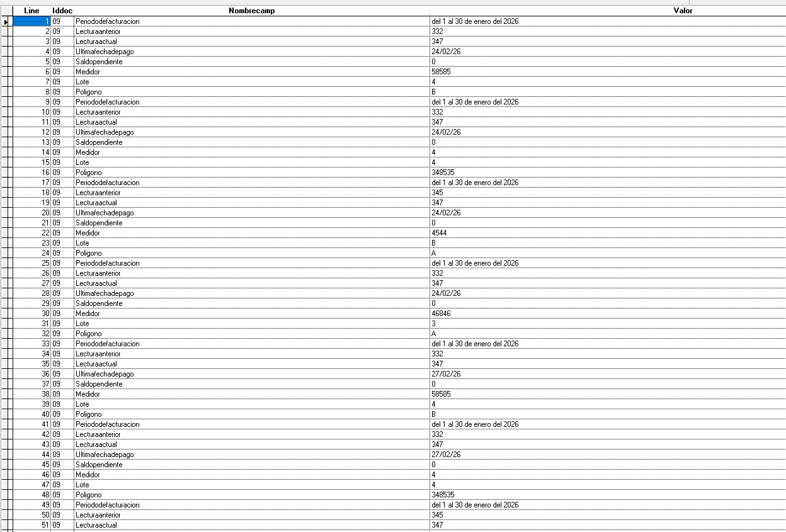
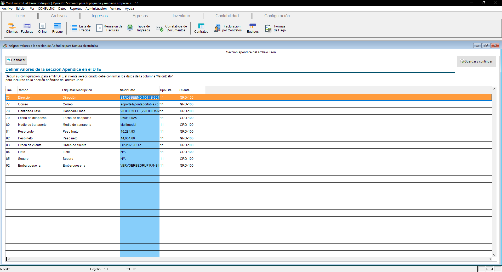
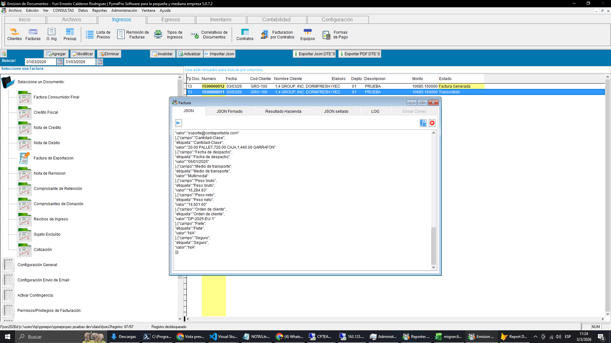
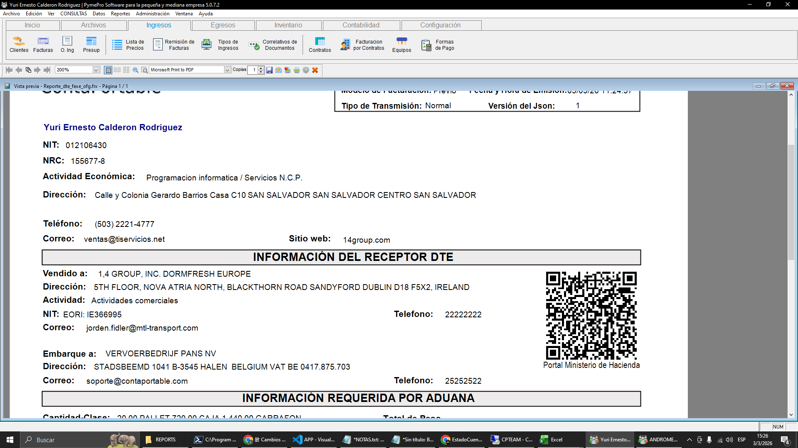
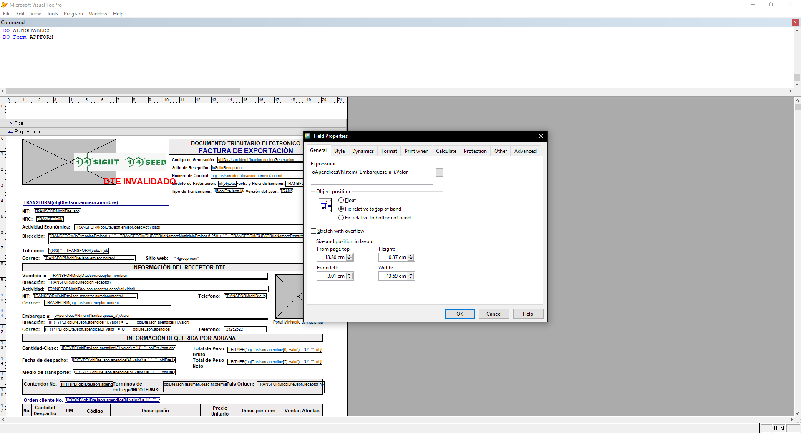

<!---
description: Documentación de los cambios en apéndices DTE — soporte para más de 10 apéndices con control de inclusión en JSON, reordenamiento y objeto oApendicesVN para reportes gráficos. Issue #547.
--->

# Facturación — Apéndices Extendidos en DTE

El módulo de Facturación incorpora soporte para más de 10 apéndices en el DTE, con configuración de cuáles se incluyen en el JSON enviado al Ministerio de Hacienda y cuáles se reservan solo para la representación gráfica. Se ha agregado un función para centralizar el acceso a estos datos desde los reportes gráficos.

---

## 📌 Introducción

!!! abstract "Apéndices extendidos y objeto oApendicesVN"
    Se extiende el sistema de apéndices DTE para soportar hasta 100 apéndices por factura, manteniendo el límite de 10 apéndices enviados al Ministerio de Hacienda. Los apéndices excluidos del JSON siguen disponibles para la representación gráfica (RG) mediante el objeto `oApendicesVN`, accesible desde cualquier reporte gráfico de DTE.

---

## 🎯 Objetivo

!!! info "Propósito"
    - Permitir más de 10 apéndices en el DTE manteniendo el límite normativo de 10 para el JSON enviado a MH.
    - Proveer el objeto `oApendicesVN` como punto de acceso unificado a todos los apéndices desde los reportes gráficos.
    - Integrar automáticamente con el módulo ConAgua al generar facturas en masa.

---

## 🔍 Alcance

!!! note "Funciones afectadas"
    - **Módulo:** Facturación Electrónica → configuración de apéndices DTE
    - **Objeto nuevo:** `oApendicesVN` — disponible en todos los reportes gráficos (RG) de DTE
    - **Integración:** El módulo/plugin ConAgua incluye esta funcion automáticamente al crear facturas masivas
    - **Límite MH:** máximo 10 apéndices enviados al JSON del Ministerio de Hacienda (sin cambio normativo)
    - **Scope del apéndice:** por cliente específico o comodín `"*"` para todos los clientes

---

## ✨ Solución Implementada

!!! abstract "Descripción de la solución"
    Se implementa el nuevo objeto `oApendicesVN` como interfaz de acceso a los demas apendices, para poder utilizarlo en las representaciones gráficas del DTE.
    La lógica de sincronización inserta nuevos apéndices y actualiza el valor de los existentes con el mismo `NombreCamp`.

    ### 🔧 Objeto oApendicesVN

    !!! note "Acceso a apéndices desde reportes gráficos"
        El objeto `oApendicesVN` contiene los 100 apéndices de la factura.
        Está disponible en todos los reportes gráficos (RG) de DTE.

        **Sintaxis de acceso:**

        ```
        oApendicesVN.item("NombreCamp").Valor
        ```

        **Ejemplos de uso** (basados en datos de la tabla `apendice_vn`):

        ```foxpro
        oApendicesVN.item("Lecturaactual").Valor    && devuelve -> "347"
        oApendicesVN.item("Lecturaanterior").Valor  && devuelve -> "332"
        oApendicesVN.item("Medidor").Valor          && devuelve -> "58585"
        oApendicesVN.item("Lote").Valor             && devuelve -> "4"
        oApendicesVN.item("Saldopendiente").Valor   && devuelve -> "0"
        ```

        { align=center }

### 📤 Límite de envío a MH

!!! note "Control del JSON enviado al Ministerio de Hacienda"
    Aunque la tabla `apendice_vn` puede contener hasta 100 apéndices, el JSON enviado al Ministerio de Hacienda mantiene el límite normativo de **10 apéndices**. El checkbox y el orden de los apéndices determinan cuáles 10 se incluyen en el JSON.

    Los apéndices excluidos del JSON siguen disponibles para la representación gráfica mediante `oApendicesVN`.

---

## ⚙️ Configuración Requerida

!!! note "Configuración de apéndices"
    | Campo | Descripción |
    | ----- | ----------- |
    | **NombreCamp** | Identificador único del apéndice — se usa como llave en `oApendicesVN.item()` |
    | **Valor** | Valor del apéndice para la factura específica |
    | **Scope** | Cliente específico o comodín `"*"` para todos los clientes |

!!! tip "Integración con ConAgua"
    El módulo/plugin ConAgua de la nueva estructura de cp365, implementa esta funcion automáticamente, sin necesidad de configuración adicional, permitiendo utilizar y mostrar en las RG los datos de lectura, consumo de agua,lectura actua, lectura anterior,medidor,lote, saldo pendiente,etc.

---

## 🔄 Flujo Funcional

!!! example "Flujo de apéndices extendidos"

    === "1️⃣ Configuración de apéndices"
        1. En la configuración de apéndices DTE, agregar los apéndices necesarios.

    === "2️⃣ Generación automática desde ConAgua"
        2. Al crear facturas desde el módulo ConAgua, el sistema llena `apendice_vn` automáticamente.
        3. Los campos de lectura (medidor, lote, lecturas, saldo) se mapean a `NombreCamp` correspondientes.
        4. El objeto `oApendicesVN` queda disponible para el reporte gráfico de cada factura.

    === "3️⃣ Uso en reportes gráficos"
        5. En el editor de reportes gráficos (RG), usar `oApendicesVN.item("NombreCamp").Valor`.
        6. Acceder a cualquier apéndice por su nombre, independientemente de si fue incluido en el JSON.
        7. El objeto está disponible para todos las RG del DTE

---

## ☑️ Validaciones y Pruebas Realizadas 🧪

!!! info "Compilado validado"
    Las pruebas se realizaron sobre el compilado **EXE_2026_03_03_04.exe**.

!!! example "Tipos de validaciones y pruebas Realizadas"
    ??? example "Objeto oApendicesVN — estructura y acceso por NombreCamp"
        Se validó que el objeto `oApendicesVN` se construye correctamente en base a `IDVENTA` y que el acceso por clave `NombreCamp` devuelve el valor esperado.

        - :material-check-circle: Construcción del objeto `oApendicesVN` por IDVENTA: **confirmada**
        - :material-check-circle: Acceso por clave `NombreCamp`: **funcional**
        - :material-check-circle: Integración automática desde módulo ConAgua: **confirmada**
        - :material-check-circle: Test confirmado por QA: **aprobado**

        { align=center }

    ??? example "Límite de 10 apéndices en JSON enviado a MH"
        Se confirmó que aunque se configuren más de 10 apéndices, solo se envían 10 en el JSON al Ministerio de Hacienda — comportamiento correcto según la normativa.

        - :material-check-circle: JSON enviado a MH con máximo 10 apéndices: **confirmado**
        - :material-check-circle: Apéndices adicionales accesibles en representación gráfica: **confirmado**

        { align=center }

        { align=center }

    ??? example "Pruebas en reportes gráficos (RG) con oApendicesVN"
        Se realizaron pruebas del formato RG utilizando el objeto `oApendicesVN` para mostrar datos de apéndices extendidos en la representación gráfica del DTE.

        - :material-check-circle: Datos de apéndices accesibles desde el RG: **confirmado**
        - :material-check-circle: Formato RG con apéndices extendidos generado correctamente: **confirmado**

        { align=center }

        { align=center }

---
