<!---
description: Documentación de la funcionalidad de bloqueo de descuentos por ítem y global mediante contraseña en el módulo de Facturación Electrónica. Issue #509.
--->

# Activar Autorización de Descuentos por Contraseña

El módulo de Facturación Electrónica incorpora la posibilidad de restringir el ingreso de descuentos por ítem y descuentos globales mediante una contraseña configurable, siguiendo el mismo modelo de seguridad ya existente para el bloqueo de precios de venta.

---

## 📌 Introducción

!!! abstract "Bloqueo de Descuentos por Contraseña"
    Esta funcionalidad permite al administrador del sistema restringir que los operadores de facturación ingresen o modifiquen descuentos —tanto por ítem como de forma global— sin autorización previa. El desbloqueo se realiza ingresando una contraseña configurable, la misma que se utiliza para el bloqueo de precios de venta.

    El privilegio puede activarse o desactivarse en cualquier momento desde los parámetros de configuración del módulo de Facturación.

---

## 🎯 Objetivo

!!! info "Propósito"
    - Controlar que únicamente usuarios autorizados mediante contraseña puedan aplicar descuentos durante el proceso de facturación.
    - Unificar el esquema de seguridad de precios y descuentos bajo una sola contraseña configurable.
    - Establecer el descuento máximo permitido por ítem usando el campo de descuento definido en la ficha del producto.

---

## 🔍 Alcance

!!! note "Módulos y funciones afectadas"
    - **Módulo:** Facturación Electrónica
    - **Funciones cubiertas:**
        - Descuento por ítem en el detalle de la factura
        - Descuento global aplicado a todos los ítems
    - **Condición de activación:** configurable por el administrador mediante parámetro de privilegio
    - **Contraseña compartida:** la misma clave usada para el bloqueo de precios de venta
    - **Límite de descuento:** definido en la ficha del producto (campo Descuento)

---

## 📋 Requerimiento Inicial

!!! example "Solicitud — Issue #509"
    **Origen:** Módulo de Facturación Electrónica

    Se requería implementar una función para **bloquear el ingreso de descuentos por ítem y descuento global**, con un comportamiento análogo al bloqueo de precios de venta ya existente. Características solicitadas:

    - :material-security: La función debe poder **activarse y desactivarse** por el administrador del sistema.
    - :material-content-save: Debe compartir la **misma contraseña** configurada para el bloqueo de precios.
    - :material-star: El **descuento configurado en la ficha del producto** debe funcionar como límite máximo de descuento aplicable.
---

## ✨ Solución Implementada

!!! abstract "Descripción de la solución"
    Se implementó el privilegio de bloqueo de descuentos integrado al sistema de seguridad existente del módulo de Facturación Electrónica. La solución cubre tanto descuentos por ítem como el descuento global.

    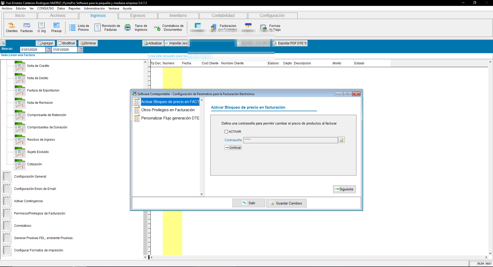{ align=center }

### 🔒 Comportamiento con el privilegio activado

!!! note "Bloqueo de descuentos activo"
    Cuando el privilegio está habilitado:

    - Los campos de **descuento por ítem** y el **check de descuento global** quedan bloqueados visualmente.
    - Al seleccionar un ítem y querer aplicar descuento, el sistema solicita la contraseña a través del menú contextual (clic derecho).
    - Para aplicar **descuento global**, el operador puede hacer clic en cualquier ítem y activar el check de descuento global — también protegido por contraseña.
    - Una vez ingresada la contraseña correcta, se habilita el campo del ítem seleccionado y el check de descuento global simultáneamente.

    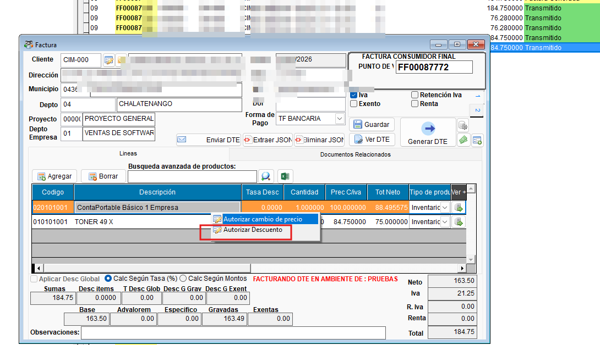{ align=center }

    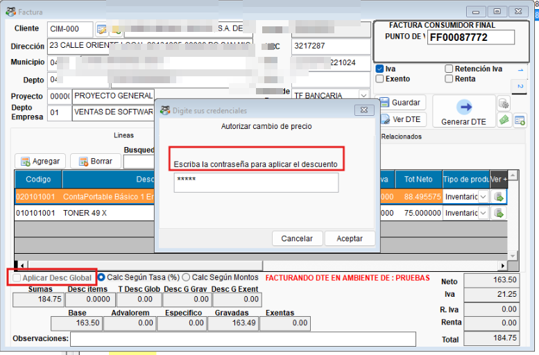{ align=center }

    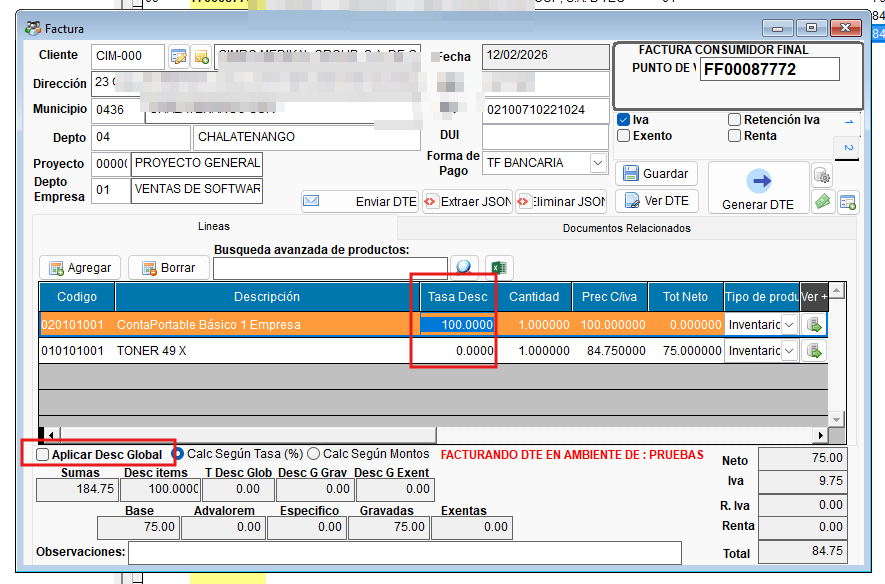{ align=center }

### 🔓 Comportamiento con el privilegio desactivado

!!! note "Privilegio desactivado"
    Cuando el privilegio está deshabilitado:

    - La opción de bloqueo **no aparece en el menú contextual** al dar clic derecho sobre un ítem.
    - Los campos de descuento permanecen editables sin restricción.

    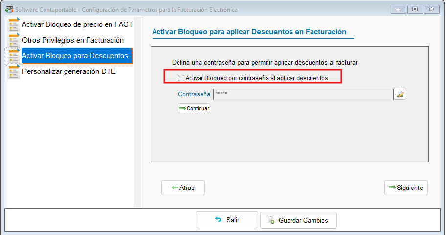{ align=center }

    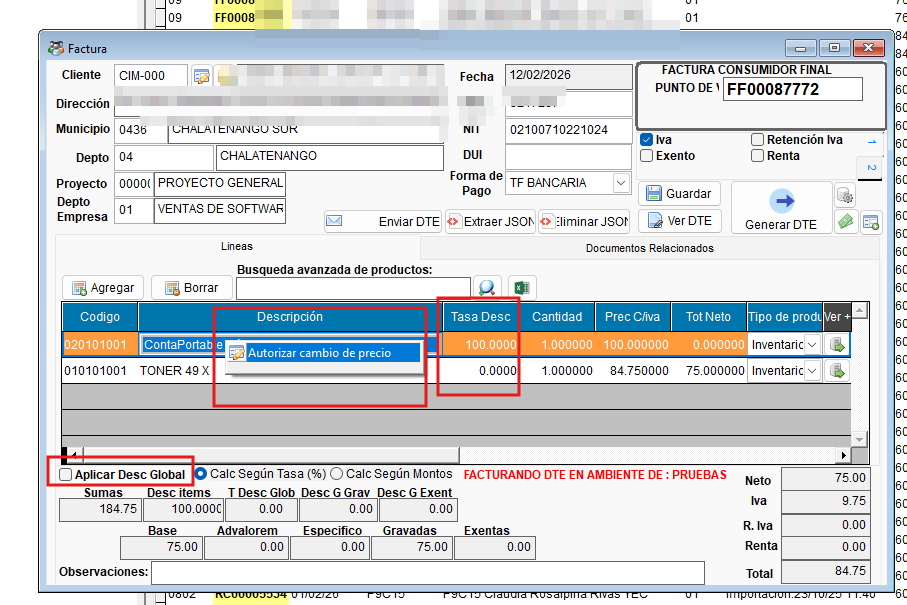{ align=center }

### 📊 Límite máximo de descuento

!!! info "Descuento máximo por producto"
    El **descuento configurado en la ficha del producto** actúa como límite máximo de descuento permitido durante la facturación. El sistema no permite ingresar un porcentaje de descuento mayor al registrado en ese campo.

    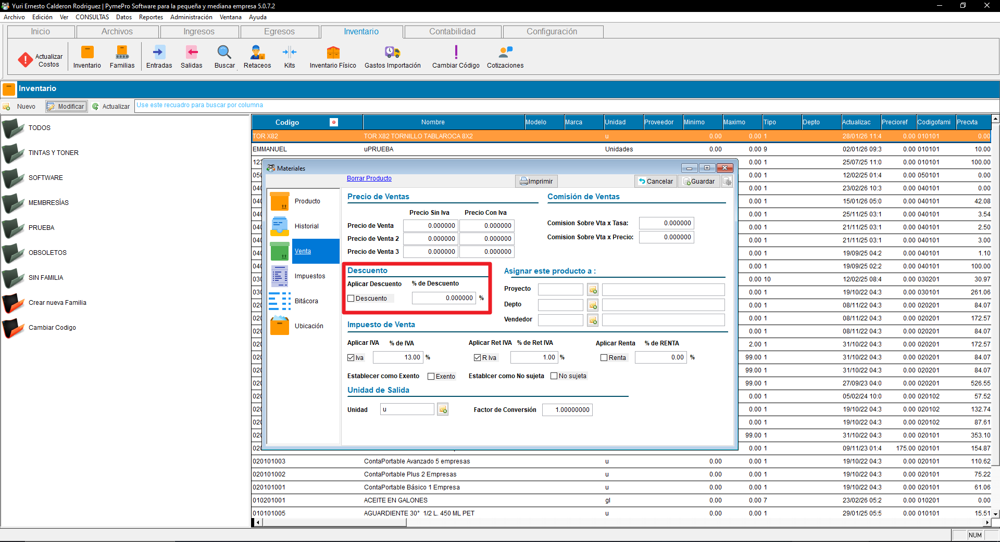{ align=center }

---

## ⚙️ Configuración Requerida

!!! note "Parámetros de configuración"
    El privilegio de bloqueo de descuentos se configura desde la sección de permisos y privilegios de facturación, en la configuración del módulo de Facturación Electrónica.

    | Parámetro | Descripción |
    |-----------|-------------|
    | **Activar bloqueo de descuentos** | Habilita o deshabilita la protección por contraseña para descuentos por ítem y global |
    | **Contraseña de bloqueo** | Contraseña compartida con el bloqueo de precios de venta. Valor por defecto: `ADMIN` |
    | **Descuento máximo por producto** | Se configura en la ficha de cada producto; actúa como tope máximo durante facturación |

### 🔑 Configuración de contraseña por primera vez

!!! example "Establecer contraseña"
    1. Ingresar a los parámetros del módulo de Facturación Electrónica.
    2. Localizar la sección de privilegios y seguridad.
    3. Activar el privilegio de **bloqueo de descuentos**.
    4. Si no tiene contraseña configurada, el sistema solicitará ingresar y confirmar la nueva clave.
    5. Si ya existe contraseña para el bloqueo de precios, el sistema utilizará esa misma clave automáticamente.

    !!! warning "Cambio de contraseña"
        Para cambiar la contraseña, el sistema solicita confirmar la **clave actual** como mecanismo de seguridad antes de permitir el cambio.

        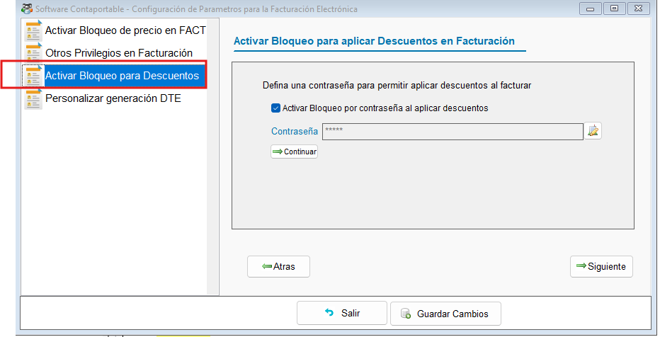{ align=center }

        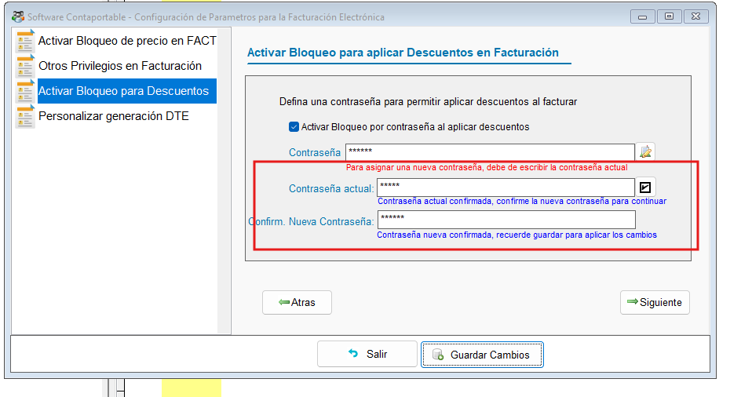{ align=center }

        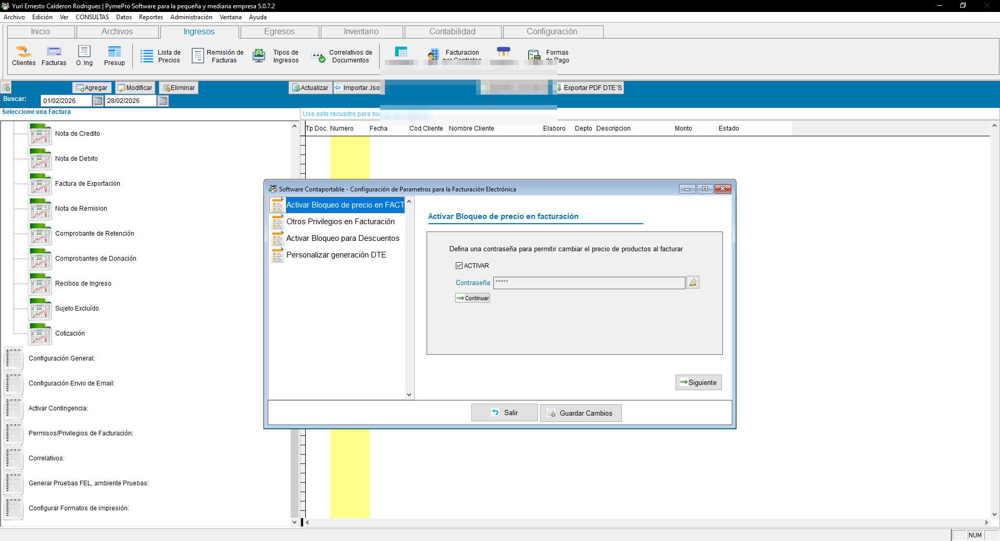{ align=center }

!!! tip "Compatibilidad con otras configuraciones"
    El privilegio de bloqueo de descuentos es **compatible** con el resto de configuraciones de la sección de facturación, incluyendo:

    - Navegación entre documentos (siguiente / anterior)
    - Activación y desactivación del flujo de generación DTE
    - Bloqueo de precios de venta (ambos pueden estar activos simultáneamente)

---

## 🔄 Flujo Funcional

!!! example "Flujo de operación al facturar con bloqueo de descuentos activo"

    === "1️⃣ Descuento por ítem"
        1. El operador agrega un ítem al detalle de la factura.
        2. Intenta modificar el campo de descuento del ítem — el campo aparece bloqueado.
        3. Hace **clic derecho** sobre el ítem para acceder al menú contextual.
        4. Selecciona la opción de desbloqueo de descuento.
        5. El sistema solicita la **contraseña de autorización**.
        6. Al ingresar la contraseña correcta, el campo de descuento del ítem seleccionado se habilita.
        7. El operador ingresa el descuento deseado (respetando el límite máximo de la ficha del producto).

    === "2️⃣ Descuento global"
        1. Con el bloqueo activo, el check de **descuento global** aparece deshabilitado.
        2. El operador hace **clic en cualquier ítem** del detalle.
        3. Hace **clic derecho** y selecciona la opción de desbloqueo.
        4. El sistema solicita la **contraseña de autorización**.
        5. Al confirmar, se habilita simultáneamente el campo del ítem seleccionado **y** el check de descuento global.
        6. El operador activa el check y configura el porcentaje de descuento global.

    === "3️⃣ Privilegio desactivado"
        1. Cuando el administrador desactiva el privilegio de bloqueo, **no aparece ninguna opción** de bloqueo en el menú contextual.
        2. Los campos de descuento por ítem y global permanecen editables sin restricción.
        3. No se solicita contraseña en ningún momento.

---

## ☑️ Validaciones y Pruebas Realizadas 🧪

!!! info "Compilado validado"
    Las pruebas se realizaron sobre el compilado **EXE_2026_03_18.exe**.

!!! example "Tipos de validaciones y pruebas Realizadas"
    ??? example "Pruebas de configuración"
        - :material-check-circle: Configuración de clave por primera vez: **exitosa**
        - :material-check-circle: Confirmación de clave actual al cambiar contraseña: **exitosa**
        - :material-check-circle: Compatibilidad con navegación entre documentos (siguiente/anterior): **confirmada**
        - :material-check-circle: Compatibilidad con activación/desactivación del flujo de generación DTE: **confirmada**

    ??? example "Pruebas de bloqueo de descuentos"
        - :material-check-circle: Bloqueo de campo de descuento por ítem con privilegio activo: **confirmado**
        - :material-check-circle: Bloqueo del check de descuento global con privilegio activo: **confirmado**
        - :material-check-circle: Desbloqueo por contraseña correcta en campo de ítem: **exitoso**
        - :material-check-circle: Habilitación simultánea del ítem y check de descuento global al desbloquear: **confirmada**
        - :material-check-circle: Ausencia de opción en menú contextual con privilegio desactivado: **confirmada**

    ??? example "Prueba de contraseña unificada"
        - :material-check-circle: Contraseña por defecto **ADMIN** funciona para ambos desbloqueos (precio y descuento): **confirmado**
        - :material-check-circle: El sistema mantiene la contraseña configurada previamente para precios de venta al activar el bloqueo de descuentos: **confirmado**

        { align=center }

        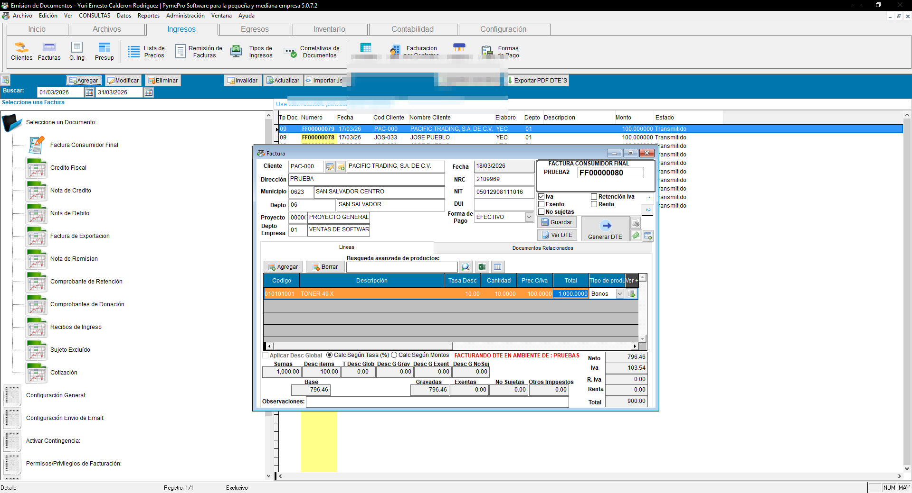{ align=center }

    ??? example "Prueba de precios por ítem"
        Se detectó y corrigió un comportamiento intermitente donde los precios del ítem no se mostraban correctamente. Validado en la versión incluida en el compilado de prueba.

        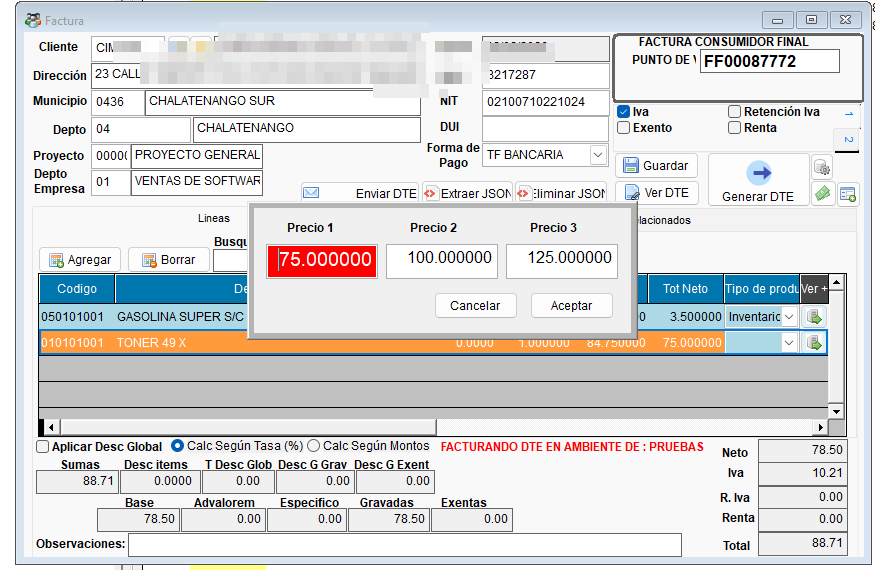{ align=center }

        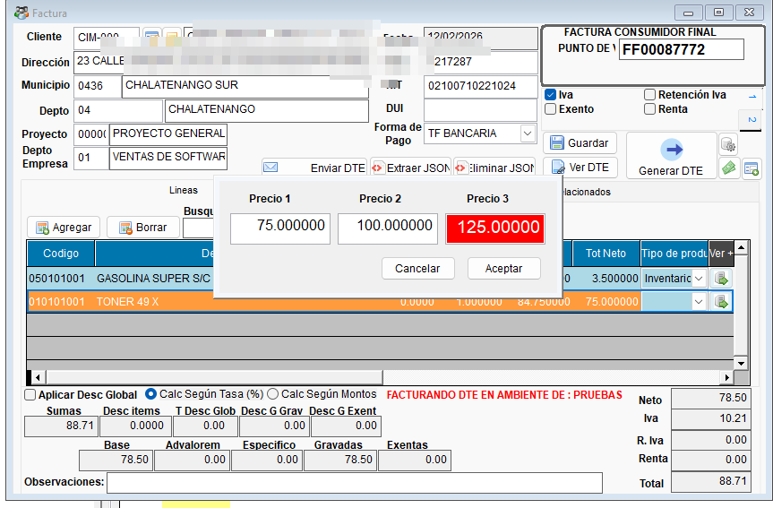{ align=center }

        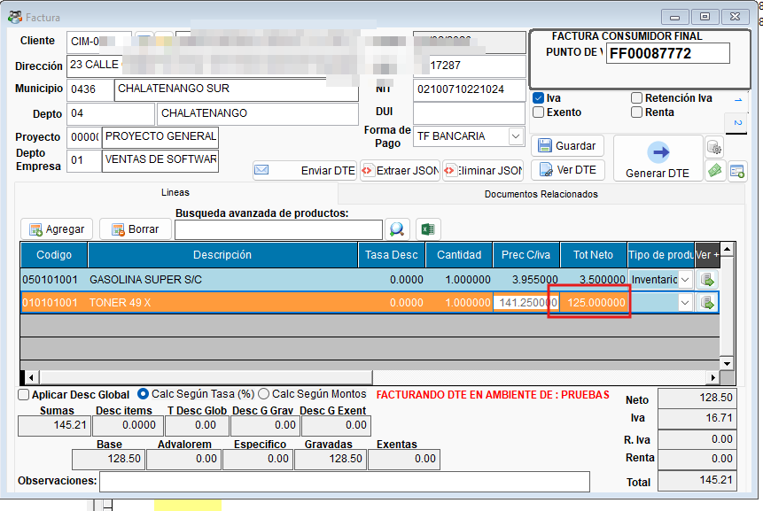{ align=center }

---
