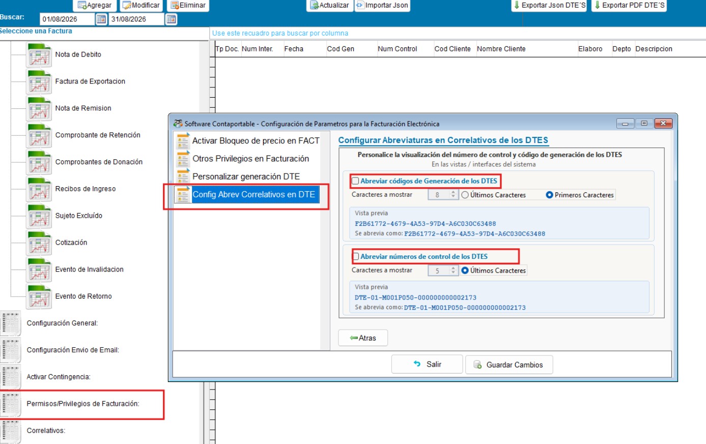
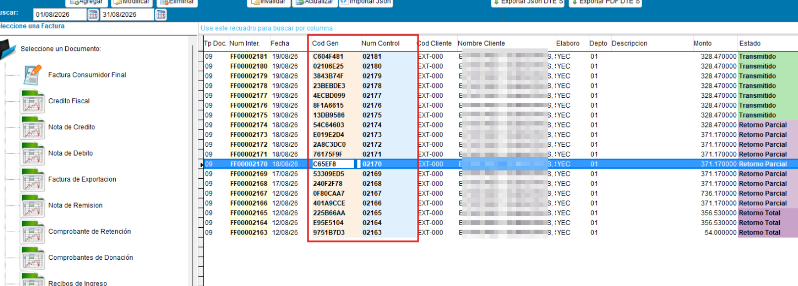
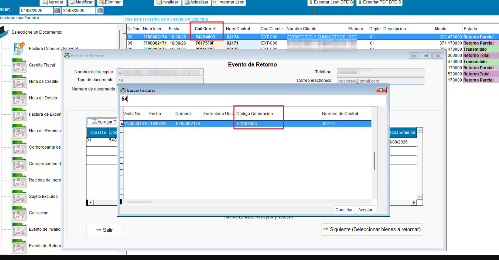
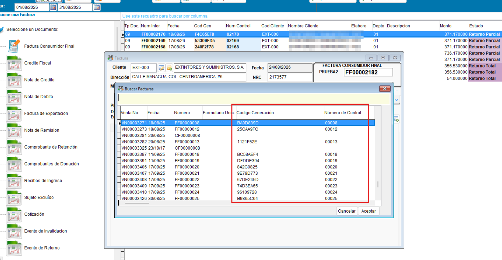
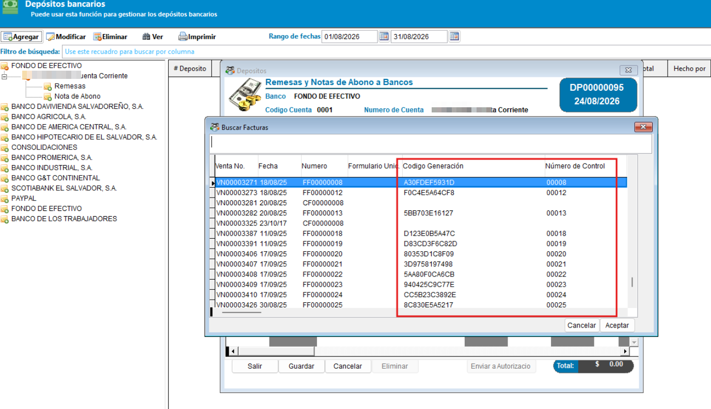

# Facturación — Configurar Abreviaturas de código de generación y número de control del DTE

## 📌 Introducción

!!! abstract "Personalizar código de generación y número de control "
    Esta funcionalidad permite personalizar la visualización del de código de generación y número de control de los DTE en las diferentes vistas / interfaces del sistema

    Las vistas / interfaces del sistema sera iran actualizando de forma escalable comenzado con el resumen de ventas y las busquedas de facturas en las diferentes opciones del ERP, posteriormente se iran incluyendo otras vistas y reportes

## ⚙️ Configuración

!!! note "Configuración de abreviaturas"
    La configuración es opcional, por default se mostrará la longitud del código de generación y número de control de los DTE completamente, pero desde la configuración de facturación se podrá personalizar la longitud del bloque de estos números

    Durante la  configuración se mostrara una vista previa de la personalizacion elegida mostrando el bloque abreviado para el código de generación y número de control 

    { align=center }

## 🚀 Implementación

!!! info "Interfaces / vistas en el sistema afectadas"
    - DTES Emitidos
    { align=center }

    - Busquedas de DTE
    { align=center }

    { align=center }

    { align=center }
---
