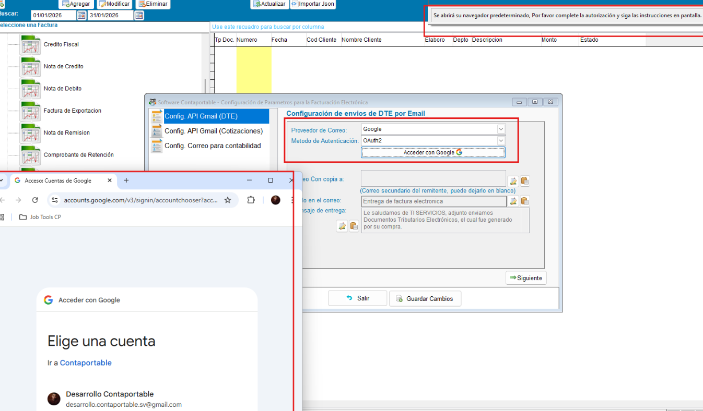
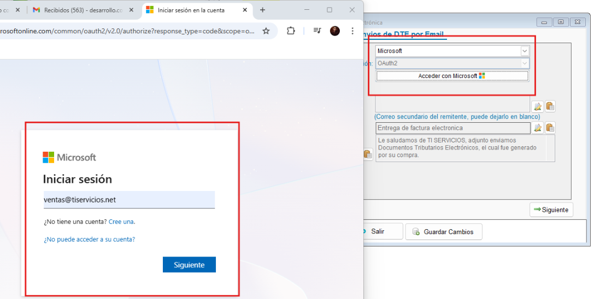
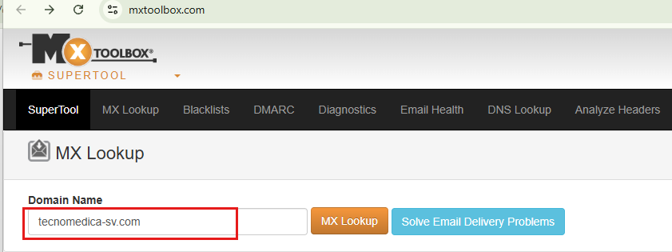
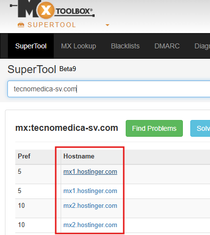

<!---
description:  Guía de Configuración de Email para envio de DTE o cotizacione
---
-->
### 📌 Guía de Configuración de Email para envio de DTE o cotizaciones, con los metodos de autenticacion por Clave de aplicacion o OAuth2

### ⚙️ Autenticacion por OAUTH2

!!! tip 
    El metodo de autenticacion Oauth esta disponible para los proveedores Google y Microsoft, porsteriormente se agregará para Yahoo y no necesita contraseña de aplicación, solo debe de vincular su cuenta dando clic en acceder se abrirá el login del proveedor en el navegador, al finalizar la autorización quedará vinculada la cuenta para el envio de correo, es mucho más fácil para el usuario y con mayor seguridad ya que no debe de agregar ninguna contraseña ni configurar algo extra en la cuenta

    !!! info "Oauth con Google"
        

    !!! info "Oauth con Google"
        

    !!! tip
         **Consultar el proveedor de correo al cliente**: Confirmar el verdadero HostName del correo, por ejemplo correos de GoDaddy e IONOS son gestionados por `outlook.com`, uno de los motores de Microsoft, en estos casos se recomienda usar Oauth2, a continuacion se muestra una lista de proveedores de dominios cuyo servicio de correo está tercerizado

         **Proveedores con Motor Microsoft**

        | Revendedor (Marca Comercial) | Segmento Principal | Nota para el Usuario |
        | :--- | :--- | :--- |
        | **GoDaddy** | Global / Pymes | El 90% de sus planes "Email Professional" son Office 365. |
        | **Tigo Business** | El Salvador / Latam | Ofrecen licencias vinculadas a planes de internet corporativo. |
        | **Claro Empresas** | El Salvador / Latam | Revenden el ecosistema de Microsoft 365. |
        | **IONOS (1&1)** | Global / Hosting | Sus correos de alta capacidad suelen usar la infraestructura de MS. |
        | **Rackspace** | Global / Corporativo | Actúan como administradores delegados de Microsoft 365. |
        | **Sherweb** | Global / Especializado | Partner directo que gestiona infraestructuras de Microsoft. |
        | **AppRiver** | Global / Seguridad | Frecuente en empresas que requieren filtrado extra de correo. |
        | **Telefónica / Movistar** | Regional | Partner oficial para soluciones de puesto de trabajo digital. |    

        **Proveedores con Motor Google Workspace**

        | Revendedor (Marca Comercial) | Segmento Principal | Nota para el Usuario |
        | :--- | :--- | :--- |
        | **Wix** | Diseño Web / eCommerce | Los correos profesionales comprados en Wix son cuentas de Google Workspace. |
        | **Squarespace** | Diseño Web | Utiliza a Google como su proveedor de correo empresarial por defecto. |
        | **Namecheap** | Dominios / Hosting | Ofrece planes de Google Workspace integrados en su panel de control. |
        | **HostGator** | Web Hosting | Revende licencias de Google Workspace para sus clientes de hosting. |
        | **Bluehost** | Web Hosting | Partner oficial que integra la consola de Google en su administrador. |
        | **HubSpot** | CRM / Marketing | Frecuentemente gestiona el envío de correos a través de servidores de Google. |

### ⚙️ Autenticación por Contraseña de aplicación

Esta guía detalla los parámetros necesarios a configurar para la integración del envío de correos electrónicos con otros proveedores  (aunque tambien aplica para google, microsoft, yahoo) usando em metodo de autenticación: contraseña de aplicación

En caso de que el proveedor **NO** sea **Microsoft, Google o Yahoo**, o el cliente tengo su dominio propio, debe de seleccionar la **opción de otros proveedores** y configurar el **servidor SMTP**, **número de Puerto y contraseña de aplicación** generada desde el **panel de configuracion del proveedor**, es importante tener en cuenta que dependera de la plataforma del proveedor si este cuenta con la opción de envio por SMTP y la generación de contraseña de aplicación, en todo caso es **responsabilidad del cliente el realizar esta configuración y brindar la información**, pero si el cliente insiste en que se le apoye con esta configuración deberá de brindar accesp al panel de su proveedor de correo, en esta documentacion se ha recopilado los pasos de algunas plataformas.

---

!!! info "Si el correo pertenece a un dominio propio y no conoce el hostName del proveedor, puede utilizar la herramienta MX Toolbox para identificar el proveedor del correo"
    
     [link "MxToolbox"](https://mxtoolbox.com/)
     

### 1. Proveedores Comunes cuya configuracion smtp es automatica en el sistema, solo debe seleccionar el proveedor y configurar la contraseña de aplicación

!!! tip
    | Marca / Motor | Servidor SMTP | Puerto | Seguridad |
    | :--- | :--- | :---: | :--- |
    | **Microsoft** | `smtp.office365.com` | 587 | STARTTLS |
    | **Google** | `smtp.gmail.com` | 465 | SSL |
    | **Yahoo** | `smtp.mail.yahoo.com` | 465 | SSL |

    **Tip:** Consultar el proveedor de correo al cliente y confirmar el verdadero HostName del correo, por ejemplo correos de GoDaddy e IONOS son gestionados por `outlook.com`, uno de los motores de Microsoft, en estos casos se recomienda usar Oauth2

---

### 2. Desglose para otros proveedores  ( Se recomienda utilizar el puerto 465 si el proveedor lo permite)

### 1. Hostinger (Titan Mail)

* **Proveedor Real:** Hostinger / Titan.
* **Servidores SMTP:** `smtp.hostinger.com` o `smtp.titan.email`.
* **Puerto:** 465 (SSL).
* **Clave de aplicación:** Si la verificación en dos pasos (2FA) está activa, se debe generar la clave en: Panel de Webmail -> Configuración -> Seguridad -> App Passwords.

### 2. Zoho Mail

* **Proveedor Real:** Zoho Corp.
* **Servidor SMTP:** `smtp.zoho.com`.
* **Puerto:** 465 (SSL).
* **Clave de aplicación:** Se genera desde el panel de seguridad de la cuenta Zoho bajo la opción "Application-Specific Passwords".

### 3. iCloud (Apple)

* **Proveedor Real:** Apple.
* **Servidor SMTP:** `smtp.mail.me.com`.
* **Puerto:** 587 (TLS).
* **Clave de aplicación:** 1. Entra en `appleid.apple.com`.
    2. Ve a "Inicio de sesión y seguridad" -> "Contraseñas específicas de la aplicación".
    3. Genera una nueva y asígnale un nombre descriptivo.

### 4. Yandex

* **Proveedor Real:** Yandex.
* **Servidor SMTP:** `smtp.yandex.com`.
* **Puerto:** 465 (SSL).
* **Clave de aplicación:** Debe habilitarse desde la configuración de seguridad de Yandex Passport en la sección de contraseñas de aplicación.

### 5. Private Email (Namecheap)

* **Proveedor Real:** Namecheap / Open-Xchange.
* **Servidor SMTP:** `mail.privateemail.com`.
* **Puerto:** 465 (SSL) o 587 (TLS).
* **Clave de aplicación:** Normalmente permite el uso de la contraseña principal, pero si activas 2FA, debes generarla en el panel de **Seguridad** de tu Webmail.

### 6. Amazon SES (Simple Email Service)

* **Proveedor Real:** Amazon Web Services (AWS).
* **Servidor SMTP:** `email-smtp.us-east-1.amazonaws.com` (Verificar región en la consola de AWS).
* **Puerto:** 465 (SSL) o 587 (TLS).
* **Clave de aplicación:** Se obtienen desde **SES** -> **SMTP Settings** -> **Create SMTP Credentials**. AWS generará un Usuario y una Contraseña específicos para el envío por este protocolo.

### 7. SendGrid

* **Proveedor Real:** Twilio / SendGrid.
* **Servidor SMTP:** `smtp.sendgrid.net`.
* **Puerto:** 465 (SSL).
* **Clave de aplicación:** Se debe generar una **API Key** en el panel de SendGrid (Settings -> API Keys). El usuario será siempre la palabra fija `apikey` y la contraseña será el valor de la API Key generada.

### 8. Mailgun

* **Proveedor Real:** Sinch / Mailgun.
* **Servidor SMTP:** `smtp.mailgun.org` (o `smtp.eu.mailgun.org` para cuentas en Europa).
* **Puerto:** 465 (SSL) o 587 (TLS).
* **Clave de aplicación:** Se gestiona en el panel de Mailgun bajo **Sending** -> **Domains** -> **SMTP credentials**. Es necesario crear o resetear la contraseña del usuario SMTP asignado al dominio verificado.
---

!!! tip
    Para implementaciones con proveedores como **Tigo Business** o **Claro**, valide siempre si el servicio de correo está tercerizado (usualmente con Microsoft 365 o Google Workspace)

    Si el cliente tiene un servidor de correo local (físico en su oficina), es muy probable que no soporte "Contraseñas de aplicación". En ese caso ellos habiliten el SMTP Relay y número de puerto (casos extremos)