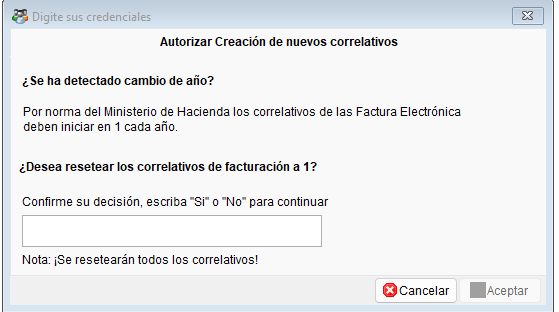
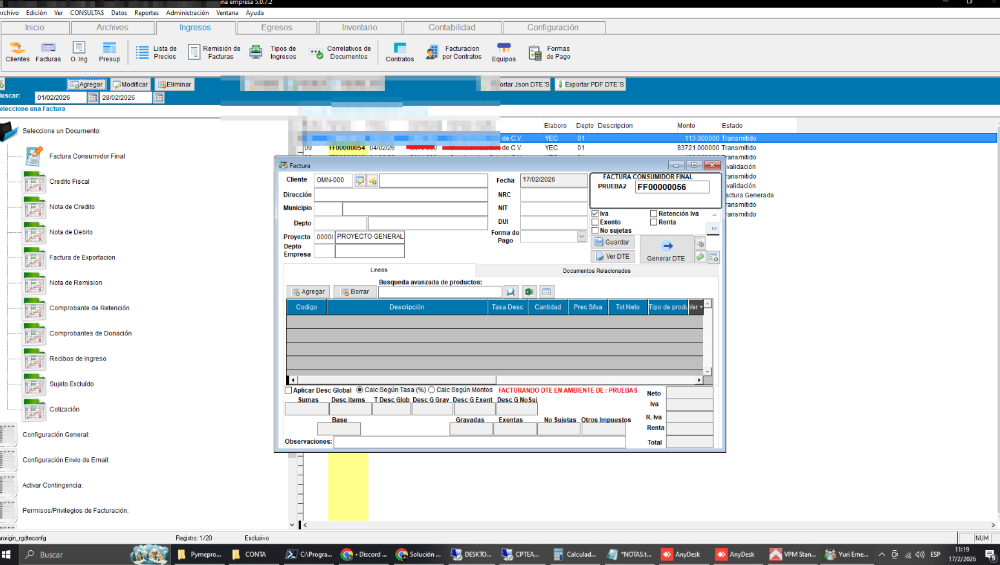

<!---
description: Documentación de la mejora en el flujo de validación de correlativos automáticos, incorporando la API de CPFOUNDATION como alternativa cuando la API principal falla o es bloqueada. Issue #559.
--->

# Creación de correlativos automáticos usando API propia de CP

El sistema ContaPortable incorpora un mecanismo de API propia para obtener la fecha actual y validar correlativos automáticos, optimizando el inicio del sistema en versiones recientes, se depreca el uso de APIS públicas de terceros, evitando bloqueos o fallos por disponibilidad que aumentaban el tiempo de inicio del sistema

---

## 📌 Introducción

!!! abstract "API Alternativa para Validación de Correlativos"
    Ante el reporte de usuarios que tenian problemas al iniciar el sistema por bloqueos en la API publica utilizada para validar la fecha actual y asi poder crear correlativos automaticos del año actual, automatizando el requerimiento de MH para reiniciar correlativos en cada año, por lo tanto se implementa la API propia de CP, con un flujo optimizado que evita solicitudes repetidas o innecesarias durante la misma sesión.

---

## ✨ Solución Implementada

!!! abstract "Descripción de la solución"
    Se implementan dos mejoras complementarias en el proceso de creación de correlativos automáticos: el primer mecanismo corresponde en utilizar la API propia de CP y una optimización en el flujo de consultas para reducir el número de solicitudes al servidor.

    Cuando el sistema detecte cambio de año, solicitará al usuario que confirme la creación de nuevos correlativos automaticos.

     {.align=center}  

### ⚡ Optimización: consulta única por sesión

!!! note "Evitar consultas repetidas"
    El sistema realiza la consulta de fecha del servidor **una sola vez** al entrar al módulo de Facturación. Si la fecha ya fue obtenida en la sesión actual, no se repite la consulta, evitando un exceso de requests innecesarios a la API.

---

## ⚙️ Configuración Requerida

!!! note "Sin configuración adicional requerida"
    La API CP opera de forma automática, asi como la validación de creación de correlativos automáticos, para los usuarios que poseen el módulo de facturacion eléctronica.

---

## ☑️ Validaciones y Pruebas Realizadas 🧪

!!! info "Compilados validados"
    | Compilado | Contexto |
    | --------- | -------- |
    | **EXE_2026_02_17** | Test externo con cliente de implementación — ingreso al sistema confirmado sin retrasos. |

    {.align=center}  

---
