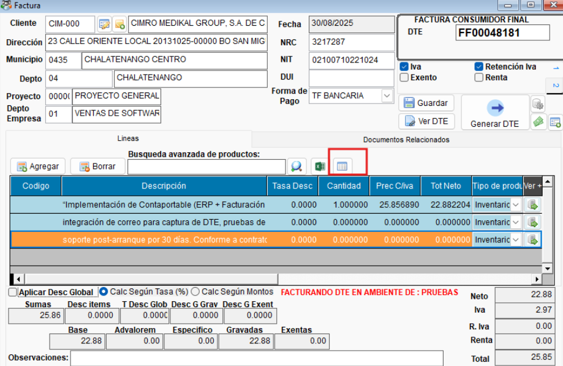
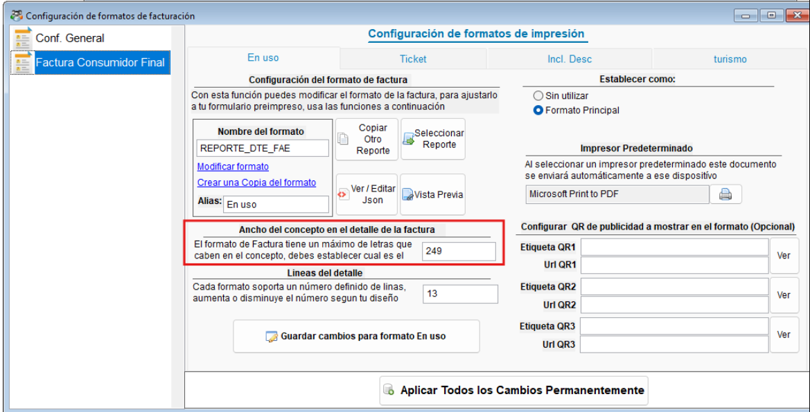
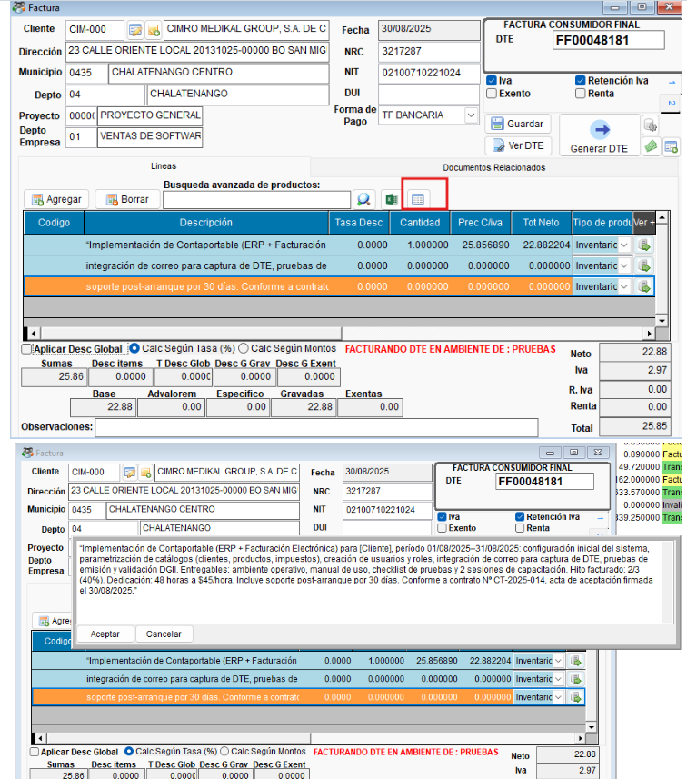
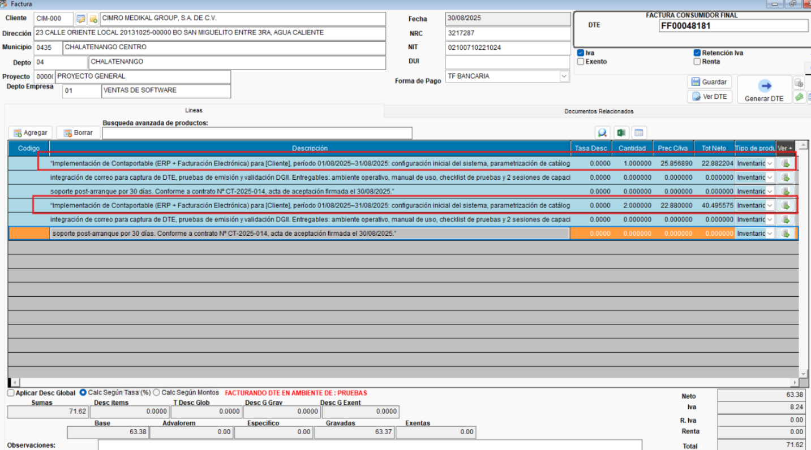

<!---
description: Facturacion Multilinea en ContaPortable, ORIGEN: solicitado por PDM INVERSIONES. 
---
-->
# Facturación Multilinea - Documentación 

Bienvenido a la documentación del requerimiento Facturación Multilinea en **CONTAPORTABLE 2025**.

---

## 📌 Introducción

En base al [requerimiento#277](https://github.com/YECAPP/CP2025/issues/277), se desarrollo la opción para incluir conceptos largos en la facturación, distribuidos en multiples lineas, segun longitud del concepto, evitando generar palabras incompletas.

## ⚙️ Configuración / Párametros

!!! Note "Activar parámetro FACTURARDESCRIPMULTILINE"
    - :material-console: Desde la venta de comandos del sistema, busca el parámetro FACTURARDESCRIPMULTILINE y asigna el valor de **SI** para activarlo.
    {.align=center}

    - :material-refresh: **Reinicia** el sistema
    - Se habilitara el nuevo icono en la ventana de facturación
    {.align=center}

    - :material-file-cog:Definir el parámetros de ancho del concepto en el detalle de factura desde la configuración de formatos, ya que se utilizará para determinara la cantidad de caracteres permitidos en cada ítem, determinando de esta forma el salto de linea para un nuevo ítem.
    {.align=center}

!!! Note "Funcionamiento"
    - Pega el texto que desees incluir en la ventana emergente
    {.align=center}
    - Clic en aceptar, luego se te solicitara la cantidad y el precio que se agregará en el primer item, veras que se agrega el concepto dristribuido por items
    {.align=center}

---

## 📚 Uso General