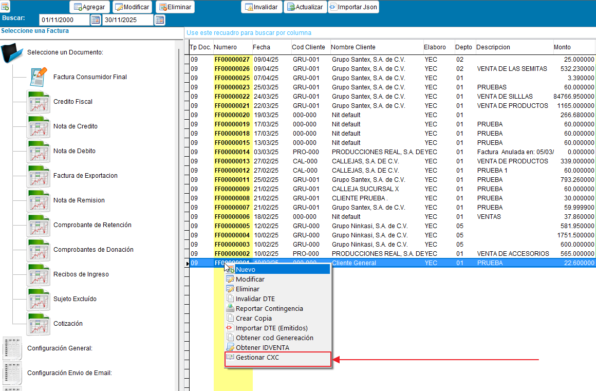
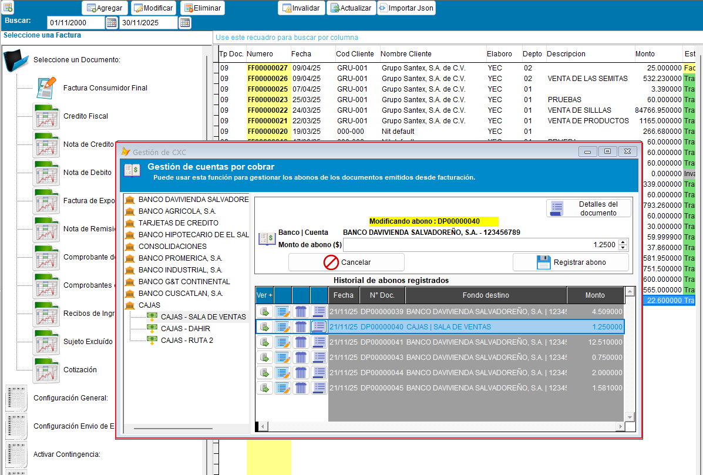
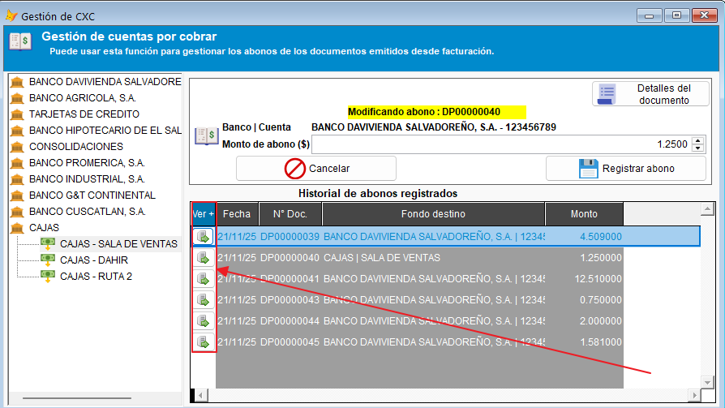
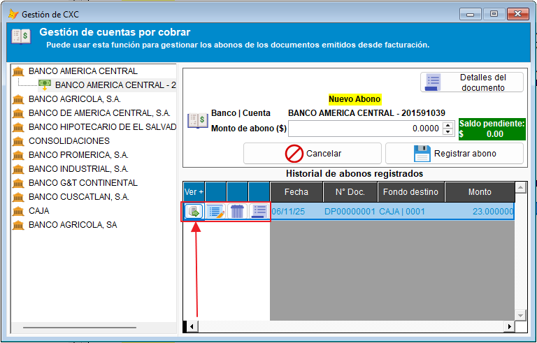
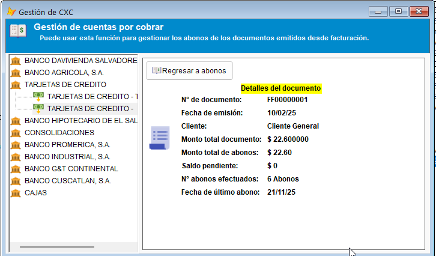

# Gestión de Cuentas por Cobrar (CXC)

A continuación se detalla el proceso para utilizar la opción de gestión de CXC directamente desde los documentos de facturación. Esta funcionalidad permite añadir, modificar y eliminar abonos, así como visualizar el estado de la cuenta por cobrar.

!!! tip " **Facturación - Gestión de CXC**"
    ``` mermaid
    graph TD
      A[Índice de contenidos]:::root

      subgraph "Subcategorías"
        B[1. Acceso desde facturación]
        C[2. Ventana de Gestión de CXC]
        D[3. Gestión de abonos]
        E[4. Detalles del documento]
        F[5. Gestión de Bancos]
      end

      A --> B
      A --> C
      A --> D
      A --> E
      A --> F

    click B "#1-acceso-desde-facturacion" "Ir al acceso desde facturación"
    click C "#2-ventana-de-gestion-de-cxc" "Ir a la ventana de gestión de CXC"
    click D "#3-gestion-de-abonos" "Ir a la gestión de abonos"
    click E "#4-detalles-del-documento" "Ir a detalles del documento"
    click F "#5-gestion-de-bancos" "Ir a la gestión de bancos"
    ```
---

## 1. Acceso desde Facturación

Para comenzar, diríjase al módulo de facturación.

1. Localice el documento que desea gestionar en la lista.
2. Haga **clic derecho** sobre el documento.
3. Seleccione la opción de gestión de CXC en el menú contextual.



---

## 2. Ventana de Gestión de CXC

Al seleccionar la opción, se abrirá la ventana emergente **Gestión de Cuentas por Cobrar**.

* **Funcionalidad:** Esta interfaz permite añadir, modificar y eliminar los abonos efectuados al documento seleccionado en la ventana anterior, en la parte izquierda se ubica un listado de bancos y cuentas bancarias creadas y desde las cuales podrá elegir efectuar un abono.



---

## 3. Gestión de abonos

Dentro del listado de abonos existentes, es posible desplegar opciones adicionales:

1. Localice el abono específico.

2. Expanda la **botonera de acciones** (Por medio del botón que se muestra al inicio del registro).



3. Se mostrarán los botones disponibles:
    * ✏️ **Modificar**
    * 🗑️ **Eliminar**
    * 📄 **Ver detalles**



---

## 4. Detalles del Documento

Al hacer clic en la opción **"Ver detalles del documento"**, el sistema desplegará información específica sobre el estado financiero del mismo.

!!! note "Información Visible"
    Aquí podrá visualizar el saldo pendiente, el total abonado y otros datos relevantes de la CXC para el documento que está siendo gestionado.



---

## 5. Gestión de Bancos

!!! info "Disponibilidad"
    Esta funcionalidad está disponible para las instalaciones que utilizan la versión de facturación **INVFACT2**. Si no ve la opción en su sistema, consulte con su administrador.

La toolbar de la versión "_ContaPortable PRO_" incluye acceso directo a la gestión de **bancos y cuentas bancarias** de la empresa, sin necesidad de salir del módulo. Esto le permite mantener actualizados los datos de sus cuentas mientras trabaja con sus documentos.

### ¿Qué puede hacer desde aquí?

- **Consultar** las cuentas bancarias registradas en el sistema.
- **Agregar** nuevas cuentas bancarias o bancos.
- **Modificar** los datos de una cuenta existente (número de cuenta, banco, moneda, etc.).

> Cualquier cambio realizado en esta sección se refleja de inmediato al momento de registrar un abono, ya que el listado de cuentas disponibles se actualiza automáticamente.

