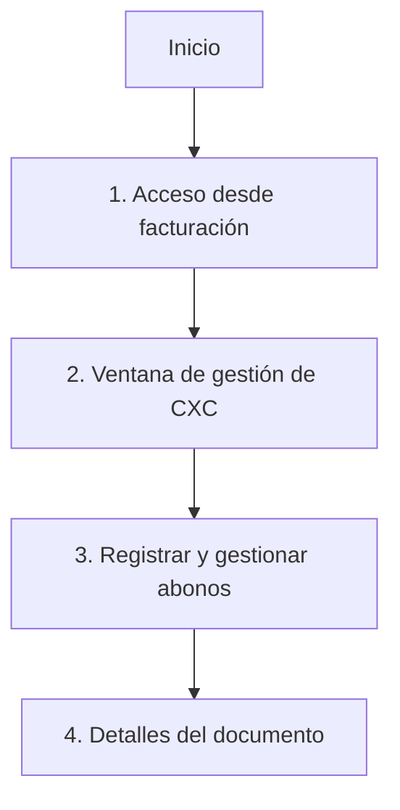

# 💵 **Gestión de Cuentas por Cobrar (CXC)**

La gestión de CXC es la interfaz con la que se registran, modifican y eliminan los abonos de un documento de facturación (factura, crédito fiscal u otro documento de venta), y desde la que se consulta en todo momento su saldo pendiente. Es la misma interfaz que utiliza la [gestión de CXP](../compras/gestion_cuentas_por_pagar.md) del módulo de compras, aplicada del lado de facturación.

!!! tip "¿Cuándo usar esta función?"
    - Cuando necesite **registrar un abono** (pago total o parcial) de un cliente sobre un documento de facturación.
    - Cuando necesite **modificar o eliminar** un abono ya registrado.
    - Cuando quiera **consultar rápidamente** el saldo pendiente, el total abonado o la fecha del último abono de un documento, sin tener que buscarlo en un reporte.

!!! tip "Flujo rápido"
    1. Abrir el documento en el módulo de facturación.
    2. Hacer clic derecho sobre el registro e ingresar a la opción **"Gestionar CXC"** del menú contextual.
    3. Registrar o ajustar los abonos.
    4. Revisar los detalles del documento y el saldo pendiente.

---

## 🚪 **1. Acceso desde Facturación**

Para iniciar, diríjase al módulo de facturación y localice el documento que desea gestionar.

1. Busque el documento en la lista de facturación.
2. Haga clic derecho sobre el registro.
3. Seleccione la opción **"Gestionar CXC"** en el menú contextual.

---

## 🖥️ **2. Ventana de gestión de CXC**

Al seleccionar la opción, se abre la ventana de gestión de cuentas por cobrar, organizada en dos pestañas:

- **Abonos** — listado de los abonos ya registrados al documento, con acceso para agregar uno nuevo.
- **Detalles del documento** — resumen financiero del documento (ver [sección 4](#4-detalles-del-documento)).

En el panel izquierdo se muestra un árbol con los **bancos y cuentas bancarias** de la empresa, del cual se elige la cuenta que recibirá el abono. Este árbol únicamente permite **seleccionar** una cuenta ya existente; si necesita crear o modificar bancos y cuentas, hágalo desde la [gestión de bancos, cuentas y chequeras](../bancos/mantenimiento_bancos_cuentas_chequeras.md).

---

## 💰 **3. Registrar y gestionar abonos**

### Registrar un nuevo abono

1. En la pestaña **Abonos**, seleccione el banco y la cuenta que recibirá el abono (panel izquierdo).
2. Indique el monto del abono.
3. Confirme el registro.

El abono aparece de inmediato en el listado y el saldo pendiente del documento se actualiza.

### Modificar, eliminar o ver detalles de un abono existente

1. Localice el abono específico dentro del listado.
2. Expanda la botonera de acciones del registro (botón al inicio de la fila).
3. Elija entre las opciones disponibles:
    - ✏️ **Modificar**
    - 🗑️ **Eliminar**
    - 📄 **Ver detalles**

---

## 📄 **4. Detalles del documento**

Desde la pestaña **Detalles del documento** (o desde la opción "Ver detalles" de un abono) el sistema muestra el estado financiero completo del documento:

- **Monto total del documento**
- **N° de documento**
- **Fecha de emisión**
- **Saldo pendiente**
- **N° de abonos efectuados**
- **Fecha del último abono**
- **Monto total de abonos**

Un botón **"Regresar a abonos"** permite volver al listado de abonos sin cerrar la ventana.

---

## 📌 **5. Buenas prácticas**

- Confirme el banco y la cuenta antes de registrar el abono, ya que determinan el movimiento bancario asociado.
- Revise el saldo pendiente después de cada abono para verificar que el documento quede correctamente aplicado.
- Elimine un abono únicamente cuando se trate de un registro erróneo; si el cobro cambió de monto, prefiera modificarlo.

## 🔗 **6. Páginas relacionadas**

- [Gestión de Cuentas por Pagar (CXP)](../compras/gestion_cuentas_por_pagar.md) — la misma lógica de abonos, aplicada del lado de compras (órdenes de compra, quedans y órdenes de gasto).
- [Gestión de bancos, cuentas y chequeras](../bancos/mantenimiento_bancos_cuentas_chequeras.md) — para crear o modificar los bancos y cuentas que aparecen en el selector de esta ventana.
- [Gestión de clientes y Resumen de Facturas](gestion_clientes.md)
- [Reportes de clientes](../../Reports/categorias/clientes.md)
