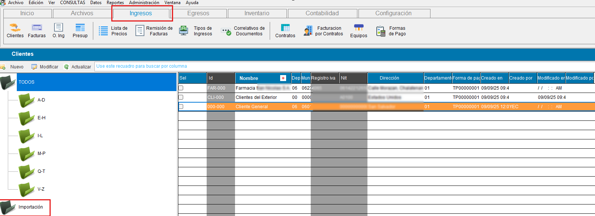
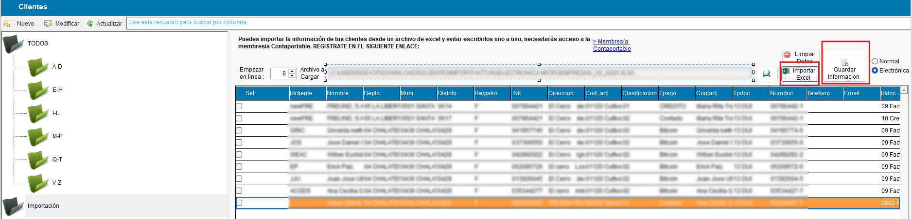
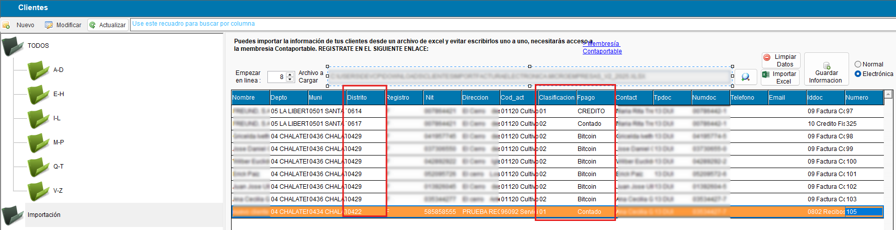

<!---
description: Importar clientes desde plantilla - importarClientesFacturasFromPlantilla
---
-->
# Importar Clientes / Facturas desde plantilla Excel 

Bienvenido a la documentación de la función para importar clientes\Facturas desde **plantilla en Excel**

---

## 📌 Ingresos -> Clientes -> Importación

Esta funcion permite importar clientes con sus facturas desde excel, mediante una plantilla específica
{.align=center}
{.align=center}

[⬇️ Descargar plantilla V2.2 (actualizada)](https://docs.google.com/spreadsheets/d/13g5fyJOf2fVxUApFPjC0zNkr6JVM7ytf/edit?usp=sharing&ouid=103010628275140656785&rtpof=true&sd=true)

---

## 📝 Historial de actualizaciones

??? note "🚀 V2.1.0 - OCTUBRE 2025"
    ###✨ Nuevos campos para importar:
     En base al [requerimiento#259](https://github.com/YECAPP/CP2025/issues/259), se agregan los campos de distrito, clasificación del cliente y forma de pago a la función de importación de clientes y facturas desde el sistema
    {.align=center}

    ###🧩 Cambios en plantilla Excel para la importación de clientes en contaportable:
    - Se actualiza la hoja **listado de municipios**.
    - Se agrega nueva columna **DISTRITO**, se añade la hoja **listado de distrito** y se asigna el origen de datos para la columna Distrito
    - Se agrega nueva columna **CLASIFICACION DE CONTRIBUYENTE**, se añade la hoja **listado de clasificacion** y se asigna el origen de datos para la columna CLASIFICACION DE CONTRIBUYENTE 
    - Se agrega nueva columna **FPAGO**, se añade la hoja **listado de formas de pago** y se asigna el origen de datos para la columna FPAGO
    - Se añade la hoja **listado de respuestas** y se asigna el origen de datos para la columna Tiene Ret IVA

    [⬇️ Descargar plantilla V2.2](https://docs.google.com/spreadsheets/d/13g5fyJOf2fVxUApFPjC0zNkr6JVM7ytf/edit?usp=sharing&ouid=103010628275140656785&rtpof=true&sd=true)
