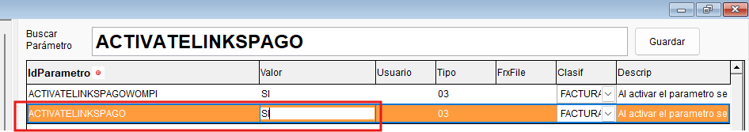
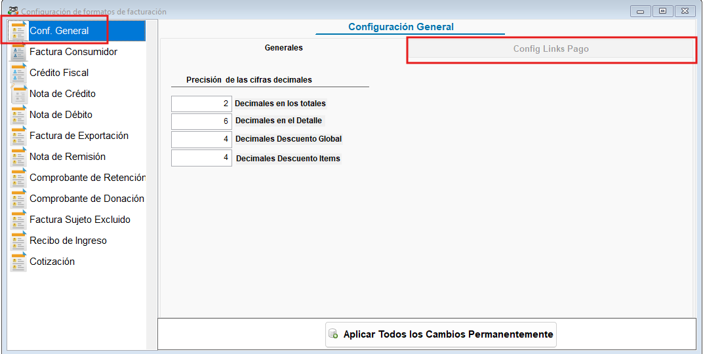
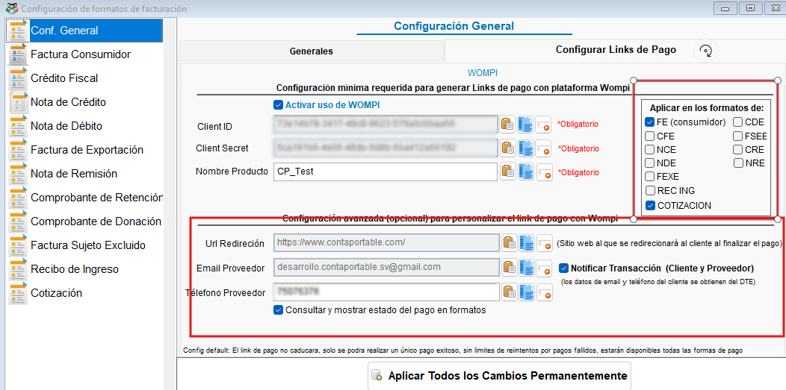
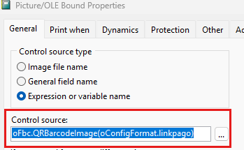
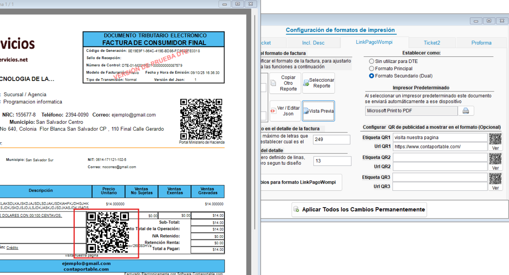
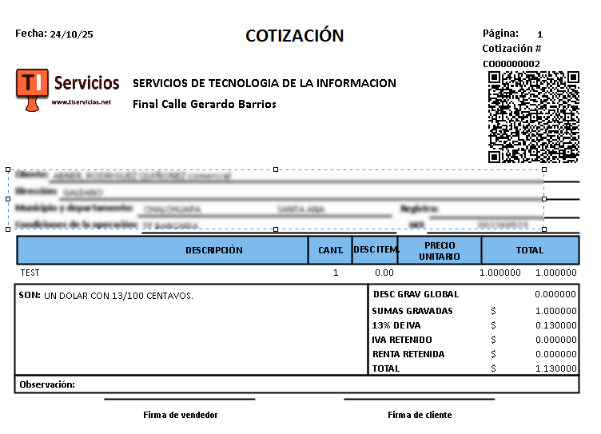
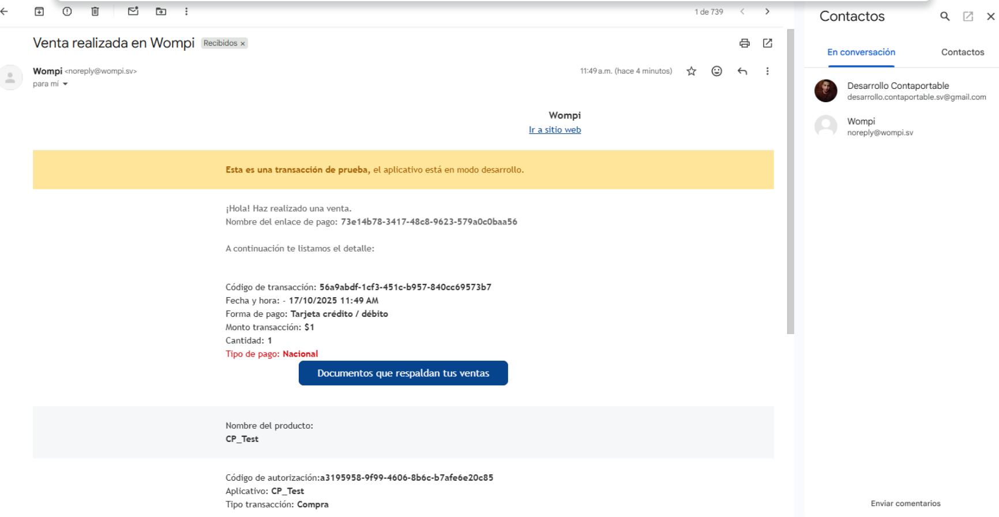
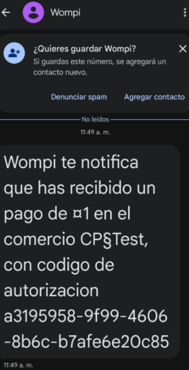
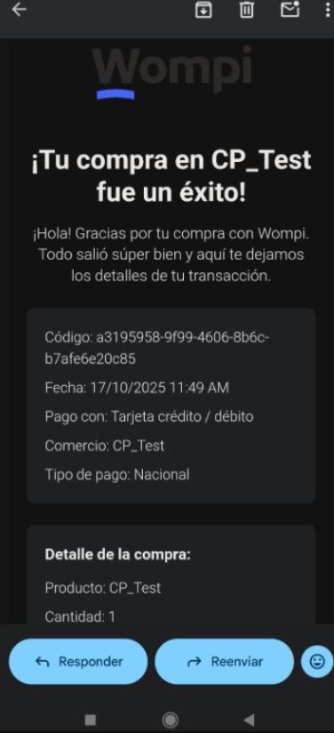

<!---
description: Generar links de pago con WOMPI
---
-->
# Generar Links de pago con plataforma WOMPI

Bienvenido a la documentación del requerimiento para configurar Links de pago con Wompi para cotizaciones y facturas desde **CONTAPORTABLE 2025**.

---

## 📌 Introducción  

En el marco de nuestro compromiso con la mejora continua en **contaporable**, se implementan la opción de configurar pasarelas de pago / cobros en línea para cotizaciones y DTE´S emitidos por los clientes mediante WOMPI

---

## ⚙️ Configuración

!!! note "Activar parametro ACTIVATELINKPAGOWOMPI"
    - :material-console: Activa el parametro **ACTIVATELINKPAGOWOMPI** y establece como valor la palabra **SI** desde la ventana de comandos en contaportable(`ctrl+F12`)
    { .align=center }
    - :material-refresh: **Reiniciar** el sistema contaportable
    - :material-file-cog: Ingresa a la configuración de formatos y desde la pestaña general selecciona la opción **Configurar links de pago**

    !!! note "Acceso Denegado a la configuración"
        :material-file-cog: Si no activas el parametro la opción aparecera deshabilitada
        { .align=center }
        - Nota: Solo los usuarios con rol de administrador podran acceder a esta configuración
    
    !!! note "Acceso a la configuración"
        { .align=center }

        - **Paso1:** Activa el uso de WOMPI
        - **Paso2:** completa la configuración minima requerida (credenciales de CLIENT ID, Secret ID de la API de Wompi y nombre del producto) Extrae esta información desde tu cuenta de wompi, en la sección negocios
        
        - **Paso3:** Selecciona los tipos de documento en los que utilizaras los links de pago
        
        - **Configuracion avanzada (Opcional):** si deseas puedes configurar una Url de redireccion a los usuarios tras realizar el pago, activar la notificación al cliente y proveedor tras completar el pago y activar consultas del estado del pago
    
    !!! note "Agregar codigo QR a la RG o formato"
        - **Paso1:** Selecciona la pestaña del formato, desde la configuración de formatos y da clic en modificar formato
        - **Paso2:** Agrega un nuevo objecto Picture OLE (puedes copiar el mismo del QR para el portal de MH)
        - **Paso3:** Dar doble clic sobre el objeto Picture OLE (que acabas de copiar en el paso anterior), y agrega la siguiente linea de código para configurar el QR de Wompi
        - **oFbc.QRBarcodeImage(oConfigFormat.linkpago)**
        - { .align=center }
        - **Paso4:** Clic en Ok / aceptar  y guardar los cambios en el formato

## 📚 Ejemplos de Uso

!!! example "Codigo QR para el link de pago para los tipos de documento selecionados"
    { .align=center }

!!! example "Codigo QR para el link de pago en cotizaciones"
    { .align=center }

!!! example "Notificaciones a cliente y proveedor por email y mensajes de texto"
    !!! example "Notificación al vendedor"
        { .align=center }
        { .align=center }

    !!! example "Notificación al comprador"
        { .align=center }

!!! Example "+ Video explicativo"
    [▶️ Reproducir video explicativo sobre la actualización](https://www.loom.com/share/a65f81cb39d043c584a0943d276c7f6e)
