<!---
description: Documentación de la funcionalidad para personalizar la nomenclatura del nombre de archivos JSON y PDF al exportar DTEs desde el módulo de Facturación. Issue #545.
--->

# Personalizar Nomenclatura de archivos al exportar el DTE (Json y Pdf)

El módulo de Facturación permite configurar el formato del nombre de archivo que se asigna a los documentos JSON y PDF al momento de exportarlos, tanto de forma masiva como individual, adaptando la nomenclatura a las necesidades operativas de cada empresa.

---

## 📌 Introducción

!!! abstract "Personalización de Nomenclatura de Archivos DTE"
    Esta funcionalidad permite al administrador del sistema definir el patrón de nombre con el que se guardarán los archivos JSON y PDF al exportar Documentos Tributarios Electrónicos (DTE). El parámetro es configurable desde la sección de ajustes del módulo de Facturación y aplica tanto a exportaciones masivas como individuales.

---

## 🎯 Objetivo

!!! info "Propósito"
    - Permitir identificar rápidamente los archivos exportados mediante nombres descriptivos y estandarizados.
    - Adaptar la nomenclatura de exportación a los procesos internos de cada empresa.
    - Aplicar el formato configurado de manera consistente en todos los tipos de exportación (JSON masivo, PDF masivo, JSON individual).

---

## 🔍 Alcance

!!! note "Módulos y funciones afectadas"
    - **Módulo:** Facturación Electrónica
    - **Tipos de archivo:** JSON y PDF
    - **Modos de exportación cubiertos:**
        - Exportación masiva de JSON
        - Exportación masiva de PDF
        - Exportación individual de JSON
    - **Configuración:** parámetro de nomenclatura en ajustes del módulo de Facturación

---

## ✨ Solución Implementada 

!!! abstract "Descripción de la solución"
    Se implementó un parámetro configurable que define el patrón de nombre de archivo aplicado en cada exportación. El sistema ofrece tres opciones de nomenclatura y aplica automáticamente el patrón seleccionado en todos los tipos de exportación disponibles.

     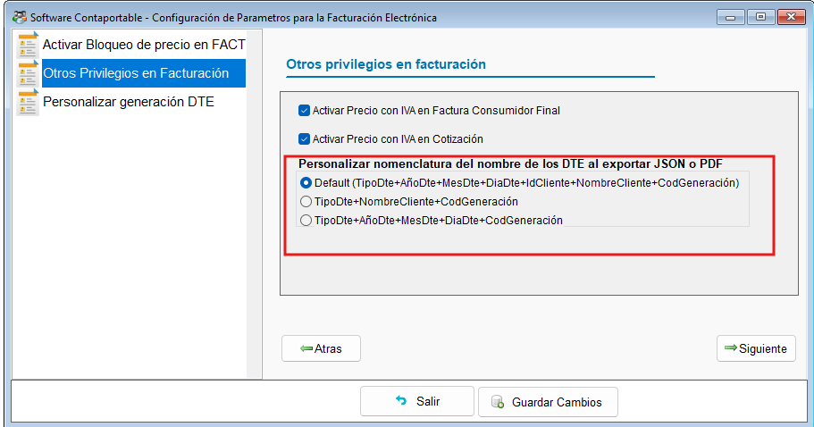{ align=center }

### 🗂️ Nomenclaturas disponibles

=== "1️⃣ Default"

    !!! note "Nomenclatura por defecto del sistema"
        El sistema utiliza el nombre de archivo predefinido. Si el nombre resultante supera la longitud máxima permitida por el sistema operativo, **se acorta automáticamente**.

        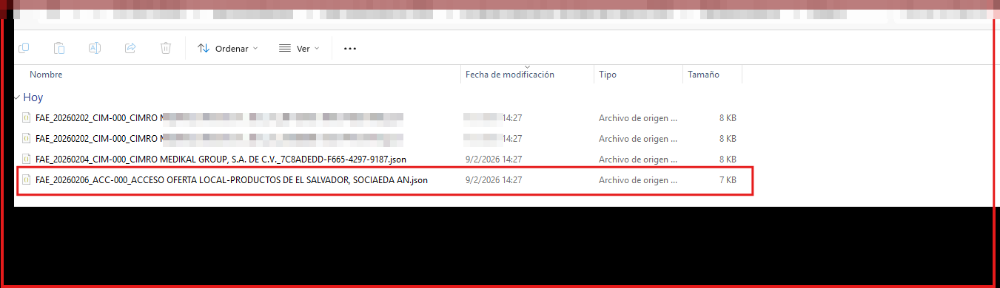{ align=center }

        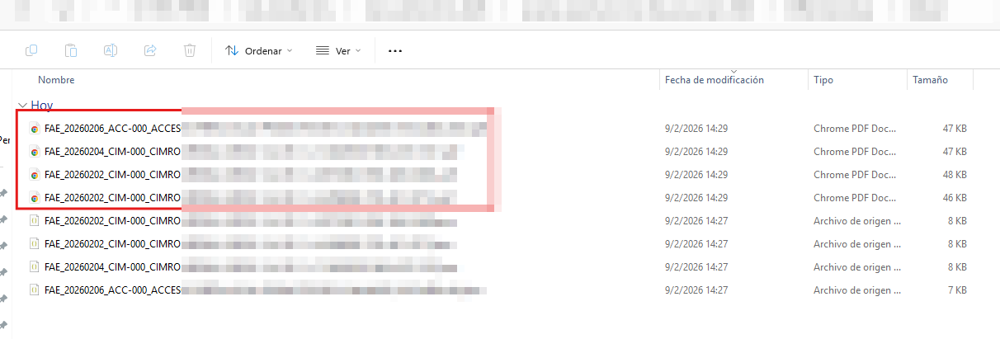{ align=center }

=== "2️⃣ TipoDte + NombreCliente + CodGen"

    !!! note "Nomenclatura con tipo de DTE, nombre del cliente y código de generación"
        El nombre del archivo combina:

        - **TipoDte** — tipo de documento tributario electrónico
        - **NombreCliente** — nombre del cliente asociado al documento
        - **CodGen** — código de generación único del DTE

        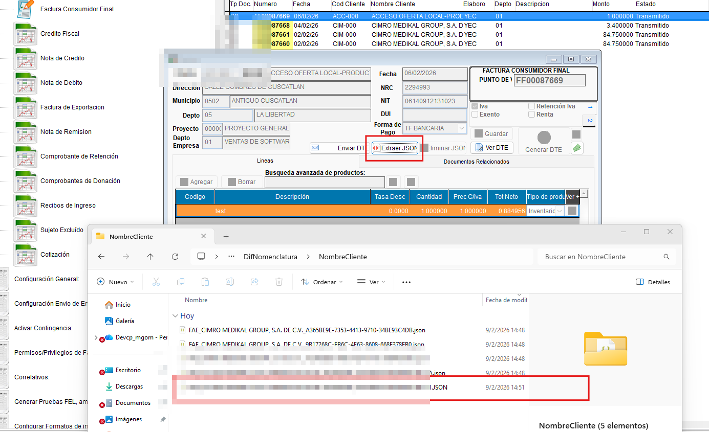{ align=center }

=== "3️⃣ TipoDte + Fecha + CodGen"

    !!! note "Nomenclatura con tipo de DTE, fecha de emisión y código de generación"
        El nombre del archivo combina:

        - **TipoDte** — tipo de documento tributario electrónico
        - **AñoDte + MesDte + DiaDte** — fecha de emisión del DTE (año, mes, día)
        - **CodGen** — código de generación único del DTE

        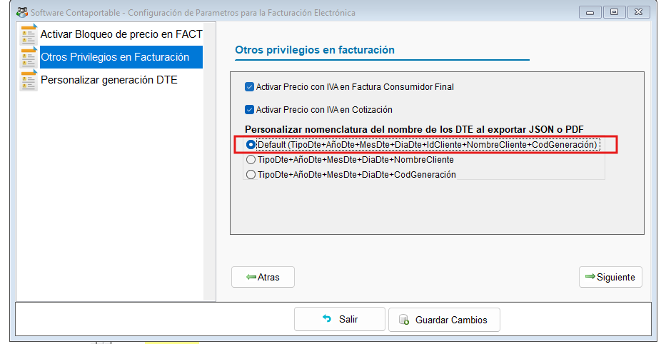{ align=center }

---

## ⚙️ Configuración Requerida

### 🔑 Configuración del parámetro de nomenclatura

!!! note "Parámetros de configuración"
    El parámetro de nomenclatura se configura desde la sección de ajustes del módulo de Facturación Electrónica.

    | Parámetro | Descripción |
    | --------- | ----------- |
    | **Nomenclatura de exportación** | Define el patrón de nombre aplicado a los archivos JSON y PDF al exportar |
    | **Default** | Nombre por defecto del sistema; se acorta automáticamente si supera la longitud máxima |
    | **TipoDte+NombreClient+CodGen** | Incluye tipo de DTE, nombre del cliente y código de generación |
    | **TipoDte+AñoDte+MesDte+DiaDte+CodGen** | Incluye tipo de DTE, fecha de emisión descompuesta y código de generación |

!!! tip "Compatibilidad"
    El parámetro aplica de forma uniforme a todos los tipos de exportación: JSON masivo, PDF masivo y JSON individual. No requiere configuración diferenciada por tipo de archivo.

---

## 🔄 Flujo Funcional

!!! example "Flujo de exportación con nomenclatura personalizada"

    === "1️⃣ Exportación JSON masiva"
        1. Acceder al módulo de Facturación Electrónica.
        2. Seleccionar los DTEs a exportar de forma masiva.
        3. Ejecutar la opción de exportación masiva de JSON.
        4. El sistema asigna automáticamente el nombre de archivo según el parámetro configurado.
        5. Los archivos se guardan con la nomenclatura definida.

        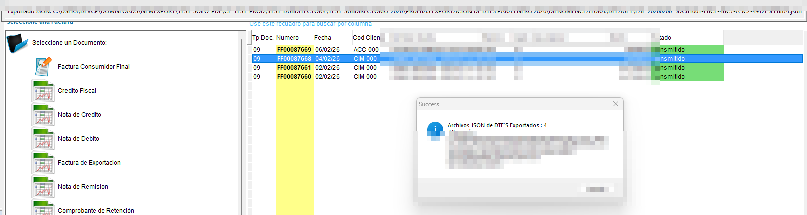{ align=center }

        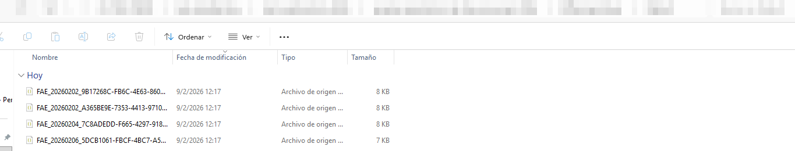{ align=center }

    === "2️⃣ Exportación PDF masiva"
        1. Acceder al módulo de Facturación Electrónica.
        2. Seleccionar los DTEs a exportar de forma masiva.
        3. Ejecutar la opción de exportación masiva de PDF.
        4. El sistema asigna el nombre de archivo según la nomenclatura configurada.
        5. Los archivos PDF se guardan con el patrón definido.

        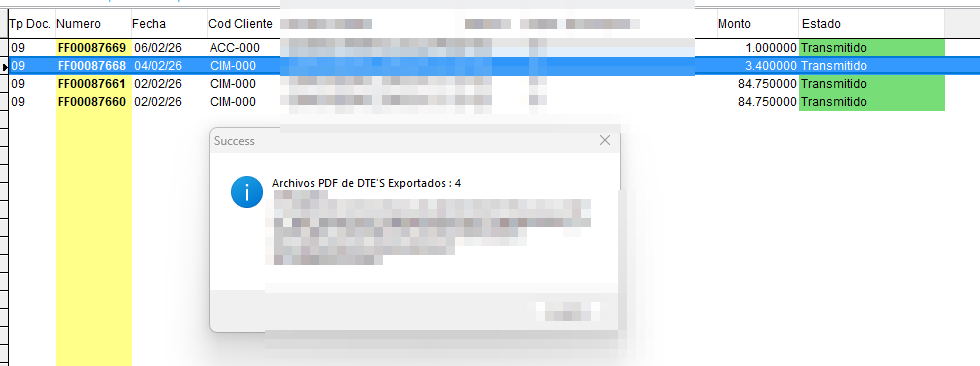{ align=center }

        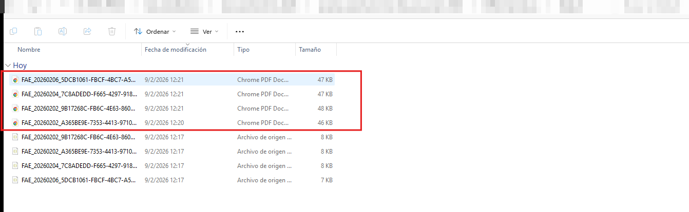{ align=center }

    === "3️⃣ Exportación JSON individual"
        1. Acceder al detalle del DTE desde el módulo de Facturación.
        2. Ejecutar la opción de exportar JSON individual.
        3. El sistema aplica el patrón de nomenclatura configurado al archivo resultante.

        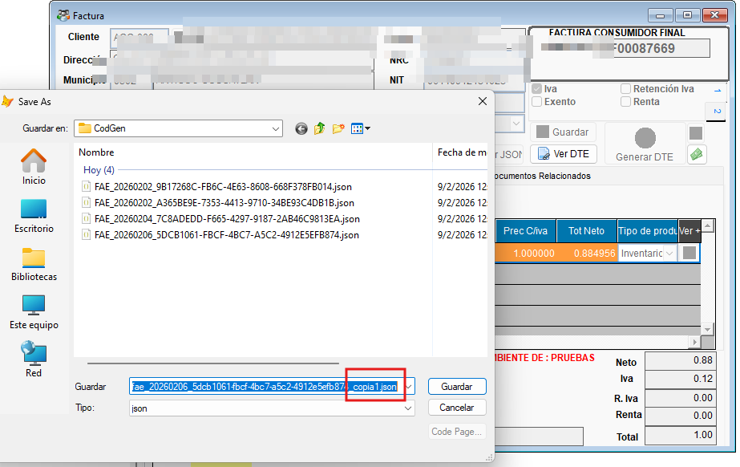{ align=center }

---

## ☑️ Validaciones y Pruebas Realizadas 🧪

!!! info "Compilado validado"
    Las pruebas se realizaron sobre el compilado **EXE_2026_03_20_03.exe**.

!!! example "Tipos de validaciones y pruebas Realizadas"
    ??? example "Exportación con variaciones de nombre"
        La exportación con las tres opciones de nomenclatura fue validada exitosamente. Los archivos generados respetan el patrón configurado en los tres modos de exportación.

        - :material-check-circle: Nomenclatura **Default** en exportación masiva: **confirmada**
        - :material-check-circle: Nomenclatura **TipoDte+NombreClient+CodGen**: **confirmada**
        - :material-check-circle: Nomenclatura **TipoDte+AñoDte+MesDte+DiaDte+CodGen**: **confirmada**
        - :material-check-circle: Exportación JSON masiva con nomenclatura personalizada: **exitosa**
        - :material-check-circle: Exportación PDF masiva con nomenclatura personalizada: **exitosa**
        - :material-check-circle: Exportación JSON individual con nomenclatura personalizada: **exitosa**

        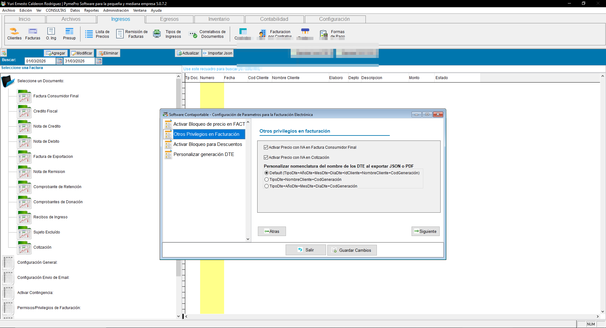{ align=center }

        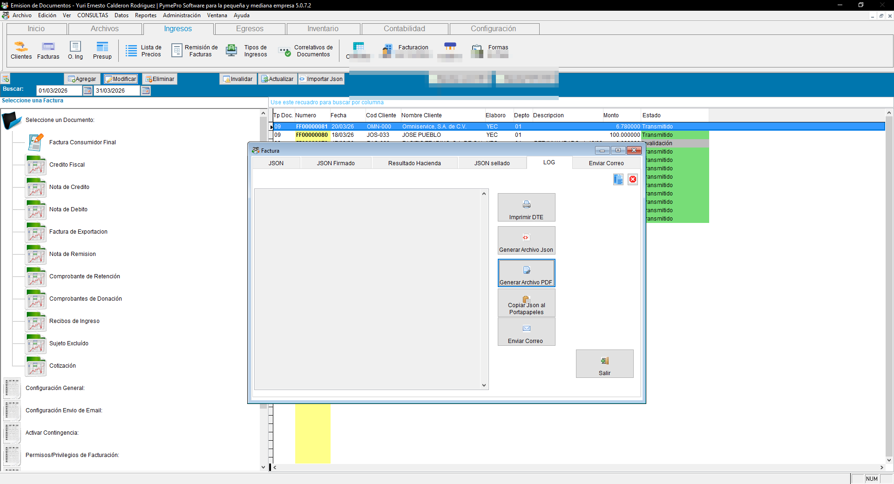{ align=center }

        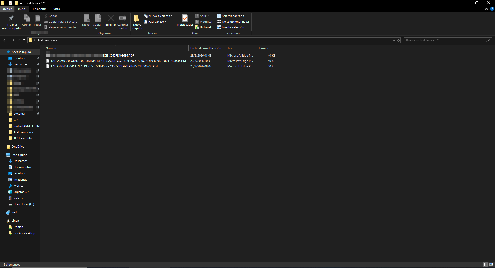{ align=center }

---