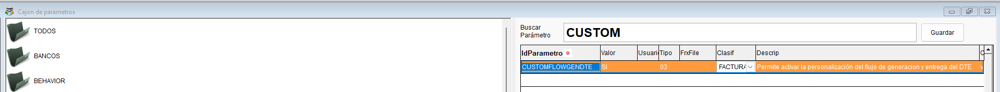
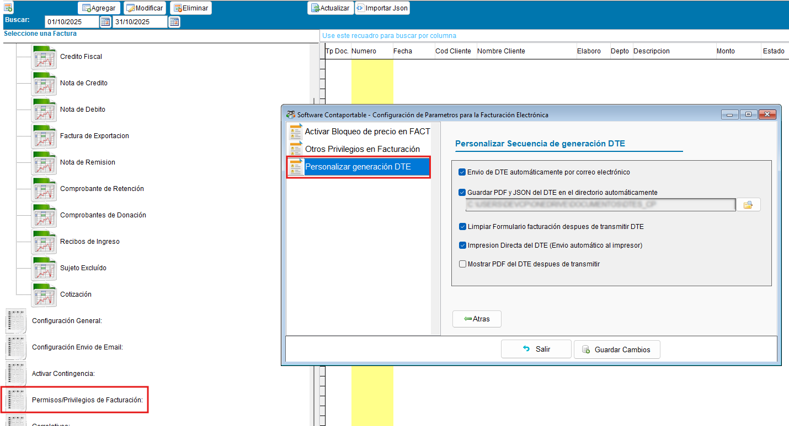

<!---
description: Personalizar secuencia generacion y entrega DTE, ORIGEN: CACCEL
---
-->
# Personalizar secuencia generación y entrega DTE - Documentación

Bienvenido a la documentación del requerimiento Personalizar secuencia generación y entrega del DTE automáticamente **CONTAPORTABLE 2025**.

---

## 📌 Introducción  

La actualización nace de la necesidad de poder agilizar el proceso de impresión y entrega del DTE de forma automática, útil para los clientes que facturan mucho o necesitan saltarse el paso del envio del DTE por correo manualmente y necesitan que el sistema este listo para hacer un nuevo DTE, agilizando la facturación en situaciones de alta demanda

---

## ⚙️ Configuración

!!! note "Activar parametro CUSTOMFLOWGENDTE"
    - :material-console: Activa el parametro **CUSTOMFLOWGENDTE** y establece como valor la palabra **SI** desde la ventana de comandos en contaportable(`ctrl+F12`)
    { .align=center }
    - :material-refresh: **Reiniciar** el sistema contaportable
    - :material-file-cog: Ingresa a la configuración de **Permisos/Privilegios de Facturación** y activa o combina las opciones que necesites, para modificar la secuncia en la generación y entrega del dte.
    - :material-email: Envio de DTE automáticamente por Email (al activarse esta opción)
    { .align=center }
  
## 📚 Privilegios

!!! tip "Descripción de privilegios"
    !!! tip "Envio Automático del DTE por email"
        - Al activarse esta opción en caso de tener configurado el formato secundario (Dual) se utilizará este formato en el envio del correo del correo automatico, de lo contrario usará el formato principal

    !!! tip "Guardar PDF Y JSON en el directorio automáticamente"
        - Utiliza el mismo directorio en donde se estan guardando los json actualmente al exportarlos desde el formulario de facturación, para almacenarlos automaticámente, pero tambien permite modificar la ubicación desde la configuración

    !!! tip "Limpiar Formulario después de transmitir DTE"
        - Esta función cierra la ventana del log de proceso de transmisión del DTE mostrado al usuario y prepara el formulario para realizar una nueva factura

    !!! tip "Impresion Directa del DTE"
        - Imprime el formato principal sin generar vista previa despúes de transmitir el DTE

    !!! tip "Mostrar PDF de DTE después de transmitir"
        - Abre el PDF del DTE automáticamente después de transmitir (en caso de estar activo)

!!! Example "+ Video explicativo"
    [▶️ Reproducir video explicativo sobre la actualización](https://www.loom.com/share/b7729def53554a09b1c80f631980f583)