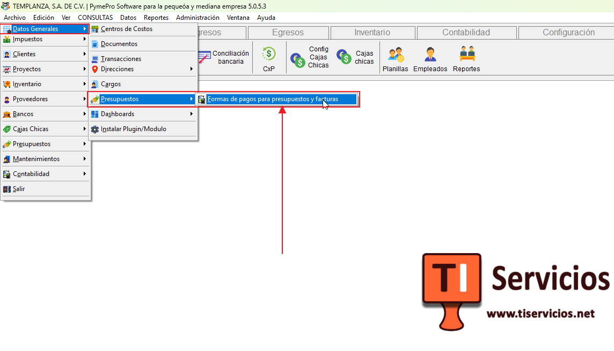
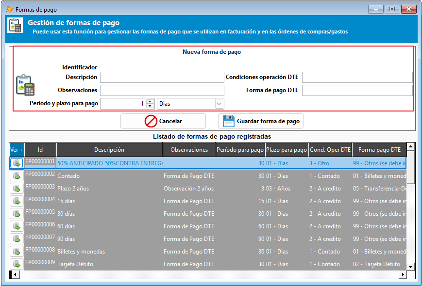
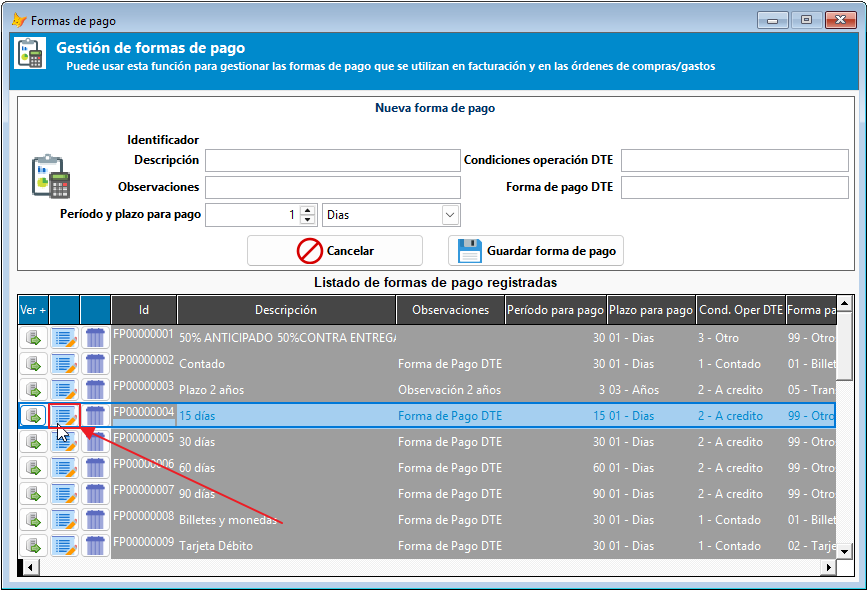
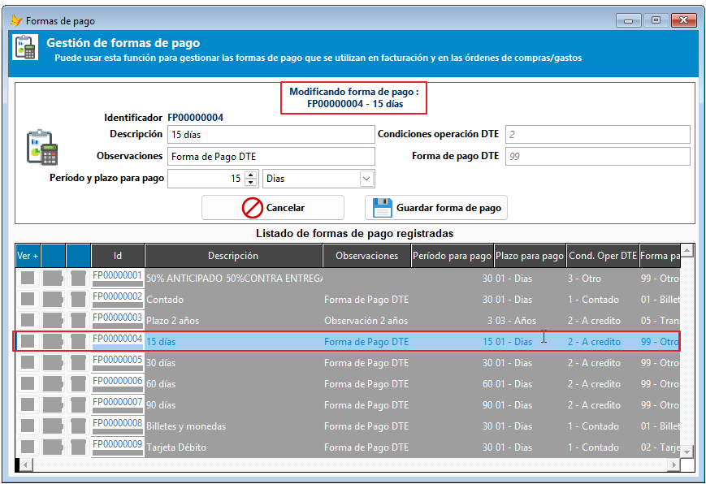
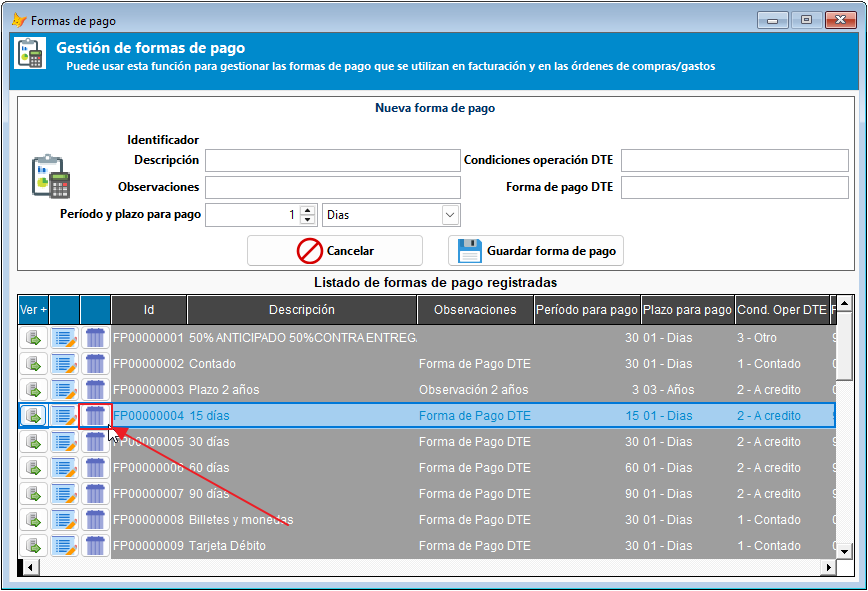
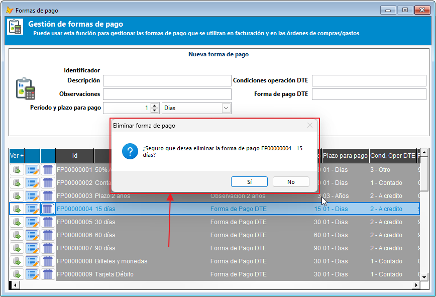
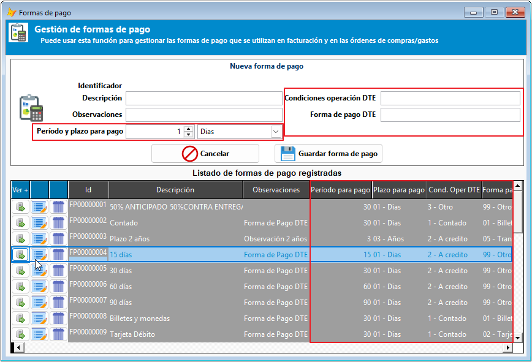

# 💳 Formas de pago

Esta guía explica cómo usar el módulo de formas de pago para registrar, consultar, modificar y eliminar los métodos de pago que se emplean en facturación, órdenes de compra y otros procesos del sistema.

!!! tip "Objetivo del módulo"
    El módulo permite mantener un catálogo ordenado de formas de pago con información útil para la emisión de documentos y para los procesos operativos que requieren este dato, además permite emparejar la información con los catálogos DTE para que la facturación .

## 1. Acceso al módulo

Para abrir el módulo:

1. Ingrese al menú de archivos o de datos generales según la versión del sistema.
2. Abra la opción de formas de pago.
3. Revise la lista de registros disponibles en la pantalla principal, cree uno nuevo o modifique uno existente.

!!! tip "Qué observar al abrir la lista"
    La pantalla principal debe mostrar el catálogo activo de formas de pago, con los registros disponibles para facturación y otros procesos.

## 2. Crear una forma de pago

Para crear un nuevo registro:

1. Verifique que la etiqueta superior diga "Nueva forma de pago".
2. Complete los campos requeridos, como descripción, observaciones y condiciones de pago.
3. Revise la información relacionada con DTE: 
    - Condición de operación.
    - Código o referencia de la forma de pago.
    - Plazo.
    - Periodo.
4. Guarde los cambios.

!!! tip "Datos esenciales al crear un registro"
    Cuando agregue una forma de pago nueva, revise la descripción, el plazo y la información relacionada con DTE para que el registro sea consistente con los documentos que se emitirán.

## 3. Modificar una forma de pago

Si necesita actualizar un registro existente:

1. Seleccione la forma de pago en la lista.
2. En los botones de acción rápida, de click en el botón de modificar.

3. Ajuste los campos necesarios, notando que la etiqueta superior indica el modo de edición.

4. Guarde los cambios.

!!! tip "Revisión previa al editar"
    Antes de modificar un registro, confirme que no está siendo usado en procesos activos o en documentos pendientes, para evitar inconsistencias operativas.

## 4. Eliminar una forma de pago

Para eliminar un registro:

1. Seleccione la forma de pago que desea eliminar.
2. Use la opción de eliminar.

3. Confirme la acción cuando el sistema lo solicite.

!!! warning "Validación previa"
    Antes de eliminar, verifique que el registro no esté asociado a procesos o documentos que aún dependan de él.

## 5. Datos relacionados con DTE

El módulo también permite registrar información vinculada con documentos tributarios, como:

- Condición de operación.
- Código o referencia de la forma de pago.
- Plazo.
- Periodo.

Estos datos deben ser consistentes con la configuración del catálogo y con el tipo de documento que se vaya a emitir.

!!! tip "Validación de datos DTE"
    Si el sistema exige información tributaria para la forma de pago, revise que los datos sean correctos antes de guardar el registro, especialmente si el cambio se aplicará a documentos ya programados.

## 6. Recomendaciones de uso

- Use nombres claros y consistentes para cada forma de pago.
- Revise los datos DTE antes de usar un registro en documentos reales.
- Evite duplicar registros similares.
- Confirme los cambios antes de eliminar una forma de pago que pueda estar en uso.

## 7. Buenas prácticas

- Mantenga el catálogo actualizado conforme cambien los procesos de la empresa.
- Registre únicamente las formas de pago que realmente se utilizarán.
- Revise periódicamente si algunos registros ya no son necesarios.
- Considere documentar cambios importantes para el área contable y de facturación.
