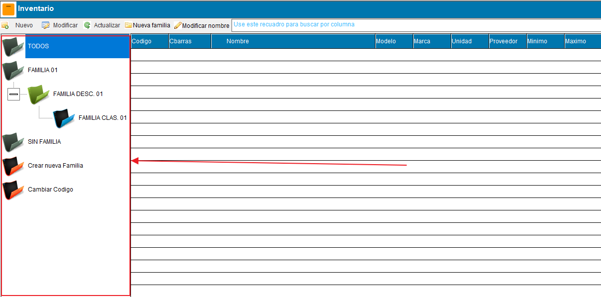
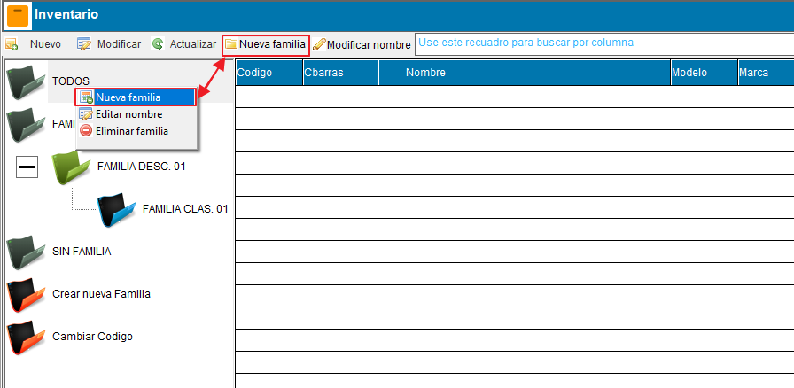
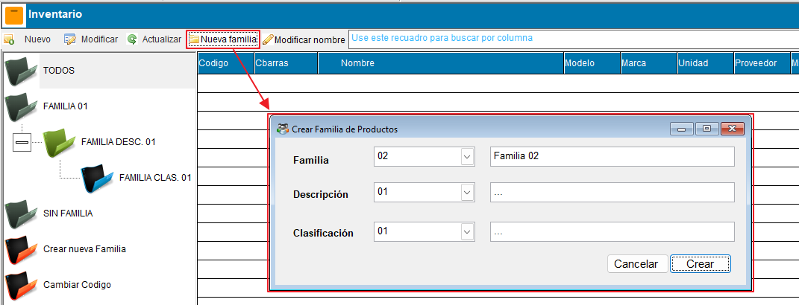
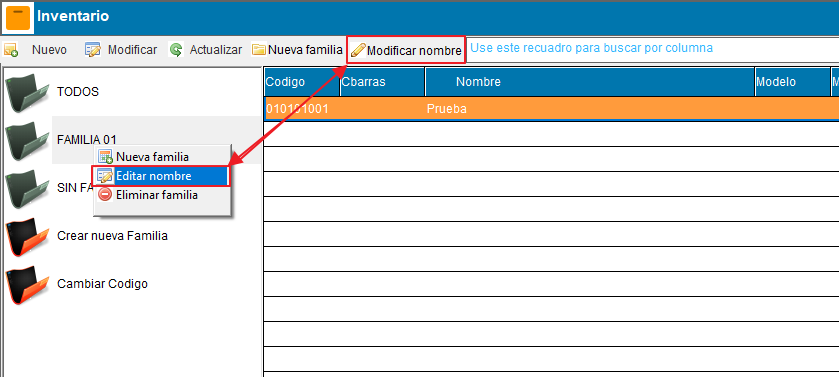
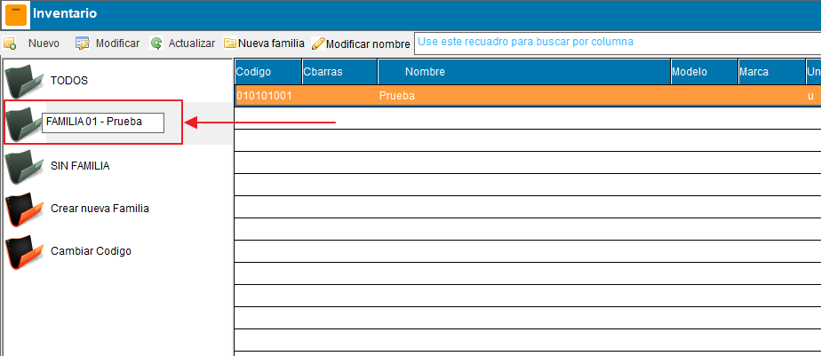
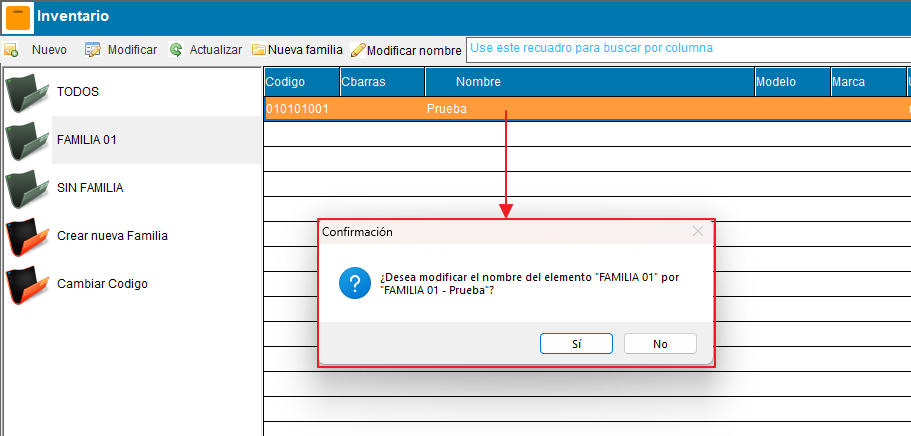
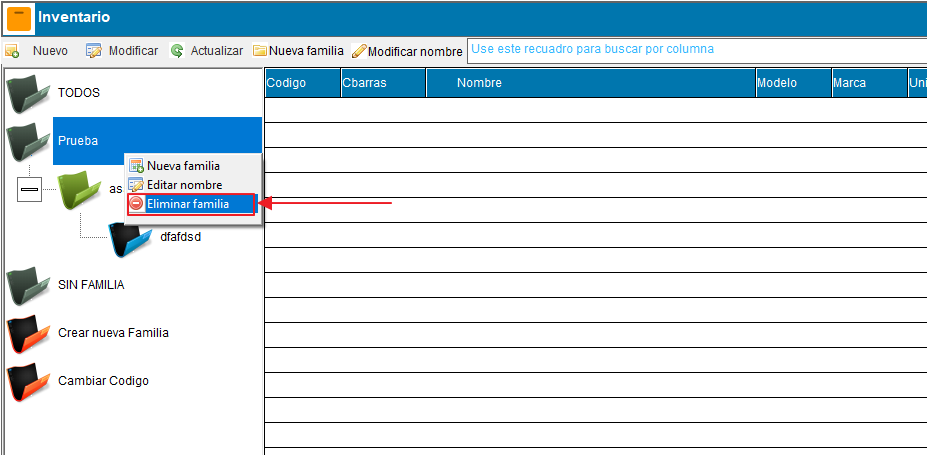
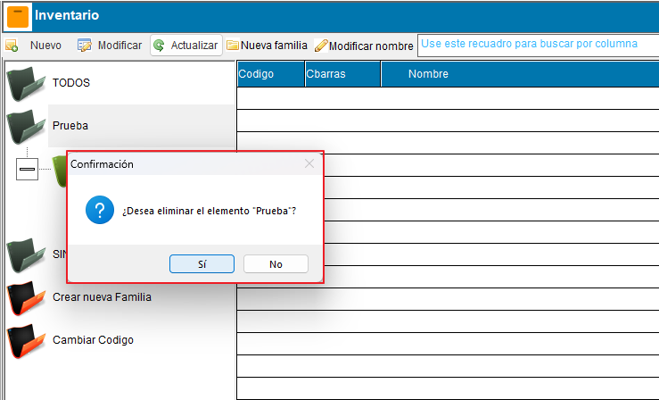
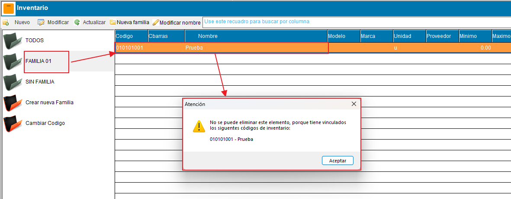
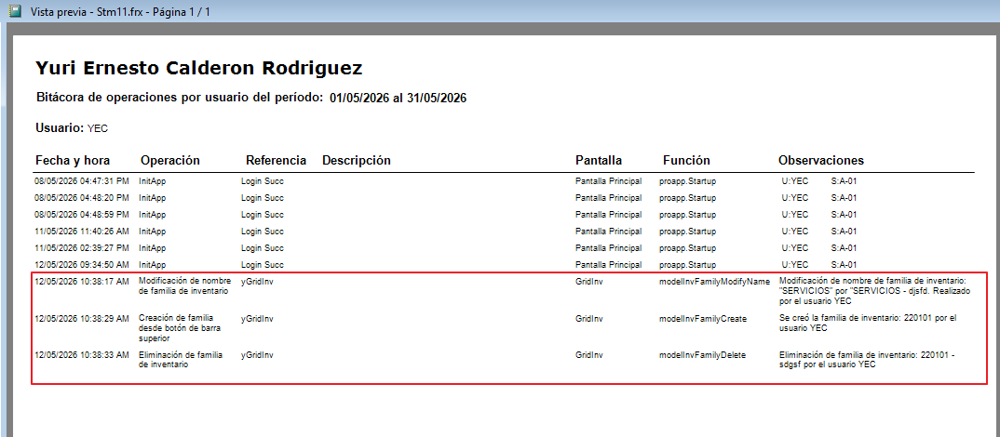

# 🗃️ **Gestión de familias de inventario**

Esta guía detalla el funcionamiento de las **Familias de Inventario**, diseñadas para organizar y clasificar los productos/materiales/items de inventario de forma jerárquica y eficiente.

!!! abstract "Parte del módulo de Inventario"
    Esta página forma parte de la [Gestión de Inventario](GestionInventario.md). Para dar de alta o editar productos individuales, vea la [Ficha de Inventario](FichaInventario.md); para editar varios productos a la vez, vea la [Edición del listado de inventario](ListadoInventario.md).

---

## 📂 **1. Acceso al formulario**

Para gestionar las familias, puede acceder de las siguientes maneras:

1. **Vista Lateral**: Abra la gestión de inventario; el árbol de familias es visible permanentemente a la izquierda.
2. **Barra de Herramientas**: Presione el botón **Familias de inventario** para desplegar un menú con las opciones **Nueva familia**, **Editar nombre** y **Eliminar familia**.
3. **Menú Contextual**: Haga **clic derecho** sobre cualquier nodo del árbol para desplegar el mismo menú de opciones.

!!! info "Un solo botón para todas las acciones"
    Crear, renombrar y eliminar familias se realiza desde el botón **Familias de inventario** de la barra superior, o desde el clic derecho sobre el árbol. Ambos despliegan el mismo menú de opciones.

    

    { align=center }
    

---

## ➕ **2. Crear una nueva familia**

Siga estos pasos para registrar una nueva familia de inventario que aparecerá en el árbol:

1. **Inicie la acción**: Presione el botón **Familias de inventario** y seleccione **Nueva familia**, o haga clic derecho sobre el árbol y elija la misma opción.
2. **Seleccione el Segmento**: En el formulario, elija el primer prefijo de la familia según su configuración. El sistema sugerirá automáticamente el siguiente código disponible.
3. **Complete los Datos**: Rellene los campos obligatorios:
    * **Familia**
    * **Descripción**
    * **Clasificación**.
4. **Finalice**: Pulse el botón `Crear`. El sistema validará que el código no esté duplicado y en caso de no estarlo, se agregará la nueva familia al árbol.

!!! note "Creación de una nueva familia de inventario"
    

    { align=center }

    { align=center }
    

    

    *Existen tres formas de crear una familia: desde el nodo dedicado en el árbol de familias, dando click derecho a un nodo existente o desde el botón "Familias de inventario" que se encuentra en la barra de herramientas.*
    

---

## ✏️ **3. Modificar familias**

Puede editar los nombres, descripciones y clasificaciones existentes:

1. **Seleccione el elemento en el árbol**: Marque en el árbol el elemento que desea modificar.
2. **Active la edición**: Presione el botón **Familias de inventario** y seleccione **Editar nombre**, o utilice el clic derecho sobre el nodo para desplegar el mismo menú contextual.
3. **Actualice**: El sistema habilitará la modificación directa del texto desde el árbol. Escriba el nuevo nombre de la familia y presione Enter para guardar, el sistema mostrará un mensaje de confirmación para proceder con el cambio de nombre del elemento de la familia.

!!! info "Nota de Seguridad"
    Los elementos  **"Todos"**, **"Crear nueva familia"**, **"Cambiar código"**,  **"Sin Familia"**, son nodos creados automáticamente, por esta razón están protegidos por el sistema y no pueden ser renombrados ni eliminados, si lo intentara el sistema mostrará un mensaje de advertencia y restringirá la acción.

!!! note "Modificación de nombre de familia desde el árbol"
    

    { align=center }

    { align=center }

    { align=center }
    

---

## 🗑️ **4. Eliminar familias**

El proceso de eliminación incluye medidas de seguridad para proteger la integridad de los datos y que no se vaya a eliminar una familia que tiene productos asociados

1. **Acción**: Seleccione el nodo en el árbol y, desde el botón **Familias de inventario** o con clic derecho, elija **Eliminar familia**.
2. **Confirmación**: El sistema solicitará una confirmación explícita por medio de un mensaje
3. **Validación de Uso**:
    * Si la familia tiene productos asociados, el sistema **bloqueará** la acción.
    * Solo se permite eliminar familias sin códigos de inventario vinculados.

!!! note "Eliminación de familia de inventario desde el árbol"
    

    { align=center }

    { align=center }
    

---

!!! warning "Restricción de Borrado"
    

    { align=center }
    

    *Mensaje de advertencia cuando existen códigos de inventarios vinculados a la familia que se intenta eliminar.*

---

## 🕘 **5. Auditoría y bitácora**

Todas las operaciones críticas quedan registradas para su posterior revisión:

- **Eventos registrados**: creación, modificación y eliminación.
- **Detalles**: usuario, fecha/hora, operación y observaciones del cambio.

!!! note "Referencia visual: bitácora"
    

    { align=center }
    

---

## 📌 **6. Buenas prácticas**

- Defina la estructura de familias antes de dar de alta productos, ya que determina cómo se agrupan en varios reportes de inventario.
- Use descripciones claras: el nombre de la familia aparece en el listado de productos y en los reportes consolidados.
- Antes de eliminar una familia, reasigne o dé de baja los productos vinculados; el sistema no permite eliminarla mientras tenga códigos asociados.

## 🔗 **7. Páginas relacionadas**

- [Gestión de Inventario](GestionInventario.md)
- [Ficha de Inventario](FichaInventario.md)
- [Edición del listado de inventario](ListadoInventario.md)
- [Reportes de inventario](../../Reports/categorias/inventario.md)
