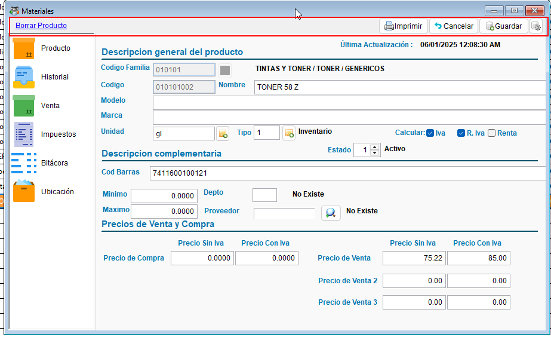
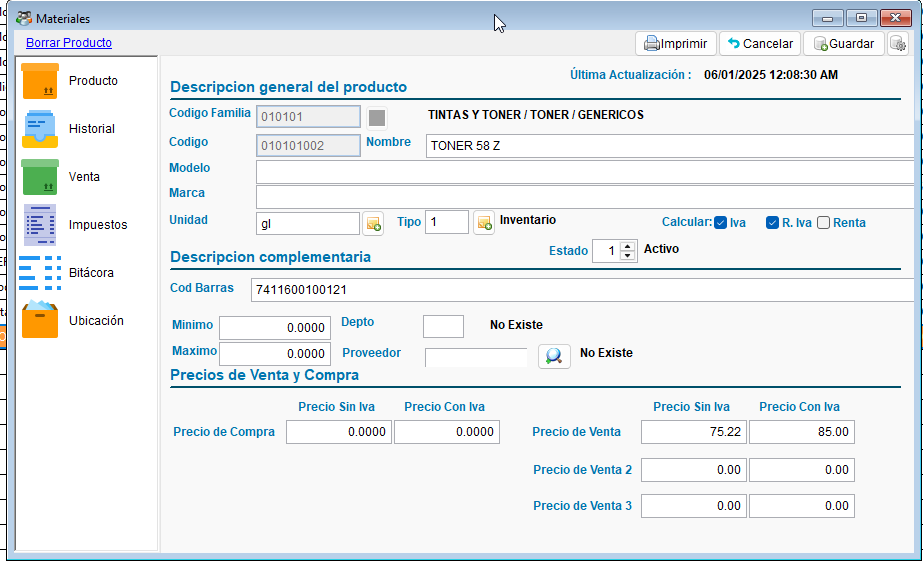
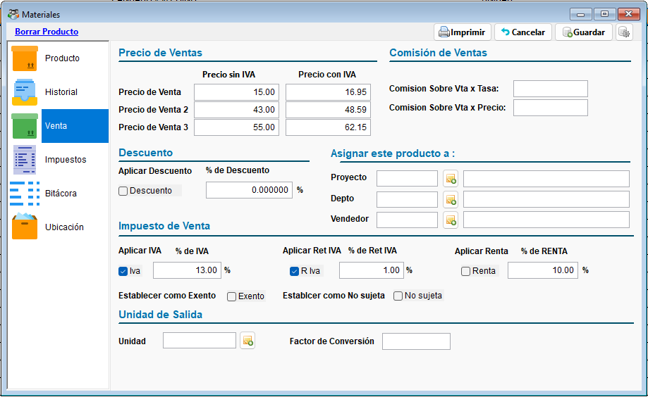
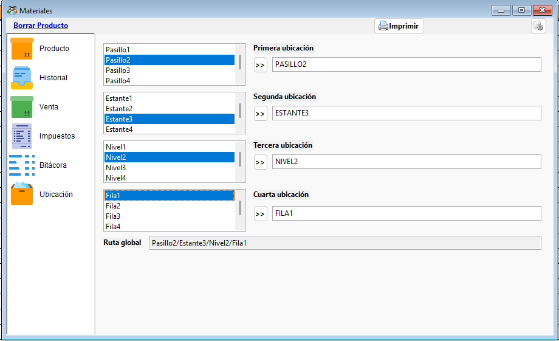
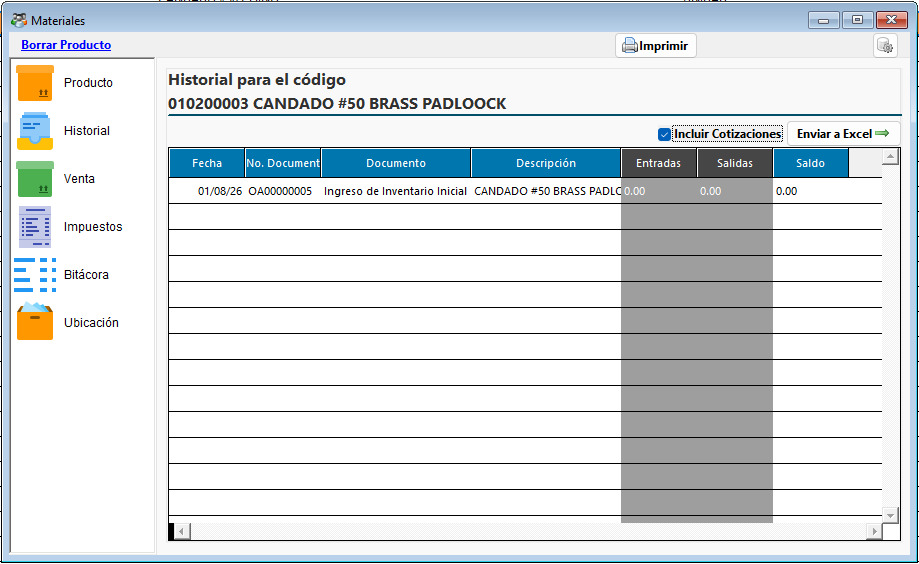
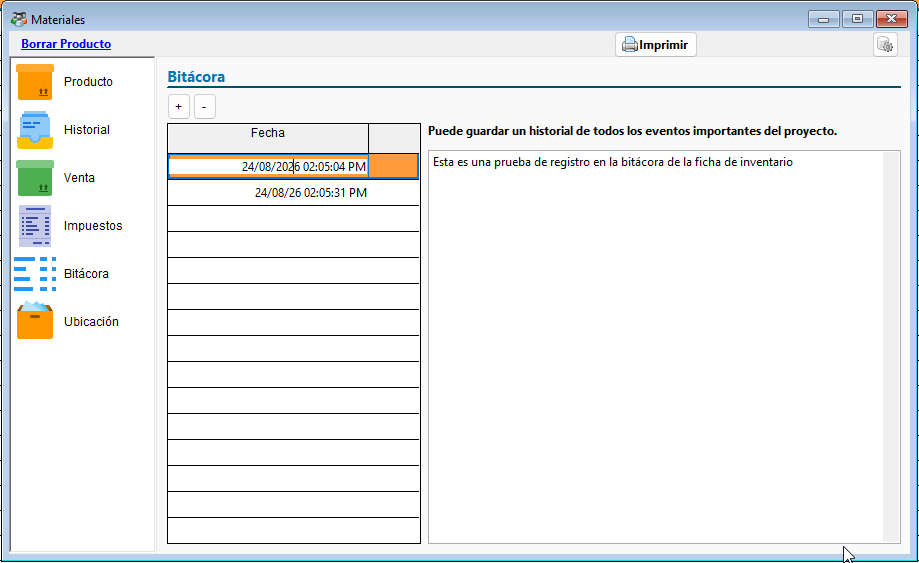
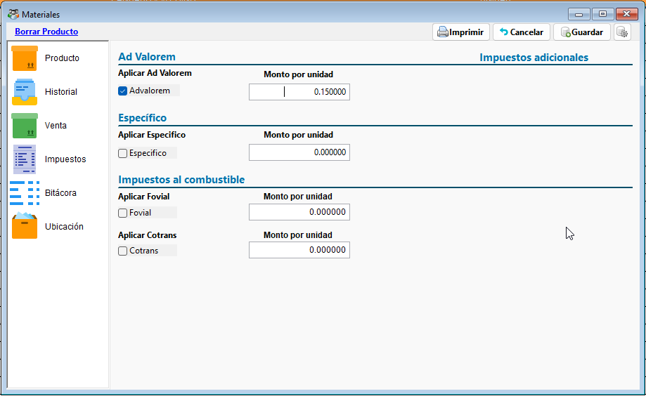

# 🗂️ **Ficha de Inventario**

La **Ficha de Inventario** es el formulario de mantenimiento individual de cada producto o material. Desde aquí se registran y completan todos los datos de un ítem: información general, precios, ubicación física, historial de compras, notas y configuración de impuestos.

Se abre desde el [listado de ítems](GestionInventario.md#4-el-listado-de-items) al crear un producto nuevo o al modificar uno existente.

!!! abstract "Parte del módulo de Inventario"
    Esta página forma parte de la [Gestión de Inventario](GestionInventario.md). Si solo necesita corregir datos puntuales en varios productos a la vez, use la [Edición del listado de inventario](ListadoInventario.md).

## 🧰 **1. Acciones principales**

En la parte superior de la ficha encontrará:

| Acción | Descripción |
| ------ | ----------- |
| **Guardar** | Guarda los datos capturados o modificados en el producto. |
| **Cancelar** | Descarta los cambios no guardados y cierra la ficha. |
| **Imprimir** | Genera un reporte con los datos del producto. |
| **Borrar Producto** | Elimina el producto actual. Disponible solo si no tiene movimientos asociados. |
| **Configuración** (ícono de engranaje) | Permite definir la longitud de los códigos de inventario y de familia, y activar o desactivar la creación asistida de códigos. |

{ align=center }

## 📄 **2. Pestaña "Generales"**

Contiene los datos básicos e identificación del producto:

- **Código**, **Código de barras** y **Código de familia**.
- **Nombre**, **Modelo** y **Marca**.
- **Unidad** de medida y **Proveedor**.
- **Mínimo** y **Máximo** de existencias.
- **Tipo** y **Departamento**.
- **Descripción general** y **descripción complementaria** del producto.
- **Estado** del producto (activo o inactivo).
- **Última actualización**.

{ align=center }

### Precios

En la misma pestaña se configuran los precios del producto:

- **Precio de compra**.
- **Precio de venta**, **Precio de venta 2** y **Precio de venta 3**.
- Un calculador de **Precio sin IVA / Precio con IVA**, para obtener uno a partir del otro automáticamente.
- Casillas para indicar si el producto aplica **IVA**, **Retención de IVA** y **Retención de Renta**.

{ align=center }

!!! tip "Búsqueda dentro de la ficha"
    En la parte superior de esta pestaña puede buscar otro producto sin cerrar la ficha actual, lo que resulta útil para revisar varios ítems de forma consecutiva.

!!! tip "Catálogos de apoyo a un clic de distancia"
    Junto a los campos de **Código de familia**, **Unidad**, **Proveedor** y **Tipo** encontrará accesos directos para crear un registro nuevo en cada catálogo sin salir de la ficha, en caso de que el que necesita todavía no exista.

## 📍 **3. Pestaña "Ubicación"**

Permite registrar hasta **cuatro niveles de ubicación física** del producto en la bodega —por ejemplo bodega, pasillo, estante y nivel—, además de una **ruta global** que resume la ubicación completa.

Esto facilita encontrar físicamente el producto al momento de despacharlo o de hacer un conteo de inventario.

{ align=center }

## 🕘 **4. Pestaña "Historial"**

Muestra el historial de movimientos del producto:

- Un listado de los documentos donde participa el producto (compras, ajustes, etc.), con la opción de **incluir o no las cotizaciones** y de **exportarlo a Excel**.
- Un resumen de **balance de cuentas por pagar** asociado al producto: compras al crédito, pagos realizados y saldo actual.

{ align=center }

!!! info "Lote y fecha de vencimiento"
    En productos configurados bajo el perfil **FactStyle MEDICA**, el historial incluye además las columnas de **lote** y **fecha de vencimiento** de cada movimiento.

## 📓 **5. Pestaña "Bitácora"**

Permite llevar notas manuales sobre el producto: eventos importantes, acuerdos con proveedores, observaciones de calidad, entre otros. Use los botones **"+"** y **"-"** para agregar o quitar una nota del listado.

{ align=center }

!!! info "Diferencia con la bitácora del sistema"
    Estas notas son de uso libre para el usuario y se guardan junto al producto. Son independientes del registro automático de auditoría del sistema (creación, modificación, etc.), que se consulta desde la bitácora general de ContaPortable.

## 💵 **6. Pestaña "Venta"**

Reúne la configuración de facturación del producto:

- **Impuesto de venta**: aplicar IVA, Retención de IVA o Retención de Renta, con su porcentaje correspondiente.
- **Descuento**: activar un descuento por defecto y su porcentaje.
- **Exenciones**: marcar el producto como **Exento** o **No sujeto**.
- **Comisión de ventas**: por precio o por tasa, para el cálculo de comisiones al vendedor.
- **Asignación del producto**: a un vendedor, proyecto y/o departamento específico por defecto.
- **Unidad de salida y factor de conversión**: cuando el producto se vende en una unidad distinta a la de su existencia (por ejemplo, comprar por caja y vender por unidad).

{ align=center }

## ⛽ **7. Pestaña "Impuestos"**

Permite configurar los **impuestos adicionales** aplicables al producto, utilizados típicamente en combustibles y productos específicos:

- **Ad Valorem**
- **Cotrans**
- **Específico**
- **Fovial**

Cada uno se activa de forma independiente y admite un **monto por unidad**. Además, existe la opción de configurar **otro impuesto** personalizado, indicando su nombre, código de tributo, tipo de cálculo (porcentaje o valor fijo) y el monto o porcentaje correspondiente.

{ align=center }

## 📌 **8. Buenas prácticas**

- Complete la pestaña de **Ubicación** si maneja bodegas grandes; agiliza notablemente el despacho y los conteos físicos.
- Revise la pestaña de **Impuestos** en productos como combustibles, para evitar omitir un impuesto específico obligatorio.
- Use la **Bitácora** del producto para dejar constancia de negociaciones o condiciones especiales con proveedores, en lugar de depender de la memoria del equipo.
- Antes de usar **Borrar Producto**, considere **Cambiar Estado** a inactivo si el producto ya tiene movimientos registrados, ya que el sistema no permite eliminar productos con historial.

## 🔗 **9. Páginas relacionadas**

- [Gestión de Inventario](GestionInventario.md)
- [Edición del listado de inventario](ListadoInventario.md)
- [Gestión de familias de inventario](FamiliaInventario.md)
- [Parámetros Generales](../../Parametros/ParametrosGenerales.md)
