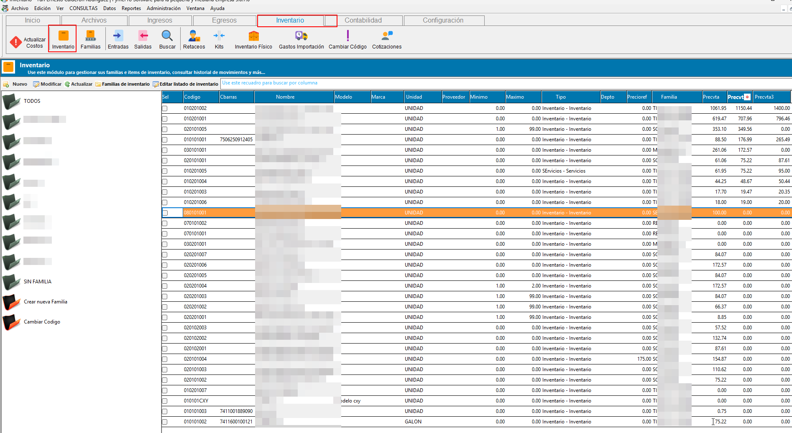
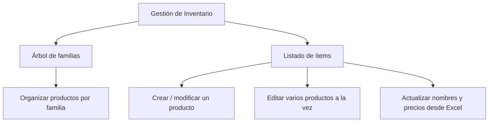
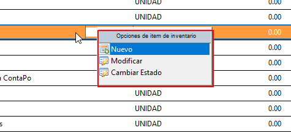

# 📦 **Gestión de Inventario**

Esta guía es el punto de partida para administrar el inventario en **ContaPortable**: explica cómo se accede al módulo, cómo está organizada la pantalla principal y hacia dónde dirigirse según lo que necesite hacer.

## 📂 **1. Acceso al módulo**

Para abrir la gestión de inventario:

1. En la barra de herramientas superior, haga clic en el panel **"Inventario"**.
2. Abra la opción de gestión de inventario (listado de productos/materiales).

{ align=center }

## 🖥️ **2. Estructura de la pantalla principal**

La pantalla principal se divide en dos áreas:

- **Árbol de familias** (lateral izquierdo): organiza los productos por familia y permite filtrar el listado según la familia seleccionada.
- **Listado de ítems** (cuadrícula central): muestra todos los productos/materiales de inventario, o solo los de la familia seleccionada en el árbol.

{ align=center }

## 🗺️ **3. ¿Qué puedo hacer desde aquí?**

| Necesito... | Dónde hacerlo |
| ----------- | ------------- |
| Dar de alta un producto nuevo, o revisar y editar todos sus datos (precios, impuestos, ubicación, historial de compras, etc.) | Clic derecho sobre el listado → **Nuevo** o **Modificar**, para abrir la [Ficha de Inventario](FichaInventario.md). |
| Activar o desactivar un producto sin eliminarlo | Clic derecho sobre el listado → **Cambiar Estado**. |
| Corregir rápidamente varios productos a la vez (nombre, precios, mínimos/máximos, etc.) sin abrir cada ficha | Botón **Edición masiva** → **Habilitar edición directa en listado de inventario**, ver [Edición del listado de inventario](ListadoInventario.md). |
| Actualizar los nombres y los precios de venta de muchos productos a partir de un archivo de Excel | Botón **Edición masiva** → **Importar nombres y precios desde plantilla de Excel...**, ver [Importar nombres y precios desde Excel](ImportarPreciosExcel.md). |
| Crear, renombrar o eliminar una familia de inventario | Botón **Familias de inventario** o clic derecho sobre el árbol, ver [Gestión de familias de inventario](FamiliaInventario.md). |
| Registrar una salida de inventario por requisición, merma o pérdida | Ver [Gestión de requisiciones, mermas y pérdidas](requisiciones-mermas-y-perdidas.md). |

## 📋 **4. El listado de ítems**

Al seleccionar una familia en el árbol (o el nodo "Todos"), el listado central muestra los productos correspondientes con su código, nombre, precios, existencias mínima y máxima, familia, proveedor y demás datos de referencia. Puede consultar el detalle de las columnas disponibles en [Edición del listado de inventario](ListadoInventario.md).

Desde el listado, con **clic derecho sobre un producto**, dispone de las siguientes opciones:

- **Nuevo**: abre la [Ficha de Inventario](FichaInventario.md) en blanco para registrar un producto nuevo.
- **Modificar**: abre la ficha del producto seleccionado con todos sus datos, para editarlo por completo.
- **Cambiar Estado**: activa o desactiva el producto seleccionado.

{ align=center }

!!! tip "Doble clic para modificar"
    También puede hacer doble clic sobre una fila del listado para abrir directamente la ficha del producto seleccionado.

## 💡 **5. ¿Ficha, edición directa del listado o importación desde excel?**

ContaPortable ofrece tres formas de editar los productos, según lo que necesite:

- Use la **[Ficha de Inventario](FichaInventario.md)** cuando necesite dar de alta un producto nuevo o revisar y completar toda su información: precios de venta, impuestos aplicables, ubicación física, historial de compras y bitácora de notas.
- Use la **[Edición del listado de inventario](ListadoInventario.md)** cuando solo necesite corregir uno o varios datos puntuales (nombre, precios, mínimos y máximos, etc.) en varios productos a la vez, sin abrir cada ficha individualmente.
- Use **[Importar nombres y precios desde Excel](ImportarPreciosExcel.md)** cuando el cambio abarque muchos productos y los datos ya vengan en un archivo (por ejemplo, la lista de precios que envía un proveedor). Actualiza únicamente el nombre y los tres precios de venta de productos que ya existen.

## 📌 **6. Buenas prácticas**

- Trabaje por familias: seleccionar la familia en el árbol antes de buscar reduce el listado y facilita la revisión.
- Prefiera **Cambiar Estado** en lugar de eliminar cuando un producto ya tiene movimientos registrados.
- Mantenga el árbol de familias ordenado, ya que determina cómo se agrupan los productos en varios reportes de inventario.

## 🔗 **7. Páginas relacionadas**

- [Ficha de Inventario](FichaInventario.md)
- [Edición del listado de inventario](ListadoInventario.md)
- [Importar nombres y precios desde Excel](ImportarPreciosExcel.md)
- [Gestión de familias de inventario](FamiliaInventario.md)
- [Requisiciones, mermas y pérdidas](requisiciones-mermas-y-perdidas.md)
- [Reportes de inventario](../../Reports/categorias/inventario.md)
