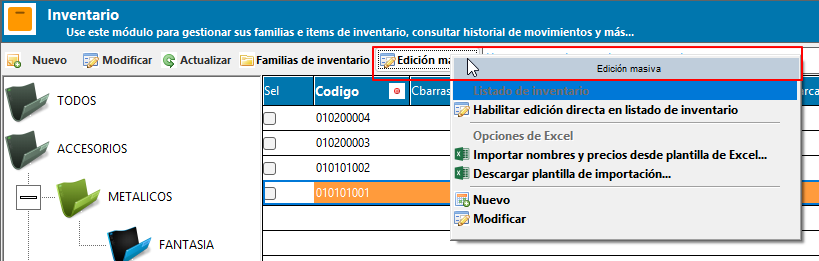
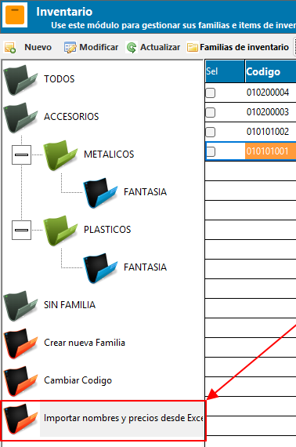
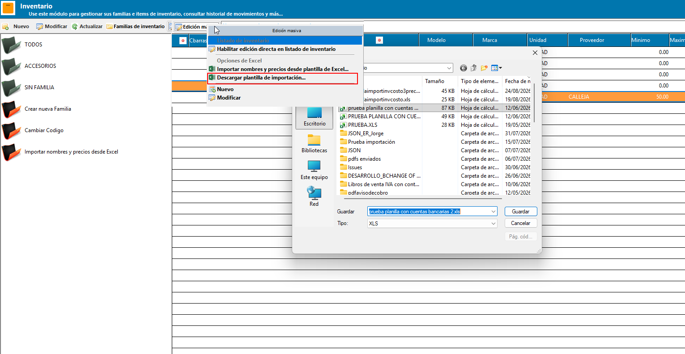
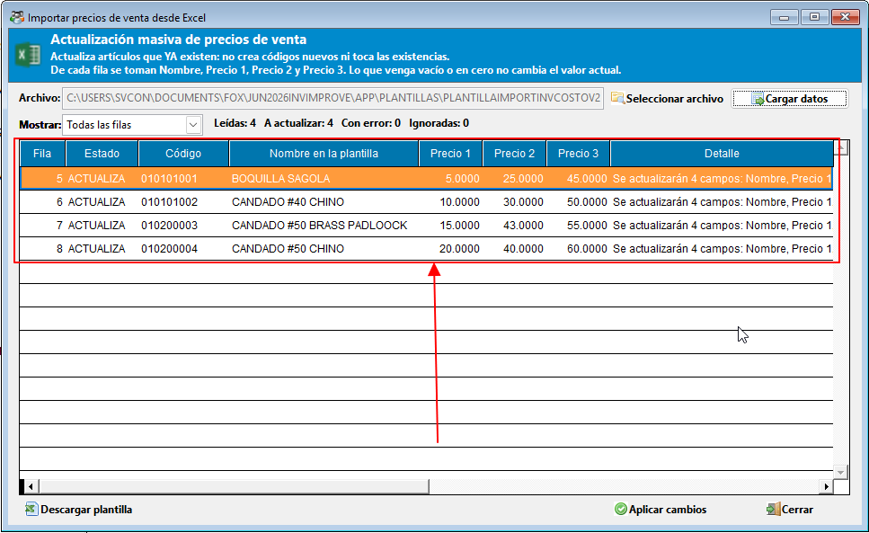
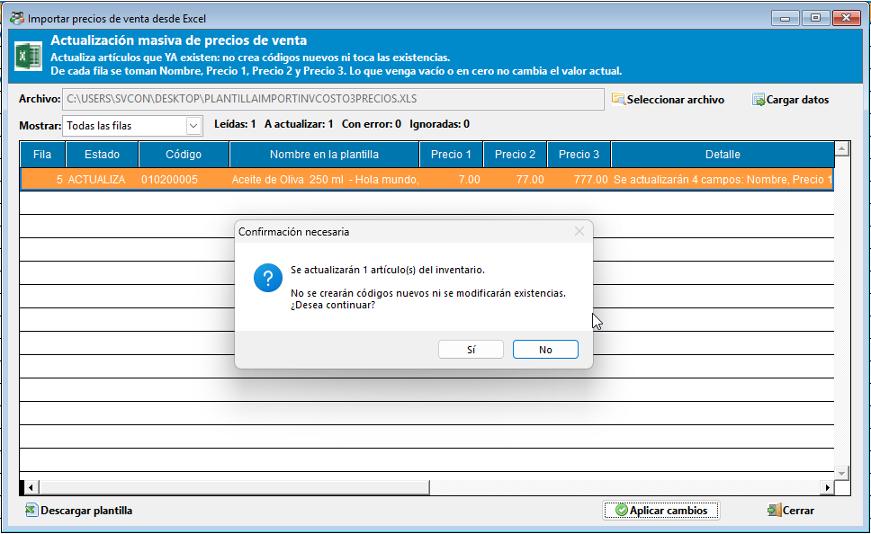
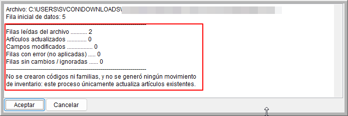

# 📊 **Importar nombres y precios desde Excel**

La **actualización masiva de precios de venta** permite corregir el nombre y los tres precios de venta de muchos productos a la vez, tomando los datos de la plantilla oficial de inventario en Excel. Es la vía indicada cuando el proveedor envía una lista de precios nueva o cuando se aplica un ajuste general de tarifas.

!!! abstract "Parte del módulo de Inventario"
    Esta página forma parte de la [Gestión de Inventario](GestionInventario.md). Para corregir pocos productos directamente sobre la cuadrícula, vea la [Edición del listado de inventario](ListadoInventario.md); para dar de alta un producto nuevo, vea la [Ficha de Inventario](FichaInventario.md).

!!! warning "Esta función únicamente actualiza productos que ya existen"
    La importación **no crea códigos nuevos**, **no crea familias** y **no genera ningún movimiento de inventario**: las existencias y los costos no se tocan. Un código que no exista en el inventario se reporta y se excluye. Para cargar inventario por primera vez, vea la [sección 7](#7-diferencia-con-la-carga-inicial-de-inventario).

## 📂 **1. Acceso a la importación**

Desde la gestión de inventario dispone de dos caminos:

1. **Botón Edición masiva**: en la barra de herramientas superior del listado, presione **Edición masiva** y elija, bajo el apartado *Opciones de Excel*, la opción **Importar nombres y precios desde plantilla de Excel...**
2. **Árbol de familias**: haga doble clic sobre el nodo **Importar nombres y precios desde Excel**, ubicado al final del árbol junto a los demás nodos de acción.

{ align=center }

{ align=center }

!!! info "Requisitos"
    - El equipo debe tener **Microsoft Excel instalado**, ya que el sistema abre el archivo a través de Excel para leerlo.
    - El archivo debe estar en formato **.XLS** (Justo como se descarga desde el sitio de la membresía) y **cerrado** al momento de leerlo.
    - Mientras el modo de **edición directa** del listado esté activo no es posible abrir la importación; primero debe guardar o descartar los cambios pendientes.

## ⬇️ **2. Descargar la plantilla oficial**

Si no tiene la plantilla a mano, el sistema la descarga por usted:

1. Presione **Edición masiva** → **Descargar plantilla de importación...**, o el botón **Descargar plantilla** dentro del formulario de importación.
2. Confirme la descarga desde el sitio oficial de ContaPortable.
3. Elija **la carpeta y el nombre** con que desea guardarla. El sistema propone *PlantillaImportInvCosto3Precios.xls* en la carpeta **Mis documentos**.
4. Al terminar, el sistema le indica la ruta exacta donde quedó guardada por medio de un mensaje.

{ align=center }

## 📄 **3. Cómo llenar la plantilla**

Los datos se escriben **a partir de la fila 5**; las filas 1 a 4 son el título y los encabezados, y no deben moverse ni eliminarse. Cada encabezado tiene un comentario que explica qué se espera en esa columna para facilitar el llenado. La plantilla incluye todas las columnas que se usan en la carga inicial de inventario, pero para la interfaz por medio de la que se realiza la actualización solo se toman algunas de ellas (Nombre, precio 1, precio 2 y precio 3).

De todas las columnas de la plantilla, esta importación toma únicamente las siguientes:

| Columna de la plantilla | Uso en la actualización |
| ----------------------- | ----------------------- |
| **Codigo** | **Obligatorio.** Identifica el producto a actualizar. Debe existir ya en el inventario y no puede superar los 15 caracteres. |
| **Nombre** | Nuevo nombre o descripción del producto. |
| **Precvta** | Nuevo precio de venta 1. |
| **PrecVta2** | Nuevo precio de venta 2. |
| **PrecVta3** | Nuevo precio de venta 3. |

El resto de columnas (familia, descripción, clasificación, modelo, marca, unidad, proveedor, mínimo, máximo, tipo, precio de referencia, código de barras, **cantidad** y **costo**) **se ignoran**: estas columnas únicamente pertenecen a la carga inicial de inventario y no tienen ningún efecto en la actualización de nombre y precios de venta.

!!! warning "En blanco o en cero significa *no modificar*"
    Solo se actualizan los campos que la fila trae con dato. Una celda vacía —o un precio en **cero**— deja el valor actual del producto **sin cambios**. Esto es deliberado: evita que un archivo recortado o mal llenado deje productos con el precio en cero.

    Si necesita registrar realmente un precio en cero, debe hacerlo desde la [Ficha de Inventario](FichaInventario.md) o desde la [edición directa del listado](ListadoInventario.md).

!!! tip "Solo necesita cinco columnas"
    Para una actualización de precios no hace falta llenar la plantilla completa: basta con **Código**, **Nombre** y los precios que desee cambiar. Puede dejar el resto de columnas vacías.

## 🔍 **4. Cargar datos y revisar la vista previa**

1. Presione **Seleccionar archivo** y elija el archivo de Excel. La ruta seleccionada queda en pantalla.
2. Presione **Cargar datos**. El sistema carga los datos contenidos en la hoja y clasifica cada fila.
3. Revise la **vista previa**: aquí todavía no se ha modificado nada en el inventario.

{ align=center }

La vista previa muestra, para cada fila del archivo:

| Columna | Descripción |
| ------- | ----------- |
| Fila | Número de fila dentro del archivo de Excel, para ubicarla y corregirla fácilmente. |
| Estado | Resultado de la validación: **ACTUALIZA**, **ERROR** o **IGNORA**. |
| Código | Código del producto tal como viene en el archivo. |
| Nombre en la plantilla | Nombre que trae el archivo para ese código. |
| Precio 1, 2 y 3 | Precios que trae el archivo. Las celdas en blanco corresponden a precios que **no** se van a modificar. |
| Detalle | Explicación de lo que hará el sistema con esa fila, o el motivo por el que no la aplicará. |

### Estados posibles

| Estado | Significado | Qué hacer |
| ------ | ----------- | --------- |
| **ACTUALIZA** | La fila es válida y se aplicará. El detalle indica qué campos cambiarán. | Nada, está lista. |
| **IGNORA** | El código existe, pero la fila no trae ningún nombre ni precio que actualizar. | Nada, o complete los datos en el archivo si esperaba que cambiara algo. |
| **ERROR** | La fila no se aplicará. | Corrija el archivo según el detalle y vuelva a cargarlo. |

Los motivos de error más frecuentes son:

- **Fila sin código**: la actualización requiere el código del artículo.
- **El código no existe en el inventario**: revise que coincida exactamente con el del sistema, o dé de alta el producto desde la [Ficha de Inventario](FichaInventario.md).
- **El código excede 15 caracteres**.
- **Código repetido dentro del archivo**: dos filas pretenden actualizar el mismo producto.
- **Hay precios negativos**.

!!! info "Contadores y filtro"
    Sobre la cuadrícula se muestra el resumen **Leídas / A actualizar / Con error / Ignoradas**, y con el desplegable **Mostrar** puede filtrar la vista previa para revisar únicamente las filas *a actualizar*, las *que tienen error* o las *ignoradas*. Las filas completamente vacías del archivo se descartan y no se listan.

## ✅ **5. Aplicar los cambios**

El botón **Aplicar cambios** se habilita únicamente cuando existe al menos una fila en estado *ACTUALIZA*, de lo contrario, no tendría ningún efecto. Antes de aplicarlos, asegúrese de que la vista previa refleja exactamente lo que desea cambiar.

1. Presione **Aplicar cambios**.
2. Confirme el mensaje, que le indica cuántos artículos se actualizarán y le recuerda que no se crearán códigos ni se modificarán existencias.
3. Durante el proceso se muestra una barra de progreso. Puede interrumpirlo con la tecla ++esc++; los productos ya procesados quedan actualizados y el resumen indica que el proceso fue cancelado.
4. Al finalizar se abre una ventana con el **resumen del proceso**, que puede revisar o copiar.

{ align=center }

El resumen incluye el archivo utilizado, el usuario que ejecutó el proceso, la cantidad de filas leídas, los artículos actualizados, el total de campos modificados, las filas con error y las ignoradas, además del detalle de las filas que no se aplicaron.

{ align=center }

!!! warning "Para volver a aplicar hay que leer de nuevo"
    Después de aplicar, la vista previa deja de ser válida y el botón **Aplicar cambios** se deshabilita. Si corrigió el archivo y necesita reintentar, presione otra vez **Leer archivo**. Al cerrar el formulario, el listado de inventario se refresca automáticamente con los precios nuevos.

!!! tip "El sistema recuerda su última plantilla"
    El archivo utilizado queda guardado para su usuario y aparece precargado la próxima vez que abra la importación, siempre que siga estando en la misma ruta. Así no tiene que volver a buscarlo cada mes.

## 🕘 **6. Registro en bitácora**

Cada campo modificado queda registrado individualmente en la bitácora del sistema, con la operación *Importación de precios desde Excel*, el código del artículo afectado, el campo modificado, el valor anterior, el nuevo valor y el **usuario que realizó el cambio**. Adicionalmente, cada producto actualizado guarda la fecha y el usuario de la última modificación en su ficha.

Esto permite auditar con precisión qué cambió, cuándo y quién lo hizo, incluso cuando la actualización abarcó cientos de productos.

## 🔀 **7. Diferencia con la carga inicial de inventario**

Ambos procesos usan **la misma plantilla de Excel**, pero tienen propósitos distintos:

| | Carga inicial de inventario | Importar nombres y precios |
| --- | --- | --- |
| Para qué sirve | Cargar el inventario por primera vez | Actualizar productos que ya existen |
| Crea códigos y familias | Sí | No |
| Carga existencias y costos | Sí (columnas *Cantidad* y *Costo*) | No, las ignora |
| Genera movimiento de inventario | Sí, una orden de ajuste de ingreso | No |
| Columna *Codigo* | Puede ir vacía; el sistema genera el código | Obligatoria y debe existir |
| Dónde se ejecuta | Importación de datos → Inventario | Gestión de inventario → Edición masiva |

!!! info "Plantillas anteriores sin las columnas de Precio 2 y 3"
    Las plantillas antiguas, que no incluían las columnas **PrecVta2** y **PrecVta3**, siguen funcionando en ambos procesos. En ese caso, esos dos precios simplemente no se modifican. También puede usar la plantilla actual, con las 3 listas de precio, en la carga inicial.

## 📌 **8. Buenas prácticas**

- Descargue siempre la plantilla desde el sistema antes de una carga grande: así se asegura de tener el orden de columnas vigente.
- Trabaje sobre una copia del archivo que le envía el proveedor y péguelo en la plantilla oficial, en lugar de reordenar las columnas de la plantilla.
- Revise la vista previa con el filtro **Solo con error** antes de aplicar: es más rápido corregir el archivo una vez que rehacer la actualización.
- Deje en blanco los precios que no deben cambiar, en lugar de escribir cero.
- Después de aplicar, revise el resumen y consérvelo; junto con la bitácora es el respaldo de lo que se modificó.
- Para cambios de pocos productos, la [edición directa del listado](ListadoInventario.md) es más rápida que preparar un archivo de Excel.

## 🔗 **9. Páginas relacionadas**

- [Gestión de Inventario](GestionInventario.md)
- [Edición del listado de inventario](ListadoInventario.md)
- [Ficha de Inventario](FichaInventario.md)
- [Gestión de familias de inventario](FamiliaInventario.md)
- [Reportes de inventario](../../Reports/categorias/inventario.md)
